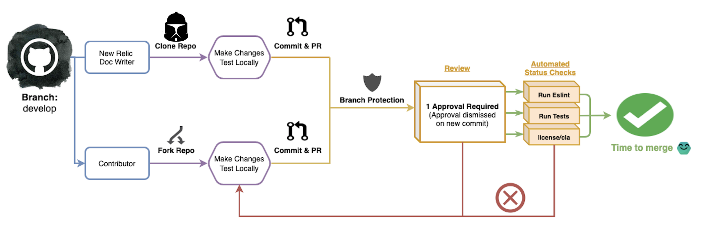

# Table of Contents

- [Table of Contents](#table-of-contents)
  - [Guidelines for contributing](#guidelines-for-contributing)
  - [Getting started](#getting-started)
    - [Local development](#local-development)
    - [Dependencies](#dependencies)
    - [Unit tests](#unit-tests)
    - [Using multiple versions of Node](#using-multiple-versions-of-node)
    - [Cloning vs forking](#cloning-vs-forking)
    - [Submitting a PR from a forked repo](#submitting-a-pr-from-a-forked-repo)
    - [Submitting a PR from a cloned repo](#submitting-a-pr-from-a-cloned-repo)
    - [Using the `develop` branch](#using-the-develop-branch)
    - [Shared Working Branches](#shared-working-branches)
    - [Working with docs-website-private](#working-with-docs-website-private)
    - [Branch Protection](#branch-protection)
    - [Draft PRs](#draft-prs)
    - [Using Conventional Commits](#using-conventional-commits)
      - [Use `chore`](#use-chore)
      - [Use `fix`](#use-fix)
      - [Use `feat`](#use-feat)
    - [Deploy previews with Gatsby Cloud](#deploy-previews-with-gatsby-cloud)
  - [Reusable components](#reusable-components)
  - [Editing existing pages](#editing-existing-pages)
  - [Private edits](#private-edits)
    - [Bring your private work back into the public repository](#bring-your-private-work-back-into-the-public-repository)
  - [Split testing and running experiments](#split-testing-and-running-experiments)
    - [Step 1](#step-1)
    - [Step 2](#step-2)
    - [Step 3](#step-3)
    - [Step 4](#step-4)
    - [Step 5](#step-5)
  - [Troubleshooting](#troubleshooting)
    - [General Install, compile or build issues](#general-install-compile-or-build-issues)
    - [Problems with yarn start](#problems-with-yarn-start)

## Guidelines for contributing

The Documentation Team and Developer Enablement Team at New Relic welcome contributions to this repository.

There are several ways you can contribute:

- If you wish to make documentation edits or add new
documentation, follow our [documentation contribution guidelines](https://docs.newrelic.com/docs/style-guide/writing-guidelines/create-edit-content/#edit-doc).
- If you'd like to to make code contributions, or make content contributions locally, follow the contribution guidelines below.

## Getting started

### Local development

You can serve this site locally to quickly see your changes and additions before you PR them. To get started, navigate into your new site’s directory and start it up, as follows.

```shell
cd docs-website/
yarn
yarn start
```

Your site is now running at [`http://localhost:8000`](http://localhost:8000)!

The first time you build the site locally, it will take upwards of 20 minutes. This is normal, and will take signifigantly less time afterwards.

### Dependencies

Node v16 is used in this project as specified in [.nvmrc](https://github.com/newrelic/developer-website/blob/master/.nvmrc).

### Unit tests

To run the unit tests, run `yarn test` in the terminal. If you would like to
have the tests automatically re-run, use `yarn run test:watch`

### Using multiple versions of Node

If you intend to run multiple versions of Node please be aware that the New Relic
Docs Site is currently on Node v16. Therefore it's recommended you use Node Version Manager [NVM](https://github.com/nvm-sh/nvm) to manage Node versions.

Review [this article](https://itnext.io/nvm-the-easiest-way-to-switch-node-js-environments-on-your-machine-in-a-flash-17babb7d5f1b)
which clearly explains the setup and configuration of NVM.

### Cloning vs forking

To be able to [clone](https://help.github.com/en/github/creating-cloning-and-archiving-repositories/cloning-a-repository) this repository and contribute you will need to be given write access to the repository. This is reserved for New Relic Doc Writers. Contact the Developer Enablement team (#help-deven-websites Slack channel) if you need write access.

To contribute without write access, you can [fork](https://help.github.com/en/github/getting-started-with-github/fork-a-repo) the repository and contribute as needed. If you're planning to leave a fork open for a long time (for example, you're working on a complex set of changes to many docs), [sync your fork](https://docs.github.com/en/github/collaborating-with-issues-and-pull-requests/syncing-a-fork) occasionally to avoid merge conflicts.

### Submitting a PR from a forked repo

0. Create a [Github](https://github.com/) account if you don't already have one.
1. `Fork` this this repository.
2. Make your changes.
3. Test your changes! Review the project's [READ ME](README.md) for instructions on how to build and run tests locally.
4. Submit a `Pull Request` to this project with your changes.
5. If/when your `PR` is accepted, the automation in this project will build the site and deploy a new version of the code to `docs.newrelic.com`.
6. And you are done!

### Submitting a PR from a cloned repo

0. Create a [Github](https://github.com/) account if you don't already have one.
1. `Clone` this repository.
2. Create a new branch locally.
3. Make your changes.
4. Test your changes! Review the project's [READ ME](README.md) for instructions on how to build and run tests locally.
5. Submit a `Pull Request` to this project with your changes.
6. If/when your `PR` is accepted, the automation in this project will build the site and deploy a new version of the code to `docs.newrelic.com`.
7. And you are done!

### Using the `develop` branch

Use the `develop` branch when creating your working branch locally. `develop` will always contain the most
current source code. The `develop` branch will be merged into the `main` branch by the maintainers when a new release is ready to ship.

All pull requests should be made against the `develop` branch. When merging to `develop`
all code should be considered ready to be deployed to production.

### Shared Working Branches

If you plan on coordinating changes across several people, and feel your code isn't "ready to ship"
use a shared working branch strategy.

1. create a new branch to collaborate with others via GIT and push that branch up to the remote repository. `git checkout -b shared-branch`
2. share that branch with others you are collaborating with. They'll need to run:  `git pull origin shared-branch`
3. All contributors should keep that branch up to date by running `git pull origin develop` frequently.
4. Push all changes to the remote repository: `git push origin shared-branch`
5. Resolve any merge conflicts.
6. When your work is complete, merge the shared working branch into `develop` via a PR.

### Working with docs-website-private

For New Relic employees working on pre-release content that needs to remain private, we have a [private docs repo](https://github.com/newrelic/docs-website-private). Before you begin creating content in the private repo, refer to the [private docs wiki](https://github.com/newrelic/docs-website-private/wiki) on to how interact with the repository.

### Branch Protection

The `develop` and `main` branches have "Branch Protection" enabled in Github. In order to merge a pull request into `develop`, you must have (at least) one approval. Additionally a few of the "PR Checks" are required and must pass before the pull request can be merged in.

You can review full Branch Protection details [here](https://docs.google.com/document/d/1O1SGS0i3OmPfvPhylpFe1CTMkE20889iAOF_cMFJ344/edit#heading=h.oh6pex9x0dx4), and check out a visual representation of the workflow below:



### Draft PRs

`Draft PRs` are ideal for in progress work or work you need others to contribute to.

To submit a [Draft PR](https://github.blog/2019-02-14-introducing-draft-pull-requests/):

1. Make your code changes and submit a `Pull Request`.
2. Select Create a draft pull request on the PR submission screen on Github.
   You can find this by clicking on the Create pull request button at the bottom of the
   `PR` you wish to submit.
3. Once you are ready to have the `PR` reviewed and merge, click the Ready for review button on the `PR`.

### Using Conventional Commits

Please help the maintainers by leveraging the following [conventional commit](https://www.conventionalcommits.org/en/v1.0.0/)
standards in your commit messages. You don't need to apply this format to the pull request title–just to commits.

As a reminder, here's the format for a single-line commit, but you are welcome to add the optional body and footer messages.

```
<type>(optional scope): <description>
```

When choosing a type, you can pick from any of the standard types (feat, fix, style, test, or chore) or you can add your own. If you are making document changes, as opposed to code changes, you can skip the `documentation` type and apply one of the other types, depending on what you're changing in the documentation.

As far as scope, we recommend that you include this because it helps us identify relevant commits. For the docs project, the scope might refer to the part of the docs you are editing (for example, APM or errors inbox). If you are suggesting a code change to the docs site, insert the section of the codebase you worked on.

Here are some examples:

#### Use `chore`

Chores are best for changes that users don't see directly, such as improving unit tests or reducing technical debt. You might use them for minor non-functional changes/additions to github actions, github templates, package or config updates, etc.

```bash
git commit -m "chore(translation): extend translation unit test coverage"
```

#### Use `fix`

Fix is used for minor functional corrections to code.

```bash
git commit -m "fix(Log management): repair broken link in introduction"
```

#### Use `feat`

Feat is for major functional changes or additions to code.

```bash
git commit -m "feat(errors inbox): add new documents"
```

### Deploy previews with Gatsby Cloud

PRs that are opened from a branch in this repo (not forks) will generate preview links on Gatsby Cloud automatically. Gatsby Cloud preview links are posted as comments on your pull request when they are done building. You can monitor the progress via the `Gatsby Build Service` job under the `Checks` section.

## Reusable components

In order to drive simplicity and ease of use New Relic has provided a set of reusable components you can leverage
when creating documentation. Refer to our [Component Guide](COMPONENT_GUIDE.md) for more information.

## Editing existing pages

1. To edit an existing page you can view the page's source code by clicking on the `Edit` icon in the upper right corner of the site.
2. Follow the instructions above to `Fork` or `Clone` the repo and make your edits.
3. Follow the instructions above to submit a `PR` for your change.

## Private edits

If you have access to a private version of this repository, you can contribute and review content without sharing it publicly.

_NOTE: with all of these steps, if you have SSH Keys set up, you will want to use the SSH URL (not the HTTPS URL)._

### Bring your private work back into the public repository

1. Click the fork button in the GitHub UI for the [docs-website repository](https://github.com/newrelic/docs-website).
2. Clone the fork on your computer: `git clone https://github.com/yourname/docs-website`.
3. Change into the fork repo: `cd docs-website`.
4. Connect the public repo: `git remote add upstream https://github.com/newrelic/docs-website.git`.
5. Pull in content from the public repo: `git pull upstream develop`.
6. Make a new branch: `git checkout -b your_branch_name`.
7. Push your branch up to the public repository: `git push upstream your_branch_name`.

## Split testing and running experiments

If you have access to [Split.io](https://split.io/) as a New Relic employee you can execute a split test
on the site to measure different scenarios if you are attempting to gather data to make
a product decision or conduct an experiment.

To execute a split test you'll need to be comfortable with Split.io as well as be able
to provide the different treatments (in code) of what you wish to test.

To understand how to use Split.io it's recommended to watch this [Introduction video](https://youtu.be/sUFM7dEet8A)

### Step 1

Decide what you want to test, what your hypothesis is and begin to define your
[experiment](https://youtu.be/BRXpPgedQlE).

- Why are you running the experiment, what is the goal?
- How will you measure to see if you reached the goal?
- What is your metrics for success?
- How long will it take to get to results you want?

### Step 2

Review the [Split.io documentation](https://help.split.io/hc/en-us/articles/360025334851-Step-2-Create-a-split-and-target-users) for creating a split test and targeting users.

### Step 3

Send [event data to Split.io](https://help.split.io/hc/en-us/articles/360025335031-Step-3-Send-event-data)

### Step 4

Measure results by [setting up a metric](https://help.split.io/hc/en-us/articles/360025335091-Step-4-Create-a-metric-monitor-and-measure-the-impact)

A good metric:

- is meaningful
- is directional
- has significance
- is fit for the test you are running

### Step 5

Run the experiment and pick a winner!

## Troubleshooting

This section attempts to capture some of the more common troubleshooting techniques to try
if you face issues in contributing.

### General Install, compile or build issues

Many of the common errors you'll face can be resolve by the following:

1. Ensure you are using `yarn` not `npm`
2. Always run `git pull` whenever you intend to create a new working branch
3. Always run `yarn` whenever you git pull

As a last resort, you can completely delete the `node_modules` folder in the root project directory, and re-run `yarn`

### Problems with yarn start

When you start up the site via `yarn start`, you may see errors in your terminal like the following:

```bash
 ERROR
[BABEL] Note: The code generator has deoptimised the styling of /Users/jdoe/code/docs-website/src/content/docs/licenses/license-information/other-licenses/services-licenses.mdx as it exceeds the max of 500KB.
```

**Solution**

You can ignore the error as this is a babel warning when compiling MDX docs. This does not affect the functionality of the site.
