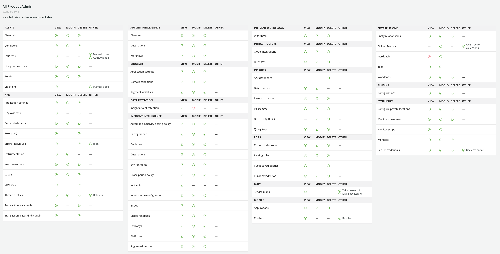

Your New Relic users can be on one of two [user models](/docs/accounts/original-accounts-billing/original-product-based-pricing/overview-changes-pricing-user-model/#user-models): this doc explains the New Relic One user model. 

<Callout variant="important">
  If your New Relic organization was created before July 30 2020 and you haven't gone through a user migration process, your users are likely on our [original user model](/docs/accounts/original-accounts-billing/original-users-roles). For more on this, see [User model changes](/docs/accounts/original-accounts-billing/original-product-based-pricing/overview-changes-pricing-user-model/#user-models).
</Callout>

## Overview 

This doc will explain the structure of the [New Relic One user model](/docs/accounts/original-accounts-billing/original-product-based-pricing/overview-changes-pricing-user-model/#user-models), including:

* [User type](#user-type) (basic user versus full user)
* [Default user groups](#groups), including **Admin** and **User**
* [Roles and capabilities](#roles)

For how to add and manage users in the UI, see [User management](/docs/accounts/accounts-billing/new-relic-one-pricing-users/manage-user-groups-roles-access-grants).

## User type: basic and full [#user-type]

  <Callout variant="important">
This section is for users on our [New Relic One user model](/docs/accounts/original-accounts-billing/original-product-based-pricing/overview-changes-pricing-user-model/#user-models). If you're on our original user model, see [Original users](/docs/accounts/original-accounts-billing/original-users-roles/users-roles-original-user-model/#user-type).
  </Callout>

A user's **user type** determines if they have access to our basic features (basic user) or can access all of our curated observability UI features (full user). The user type is something meant to be set long-term based on that user's expected New Relic responsibilities. 

Below are details on the two user types. Note that full users are billable only if you're on [New Relic One pricing](/docs/accounts/original-accounts-billing/original-product-based-pricing/overview-changes-pricing-user-model#pricing-plans).

* **Basic user**. Details:
  * These users are free and have access to a wide range of features, including setting up and configuring any New Relic data-reporting tool, running queries of your data, using our logs UI, making custom charts and dashboards, and setting up alerts. Unlike full users, they do **not** have access to our more curated observability UI experiences or some Applied Intelligence features (for a detailed comparison, see [Capabilities](#user-capabilities)).
  * Basic users will see prompts to become a full user when they attempt to access unavailable features. For details, see [Upgrade](/docs/accounts/accounts-billing/new-relic-one-user-management/authentication-domains-saml-sso-scim-more/#session-mgmt).
* **Full user**. Details:
  * Full users have access to everything (depending on any role restrictions), including all our observability UI experiences, such as APM, infrastructure monitoring, browser monitoring, mobile monitoring, synthetic monitors, access to New Relic One apps, and more. For details, see [Capabilities](#user-capabilities).
  * [Standard edition](https://newrelic.com/pricing) includes one free full user and up to five total full users.
  * A full user can downgrade to a basic user [twice in a 12-month period](/docs/accounts/accounts-billing/new-relic-one-pricing-billing/new-relic-one-pricing-billing/#user-count). 

To view and edit the user type of your users, use the [User management UI](/docs/accounts/accounts-billing/new-relic-one-user-management/add-manage-users-groups-roles#edit-user-type). 

Learn more about basic user versus full user differences:

<CollapserGroup>
  <Collapser
    className="freq-link"
    id="user-capabilities"
    title="Compare full vs basic capabilities"
  >
Below is a table comparing what basic users and full users can do. A simple way to think about it is that full users have theoretical access (dependent on any chosen role restrictions) to all of our curated UI experiences, while basic users are restricted to fairly basic capabilities. 

    <table>
      <thead>
        <tr>
          <th style={{ width: "350px" }}>
            Features
          </th>

          <th className="fcenter">
            Full user
          </th>

          <th className="fcenter">
            Basic user
          </th>
        </tr>
      </thead>

      <tbody>
        <tr>
          <td
            className="fcenter"
            style={{ backgroundColor: "#e9f3f3" }}
          >
            **Observability UI experiences**

          </td>

          <td style={{ backgroundColor: "#e9f3f3" }}/>

          <td style={{ backgroundColor: "#e9f3f3" }}/>
        </tr>

        <tr>
          <td>
            Application monitoring (APM) UI
          </td>

          <td className="fcenter">
            <Icon
              style={{color: '#328787'}}
              name="fe-check"
            />
          </td>

          <td/>
        </tr>

        <tr>
          <td>
            Infrastructure monitoring UI
          </td>

          <td className="fcenter">
            <Icon
              style={{color: '#328787'}}
              name="fe-check"
            />
          </td>

          <td/>
        </tr>

        <tr>
          <td>
            Digital Experience Monitoring UI, which includes: 
              * Browser monitoring UI
              * Mobile monitoring UI
              * Synthetic monitoring UI
          </td>

          <td className="fcenter">
            <Icon
              style={{color: '#328787'}}
              name="fe-check"
            />
          </td>

          <td/>
        </tr>
        <tr>
          <td>
            Synthetics checks
          </td>

          <td className="fcenter">
            <Icon
              style={{color: '#328787'}}
              name="fe-check"
            />
          </td>
          <td/>
        </tr>  
        <tr>
          <td>
            Serverless monitoring UI
          </td>

          <td className="fcenter">
            <Icon
              style={{color: '#328787'}}
              name="fe-check"
            />
          </td>
          <td/>
        </tr>

        <tr>
          <td>
            Logs in context 
          </td>

          <td className="fcenter">
            <Icon
              style={{color: '#328787'}}
              name="fe-check"
            />
          </td>

          <td/>
        </tr>

        <tr>
          <td>
            Distributed tracing UI
          </td>

          <td className="fcenter">
            <Icon
              style={{color: '#328787'}}
              name="fe-check"
            />
          </td>

          <td/>
        </tr>  

        <tr>
          <td>
            Infinite Tracing
          </td>

          <td className="fcenter">
            <Icon
              style={{color: '#328787'}}
              name="fe-check"
            />
            ([Pro and Enterprise edition](https://newrelic.com/pricing))
          </td>

          <td/>
        </tr>        
        <tr>
          <td>
            Assorted UI experiences, including: 
              * Kubernetes cluster explorer UI
              * Key transaction UI
              * Workloads UI
          </td>

          <td className="fcenter">
            <Icon
              style={{color: '#328787'}}
              name="fe-check"
            />
          </td>
          <td/>
        </tr>

        <tr>
          <td>
            Access to [New Relic One apps](https://developer.newrelic.com/build-apps/permission-manage-apps) 
          </td>

          <td className="fcenter">
            <Icon
              style={{color: '#328787'}}
              name="fe-check"
            />
          </td>

          <td className="fcenter">
        Can build apps but can't access other apps
          </td>
          
        </tr>

        <tr>
          <td
            className="fcenter"
            style={{ backgroundColor: "#e9f3f3" }}
          >
            **New Relic One platform capabilities**
          </td>

          <td className="fcenter" style={{ backgroundColor: "#e9f3f3" }}>Full user</td>

          <td className="fcenter" style={{ backgroundColor: "#e9f3f3" }}>Basic user</td>
        </tr>

        <tr>
          <td>
            Data ingest from any source (agents, integrations, APIs)
          </td>

          <td className="fcenter">
            <Icon
              style={{color: '#328787'}}
              name="fe-check"
            />
          </td>

          <td className="fcenter">
            <Icon
              style={{color: '#328787'}}
              name="fe-check"
            />
          </td>
        </tr>

        <tr>
          <td>
            Query data 
          </td>

          <td className="fcenter">
            <Icon
              style={{color: '#328787'}}
              name="fe-check"
            />
          </td>

          <td className="fcenter">
            <Icon
              style={{color: '#328787'}}
              name="fe-check"
            />
          </td>
        </tr>  

        <tr>
          <td>
            Create custom charts and dashboards
          </td>

          <td className="fcenter">
            <Icon
              style={{color: '#328787'}}
              name="fe-check"
            />
          </td>

          <td className="fcenter">
            <Icon
              style={{color: '#328787'}}
              name="fe-check"
            />
          </td>
        </tr>

        <tr>
          <td>
            Alerts and notifications
          </td>

          <td className="fcenter">
            <Icon
              style={{color: '#328787'}}
              name="fe-check"
            />
          </td>

          <td className="fcenter">
            <Icon
              style={{color: '#328787'}}
              name="fe-check"
            />
          </td>
        </tr>

        <tr>
          <td>
            APIs, including [NerdGraph](/docs/apis/nerdgraph/get-started/introduction-new-relic-nerdgraph)
          </td>

          <td className="fcenter">
            <Icon
              style={{color: '#328787'}}
              name="fe-check"
            />
          </td>

          <td className="fcenter">
            <Icon
              style={{color: '#328787'}}
              name="fe-check"
            />
            (basic user permissions)
          </td>
        </tr>

        <tr>
          <td>
            Query and chart log data
          </td>

          <td className="fcenter">
            <Icon
              style={{color: '#328787'}}
              name="fe-check"
            />
          </td>

          <td className="fcenter">
            <Icon
              style={{color: '#328787'}}
              name="fe-check"
            />
          </td>
        </tr>

        <tr>
          <td>
            Build [New Relic One apps](https://developer.newrelic.com/build-apps/permission-manage-apps)
          </td>

          <td className="fcenter">
            <Icon
              style={{color: '#328787'}}
              name="fe-check"
            />
          </td>

          <td className="fcenter">
            <Icon
              style={{color: '#328787'}}
              name="fe-check"
            />
            (but cannot access other apps)
          </td>
        </tr>

        <tr>
          <td>
            Manage New Relic data
          </td>

          <td className="fcenter">
            <Icon
              style={{color: '#328787'}}
              name="fe-check"
            />
          </td>

          <td className="fcenter">
          </td>
        </tr>    

        <tr>
          <td>
            Manage other New Relic users
          </td>

          <td className="fcenter">
            <Icon
              style={{color: '#328787'}}
              name="fe-check"
            />
          </td>
          <td/>

        </tr>         

        <tr>
          <td
            className="fcenter"
            style={{ backgroundColor: "#e9f3f3" }}
          >
            **Applied Intelligence**
          </td>

          <td className="fcenter" style={{ backgroundColor: "#e9f3f3" }}>Full user</td>

          <td className="fcenter" style={{ backgroundColor: "#e9f3f3" }}>Basic user</td>
        </tr>

        <tr>
          <td>
            Acknowledge and resolve issues
          </td>

          <td className="fcenter">
            <Icon
              style={{color: '#328787'}}
              name="fe-check"
            />
          </td>

          <td className="fcenter">
            <Icon
              style={{color: '#328787'}}
              name="fe-check"
            />
          </td>
        </tr>

        <tr>
          <td>
            Root cause analysis
          </td>

          <td className="fcenter">
            <Icon
              style={{color: '#328787'}}
              name="fe-check"
            />
          </td>
          <td className="fcenter">
          </td>          
        </tr>

        <tr>
          <td>
            Incident/anomaly analysis
          </td>
          <td className="fcenter">
            <Icon
              style={{color: '#328787'}}
              name="fe-check"
            />
          </td>

          <td className="fcenter">
          </td>

        </tr>

        <tr>
          <td>
            Correlation assistant
          </td>

          <td className="fcenter">
            <Icon
              style={{color: '#328787'}}
              name="fe-check"
            />
          </td>
          <td className="fcenter">
          </td>          
        </tr>

        <tr>
          <td>
            Issue maps
          </td>

          <td className="fcenter">
            <Icon
              style={{color: '#328787'}}
              name="fe-check"
            />
          </td>
          <td className="fcenter">
          </td>
        </tr>
        <tr>
          <td>
            Machine learning classification
          </td>

          <td className="fcenter">
            <Icon
              style={{color: '#328787'}}
              name="fe-check"
            />
          </td>          
          <td className="fcenter">
          </td>
        </tr>

      </tbody>
    </table>

Note that the [pricing edition](https://www.newrelic.com/pricing) (Standard, Pro, or Enterprise) will also affect what features you have access to. 

For organizations with New Relic One pricing, learn more about [how full users impact billing](/docs/accounts/accounts-billing/new-relic-one-pricing-users/pricing-billing#user-count).
  </Collapser>

  <Collapser
    className="freq-link"
    id="decide-user-type"
    title="Tips on choosing user type"
  >
  A user's type (basic user vs full user) is meant to be a long-term assignment, based on the New Relic responsibilities that user is expected to perform. A full user can be downgraded to a basic user [only twice in one year](/docs/accounts/accounts-billing/new-relic-one-pricing-billing/new-relic-one-pricing-billing/#user-count). Below are tips for why you'd choose full user versus basic user. 
  
  Reasons to make someone a full user:

    * They play a key role in the development, testing, deployment, and maintenance phases of the application development lifecycle.
    * They break/fix code regularly; they are responsible for triaging workflows, troubleshooting, or managing users and roles for their team.
    * They have DevOps practices (i.e. version control systems and implement CI/CD).
    * They need to use New Relic's curated dashboards and experiences (not just the ability to create their own custom queries and charts); in other words, they need full access to our platform.
    * They need to be able to manage users and/or billing.

    Reasons to make someone a basic user:

    * They play a key role in the planning phase of the application development lifecycle.
    * They use and configure New Relic agents, APIs, and integrations to send us data, and access, configure, and use alerts on such data (not necessarily responsible for triaging workflows, troubleshooting, or managing users and roles for their team).
    * They want to see high-level analytics and business metrics for future planning (such as C-Suite executives).
    * They do not need to use our curated experiences and dashboards, but would benefit from the ability to create their own custom queries and charts of data; in other words, they don't need full access to the platform.
    * They don't manage users.

For accounts on New Relic One pricing, learn more about [user-related billing calculations](/docs/accounts/accounts-billing/new-relic-one-pricing-users/pricing-billing#user-count).
  </Collapser>

  <Collapser
    className="freq-link"
    id="billing-calculation"
    title="Understand user-related billing"
  >
    If you're on the [New Relic One pricing plan](/docs/accounts/accounts-billing/new-relic-one-pricing-billing/new-relic-one-pricing-billing), full users are billable, and there are restrictions around how often a full user can downgrade to a basic user. For details, see [User count billing details](/docs/accounts/accounts-billing/new-relic-one-pricing-users/pricing-billing#user-count). 
    
    For how to query and alert on usage data, see [Query usage data](/docs/accounts/accounts-billing/new-relic-one-pricing-users/queries-alerts).
  </Collapser>
</CollapserGroup>

## Have questions about why you can't access something? [#access]

See [Factors affecting access](/docs/accounts/accounts-billing/general-account-settings/factors-affecting-access-features-data/#account-access). 

## Default groups: Admin and User [#groups]

For users on our New Relic One user model, a "group" is what allows the grouping together and managing of multiple users at the same time. Your New Relic users are assigned to a group, and that group is granted access to specific roles on specific accounts.

We have two default groups:

* **User**: This group allows a user to use and configure monitoring/analysis features but **not** perform account-related tasks like managing billing or users. It has access to the **All product admin** role, which gives access to our observability platform tools but not to the organization and user management capabilities governed by the **Organization manager** and **Authentication manager** roles. 
* **Admin**: has full access and capabilities, including the organization-level admin abilities. This is the equivalent of having the **All product admin**, the **Billing user**, the **Organization manager** and the **Authentication domain manager** [roles](#standard-roles). 

These groups are added inside your default [authentication domain](/docs/accounts/accounts-billing/new-relic-one-user-management/authentication-domains-saml-sso-scim-more/), which includes the default settings of users a) being managed via New Relic and b) logging in via standard email and password. If you add other authentication domains (for SAML SSO and/or SCIM provisioning of users), you'd have new custom groups in those new domains to govern those users. 

Note that groups, whether default or custom, are not what limit a user's capabilities: it is the role that is assigned to that group (with any basic user restrictions on top of that). If your organization is Pro or Enterprise edition and you want to understand how users are granted access to specific roles and accounts, see [Access grants](/docs/accounts/accounts-billing/new-relic-one-user-management/add-manage-users-groups-roles/#understand-concepts).

To change the group a user is in, use the [**User management** UI](/docs/accounts/accounts-billing/new-relic-one-user-management/add-manage-users-groups-roles#where).

## How do user type, roles, and groups relate to each other? [#type-role-group]

For users on the [New Relic One user model](/docs/accounts/original-accounts-billing/original-product-based-pricing/transition-guide-new-pricing-user-changes#user-models), here's a table explaining how [user type](#user-type) (basic vs full user), roles, and groups relate to each other: 

<table>
  <thead>
    <tr>
      <th style={{ width: "100px" }}>

      </th>

      <th style={{ width: "250px" }}>
        Full user
      </th>

      <th style={{ width: "250px" }}>
        Basic user
      </th>
    </tr>
  </thead>

  <tbody>
    <tr>
      <td>
        **Group**
      </td>

      <td>
        Full users can be assigned to [default groups](#groups) (**User** and **Admin**) or custom groups. 
      </td>

      <td>
        When basic users are added to a group, that group's role-related restrictions apply. A basic user's capabilities can be restricted in that way, but a basic user can never be granted more capabilities than they start with.
        For Standard edition, basic users can't be assigned to groups. For Pro and Enterprise edition, they can.
      </td>
    </tr>

    <tr>
      <td>
        **Role**
      </td>

      <td>
For an explanation of the roles our default groups have, see [Default groups](#groups). 

Custom groups can have either our default standard roles, or custom roles.
      </td>

      <td>
A basic user's abilities aren't directly defined by a specific role. A basic user can best be described as having the [**All product admin** role](#standard-roles) but without access to our more curated UI experiences ([learn more about user type](#user-type)).

When basic users are added to a group, that group's role-related restrictions apply, but a basic user can never be granted more capabilities than they start with.  
      </td>
    </tr>
  </tbody>
</table>

## Roles and capabilities [#roles]

For users on the [New Relic One user model](/docs/accounts/original-accounts-billing/original-product-based-pricing/transition-guide-new-pricing-user-changes#user-models), a "role" can be defined as "a set of capabilities." A capability is defined as the ability to do a specific New Relic task, like 'Delete alert conditions' ([learn more about capabilities](#capabilities)). 

Roles are assigned to user groups. Our default groups [**Admin** and **User**](#groups) already have our standard roles (defined below) assigned. Organizations on Pro or Enterprise [edition](https://newrelic.com/pricing) can also create [custom roles](/docs/accounts/accounts-billing/new-relic-one-user-management/add-manage-users-groups-roles/#understand-concepts).

### Standard (default) roles [#standard-roles]

Roles are sets of [capabilities](#capabilities). We have several "standard roles," which are roles that satisfy some commonly needed use cases. To view roles and their associated capabilities, use the [**Organization and access** UI](/docs/accounts/accounts-billing/new-relic-one-user-management/add-manage-users-groups-roles/#where). 

<Callout variant="important">
Note that some of our [standard roles](#standard-roles) have hidden, non-exposed capabilities that are not available for selection when creating a custom role. The only standard roles that can be replicated with a custom role are **Standard user** and **Read only**; all others have some hidden capabilities. 
</Callout>

Our standard roles include:

<table>
  <thead>
    <tr>
      <th style={{ width: "180px" }}>
        Standard roles
      </th>

      <th style={{ width: "120px" }}>
        Scope
      </th>

      <th>
        Description
      </th>
    </tr>
  </thead>

  <tbody>
    <tr>
      <td>
        **All product admin**
      </td>

      <td>
        Account
      </td>

      <td>
        Provides admin-level access to observability platform features but not organization-level and user management features. In other words, this role includes all New Relic capabilities with the exception of managing users (**Authentication domain manager** role), managing organization/account-structure settings (**Organization manager** role), and managing billing (**Billing user** role).

        Note: the **Standard user** role is essentially the **All product admin** role minus observability feature configuration capabilities. 
      </td>
    </tr>

    <tr>
      <td>
        **Standard user**
      </td>

      <td>
        Account
      </td>

      <td>
        Provides access to observability platform features, but lacks permissions for configuring those features (for example, ability to configure [synthetic monitor secure credentials](/docs/synthetics/synthetic-monitoring/using-monitors/store-secure-credentials-scripted-browsers-api-tests)) and lacks organization-level and user management permissions. 

        Note: the **Standard user** role is essentially the **All product admin** role without that role's ability to configure platform features.  
      </td>
    </tr>

    <tr>
      <td>
        **Billing user**
      </td>

      <td>
        Account
      </td>

      <td>
        Provides ability to manage subscriptions and billing setup, and read-only access to the rest of the platform. For organizations with multiple accounts, billing is aggregated in the primary (first-created) account, which is why assigning this role to that primary account grants billing permissions for the entire organization.
      </td>
    </tr>

    <tr>
      <td>
        **Organization manager**
      </td>

      <td>
        Organization
      </td>

      <td>
        Provides the ability to manage [organization](/docs/accounts/accounts-billing/new-relic-one-pricing-users/new-relic-account-structure/-level) settings, including organization structure, name, and preferences. Due to our recent switch to the [New Relic One user model](/docs/accounts/original-accounts-billing/original-product-based-pricing/overview-changes-pricing-user-model/#user-models), this role currently has few abilities but more will be added over time.
        
        For how to grant this role, see [Add user management capability](/docs/accounts/accounts-billing/new-relic-one-pricing-users/manage-user-groups-roles-access-grants#add-user-managers).
      </td>
    </tr>

    <tr>
      <td>
        **Organization read only**
      </td>

      <td>
        Organization
      </td>

      <td>
        Provides the ability to view organization-level settings. For how to grant this role, see [Add user management capability](/docs/accounts/accounts-billing/new-relic-one-pricing-users/manage-user-groups-roles-access-grants#add-user-managers).
      </td>
    </tr>

    <tr>
      <td>
        **Authentication domain manager**
      </td>

      <td>
        Organization
      </td>

      <td>
        Provides ability to add and manage users, and configure [authentication domains](/docs/accounts/accounts-billing/new-relic-one-user-management/configure-authentication-domains-sso) for users on the [New Relic One user model](/docs/accounts/original-accounts-billing/original-product-based-pricing/overview-changes-pricing-user-model#user-models). For how to grant this role, see [Add user management capability](/docs/accounts/accounts-billing/new-relic-one-pricing-users/manage-user-groups-roles-access-grants/#add-user-managers).
      </td>
    </tr>

    <tr>
      <td>
        **Authentication domain read only**
      </td>

      <td>
        Organization
      </td>

      <td>
        Provides the ability to view users in your organization and view the configuration of [authentication domains](/docs/accounts/accounts-billing/new-relic-one-user-management/configure-authentication-domains-sso). For how to grant this role, see [Add user management capability](/docs/accounts/accounts-billing/new-relic-one-pricing-users/manage-user-groups-roles-access-grants/#add-user-managers).
      </td>
    </tr>

    <tr>
      <td>
        **Read only**
      </td>

      <td>
        Account
      </td>

      <td>
        Provides read-only access to the New Relic platform (except for [synthetic monitor secure credentials](/docs/synthetics/synthetic-monitoring/using-monitors/store-secure-credentials-scripted-browsers-api-tests)).
      </td>
    </tr>    

    <tr>
      <td>
        **Manage v1 users**
      </td>

      <td>
        Account
      </td>

      <td>
        For New Relic organizations that existed before July 30 2020 and have users on our [original user model](/docs/accounts/original-accounts-billing/original-product-based-pricing/overview-changes-pricing-user-model#how-pricing-users-relate), this role lets you manage those "v1" users.
      </td>
    </tr>
  </tbody>
</table>

For more about how you'd assign roles to groups and create custom roles, see the [user management tutorial](/docs/accounts/accounts-billing/new-relic-one-user-management/tutorial-add-new-user-groups-roles-new-relic-one-user-model). 

### Capabilities [#capabilities]

A role, whether one of our [standard roles](#standard-roles) or a custom role, is defined as a set of capabilities. To view roles and their associated capabilities, use the [**Organization and access** UI](/docs/accounts/accounts-billing/new-relic-one-user-management/add-manage-users-groups-roles/#where).

<Callout variant="important">
Some of our standard roles have hidden capabilities that aren't available for selection when creating a custom role. For details, see [Standard roles](#standard-roles).
</Callout>

<figcaption>
A view of the capabilities associated with the [**All product admin** role](#standard-roles). When creating a custom role, you select a custom set of capabilities. Note that the capabilities we expose may change over time: this screenshot was taken in April of 2021. 
</figcaption>

For how to set up roles with custom capabilities, see the [user management tutorial](/docs/accounts/accounts-billing/new-relic-one-user-management/tutorial-add-new-user-groups-roles-new-relic-one-user-model/#roles).

## Manage users

To learn how to add users, assign them to groups, and create custom groups and roles, see [Manage users](/docs/accounts/accounts-billing/new-relic-one-pricing-users/add-manage-users-groups-roles).

## 2020 user model changes [#limitations]

If you'd like to understand how our user model changed in 2020 and what the impacts of that change were, see [User model changes](/docs/accounts/original-accounts-billing/original-product-based-pricing/overview-changes-pricing-user-model#impacts-user-model).
