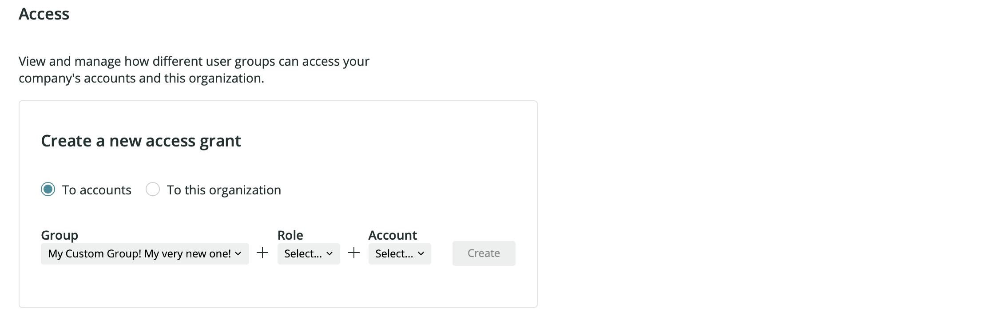

This tutorial will walk you through some common procedures for managing users on the New Relic One user model.

## Requirements

Before you start this tutorial, read this:

* This tutorial is for managing users on our [New Relic One user model](/docs/accounts/original-accounts-billing/original-product-based-pricing/overview-changes-pricing-user-model#user-models).
* Some features require Pro or Enterprise tier. For details, see [user management requirements](/docs/accounts/accounts-billing/new-relic-one-user-management/add-manage-users-groups-roles#requirements).
* [Role](/docs/accounts/accounts-billing/new-relic-one-user-management/new-relic-one-user-model#standard-roles) requirements:
  * Steps 1-4: **Authentication domain manager** and **Organization manager** roles.
  * Step 5: **Authentication domain manager** role.

## Overview

This tutorial uses terms and concepts explained in these introductory docs:

* [New Relic One user model basics](/docs/accounts/accounts-billing/new-relic-one-pricing-users/new-relic-one-user-model)
* [User management concepts](/docs/accounts/accounts-billing/new-relic-one-user-management/add-manage-users-groups-roles)

This tutorial will walk you through how to:

* Step 1: [Add/manage groups](#step-1-groups)
* Step 2: [Add/manage roles](#step-2-roles)
* Step 3: [Manage accounts](#step-3-roles)
* Step 4: [Grant groups access to roles/accounts](#step-4-access-grants) (access grants)
* Step 5: [Add/manage users](#step-5-users)

<Callout variant="tip">
  The tutorial steps are also summarized in the [Organization and access UI](https://one.newrelic.com/launcher/organizations-ui.organization-launcher).
</Callout>

## Step 1: Add/manage groups [#step-1-groups]

Groups are used to manage what users are able to do in New Relic. By default, most New Relic organizations have two groups: [**Admin** and **User**](/docs/accounts/accounts-billing/new-relic-one-user-management/new-relic-one-user-model#group-roles). And you can add your own custom groups.

<Callout variant="tip">
  You can also [import users automatically from your identity provider](/docs/accounts/accounts/automated-user-management/automated-user-provisioning-single-sign).
</Callout>

To view your organization’s groups: go to the [account dropdown](/docs/using-new-relic/welcome-new-relic/get-started/glossary#account-dropdown), click **Organizations and access**, and click **Groups**.

To create a group:

1. Click **Add group** and then name the group.
2. Select the [authentication domain](/docs/accounts/accounts-billing/new-relic-one-user-management/configure-authentication-domains-sso) the group should belong to, and click **Add group**.

<Callout variant="tip">
  Remember that the settings on the chosen [authentication domain](/docs/accounts/accounts-billing/new-relic-one-user-management/configure-authentication-domains-sso) will determine the source of users ([manual or SCIM](/docs/accounts/accounts-billing/new-relic-one-user-management/configure-authentication-domains-sso#source-users)) and the method of authentication (username/password or SAML SSO) for users that are later added to this group.
</Callout>

## Step 2: Add/manage roles [#step-2-roles]

A role is a set of [capabilities](/docs/accounts/accounts-billing/new-relic-one-user-management/add-manage-users-groups-roles#understand-concepts). Our default [standard roles](/docs/accounts/accounts-billing/new-relic-one-user-management/new-relic-one-user-model#standard-roles) have various sets of capabilities, and you can also create custom roles that have a custom set of capabilities. Later in this tutorial, you'll learn how to create an access grant, which assigns a role to a group.

To view and manage roles: go to the [account dropdown](/docs/using-new-relic/welcome-new-relic/get-started/glossary#account-dropdown), click **Organizations and access**, and click **Roles**. Available options:

* To create a custom role: click **Add new custom role**, enter a name for the role, and select the capabilities for the role.
* To view the capabilities assigned to an existing role: click on a role.
* To edit an existing custom role: click on the role you’d like to edit, click **Edit** and make the desired changes.
* To delete a custom role: hover over the role you’d like to delete and click the delete icon. Note that this will remove any user access that has been granted using this role.

## Step 3: Manage accounts [#step-3-accounts]

Understanding the accounts in your New Relic Organization is important because when you grant groups access (next step), you are able to choose what account that group has access to.

To view the accounts in your organization: go to the [account dropdown](/docs/using-new-relic/welcome-new-relic/get-started/glossary#account-dropdown), click **Organizations and access**, and click **Accounts**.

## Step 4: Grant access [#step-4-access-grants]

An access grant is what grants a group access to:

* A specific role
* A specific New Relic account

For a diagram explaining this in more detail, see [User management concepts](/docs/accounts/accounts-billing/new-relic-one-user-management/add-manage-users-groups-roles#understand-concepts).

<Callout variant="tip">
  When creating a new group, users don't have access to that group until both of these steps are done:

  * An access grant is completed
  * Users are added to that group (the next tutorial step)
</Callout>

To view existing access grants, go to the [account dropdown](/docs/using-new-relic/welcome-new-relic/get-started/glossary#account-dropdown), click **Organizations and access**, and click **Access**.

To create an access grant for users who need to manage other New Relic users:

1. From the **Access** tab, select **To this organization**.
2. Select a group and at least one [organization-scoped role](/docs/accounts/accounts-billing/new-relic-one-user-management/new-relic-one-user-model-understand-user-structure#standard-roles). (These users must also have at least one account-scoped role or may get a message they are not in a New Relic organization.)

To create all other access grants, scoped to specific accounts:

1. From the **Access** tab, select **To accounts**.
2. Select a group, a role, and an account.

<Callout variant="tip">
  Note that if a group has basic users in it, their [basic user status overrides any role limitations in that group](/docs/accounts/accounts-billing/new-relic-one-user-management/new-relic-one-user-model#).
</Callout>

To remove a group’s access grant: hover over a grant and click **Remove access**.

## Step 5: Add/manage users [#step-5-users]

After you’ve created an access grant for a new group, you can add users to that group.

To view or manage users, go to the [account dropdown](/docs/using-new-relic/welcome-new-relic/get-started/glossary#account-dropdown) and click **User management**. If you don’t see that option, review the [requirements](#requirements).

<Callout variant="tip">
  You can also [import users automatically from your identity provider](/docs/accounts/accounts/automated-user-management/automated-user-provisioning-single-sign).
</Callout>

Groups reside within the boundaries of an [authentication domain](/docs/accounts/accounts-billing/new-relic-one-pricing-users/configure-authentication-domains). If your organization has more than one authentication domain, the domain switcher in the top left will show which authentication domain you’re currently in.

To add a user, click **Add user**. Choose the [user type](/docs/accounts/accounts-billing/new-relic-one-user-management/new-relic-one-user-model#user-type) and group. Any custom groups you’ve added should be available in the group dropdown. If the custom group you choose has been granted access to a role and an account, once you add the user to that group, that user now has access.

To edit a user’s group or other details: click on the user you want to edit and make changes.
