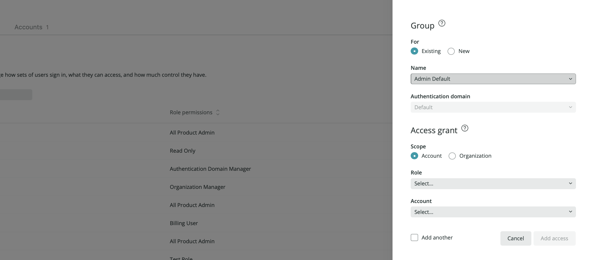

This tutorial will walk you through some in-depth procedures for managing users on the [New Relic One user model](/docs/accounts/original-accounts-billing/original-product-based-pricing/overview-user-models). These tutorials build on some of the simpler [user management task docs](/docs/accounts/accounts-billing/new-relic-one-user-management/user-management-ui-and-tasks). 

Here's a quick video overview showing how users get access to roles and accounts (3:24 minutes):

<Video id="dninMzr_zHc" type="youtube" />

For more videos showing the user management UI, see [User management videos](/docs/accounts/accounts-billing/new-relic-one-user-management/user-mgmt-videos).

## Requirements [#requirements]

Some notes on requirements:

* This tutorial is for users on our [New Relic One user model](/docs/accounts/accounts-billing/new-relic-one-user-management/user-type).
* Before using these tutorials, we recommend you understand some important [user management concepts](/docs/accounts/accounts-billing/new-relic-one-user-management/user-management-concepts#understand-concepts). 
* For user management permission requirements, see [User management tasks](/docs/accounts/accounts-billing/new-relic-one-user-management/user-management-ui-and-tasks).

## Overview [#overview]

This tutorial will walk you through how to:

* [Add users](#add-users)
* [View available accounts](#accounts)
* [Create access grants (give groups access to roles and accounts)](#group-access) 
* [Create custom roles](#roles)
* [Assign users to groups](#add-users)

## Add users to New Relic [#add-users]

Adding users to New Relic is a separate process from creating access grants. In other words, you can do either procedure first. The key point is that if you're trying to give a user access to a role or an account that they don't yet have, they won't have that access until they're both a) in a group and b) that group has the correct access grant (access to a specific role on a specific account).

There are two ways to add users: 

* With the user management UI (described below).
* With [automated user management](/docs/accounts/accounts/automated-user-management/automated-user-provisioning-single-sign), also known as SCIM provisioning. With this method, groups are defined in your identity provider and you can't edit a user's group from the New Relic UI. 

To add users from the UI:

1. From the top right of the New Relic UI, click the [account dropdown](/docs/using-new-relic/welcome-new-relic/get-started/glossary#account-dropdown), click **Administration**, and click **User management**. 
2. If you have multiple [authentication domains](/docs/accounts/accounts-billing/new-relic-one-pricing-users/configure-authentication-domains), choose one from the authentication domain dropdown.
3. Click **Add user**.
4. Complete the process, including choosing [user type](/docs/accounts/accounts-billing/new-relic-one-pricing-users/users-roles#user-type) and [user group](/docs/accounts/accounts-billing/new-relic-one-pricing-users/users-roles#user-group).  

Relevant tips: 
* For how to bulk edit users' user type, see [Edit user type](/docs/accounts/accounts-billing/new-relic-one-user-management/user-management-ui-and-tasks#edit-user-type). 
* When choosing a group, you can choose either one of our [default groups](/docs/accounts/accounts-billing/new-relic-one-user-management/user-management-concepts#groups) or a custom group that you've defined an access grant for. 

For more on creating access grants, keep reading. 

## View available accounts [#accounts]

When thinking about creating access grants for granting access to different accounts, it can help you to understand what accounts there are in your organization. 

To view the accounts in your organization: go to the [account dropdown](/docs/using-new-relic/welcome-new-relic/get-started/glossary#account-dropdown), click **Administration**, click **Organizations and access**, and then click **Accounts**.

## Grant access to accounts and roles [#group-access]

Groups are used to group your users and manage what your users are able to do in New Relic: by creating an access grant, you assign a group access to a) a specific role on b) a specific account. 

By default, organizations on the New Relic One user model have two available groups: [**Admin** and **User**](/docs/accounts/accounts-billing/new-relic-one-user-management/user-management-concepts#groups). These default groups automatically have access to specific standard roles and are assigned to the account in which they were initially added. 

To view existing access grants: from the [account dropdown](/docs/using-new-relic/welcome-new-relic/get-started/glossary#account-dropdown), click **Administration**, and then click **Organization and access**. Even if you haven't created any custom access grants, you will see the default-created grants there that are present for our default groups. 

<figcaption>This is what you might see when you go to the **Organization and access** UI and view groups. The default available groups of **Admin** and **User** have access grants automatically created that grant users in those groups access to the roles associated with those groups and to the initial account those users were added in. </figcaption>

To create a new access grant that gives a user group access to a role and an account: 

1. From the **Organization and access** UI, click **Group access**. If you don't see that UI, it may be because you're logged in with an [original user model](/docs/accounts/original-accounts-billing/original-product-based-pricing/overview-user-models) record, or because you don't have the ability to manage users. For more on such factors, see [Factors affecting access](/docs/accounts/accounts-billing/account-structure/factors-affecting-access-features-data/).
  
2. Choose one of the following: 
  * **Existing**: If there is already a group you want to add an access grant to, you can use this. For example, if you want to gives users in the default [**Admin** or **User** group](/docs/accounts/accounts-billing/new-relic-one-user-management/user-management-concepts#groups) access to new accounts, you might choose this and then select the **Admin Default** or **Admin User** role. 
  * **New**: If you need to create a new group, choose this. You'll also need to choose the [authentication domain](/docs/accounts/accounts-billing/new-relic-one-user-management/authentication-domains-saml-sso-scim-more/#auth-domain-definition) that group is inside of (for an explanation of what "Default" means, see [Default groups](/docs/accounts/accounts-billing/new-relic-one-user-management/user-management-concepts#groups). If your organization strategy requires a good amount of restrictions over access to accounts and access to roles, you'll probably need to create a good amount of access grants. 
3. Next, under **Access grant**, you'll choose one of following: 
  * **Account**: Choose this to be able to select from [the roles that are account-scoped](/docs/accounts/accounts-billing/new-relic-one-user-management/user-management-concepts#standard-roles). These are the roles that have to do with using and configuring our platform features (and not about organization and user management). 
  * **Organization**: Choose this to be able to select from [the roles that are organization-scoped](/docs/accounts/accounts-billing/new-relic-one-user-management/user-management-concepts#standard-roles). These are the roles that govern organization- and user management. (Note that these users must also already belong to an account-scoped role. This is true for most users but if it's not, you may see a message that the user doesn't belong to an organization.)
4. Select the **Role** you want to assign. Roles are organization-wide, so regardless of the authentication domain you're in, you have access to our [standard roles](/docs/accounts/accounts-billing/new-relic-one-user-management/user-management-concepts#standard-roles) and any custom roles you've created. For tips on selecting roles, see the tips after these instructions.
5. Select the **Account** you want to add access to from the dropdown. If you don't see an account that you'd expect to see, this may be for a few reasons. One is that you yourself don't have the proper permissions for that account. Another is that that account is not actually in your organization. For more information, see [Factors affecting access](/docs/accounts/accounts-billing/account-structure/factors-affecting-access-features-data/). If you are still having problems, talk to your account representative. 
6. If you want to continue adding more grants for that same group, select **Add another** at the bottom before clicking **Add access**. 
7. When you're done, if your users are already in the group you've added the grant to, they should have access within a few minutes (although for [EU region New Relic accounts](/docs/using-new-relic/welcome-new-relic/get-started/our-eu-us-region-data-centers), this can take up to twenty minutes or so). If your users are not yet in that group (which would be true if you just created an access grant with a new group), you'll need to go to the [**User management** UI](/docs/accounts/accounts-billing/new-relic-one-user-management/user-management-ui-and-tasks#where) and add one or more users to that group. 

Some tips for using this UI:

* If your users are managed via [automated user management](/docs/accounts/accounts/automated-user-management/automated-user-provisioning-single-sign/),
you can't use the [**User management** UI](/docs/accounts/accounts-billing/new-relic-one-user-management/user-management-ui-and-tasks#where) to add users to groups because your groups are imported from your identity provider. You will need to create access grants for those groups once they are in New Relic, though, to give those groups access. 
* Note that if a user has the organization-scoped **Organization manager** and/or **Authentication domain manager** roles (which is true of users in our default **Admin** group) those users will always have those capabilities because those are organization-scoped abilities. This means that when you go to add those users to another account, you only have to add an account-scoped role, and not an organization-scoped role. In other words, once the users in a group have those organization-scoped roles, they will always have them for that organization unless removed.  
* When selecting from amongst our [standard roles](/docs/accounts/accounts-billing/new-relic-one-user-management/user-management-concepts#standard-roles), it's important to understand the difference between **All product admin** and **Standard user**. In short, **All product admin** is more popular a choice because it gives the ability to configure platform features. If you wanted to have your users be able to use platform features but not configure them, you'd choose **Standard user**. 

## Create custom role [#roles]

When [creating an access grant](#group-access), you can use our [standard roles](/docs/accounts/accounts-billing/new-relic-one-user-management/user-management-concepts#standard-roles), or you can create your own roles with unique sets of capabilities.

To view existing roles: from the [account dropdown](/docs/using-new-relic/welcome-new-relic/get-started/glossary#account-dropdown), click **Administration**, then click **Organization and access**, and then click **Roles**.

To create a custom role, click **Add new custom role**. Review the list of available capabilities and decide which ones your custom role needs. 

For more information about how roles and capabilities work, see [Capabilities](/docs/accounts/accounts-billing/new-relic-one-user-management/user-management-concepts#capabilities). Or check out this NerdByte video (4:07 minutes).

<Video id="CBa0jWINQiw" type="youtube" />

Once you're finished creating a custom role, you will probably want to use it in a new [access grant](#group-access). 

## Add users to groups [#add-users]

In the user management UI, you can see your users and the groups they've been assigned to. Your users only have access to the access grants associated with the groups they've been added to. 

To view users and see their groups: from the [account dropdown](/docs/using-new-relic/welcome-new-relic/get-started/glossary#account-dropdown), click **Administration**, and click **User management**. If you don’t see that option, review the [requirements](#requirements).

Groups reside within the boundaries of an [authentication domain](/docs/accounts/accounts-billing/new-relic-one-user-management/user-management-concepts#understand-concepts). If your organization has more than one authentication domain, the domain switcher in the top left will show which one you’re in.

To add a user, click **Add user**. Complete the prompts in the UI, including choosing the [user type](/docs/accounts/accounts-billing/new-relic-one-user-management/new-relic-one-user-model#user-type) and group. Any custom groups you’ve added should be available from the group dropdown. If the custom group you choose has been granted access to a role and an account, once you add the user to that group, that user will now have access.

To edit a user’s group or other details: click on the user you want to edit and make changes.

