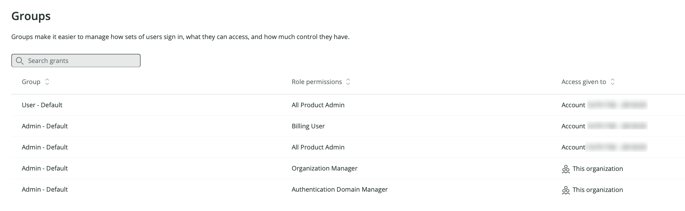
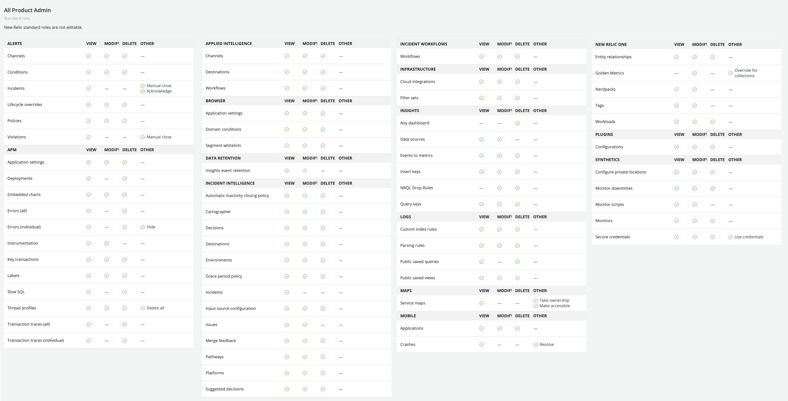

This doc will explain how New Relic users get access to specific New Relic capabilities and to specific accounts.  

## Major factors affecting permissions: user type and roles [#user-type-groups-relation]

When it comes to what New Relic features your New Relic users can access, there are two major factors at work: 

* The [user type](/docs/accounts/accounts-billing/new-relic-one-user-management/user-type): For organizations on [New Relic One pricing](/docs/accounts/accounts-billing/new-relic-one-pricing-billing/new-relic-one-pricing-billing), your users' user type is a billing factor. The user type is what sets the maximum allowed capabilities a user can access. It is meant to be a fairly long-term setting based on someone's expected New Relic duties.  
* The roles assigned: after a user's user type is decided, **roles** can be used to more precisely control a user's access. Roles are sets of **capabilities**, which are the granular New Relic abilities (for example, the ability to modify New Relic APM settings). Roles are assigned to [user groups](#groups). 

Another way to think about the relationship between user type and roles: a user's user type overrides all role restrictions. For example: a basic user might be assigned a role that has wide New Relic access, but their [basic user](/docs/accounts/accounts-billing/new-relic-one-user-management/user-type) restrictions override any role-related permissions.

## How access grants give users access to New Relic [#understand-concepts]

In order for a New Relic user to be able to access any New Relic account or capability, they must be in a [group](#groups), and that group must have an associated **access grant**. The access grant is what gives a group of users: 

* Access to a specific [role](#roles) (a role being a set of specific [capabilities](#capabilities)).
* Access to a specific account, or to the entire organization.

Organizations with [Pro or Enterprise edition](https://newrelic.com/pricing) can have multiple accounts in their organization, and can create and configure access grants. Standard edition organizations are only allowed a single account in their organization, and don't have the ability to create or configure access grants. 

When you initially sign up for New Relic, your organization has some built-in access grants associated with the default [**User** or **Admin** groups](/docs/accounts/accounts-billing/new-relic-one-user-management/user-management-concepts#groups). For example, the **Admin** group has several access grants that give any user in that group broad New Relic access, including to the higher level organization-related and user-related admin capabilities.  

<figcaption>
A view of the **Organization and access** UI, showing the default access grants associated with our default groups. 
</figcaption>

Here's a diagram showing how access grants work and how they relate to the broader organization:

<figcaption>
  A diagram explaining the concept of how access grants give a user group access to a specific role and a specific account (or the organization). (These concepts apply to users on our [New Relic One user model](/docs/accounts/original-accounts-billing/original-product-based-pricing/overview-changes-pricing-user-model#user-models) (and not our original user model).)
</figcaption>

For how to create and manage access grants, see:
* [Tips for planning out access grants](#access-grant-tips).
* [Access grant tutorial](/docs/accounts/accounts-billing/new-relic-one-user-management/tutorial-add-new-user-groups-roles-new-relic-one-user-model/#group-access).

## Groups [#groups]

For users on our [New Relic One user model](/docs/accounts/original-accounts-billing/original-product-based-pricing/overview-user-models), a "group" represents a group of users. Putting users in a group allows the managing of permissions for multiple users at the same time. For example, if you're using our automated user management feature, you can import a custom group of users (for example, **External consultants**) from your identity provider service, and then assign an [access grant](#understand-concepts) to that group, giving those users a specific role on a specific account. 

A New Relic user always requires assignment to at least one group to have access to any New Relic capability. A user that's not in a group won't have any New Relic access. A New Relic user may be in multiple groups. 

It's worth noting that groups are **not** what restrict a user's New Relic permissions: it's the **role** assigned to the group that includes the actual capability permissions. 

We have two default groups (see below). And Pro and Enterprise organizations can [create custom groups](/docs/accounts/accounts-billing/new-relic-one-user-management/tutorial-add-new-user-groups-roles-new-relic-one-user-model/#group-access).

Users and groups are located within an [authentication domain](/docs/accounts/accounts-billing/new-relic-one-user-management/authentication-domains-saml-sso-scim-more/), which is what controls settings related to how users are added and managed (for example, via SCIM provisioning) and how users log in to New Relic. 

### Our default user groups [#default-groups]

We have two default user groups:

* **User**: This group allows a user to use and configure our observability and monitoring features but **not** perform account-level tasks like managing billing or managing other users. It has access to the [**All product admin**](#standard-roles) role, which gives access to our observability platform tools, but doesn't have the **Organization manager** and **Authentication manager** roles, which give access to the account-level capabilities. 
* **Admin**: has all capabilities, including the organization-level admin abilities. This is the equivalent of having the [standard roles](#standard-roles) of **All product admin**, the **Billing user**, the **Organization manager** and the **Authentication domain manager**. 

To change a user's group, use the [**User management** UI](/docs/accounts/accounts-billing/new-relic-one-user-management/user-management-ui-and-tasks#where).

## Roles [#roles]

Roles are sets of [capabilities](#capabilities). We have our default roles, described below. And Pro and Enterprise edition organizations can create custom roles. 

To view roles and their capabilities, go to the [**Organization and access** UI](/docs/accounts/accounts-billing/new-relic-one-user-management/user-management-ui-and-tasks#where) and click **Roles**. Note that the roles UI shows the account-scoped roles but doesn't show the organization-scoped roles (**Organization manager** and **Authentication domain manager**). 

### Our standard (default) roles [#standard-roles]

We have several "standard roles," which are roles that satisfy some commonly needed use cases. 

<Callout variant="important">
Note that some of our [standard roles](#standard-roles) have hidden, non-exposed capabilities that are not available for selection when creating a custom role. The only standard roles that can be replicated with a custom role are **Standard user** and **Read only**; all others have some hidden capabilities. 
</Callout>

Our standard roles include:

<table>
  <thead>
    <tr>
      <th style={{ width: "180px" }}>
        Standard roles
      </th>

      <th style={{ width: "120px" }}>
        Scope
      </th>

      <th>
        Description
      </th>
    </tr>
  </thead>

  <tbody>
    <tr>
      <td>
        **All product admin**
      </td>

      <td>
        Account
      </td>

      <td>
        Provides admin-level access to observability platform features but not organization-level and user management features. In other words, this role includes all New Relic capabilities with the exception of managing users (**Authentication domain manager** role), managing organization/account-structure settings (**Organization manager** role), and managing billing (**Billing user** role).

        Note: the **Standard user** role is essentially the **All product admin** role minus observability feature configuration capabilities. 
      </td>
    </tr>

    <tr>
      <td>
        **Standard user**
      </td>

      <td>
        Account
      </td>

      <td>
        Provides access to observability platform features, but lacks permissions for configuring those features (for example, ability to configure [synthetic monitor secure credentials](/docs/synthetics/synthetic-monitoring/using-monitors/store-secure-credentials-scripted-browsers-api-tests)) and lacks organization-level and user management permissions. 

        Note: the **Standard user** role is essentially the **All product admin** role without that role's ability to configure platform features.  
      </td>
    </tr>

    <tr>
      <td>
        **Billing user**
      </td>

      <td>
        Account
      </td>

      <td>
        Provides ability to manage subscriptions and billing setup, and read-only access to the rest of the platform. For organizations with multiple accounts, billing is aggregated in the primary (first-created) account, which is why assigning this role to that primary account grants billing permissions for the entire organization.
      </td>
    </tr>

    <tr>
      <td>
        **Organization manager**
      </td>

      <td>
        Organization
      </td>

      <td>
        Provides the ability to manage [organization](/docs/accounts/accounts-billing/new-relic-one-pricing-users/new-relic-account-structure/-level) settings, including organization structure, name, and preferences. Due to our recent switch to the [New Relic One user model](/docs/accounts/original-accounts-billing/original-product-based-pricing/overview-user-models), this role currently has few abilities but more will be added over time.
        
        For how to grant this role, see [Add user management capability](/docs/accounts/accounts-billing/new-relic-one-pricing-users/manage-user-groups-roles-access-grants#add-user-managers).
      </td>
    </tr>

    <tr>
      <td>
        **Organization read only**
      </td>

      <td>
        Organization
      </td>

      <td>
        Provides the ability to view organization-level settings. For how to grant this role, see [Add user management capability](/docs/accounts/accounts-billing/new-relic-one-pricing-users/manage-user-groups-roles-access-grants#add-user-managers).
      </td>
    </tr>

    <tr>
      <td>
        **Authentication domain manager**
      </td>

      <td>
        Organization
      </td>

      <td>
        Provides ability to add and manage users, and configure [authentication domains](/docs/accounts/accounts-billing/new-relic-one-user-management/configure-authentication-domains-sso) for users on the [New Relic One user model](/docs/accounts/original-accounts-billing/original-product-based-pricing/overview-changes-pricing-user-model#user-models). For how to grant this role, see [Add user management capability](/docs/accounts/accounts-billing/new-relic-one-pricing-users/manage-user-groups-roles-access-grants/#add-user-managers).
      </td>
    </tr>

    <tr>
      <td>
        **Authentication domain read only**
      </td>

      <td>
        Organization
      </td>

      <td>
        Provides the ability to view users in your organization and view the configuration of [authentication domains](/docs/accounts/accounts-billing/new-relic-one-user-management/configure-authentication-domains-sso). For how to grant this role, see [Add user management capability](/docs/accounts/accounts-billing/new-relic-one-pricing-users/manage-user-groups-roles-access-grants/#add-user-managers).
      </td>
    </tr>

    <tr>
      <td>
        **Read only**
      </td>

      <td>
        Account
      </td>

      <td>
        Provides read-only access to the New Relic platform (except for [synthetic monitor secure credentials](/docs/synthetics/synthetic-monitoring/using-monitors/store-secure-credentials-scripted-browsers-api-tests)).
      </td>
    </tr>    

    <tr>
      <td>
        **Manage v1 users**
      </td>

      <td>
        Account
      </td>

      <td>
        For New Relic organizations that existed before July 30 2020 and have users on our [original user model](/docs/accounts/original-accounts-billing/original-product-based-pricing/overview-changes-pricing-user-model#how-pricing-users-relate), this role lets you manage those "v1" users.
      </td>
    </tr>
  </tbody>
</table>

For more about how you'd assign roles to groups and create custom roles, see the [user management tutorial](/docs/accounts/accounts-billing/new-relic-one-user-management/tutorial-add-new-user-groups-roles-new-relic-one-user-model). 

## Capabilities [#capabilities]

A role, whether one of our [standard roles](#standard-roles) or a custom role, is a set of capabilities. To view roles and their associated capabilities, use the [**Organization and access** UI](/docs/accounts/accounts-billing/new-relic-one-user-management/user-management-ui-and-tasks#where).

<figcaption>
A view of the capabilities associated with the [**All product admin** role](#standard-roles). When creating a custom role, you select a custom set of capabilities. Note that the capabilities exposed in the UI may change over time: this screenshot was taken in April of 2021. 
</figcaption>

Note that some of the standard roles have hidden capabilities not available for selection when building a custom role. For more detail, see [Standard roles](#standard-roles).

For how to set up roles that have custom capabilities, see the [user management tutorial](/docs/accounts/accounts-billing/new-relic-one-user-management/tutorial-add-new-user-groups-roles-new-relic-one-user-model/#roles).

## Manage users

To learn how to add users, assign them to groups, and create custom groups and roles, see [Manage users](/docs/accounts/accounts-billing/new-relic-one-user-management/user-management-ui-and-tasks).

## 2020 user model changes [#limitations]

If you'd like to understand how our user model changed in 2020 and what the impacts of that change were, see [User model changes](/docs/accounts/original-accounts-billing/original-product-based-pricing/overview-changes-pricing-user-model#impacts-user-model).

### Tips for creating access grants [#access-grant-tips]

Pro and Enterprise edition organizations can create and configure [access grants](#understand-concepts). (Standard edition organizations don't have to think much about access grants.) To implement access grants well, you'll need to think about what groups you'll need, what roles those groups should have, and what account access those groups should have. 

If you have a relatively flat organizational structure, and are okay with all or many of your users having wide administrative access and access to all accounts, you'll probably only need at most a few access grants. For example, you might decide to add new access grants to the existing default **Admin** or **User** groups, giving those roles access to other accounts. Or, if you need more granular definition over roles and permissions, you'd create access grants that define new groups that have access to specific roles (either our standard roles or custom-defined roles). 

For a tutorial on how to create access grants and create custom roles, see the [User management tutorial](/docs/accounts/accounts-billing/new-relic-one-user-management/tutorial-add-new-user-groups-roles-new-relic-one-user-model/). For other examples of some common user management tasks, see [Example tasks](#workflow). To see the UI in action, see our [user management videos](/docs/accounts/accounts-billing/new-relic-one-user-management/user-mgmt-videos). 

Some tips on setting up access grants: 

* It may help to first plan out how your access grants will be organized. How many accounts will you have? What user groups will get access to which roles and which accounts? Will you use our default groups and roles or create your own custom groups and roles? 
* If you've used [automated user management](/docs/accounts/accounts/automated-user-management/automated-user-provisioning-single-sign) to provision users via SCIM, you will have to create access grants to give those users access. 
* A common configuration for organizations with many accounts (roughly 20 or more) is setting up groups with the more organization-scoped roles (**Organization manager**, **Authentication domain manager**, and **Billing user**) on the primary account, and then on other accounts, setting up groups with the more product-scoped roles (like **All product admin**, **Standard user**, or custom roles). 

## User management terms and definitions [#definitions]

For an explanation of how user access to accounts and roles works, see [User access explained](#understand-concepts). Here are some definitions for some of our user management terms:

* A New Relic **organization** is the representation of your organization, containing all your accounts, users, and data. For more information, see [Organization and account structure](/docs/accounts/accounts-billing/account-structure/new-relic-account-structure).
* A **capability** is an ability to use or edit a specific, granular New Relic feature. Examples of capabilities:
  * The ability to modify APM settings
  * The ability to delete alert conditions
* A **role** is a set of capabilities. It is what gives a user their permissions. Our default [standard roles](/docs/accounts/accounts-billing/new-relic-one-pricing-users/users-roles#standard-roles) have various capability sets, and you can create custom roles that have a custom set of capabilities. See some specific [New Relic capabilities](/docs/accounts/accounts-billing/new-relic-one-user-management/user-management-concepts#capabilities).
* A user **group** has one or more roles associated with it. You assign your users to a group. We have [default user groups](/docs/accounts/accounts-billing/new-relic-one-pricing-users/users-roles#group-roles) (**Admin** and **User**), and you can make your own groups.
* An **access grant** is what grants a user group access to roles and to specific New Relic accounts. An access grant essentially states, "This group is assigned this role on this New Relic account." Adding a user to a group doesn’t do anything unless that group is included in an access grant.
* An [**authentication domain**](/docs/accounts/accounts-billing/new-relic-one-pricing-users/configure-authentication-domains) contains a set of users who are added to New Relic and who log in to New Relic in the same way. For example, you may have one authentication domain for users who log in via username/password and another authentication domain for users who log in via SAML.
* If a user is a [basic user](/docs/accounts/accounts-billing/new-relic-one-pricing-users/users-roles#user-type), this takes precedence over any role-related limitations. For more on this, see [Basic user and roles](/docs/accounts/accounts-billing/new-relic-one-pricing-users/users-roles#user-type-roles).

