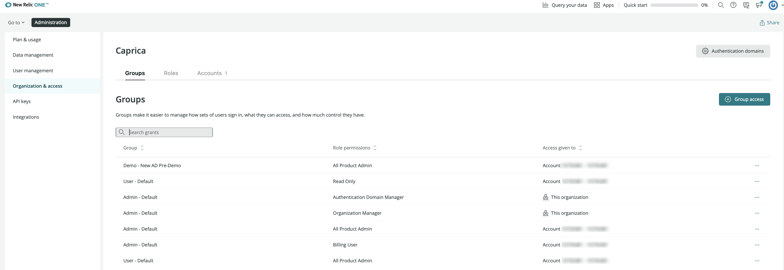

<Callout title="New pricing model">
This doc is about managing users on our [New Relic One user model](/docs/accounts/original-accounts-billing/original-product-based-pricing/overview-changes-pricing-user-model#user-models).
</Callout>

This doc explains how to find and use the user management UI and how to do some common user management tasks. 

## Requirements [#requirements]

The easiest way to see what user management capabilities you have is to go to the [user management UI](#where) and see what you have access to. 

Some user management requirements and restrictions:

* The features in this doc pertain to managing users on the [New Relic One user model](/docs/accounts/original-accounts-billing/original-product-based-pricing/overview-user-models). To learn more, see [User models](/docs/accounts/original-accounts-billing/original-product-based-pricing/overview-user-models).
* To avoid configuration conflicts, try to ensure that only one person in your organization is managing users at a time. Simultaneous configuration by more than one user may result in errors and unexpected results. 
* Most user management capabilities require the [**Authentication domain manager** role](/docs/accounts/accounts-billing/new-relic-one-pricing-users/users-roles#standard-roles) and some require the [**Organization manager** role](/docs/accounts/accounts-billing/new-relic-one-pricing-users/users-roles#standard-roles). For details, see [Standard roles](/docs/accounts/accounts-billing/new-relic-one-user-management/user-management-concepts#standard-roles).
* Pricing edition requirements:
  * To manage user groups, roles, and access grants: [Pro or Enterprise](https://newrelic.com/pricing) edition is required.
  * To [import users from an identity provider](/docs/accounts/accounts-billing/new-relic-one-user-management/configure-authentication-domains-sso#source-users): [Enterprise](https://newrelic.com/pricing) is required.
* A New Relic user can have a maximum of either three concurrent active sessions, or three unique IP addresses in use at any given time.  

## User management UI [#where]

For users on the [New Relic One user model](/docs/accounts/original-accounts-billing/original-product-based-pricing/overview-user-models), to find your user management options: From the [account dropdown](/docs/using-new-relic/welcome-new-relic/get-started/glossary#account-dropdown), select **Administration**. There are two user management UI pages there: 

* **User management**: Use this to add users, [update user type](#edit-user-type), manage what groups a user is assigned, and approve [user upgrade requests](/docs/accounts/accounts-billing/new-relic-one-user-management/authentication-domains-saml-sso-scim-more/#session-mgmt).
* **Organization and access**: Use this page to create and manage groups, roles, and access grants, and to set up [SAML SSO and SCIM provisioning](/docs/accounts/accounts-billing/new-relic-one-user-management/authentication-domains-saml-sso-scim-more).

Want to see videos of the user management UI in action? See our [user management videos](/docs/accounts/accounts-billing/new-relic-one-user-management/user-mgmt-videos).

<Callout variant="important">
  If you can't see these UI pages, it may be because you're on our [original user model](/docs/accounts/original-accounts-billing/original-users-roles/users-roles-original-user-model) or because you don't have the [required user management role](#requirements).
</Callout>

## Common user management tasks [#workflow]

<figcaption>
  In the **Organization and access** UI, you can create access grants, custom groups, custom roles, and configure an authentication domain.
</figcaption>

Here are some example user management procedures:

<CollapserGroup>

  <Collapser
    id="add-users"
    title="Add, edit, and delete users"
  >

See the [user management tutorial](/docs/accounts/accounts-billing/new-relic-one-user-management/tutorial-add-new-user-groups-roles-new-relic-one-user-model#add-users).

  </Collapser>

    <Collapser
    id="edit-user-type"
    title="Edit user type (basic, core, full platform)"
  >

Before changing your users’ user type, we recommend you understand: 

* [How to decide user type](/docs/accounts/accounts-billing/new-relic-one-user-management/user-type#choose-user-type)
* [User billing calculation](/docs/accounts/accounts-billing/new-relic-one-pricing-billing/user-count-billing)
* [User downgrade rules](/docs/accounts/accounts-billing/new-relic-one-pricing-billing/user-count-billing#user-downgrade-rules)
* If you're using [automated user management](/docs/accounts/accounts/automated-user-management/automated-user-provisioning-single-sign), you have [other options for managing user type](/docs/accounts/accounts-billing/new-relic-one-user-management/authentication-domains-saml-sso-scim-more/#user-upgrade). 

To change the user type of one or more users: 

1. On the [**User management** page](#find), click the checkboxes for the users whose user type you want to edit. 
2. Once you start selecting users, an option will appear for **Edit type**. 

You can also edit the user type and group of a specific user by clicking on that user. 

  </Collapser>

  <Collapser
    id="access-grants"
    title="Give users access to accounts and roles (access grants)"
  >
    See our [user management tutorial](/docs/accounts/accounts-billing/new-relic-one-user-management/tutorial-add-new-user-groups-roles-new-relic-one-user-model).
  </Collapser>

  <Collapser
    id="new-group"
    title="Create new custom groups and roles"
  >
    See the [user management tutorial](/docs/accounts/accounts-billing/new-relic-one-user-management/tutorial-add-new-user-groups-roles-new-relic-one-user-model).
  </Collapser>

    <Collapser
    id="new-group"
    title="Set up SAML SSO and/or SCIM provisioning"
  >
    See [Get started with SAML SSO or SCIM](/docs/accounts/accounts-billing/new-relic-one-user-management/introduction-saml-scim).

  </Collapser>

  <Collapser
    id="add-user-managers"
    title="Grant users ability to manage other users"
  >
    To grant your users the ability to manage other users, you'll need to add users to a group that has the [**Authentication domain manager** and **Organization manager** role](/docs/accounts/accounts-billing/new-relic-one-user-management/user-management-concepts#standard-roles).

    You have two options:

    * From the [User management](#where) UI, you can add a user to the default [**Admin** group](/docs/accounts/accounts-billing/new-relic-one-pricing-users/users-roles#groups), which includes both of those roles.

      OR
    * You can create a custom group and assign it these roles. For a tutorial on creating new access grants, groups, and roles, see the [user management tutorial](/docs/accounts/accounts-billing/new-relic-one-user-management/tutorial-add-new-user-groups-roles-new-relic-one-user-model).
  </Collapser>

  <Collapser
    id="basic-full-upgrade"
    title="Control how users upgrade their user type"
  >
    See the [authentication domain settings](/docs/accounts/accounts-billing/new-relic-one-user-management/authentication-domains-saml-sso-scim-more/#session-mgmt).
  </Collapser>  
</CollapserGroup>

## Track changes [#track-changes]

To see an audit log of changes to your account, including user management actions, you can query the [`NrAuditEvent`](/docs/insights/insights-data-sources/default-data/nrauditevent-event-data-query-examples).

