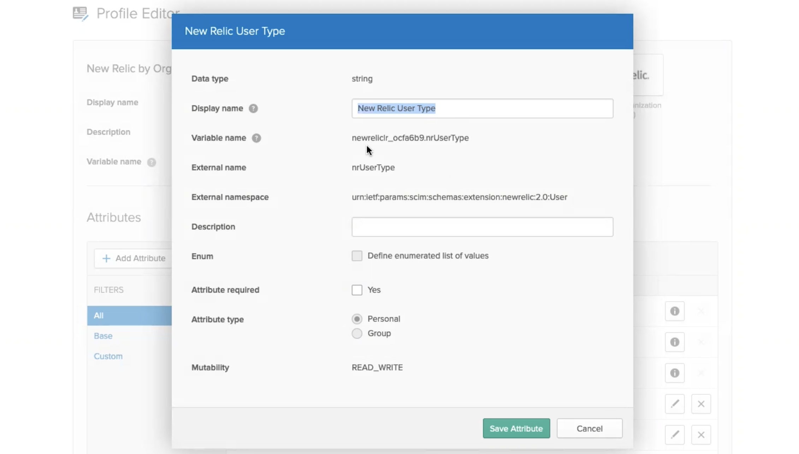
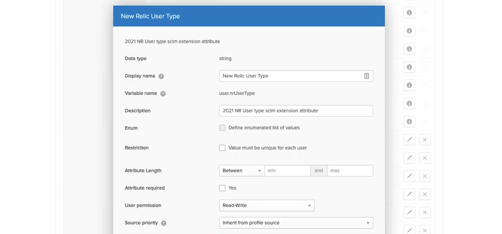

Our [automated user management](/docs/accounts/accounts/automated-user-management/automated-user-provisioning-single-sign) (AUM) allows allows you to import and configure your New Relic users from your identity provider via SCIM. This guide provides Okta specific details on how to configure the New Relic Okta SCIM/SSO application.

## Requirements

Before using this guide, read our [AUM requirements](/docs/assign-users-automated-provisioning-allow-single-sign#requirements).

Note that these instructions require going back and forth between your identity provider and New Relic. 

## Step 1. Create authentication domain and enable SCIM [#auth-domain]

To get to the New Relic authentication domain UI: From [one.newrelic.com](https://one.newrelic.com), click the [account dropdown](/docs/using-new-relic/welcome-new-relic/get-started/glossary/#account-dropdown), click **Organization and access**, and then click **Authentication domains**. 

If you don't already have one, create a new authentication domain for your SCIM-provisioned users by clicking **+ Add new**. 

For that authentication domain, under **Source of users**, select **SCIM**. Copy and save the API token for later use. Note that this will be shown only once.

## Step 2. Set up Okta's New Relic app [#app]

Next, set up Okta's New Relic SCIM/SSO application:

1. Go to [okta.com/](https://www.okta.com/) and sign in with an account that has administrator permissions.
2. From the Okta home page, click on **Admin**.
3. From the Okta admin **Dashboard**, choose the **Applications** page. 
4. Click **Browse app catalog** and search for "New Relic by organization" (not "New Relic by account") and choose that from the results.
5. From the **New Relic by Organization** page, click on **Add**.
6. From the **Add New Relic by organization** page, check the two **Application visibility "Do not display..."** checkboxes and click on **Done**. We will make the application visible later after configuration is complete and provisioning has begun.

## Step 3. Configure provisioning [#configure-provisioning]

Configure Okta's New Relic SCIM/SSO application to automatically provision your users to New Relic:

1. From the app, click on the **Provisioning** tab.
2. From the **Integration** form, click on **Configure API integration**.
3. Check the **Enable API integration** checkbox.
4. Take the API token you saved in [Step 1](#auth-domain) and input it in the Okta New Relic app's **API token** field.
5. Optional: click on **Test API credentials** to verify a SCIM connection can be established to New Relic. If a connection can be established, a success message is displayed. If a connection was not established, re-enter the API Token and try the test again.
6. Click **Save**. Note that the save process does a test of the API credentials. If a connection is not established to New Relic, the save will fail.
7. On the newly displayed **To App** form, click on **Edit**.
8. Check the **Enable** checkbox in the **Create users**, **Update user attributes**, and **Deactivate users** sections.
9. Click **Save**.

## Step 4. Assign users and groups [#assign-users]

Next, you'll assign users in Okta's New Relic application.

Assigning users is done using two different tabs in the app. We recommend having your New Relic users selected on the **Assignments** tab and their associated groups selected on the **Push groups** tab.

### Assignments tab

1. In the app, click on the **Assignments** tab.
2. From the **Assignments** form, click on **Assign**.
3. From the pop up menu, click on **Assign to groups**.
4. From the **Assign ... to groups** form, click on **Assign** for the group you wish to assign to the application.
5. **Highly recommended**: Set your users' time zones in Okta. The time zone affects how date/times for that user are shown in New Relic. Users without a time zone configured will be shown in UTC time in New Relic. Time zone is specified in IANA Time Zone database format, also known as the "Olson" time zone database format (e.g., "America/Los_Angeles"). There are several ways in Okta to assign users' time zone, so consult the Okta docs for more information if needed. Here is one way to do this in the **Assignments** tab: 
   * In the **Time zone** field, enter the default time zone for members of the group. 
6. Click on **Save and go back**.
7. Repeat the steps to add a group until all desired groups have been assigned to the application.
8. Click **Done**.

### Push groups tab

1. In the app, click on the **Push groups** tab.
2. From the **Push groups** form, click on **Push groups**.
3. From the pop up menu, click on **Find groups by name**.
4. From the **Push groups to...** form, in the search field enter the first few characters of the name of the group you want to send to New Relic. Leave the **Push group memberships immediately** checkbox checked.
5. Click on your group in the pop up search results list.
6. In the **Match result & push action** section, **No match found** should be displayed, meaning that the group does not yet exist at New Relic. Leave the selector set to **Create group** and leave the default name for the group. The intent here is to have a group of the same name created at New Relic.
7. If this is the last group you wish to send to New Relic, click on **Save**. Otherwise, if you have more groups to configure, click on **Save & add another** and repeat the steps to add a group.

When you've added one or more groups, you should be able to see the users you've added by going to the [**User management** UI page](/docs/accounts/accounts-billing/new-relic-one-user-management/add-manage-users-groups-roles/#where). 

## Step 5. Set your users' user type [#user-type]

When your users are provisioned in New Relic, you're able to see them in the [**User management** UI](/docs/accounts/accounts-billing/new-relic-one-user-management/add-manage-users-groups-roles/#where). 

If you're adding users to New Relic via SCIM but **not** managing their [user type](/docs/accounts/accounts-billing/new-relic-one-user-management/new-relic-one-user-model-understand-user-structure/#user-type) via SCIM, they start out as [basic users](/docs/accounts/accounts-billing/new-relic-one-user-management/new-relic-one-user-model-understand-user-structure#user-type). To convert users to [full users](/docs/accounts/accounts-billing/new-relic-one-user-management/new-relic-one-user-model-understand-user-structure#user-type), you have two options: 

* Use the [User management UI](/docs/accounts/accounts-billing/new-relic-one-user-management/add-manage-users-groups-roles#edit-user-type) to set users to basic. 
* Manage user type from Okta (described below). 

To manage your users' user type from Okta: 

1. Go to the New Relic [authentication domain UI](/docs/accounts/accounts-billing/new-relic-one-user-management/authentication-domains-saml-sso-scim-more/#manage-user-type-scim) and click **Enable Manage user type with SCIM**. Note that when this is enabled, you can’t manage user type from the New Relic UI and can only manage it from Okta.
2. Go into your Okta instance. The rest of these instructions are done from Okta.
3. Next, you'll configure Okta to be able to send a new attribute `nrUserType`. Steps: 
	* Go to the **Profile editor**. In the **Attributes** section, click **Add attribute**. 
	* Set your settings to match the screenshot below (except for the variable name, which is created automatically). The only two fields that must match exactly are **External name** and **External namespace**. The value for **External namespace** must be `urn:ietf:params:scim:schemas:extension:newrelic:2.0:User`
	
  

4. Next, you'll configure your Okta user profile to have this field. Steps: 
	* In the **Profile editor**, go to **Users** and click the **User (default)** profile. 
	* Add a new **New Relic user type** attribute to that profile ([see Okta user profile instructions](https://developer.okta.com/docs/concepts/user-profiles/#universal-directory-schemas)). How you set this will depend on your own setup and preferences for defining user type. Note that the expected values for user type are `Basic user` and `Full user`. Below is an example with information filled in. 
  
5. In the **People** section, define the user type for your users. How you do this will depend on your setup and preferences. For example, you may choose to set this manually by setting each user’s user type, or you may use Okta to manage these in bulk.
6. Next, you’ll set up mapping for that attribute. Steps: 
	* In the app's **Provisioning** section, click **Unmapped attributes**.
	* Go into edit mode for the unmapped New Relic user type attribute.
	* Configure it based on how you want to set the user type. To learn about why you'd set them as basic users or full users, see [User type](/docs/accounts/accounts-billing/new-relic-one-user-management/new-relic-one-user-model-understand-user-structure#user-type). [Learn more about Okta attribute mappings.](https://help.okta.com/en/prod/Content/Topics/users-groups-profiles/usgp-about-attribute-mappings.htm) 

## Step 6. Assign access grants [#assign-users]

Once these steps are completed, you're able to see your users in New Relic by going to the [User management UI](/docs/accounts/accounts-billing/new-relic-one-user-management/add-manage-users-groups-roles/#where). Now that your users are present in New Relic, you must grant them access to specific roles on specific accounts. If this is not done, your users don't yet have access to New Relic. To learn how to do this, see: 

* [How access grants work](/docs/accounts/accounts-billing/new-relic-one-user-management/add-manage-users-groups-roles#understand-concepts)
* The [user management tutorial](/docs/accounts/accounts-billing/new-relic-one-user-management/tutorial-add-new-user-groups-roles-new-relic-one-user-model/) 

## Step 7. Configure SAML SSO [#saml]

To enable SAML SSO, see the [SAML instructions](/docs/accounts/accounts-billing/new-relic-one-user-management/authentication-domains-saml-sso-scim-more/#saml). 

## Additional considerations [#additional-considerations]

In this section we discuss other important things to know when using the New Relic SCIM/SSO application. This section includes tips to work around potential issues that could cause undesired results when integrating between Okta and New Relic.

### Moving users between groups [#moving-users]

When moving a user between groups, you must manually synchronize the old group's membership with New Relic. This is because Okta does not send a SCIM request to remove a user from a group. So, the admin needs to push the old group's membership to New Relic manually to inform New Relic that the user is no longer a member of the old group.

Here are the steps to manually synchronize a group's membership:

1. From the New Relic SCIM/SSO application page, click on the **Push groups** tab.
2. From the **Push groups** form, open the pick list on the desired group's button under the **Push Status** column.
3. From the displayed pick list on the button, click **Push now**. This causes an immediate synchronization of the group's membership with New Relic.
