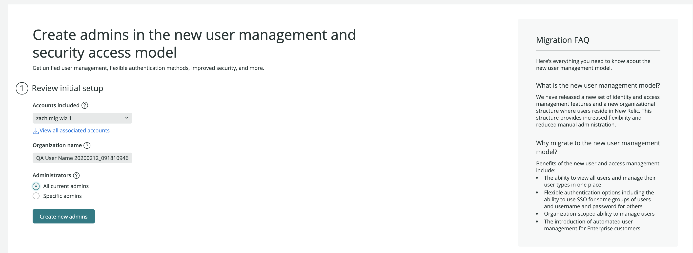

Starting April 12, 2021, we're allowing some customers who have users on our original user model to self-serve and migrate those users to be on the New Relic One user model.

## Background [#background]

On July 30, 2020, we released a new and improved user model called the New Relic One user model. This newer model offers a simpler, more efficient way to manage users and their access to roles and accounts.

At first, this new model was available mainly to new customers, while users in pre-existing New Relic organizations remained on our original user model. But now some original-user-model organizations that meet some [requirements](#requirements) can use a migration wizard to migrate their users to the new model. When that migration process is complete, your users are on the New Relic One user model and you’ll have [new procedures for managing your users and their access to accounts](/docs/accounts/accounts-billing/new-relic-one-user-management/introduction-managing-users/).  

## Benefits [#benefits]

When you migrate your users to this model, benefits include:

* Viewing and managing all users from multiple accounts in one place.
* Fewer steps to add and manage users.
* Flexible authentication options.
* More granular roles for user management.
* For Enterprise customers: access to automated user management via identity providers.

[Learn more about the benefits of the new model.](https://blog.newrelic.com/product-news/user-management-and-access-security/)

## Requirements [#requirements]

Requirements include: 
* You must be on the [original user model](/docs/accounts/original-accounts-billing/original-product-based-pricing/overview-user-models). If you aren't sure which you are, see [Determine user model](/docs/accounts/original-accounts-billing/original-product-based-pricing/overview-changes-pricing-user-model/#determine-user-model). 
* To use the user migration wizard, you must have the [Owner role](/docs/accounts/original-accounts-billing/original-users-roles/users-roles-original-user-model/#roles). 

## Recommendations and considerations [#recommendations]

We have some recommendations below that apply to organizations who choose to do the user migration on their own. Note that **these considerations won't apply if you're being helped by a New Relic representative**; in that case, your account representative will give you guidance. 

We recommend **not** using the user migration wizard in these circumstances:

* If your organization has more than 20 accounts (unless you're getting help from a New Relic representative). Note that this refers to having 20 or more accounts, **not** users.
* If you frequently [add accounts](/docs/accounts/accounts-billing/account-structure/mastersub-account-structure/#creating). Currently, users on the new user model require New Relic assistance to add accounts. 
* If you think any of the [new user model impacts and limitations](/docs/accounts/original-accounts-billing/original-product-based-pricing/overview-changes-pricing-user-model/#limitations) might affect you negatively.
* If you require account-level roles for user management capabilities. Roles related to user management (ability to add and update users, change user type, create access grants) currently apply across an organization and can't be assigned at an account level. 

If you have questions about whether you should use the user migration wizard, talk to your New Relic account representative. 

## Understand user management concepts [#before-beginning]

During the user migration procedure, you'll have a choice to either grant all your users access to all your organization's accounts, or to assign more granular access (set the roles and accounts your user groups have access to). 

The more you need to partition access to accounts or roles, the more it will help you to understand some basics about the newer user management concepts. Here's a brief summary: 

* Users are grouped in a container called an "authentication domain". The domain governs how users are added to New Relic (manually with the UI or automatically via SCIM). It also governs how users log in (manually with email/password or using SAML SSO). Most organizations will have just one or two authentication domains: one for the default manual settings and another for the more automatic methods.
* Users can be assigned to one or more groups (for example, our default **Admin** group or a custom group like **Contractors**). For large organizations, users are often assigned to multiple groups. 
* When you want to give a user group access to a specific role and a specific account, you must create an **access grant**. For example, you may give a **Contractors** group access to our default **All product admin** role on one or more of your accounts, or give that group a custom role. 

To learn more, see [User management concepts](/docs/accounts/accounts-billing/new-relic-one-user-management/add-manage-users-groups-roles/#understand-concepts).

## Optional: plan out user groups and access grants [#plan-groups]

If you'll need to do a good amount of partitioning of users' access to accounts or roles, you'll want to think about how you'll implement groups for your organization. Here are some tips for how different types of organizations may use groups:  

* For organizations with a good number of accounts, a common configuration is to have one user group with the [**Organization manager** role](/docs/accounts/accounts-billing/new-relic-one-user-management/new-relic-one-user-model-understand-user-structure/#roles) (organization-level management capabilities), one group with the [**Authentication domain manager**](/docs/accounts/accounts-billing/new-relic-one-user-management/new-relic-one-user-model-understand-user-structure/#roles) (user management capabilities), a group with the [**Billing user**](/docs/accounts/accounts-billing/new-relic-one-user-management/new-relic-one-user-model-understand-user-structure/#roles) (billing-related capabilities) on the primary (first) account, and then configuring various users groups for admins, users, and other roles as needed on your other accounts.  
* Customers with smaller and/oor flatter organizations that are okay with transparency for all teams across all of their data could have as little as one or two groups.
* For organizations where all data is in a single account, a common configuration might be having five or six groups.

## Migrate your users with the migration wizard [#find]

Before you start, be sure you've read [the requirements](#requirements). To start using the wizard: 

1. From [one.newrelic.com](https://one.newrelic.com), click **Apps** in the top navigation. 
2. In the table of apps, click the **User migration walkthrough** app.
3. Optional: If you want more help and context, see the sections below for tips and recommendations for specific migration wizard pages. 

If you've successfully completed migration, learn [how to manage your users](#manage-users). 

## Step 1: Create admins [#page1]

Tips: 
* You can either a) import all current admins for your account or b) specify the admins that should have access to user management capabilities. Note that you can add more admin users and edit permissions after you complete the migration process.
* If you've already used the wizard to set up an admin on the new user model, have the admin sign in using their new user record to access the migration tool. The user migration wizard, when completed, destroys the old user record, but if you've started the user migration process without completing it, you may have users with access to both the original and new record, as shown below: 
	 
    <figcaption>
	  If a user on the new model has been created and the migration process hasn't been completed, they may have access to both the original user record and the new user records. 
    </figcaption>
* If you plan on migrating only a portion of your users to the new user model to start, we recommend leaving some original user model admins so that you have an admin to manage your users on the original model. 

## Step 2: Set up organization [#page2]

You may choose a) a guided setup that allows more configuration options, or b) an automatic setup with fewer steps. Some notes on the automatic setup:

* It won't transition SSO or [AUM-implemented SCIM configurations](/docs/accounts/accounts/automated-user-management/automated-user-provisioning-single-sign). Instead, users will be provisioned manually and will log in manually with their username and password. 
* It provides all users with access to all accounts. If you use SSO or AUM today or require some accounts to be inaccessible by certain user groups, don't use the automatic option.

## Step 3: Name your organization [#page3]

Name your organization something descriptive and easily recognizable.

## Step 4: Authentication domain settings [#page4]

This section controls how users are provisioned (added to New Relic) and how they authenticate (log in). Note that choosing SAML SSO or SCIM setup will require you to exit the migration wizard and configure things elsewhere in the New Relic UI.

Here's more detail about the two authentication domain sections: 

### Managing users [#managing-users]

For how users are added and managed, you can select **Manually** or **Identity provider**. 

The option to use your identity provider to provision users is available only if your organization has [Enterprise edition](https://newrelic.com/pricing). If you choose **Identity provider**, you must follow [additional steps for using specific identity providers](/docs/accounts/accounts/automated-user-management/automated-user-provisioning-single-sign). Once you do that, these users are created on the new user model and synced in New Relic based on your identity provider configuration. 

Note that if you're already using an app made by Okta, Azure, or OneLogin, you'll probably need to use a newer version made for New Relic's newer user model. For more on this, see [Identity provider apps](#idp-apps).

After you complete provisioning users, you can confirm that these users have been added by seeing if they’re in the new [**User management** UI](#manage-users).

If you’ve selected the guided workflow, we’ll match these users by email address. There will be no need to later complete the user import step for these users given they’ll have been brought into New Relic via your identity provider. When done, you can skip ahead to the **Migrate assets** step.

### Login methods [#login-methods]

If you chose **Manually** for [managing users](#managing-users), you have a choice for how those users log in. You can select either a) email/password login or b) single sign on (SSO). Note that SSO is available only for organizations with Pro or Enterprise edition.

You can select multiple authentication methods based on your needs. For example, you might use SSO for your employees and username/password for contractors. 

If you select SSO, you must complete [additional configuration steps](/docs/accounts/accounts-billing/new-relic-one-user-management/authentication-domains-saml-sso-scim-more/#saml). You can complete the procedure for setting up SSO, and then come back to the migration wizard to continue the migration process. If you select more than one authentication method, note that you’ll need to add a new [authentication domain](/docs/accounts/accounts-billing/new-relic-one-user-management/authentication-domains-saml-sso-scim-more/#auth-domain-definition).

Note that if you're already using an identity provider's New Relic app, you'll probably need to use a newer version made for New Relic's newer user model. For more on this, see [Identity provider apps](#idp-apps), below. 

### A note about identity provider apps [#idp-apps]

Okta, Azure, and OneLogin have New Relic apps for both the original user model and the New Relic One user model. The original apps are titled "New Relic by account" while the newer apps are titled "New Relic by organization." If you're already using one of the New Relic apps, it's likely made for the original user model, which means you'll need to set up a new app. 

## Step 5: Import existing users [#import-users]

**Recommended**: Download the full list of existing original user model users before choosing to import users. This will be a useful resource and serve as a backup, if you need it. 

After downloading your original user model users, you can upload all users or just some of them. This step will create user records on the New Relic One user model. In a later step, you’ll be able to transition these users' assets. 

The new user record that's created has the same login credentials: there is no need to reset passwords. If a user has a pending email verification status (pending being verified), that will also be transitioned over. 

Important tips: 

* Ensure the new users' email addresses match their original user record email addresses, including matching exact case. We use email addresses as the key value to match users and, in a later step, to transition their user-associated assets. 
* Once you complete this step and create new user records, we highly recommend completing the migration process without delay. If you don't complete the steps to migrate assets and delete the original user record, a user may see two user records when logging in (see [login screenshot from Step 1](#page1)) or else may be missing assets they expect to see (like dashboards). 

## Step 6: Access settings [#access-settings]

This step allows you to determine the level of access your users have. If you need to map user access to specific accounts and roles, then you'll want to set up groups and access grants at this stage. 

You'll need to create an access grant for each account that you want a group to have access to. For example, a DevOps group might have five different access grants, each giving the group access to a different account.  

This procedure is done separately from the user migration wizard procedure. For more on how to create access grants, see the [user management tutorial](/docs/accounts/accounts-billing/new-relic-one-user-management/tutorial-add-new-user-groups-roles-new-relic-one-user-model/#group-access).

## Step 7: Migrate user assets [#migrate-assets]

Upon completion of this step, personal assets are migrated to new user records and the original user record is deleted. User assets include: 

* Dashboards
* Favorites
* Weekly email settings
* Email opt in/out preferences
* User-specific [user keys](/docs/apis/intro-apis/new-relic-api-keys/#user-api-key)
* New Relic One apps [NerdStorage data](https://developer.newrelic.com/explore-docs/nerdstorage)

If a user has access to several organizations that use New Relic (for example, if that user is a contractor), their original user model record won't be fully deleted until all those organizations migrate their users. It's possible that such a user will have both an original user record and one or more new user records and this will be displayed upon login (see [login screenshot in Page 1 section](#page1)).

## Step 8: Review and finish [#review-finish]

If you're migrating users in chunks and not all at once, you can go through the migration workflow several times with different groups of users. You can only click **Finish Setup** when all users in the organization are migrated.

## After you're done [#manage-users]

Once your users are migrated to the new user model, you can find and manage them by clicking the [account dropdown](/docs/using-new-relic/welcome-new-relic/get-started/glossary/#account-dropdown), clicking **Administration**, and using these UI pages: 

* **User management**: use this to view and add users, change their type (basic versus full), change their group, and approve user upgrade requests. 
* **Organization and access**: use this to create access grants (granting groups access to roles and accounts), and configure authentication domains (SAML SSO settings and SCIM settings, and more). 

For more about these tools, see the [new user management docs](/docs/accounts/accounts-billing/new-relic-one-user-management/introduction-managing-users/).

