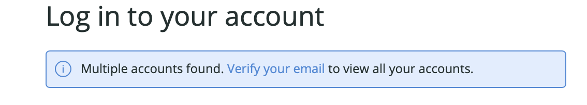

For users on our [**original user model**](/docs/accounts/original-accounts-billing/original-product-based-pricing/overview-changes-pricing-user-model#user-models), an introduction to how the user model works, including user roles and permissions, and how to add and manage users.

## Requirements [#who-is-doc-for]

This doc and the surrounding [section of docs](/docs/accounts/original-accounts-billing/original-users-roles) shows you how to manage users on our [original user model](/docs/accounts/original-accounts-billing/original-product-based-pricing/overview-changes-pricing-user-model#user-models). If you were a New Relic customer before July 30 2020 and haven't [migrated your users to the new model](/docs/accounts/original-accounts-billing/original-users-roles/user-migration), your users are on our original user model (and not the [New Relic One model](/docs/accounts/accounts-billing/new-relic-one-pricing-users/users-roles)).

If you're an admin and want to see if you have users on the original model: If you can see users in the [**Users and roles** UI](#view-access), those users are on our original user model. 

## Updates about our new user model [#migrate]

In July of 2020, we released a new user model called the [New Relic One user model](/docs/accounts/original-accounts-billing/original-product-based-pricing/overview-changes-pricing-user-model/#user-models), which offers many [benefits in terms of how you manage your organization and users](https://newrelic.com/blog/how-to-relic/user-management-and-access-security). At first this was only available to new sign-ups but over time we've been migrating more older customers to the new model. Some older customers are able [to migrate their users on their own](/docs/accounts/original-accounts-billing/original-users-roles/user-migration/). We'll continue working on migrating users to the new model until the original model is fully deprecated. 

One impact of the new user model is that it's possible now for users to have multiple logins associated with the same email. For example, a user with access to multiple organizations (like a contractor) may have their user record updated to the new user model in one organization, resulting in them having their original login method and records and a New Relic One user model record. This may result in the user being logged in to New Relic and not being able to find an account they're looking for. For more on that, see [Factors affecting access](/docs/accounts/accounts-billing/general-account-settings/factors-affecting-access-features-data/#account-access).

    <figcaption>
If a user's email is associated with more than one login, they'll see a "multiple accounts found" note when logging in. </figcaption>

## View and manage users in UI [#view-access]

If your New Relic account has users on our [original user model](#who-is-doc-for), you can use the **Users and roles** UI. To access this: Click the [account dropdown](/docs/accounts-partnerships/education/getting-started-new-relic/glossary#account-dropdown), click **Account settings**, and then click **Users and roles**.

Some features in the UI are visible only to account Owners and Admins.

<Callout variant="tip">
  You can also use the [New Relic REST API](/docs/apis/rest-api-v2/account-examples-v2/listing-users-your-account) to obtain a list of everyone and their roles in your New Relic account.
</Callout>

Here are some instructions and tips for adding and managing users via the UI:

<CollapserGroup>
  <Collapser
    id="adding_users"
    title="Add a new user"
  >
    <Callout variant="tip">
      **Owner or Admins**
    </Callout>

    To add a new user to your New Relic account:

    1. Go to: **[account dropdown](/docs/accounts-partnerships/education/getting-started-new-relic/glossary#account-dropdown) > Account settings > Users and roles > Users**.
    2. In the upper right corner, click **<Icon name="fe-plus-circle"/>
       New user**.
    3. Enter the appropriate name and email address.
    4. Select their base role as either Admin, User, or Restricted.
    5. Select **Add user**.

    The new user will receive an email notification automatically from New Relic.

    <Callout variant="important">
      New Relic recommends a maximum of 1,000 accounts per user. Additional accounts may result in limited access to some New Relic features.
    </Callout>
  </Collapser>

  <Collapser
    id="update-user-type"
    title="Manage user type (basic vs full) and full user upgrades"
  >

    Note that billing-related aspects of your count of full users only apply if you're on [New Relic One pricing](/docs/accounts/original-accounts-billing/original-product-based-pricing/overview-changes-pricing-user-model#pricing-plans). If you're on our [original pricing plan](/docs/accounts/original-accounts-billing/original-product-based-pricing/overview-changes-pricing-user-model#pricing-plans), billing impacts do not apply. 

    To update a user's type (basic user versus full user):

    1. Go to: **[account dropdown](/docs/accounts-partnerships/education/getting-started-new-relic/glossary#account-dropdown) > Account settings > Users and roles > Users**.
    2. Either select a user and edit their type or [bulk update the type for multiple users](/docs/accounts/accounts/roles-permissions/bulk-user-actions-add-delete-or-update-batches-users).
    
    To control how basic users upgrade to become full users, from the **Users and roles** UI you can select **Access requests**. You have two options: 
    * **Automatic approval**: With this option, basic users can automatically upgrade to be full users. This option allows your users to more easily troubleshoot problems. 
    * **Require review**: With this option, your admins get a notification when basic users request an upgrade and must upgrade them first. You can approve them either from the notification email or from the user's entry in the **Users and roles** UI.

    For more about user type, see [User type](#user-type).
  </Collapser>

   <Collapser
    id="full-user-count"
    title="Determine full user count"
  >
If you're on [New Relic One pricing plan](/docs/accounts/accounts-billing/new-relic-one-pricing-billing/new-relic-one-pricing-billing/), your count of [full users](#user-type) is a factor in your billing. To see your count of full users, click the [account dropdown](/docs/using-new-relic/welcome-new-relic/get-started/glossary/#account-dropdown) and then click **View your usage**.

If you have a [parent/child account structure](/docs/accounts/original-accounts-billing/original-users-roles/mastersub-account-structure/) (including a [customer partnership](/docs/new-relic-partnerships/partner-integration-guide/partner-account-maintenance/partnership-accounts-users-subscriptions/)), your count of full users may not match what you see when you go to **Account settings** > **Users and roles**. To examine users on a parent account's children accounts, go to a parent account's **Account settings** UI page, click on a child account, and go to that account's **Users and roles** UI page.

  </Collapser>
 

  <Collapser
    id="saml-sso"
    title="Enable SAML SSO and/or SCIM"
  >
For an introduction to using SAML SSO and/or SCIM provisioning, see [Get started with SAML SSO or SCIM](/docs/accounts/accounts-billing/new-relic-one-user-management/introduction-saml-scim).
  </Collapser>

  <Collapser
    id="view-pending"
    title="View pending SAML SSO users"
  >
    New Relic accounts with [SAML Single Sign On (SSO)](/docs/accounts-partnerships/accounts/saml-single-sign/saml-service-providers) may have a list of **Pending users**. These are individuals who have been [added to the SAML-enabled account](/docs/accounts-partnerships/accounts/saml-single-sign/adding-users-saml-accounts) but have not yet confirmed.
  </Collapser>

  <Collapser
    id="updating"
    title="Update account roles"
  >
    <Callout variant="tip">
      **Owner or Admins**
    </Callout>

    To update a person's role and capabilities:

    1. Go to: **[account dropdown](/docs/accounts-partnerships/education/getting-started-new-relic/glossary#account-dropdown) > Account settings > Users and roles > Users**.
    2. Select the person's name.
    3. Under **Roles and capabilities**, select their base role as Admin, User, or Restricted.

    The account Owner must [update the Owner role](#owner).
  </Collapser>

  <Collapser
    id="deleting"
    title="Delete a user"
  >
    <Callout variant="tip">
      **Owner or Admins**
    </Callout>

    To remove a user from your New Relic account:

    1. Go to: **[account dropdown](/docs/accounts-partnerships/education/getting-started-new-relic/glossary#account-dropdown) > Account settings > Users and roles > Users**.
    2. Click on the name of the person you would like to update.
    3. Click **<Icon name="fe-trash-2"/>
       Delete User**.

    <Callout variant="tip">
      You can also add, update, or delete users in bulk [via CSV file](/docs/accounts/accounts/roles-permissions/bulk-user-actions-add-delete-or-update-batches-users).
    </Callout>
  </Collapser>

  <Collapser
    id="owner"
    title="Update the account Owner"
  >
    A New Relic account can have only one Owner [role](/docs/accounts-partnerships/accounts/account-billing-usage/users-roles#roles) at any time. You must be the current account Owner to change your role to someone who currently has an Admin role for the account. If the [current Owner is unavailable](#no-owner), contact your account representative at New Relic, or get support at [support.newrelic.com](https://support.newrelic.com).

    You cannot delete or remove your assigned Owner role. However, if the account has one or more Admin role, you can change an Owner to an Admin.

    1. Go to: **[account dropdown](/docs/accounts-partnerships/education/getting-started-new-relic/glossary#account-dropdown)** **>** **Account settings > Account > Users and roles**.
    2. Above the Active users list, select <Icon name="fe-repeat"/>
       **Change owner**. If an account has no Admins, this button won't be available.
    3. Select someone who currently has an Admin role for the account.
    4. Refresh the page for changes to take effect.

    Your previous Owner role automatically changes to an Admin role.

    To find out who is the current assigned Owner:

    1. Go to: **[account dropdown](/docs/accounts-partnerships/education/getting-started-new-relic/glossary#account-dropdown)** **>** **Account settings > Account > Users and roles**.
    2. View the **Base role** column to locate your account Owner.

    The <Icon name="fe-repeat"/>
    **Change owner** button is only visible to the current account Owner. If the current Owner is unable to change the role (for example, that person no longer is with your organization), contact your account representative at New Relic, or get support at [support.newrelic.com](https://support.newrelic.com).
  </Collapser>
</CollapserGroup>

## User types: basic user and full user [#user-type]

  <Callout variant="important">
This section is for users on our [original user model](/docs/accounts/original-accounts-billing/original-product-based-pricing/overview-changes-pricing-user-model/#user-models). If you're on our New Relic One user model, see our [New Relic One user docs](/docs/accounts/accounts-billing/new-relic-one-user-management/new-relic-one-user-model-understand-user-structure/).

Starting March 2021, we ended the preview period for basic users on our original user model. The preview period gave these basic users the same permissions as full users. For more on this, see our [Explorers Hub post on user type changes](https://discuss.newrelic.com/t/basic-users-can-now-request-upgrades-to-full-stack-observability-uis-on-march-1/139782).
    </Callout>

The user type (basic user or full user) determines what features a user has access to. 

Below are details on the two user types. Note that billing-related aspects only apply if you're on [New Relic One pricing](/docs/accounts/original-accounts-billing/original-product-based-pricing/overview-changes-pricing-user-model#pricing-plans). If you're on our [original pricing plan](/docs/accounts/original-accounts-billing/original-product-based-pricing/overview-changes-pricing-user-model#pricing-plans), billing impacts do not apply. 

* **Basic user**. Details:
  * These users have access to basic features like setting up reporting of data, running queries of data, making custom charts and dashboards, and setting up alerts. They do **not** have access to our more curated observability UI experiences (for more details on feature access, see [Capabilities](#user-capabilities)).
  * Depending on [access request settings](#update-user-type), basic users can either upgrade themselves to be full users or request upgrade access from admins.
* **Full user**. Details:
  * Full users have access to everything (dependent on role restrictions), which includes our curated observability UI experiences, such as APM, infrastructure monitoring, browser monitoring, mobile monitoring, and synthetic monitors. For details, see [Capabilities](/docs/accounts/accounts-billing/new-relic-one-user-management/new-relic-one-user-model-understand-user-structure/#user-capabilities). 
  * For organizations on [New Relic One pricing](/docs/accounts/original-accounts-billing/original-product-based-pricing/overview-changes-pricing-user-model#pricing-plans): these users are [billable](/docs/accounts/accounts-billing/new-relic-one-pricing-users/pricing-billing#user-count). The Standard [edition](https://newrelic.com/pricing) includes one free full user and up to five total. 

If a user in your organization is set as a basic user in one account and a full user in another, the user is considered a full user and has full user access on all accounts in that organization.

For how to edit a user's type, see [Manage users](#update-user-type).

## Account roles [#roles]

A New Relic account can have only one Owner. To share an account with other users in your organization, create Admins, Users, or Restricted Users.

<table>
  <thead>
    <tr>
      <th width={150}>
        **Account role**
      </th>

      <th>
        **Description**
      </th>
    </tr>
  </thead>

  <tbody>
    <tr>
      <td>
        Owner
      </td>

      <td>
        The person who initially creates the New Relic account and receives all [billing queries](/docs/accounts-partnerships/accounts/account-billing-usage/account-pricing-billing-options). The Owner has [complete access to all of the account information](/docs/accounts-partnerships/accounts/account-billing-usage/account-pricing-billing-options#self-serve).
      </td>
    </tr>

    <tr>
      <td>
        Admin
      </td>

      <td>
        Can [add, edit, and delete users](/docs/accounts-partnerships/accounts/account-setup/add-update-users), and can enable or set up features.
      </td>
    </tr>

    <tr>
      <td>
        User
      </td>

      <td>
        Can use (and optionally set up) New Relic features. In general, Admins take responsibility for setting up features, and Users and Restricted Users can use them.
      </td>
    </tr>

    <tr>
      <td>
        Restricted User
      </td>

      <td>
        One or more individuals who can view (but not set up or change) any New Relic features.

        The Restricted User role is useful, for example, for demos. You can change your New Relic [session settings](/docs/accounts-partnerships/accounts/account-maintenance/setting-session-timeouts) so that Restricted User logins do not time out, and then set the user interface to [Kiosk](/docs/using-new-relic/user-interface-functions/view-your-data/standard-new-relic-ui-page-functions#kiosk) mode.
      </td>
    </tr>
  </tbody>
</table>

## Add-on roles [#add-on]

With add-on roles, you can grant variable levels of access to all users in your account, across the entire platform of New Relic products. This allows you to tailor your account permissions levels to suit the needs of Users and Restricted Users within your account.

Giving a User or Restricted User add-on manager access to a product grants them the equivalent of **Admin** capabilities within the product. They will continue to have User or Restricted User capabilities for all other New Relic products. For example, you could make a software engineer in your company a User in most products, but assign Admin-level access to APM. For another example, you might assign the Nerdpack manager role to a user, and that gives them the ability to [subscribe and unsubscribe New Relic One applications](/docs/new-relic-one/use-new-relic-one/build-new-relic-one/discover-manage-applications-new-relic-one-catalog) to an account.

There are two types of add-on roles:

* **Add-on Manager roles** are available to grant permissions on a per-product basis. Giving a [User](/docs/accounts-partnerships/accounts/account-billing-usage/users-roles#roles) or [Restricted User](/docs/accounts-partnerships/accounts/account-billing-usage/users-roles#roles) managed add-on access to a product grants them the equivalent of Admin capabilities within the product.
* **Custom add-on roles** can grant feature-specific permissions across different New Relic products. For example, a group of [Users](/docs/accounts-partnerships/accounts/account-billing-usage/users-roles#roles) could have the ability to acknowledge [incidents](/docs/alerts/new-relic-alerts/reviewing-alert-incidents/acknowledge-alert-incidents) and [close violations](/docs/alerts/new-relic-alerts/reviewing-alert-incidents/close-violations-manually) in [New Relic Alerts](/docs/alerts), but not have the ability to modify your existing alert [preferences](/docs/alerts/new-relic-alerts/configuring-alert-policies/specify-when-new-relic-creates-incidents).

Individuals on a parent account automatically have the same level of access for all the child accounts of the parent account.

Below are options for managing both managed add-on roles and custom add-on roles:

<CollapserGroup>
  <Collapser
    id="view-roles"
    title="View roles"
  >
    To view the list of individuals [assigned to your account and their current roles](/docs/accounts-partnerships/accounts/account-setup/adding-updating-users): Go to **[account dropdown](/docs/accounts-partnerships/education/getting-started-new-relic/glossary#account-dropdown) > Account settings > Users and roles**.
  </Collapser>

  <Collapser
    id="assign-role"
    title="Assign a managed role"
  >
    <Callout variant="tip">
      **Owner and Admins**
    </Callout>

    Managed add-on roles are available by default for each New Relic product. Adding a managed role for a user grants them [Admin-level permissions for the assigned product](/docs/accounts-partnerships/accounts/account-billing-usage/users-roles). They cannot be edited or deleted. To assign a managed add-on role for a User or Restricted User in your account:

    1. Go to **[account dropdown](/docs/accounts-partnerships/education/getting-started-new-relic/glossary#account-dropdown) > Account settings > Users and roles**.
    2. From the list of users associated with your account, select their name.
    3. Under **Add-on roles**, select the type of manager role for the user.
    4. To understand which capabilities may be added, use the **Capabilities preview** chart.

    Features in the **Capabilities preview** chart may not exactly match what features are available for your subscription level.

    <Callout variant="tip">
      You can also add, update, or delete users in bulk by using a [CSV file](/docs/accounts/accounts/roles-permissions/bulk-user-actions-add-delete-or-update-batches-users).
    </Callout>
  </Collapser>

  <Collapser
    id="create"
    title="Create a custom role"
  >
    To create a custom add-on role for your account:

    1. Go to **[account dropdown](/docs/accounts-partnerships/education/getting-started-new-relic/glossary#account-dropdown) > Account settings > Users and roles > Roles**.
    2. Select **<Icon name="fe-plus-circle"/>
       New custom add-on role**.
    3. Select the capabilities necessary for the new custom role, then **Create role**.
  </Collapser>

  <Collapser
    id="assign-custom"
    title="Assign a custom role"
  >
    <Callout variant="tip">
      **Owners and Admins**
    </Callout>

    You must create a custom role before assigning it to a user. To assign a custom add-on role for a User or Restricted User in your account:

    1. Go to **[account dropdown](/docs/accounts-partnerships/education/getting-started-new-relic/glossary#account-dropdown) > Account settings > Users and roles > Users**.
    2. From the list of users associated with your account, select their name ].
    3. Under **Add-on roles**, select a custom role for the user.
    4. Click **Update user**.
  </Collapser>

  <Collapser
    id="edit"
    title="Edit or delete a custom role"
  >
    <Callout variant="tip">
      **Owners and Admins**
    </Callout>

    You cannot edit or delete New Relic's default roles. However, you can edit or delete custom add-on roles for your account:

    1. Go to **[account dropdown](/docs/accounts-partnerships/education/getting-started-new-relic/glossary#account-dropdown) > Account settings > Users and roles > Roles**.
    2. From the **Add-on roles** list, select the custom add-on role, then select **<Icon name="fe-edit-2"/>
       Edit role** or **<Icon name="fe-trash-2"/>
       Delete role** as appropriate.
  </Collapser>
</CollapserGroup>

## Account permissions [#account-rights]

Here is a summary of user permissions. Individuals on a [parent account](/docs/accounts/original-accounts-billing/original-users-roles/mastersub-account-structure) automatically have the same level of access for all the child accounts of that parent account. However, they won't receive [email notifications for alerts or weekly reports](#alert-rights) for child accounts unless they are explicitly granted permission on those accounts.

<table>
  <thead>
    <tr>
      <th>
        Function
      </th>

      <th width={75}>
        Owner
      </th>

      <th width={75}>
        Admin
      </th>

      <th width={75}>
        User
      </th>

      <th width={100}>
        Restricted
      </th>
    </tr>
  </thead>

  <tbody>
    <tr>
      <td>
        [Maintain billing information](/docs/accounts-partnerships/accounts/account-setup/create-your-new-relic-account).
      </td>

      <td className="fcenter">
        <Icon
          style={{color: '#328787'}}
          name="fe-check"
        />
      </td>

      <td/>

      <td/>

      <td/>
    </tr>

    <tr>
      <td>
        Change the account [Owner](/docs/accounts-partnerships/accounts/account-billing-usage/change-account-owner).
      </td>

      <td className="fcenter">
        <Icon
          style={{color: '#328787'}}
          name="fe-check"
        />
      </td>

      <td/>

      <td/>

      <td/>
    </tr>

    <tr>
      <td>
        [Add, update, and delete account Admins, Users, and Restricted Users](/docs/accounts-partnerships/accounts/account-setup/adding-updating-users).

        When the account Owner and Admins add individuals to the account, New Relic automatically sends them an email message.
      </td>

      <td className="fcenter">
        <Icon
          style={{color: '#328787'}}
          name="fe-check"
        />
      </td>

      <td className="fcenter">
        <Icon
          style={{color: '#328787'}}
          name="fe-check"
        />
      </td>

      <td/>

      <td/>
    </tr>

    <tr>
      <td>
        Update [users' job titles and roles](/docs/accounts-partnerships/accounts/account-setup/add-update-users) from **Account settings** in the New Relic UI.
      </td>

      <td className="fcenter">
        <Icon
          style={{color: '#328787'}}
          name="fe-check"
        />
      </td>

      <td className="fcenter">
        <Icon
          style={{color: '#328787'}}
          name="fe-check"
        />
      </td>

      <td/>

      <td/>
    </tr>

    <tr>
      <td>
        Create, modify and delete [child accounts](/docs/accounts-partnerships/accounts/account-setup/create-sub-accounts) from **Account settings** in the New Relic UI.
      </td>

      <td className="fcenter">
        <Icon
          style={{color: '#328787'}}
          name="fe-check"
        />
      </td>

      <td className="fcenter">
        <Icon
          style={{color: '#328787'}}
          name="fe-check"
        />
      </td>

      <td/>

      <td/>
    </tr>

    <tr>
      <td>
        [Update your own account information](/docs/accounts-partnerships/accounts/account-maintenance/change-passwords-user-preferences) (name, [password change](/docs/accounts-partnerships/accounts/account-maintenance/change-passwords-user-preferences) or [password reset request](/docs/accounts-partnerships/accounts/account-setup/troubleshoot-password-email-address-login-problems#reset-password), default account, email preferences, etc.) from **User preferences** in the New Relic UI.
      </td>

      <td className="fcenter">
        <Icon
          style={{color: '#328787'}}
          name="fe-check"
        />
      </td>

      <td className="fcenter">
        <Icon
          style={{color: '#328787'}}
          name="fe-check"
        />
      </td>

      <td className="fcenter">
        <Icon
          style={{color: '#328787'}}
          name="fe-check"
        />
      </td>

      <td className="fcenter">
        <Icon
          style={{color: '#328787'}}
          name="fe-check"
        />
      </td>
    </tr>

    <tr>
      <td>
        Change someone else's password.

        You cannot reset passwords for anyone else on the account, even if you are an Owner or Admin. Instead, follow standard procedures to [request a password reset](/docs/accounts-partnerships/accounts/account-setup/troubleshoot-password-email-address-login-problems#reset-password) from New Relic.
      </td>

      <td/>

      <td/>

      <td/>

      <td/>
    </tr>

    <tr>
      <td>
        View the [list of individuals on the account](/docs/accounts-partnerships/accounts/account-setup/add-update-users) from **([account dropdown](/docs/accounts-partnerships/education/getting-started-new-relic/glossary#account-dropdown)) > Account settings > Account > Summary** in the New Relic UI.
      </td>

      <td className="fcenter">
        <Icon
          style={{color: '#328787'}}
          name="fe-check"
        />
      </td>

      <td className="fcenter">
        <Icon
          style={{color: '#328787'}}
          name="fe-check"
        />
      </td>

      <td className="fcenter">
        <Icon
          style={{color: '#328787'}}
          name="fe-check"
        />
      </td>

      <td className="fcenter">
        <Icon
          style={{color: '#328787'}}
          name="fe-check"
        />
      </td>
    </tr>

    <tr>
      <td>
        Manage [flexible data retention](/docs/accounts/accounts/subscription-pricing/flexible-retention-define-how-long-new-relic-retains-event-data).
      </td>

      <td className="fcenter">
        <Icon
          style={{color: '#328787'}}
          name="fe-check"
        />
      </td>

      <td/>

      <td/>

      <td/>
    </tr>

    <tr>
      <td>
        Subscribe and unsubscribe applications to New Relic One
      </td>

      <td className="fcenter">
        <Icon
          style={{color: '#328787'}}
          name="fe-check"
        />
      </td>

      <td className="fcenter">
        <Icon
          style={{color: '#328787'}}
          name="fe-check"
        />
      </td>

      <td/>

      <td/>
    </tr>

    <tr>
      <td>
        Add, update, and delete Proactive Detection configurations.
      </td>

      <td className="fcenter">
        <Icon
          style={{color: '#328787'}}
          name="fe-check"
        />
      </td>

      <td className="fcenter">
        <Icon
          style={{color: '#328787'}}
          name="fe-check"
        />
      </td>

      <td className="fcenter">
        <Icon
          style={{color: '#328787'}}
          name="fe-check"
        />
      </td>
      <td>
        <Icon
          style={{color: '#328787'}}
          name="fe-check"
        />
      </td>
    </tr>
  </tbody>
</table>

## Alert permissions [#alert-rights]

Here is a summary of Admin and Add-on manager capabilities with [New Relic Alerts](/docs/alerts/new-relic-alerts/getting-started/introduction-new-relic-alerts). To allow a User or Restricted User to execute any of these functions in New Relic Alerts, assign an Alerts add-on manager role.

Admin and manager capabilities for Alerts include:

* [Create](/docs/alerts/new-relic-alerts/getting-started/alert-policy-workflow#alert-policy-process) or [name](/docs/alerts/new-relic-alerts/configuring-alert-policies/name-or-rename-alert-policy) alert policies.
* [Specify incident preferences](/docs/alerts/new-relic-alerts/configuring-alert-policies/specify-when-new-relic-creates-incidents).
* [Disable](/docs/alerts/new-relic-alerts/configuring-alert-policies/update-or-disable-policies-conditions) or [define](/docs/alerts/new-relic-alerts/defining-conditions/define-alert-conditions) alert conditions.
* Provide [runbook instructions](/docs/alerts/new-relic-alerts/defining-conditions/provide-runbook-instructions-alert-activity).
* Select [product targets](/docs/alerts/new-relic-alerts/defining-conditions/select-product-targets-alert-condition).
* Alter [alert condition thresholds](/docs/alerts/new-relic-alerts/defining-conditions/define-thresholds-trigger-alert#thresholds).
* [Create](/docs/alerts/new-relic-alerts/managing-notification-channels/notification-channels-controlling-where-send-alerts#add-channel), [modify](/docs/alerts/new-relic-alerts/managing-notification-channels/update-alert-notification-channels), or [delete](/docs/alerts/new-relic-alerts/managing-notification-channels/delete-alert-notification-channels) notification channels.

## APM permissions

Here is a summary of Admin and Add-on manager capabilities with [APM](/docs/apm/new-relic-apm/getting-started/introduction-new-relic-apm). To allow a User or Restricted User to execute any of these functions in APM, assign an APM add-on manager role.

Admin and manager capabilities for APM include:

* [Remove applications](/docs/apm/new-relic-apm/maintenance/remove-applications-new-relic-ui) from the New Relic UI.
* Delete [app traces](/docs/apm/applications-menu/monitoring/databases-slow-queries-page#db_deleting) and [error traces](/docs/apm/applications-menu/error-analytics/error-analytics-manage-error-traces#deleting).

## Browser permissions

Here is a summary of Admin and Add-on manager capabilities with [New Relic Browser](/docs/browser). To allow a User or Restricted User to execute any of these functions in New Relic Browser, assign a Browser add-on manager role.

Admin and manager capabilities for Browser include:

* [Add](/docs/browser/new-relic-browser/installation-configuration/add-apps-new-relic-browser), [rename](/docs/browser/new-relic-browser/installation-configuration/rename-browser-apps), or [delete](/docs/browser/new-relic-browser/installation-configuration/delete-apps-new-relic-browser) applications.
* Manage [whitelists](/docs/browser/new-relic-browser/installation-configuration/url-whitelists-grouping-browser-metrics).
* Manage [domain conditions](/docs/browser/new-relic-browser/installation-configuration/monitor-or-block-specific-domains#configure).

## Infrastructure permissions

Here is a summary of Admin and Add-on manager capabilities with [New Relic Infrastructure](/docs/infrastructure/new-relic-infrastructure/getting-started/introduction-new-relic-infrastructure). To allow a User or Restricted User to execute any of these functions in New Relic Infrastructure, assign an Infrastructure manager role.

Admin and manager capabilities for Infrastructure include:

* [Create alert conditions](/docs/infrastructure/new-relic-infrastructure/infrastructure-alert-conditions/infrastructure-alerts-add-edit-or-view-host-alert-information#create-condition) in New Relic Infrastructure, including conditions for [host not reporting](/docs/infrastructure/new-relic-infrastructure/infrastructure-alert-conditions/create-infrastructure-host-not-reporting-condition).
* Add or modify [integrations](/docs/infrastructure/infrastructure-integrations/get-started/introduction-infrastructure-integrations).

## Insights permissions

Here is a summary of Admin and Add-on manager capabilities with [New Relic Insights](/docs/insights/use-insights-ui/getting-started/introduction-new-relic-insights). 

To allow a User or Restricted User to execute any of these functions, assign an Insights manager role. These functions include:

* Create, view, modify, or delete [Query API keys](/docs/insights/export-insights-data/export-api/query-insights-event-data-api) or [Insert API keys](/docs/insights/explore-data/custom-events/insert-custom-events-insights-api#register).

<Callout variant="tip">
  New Relic Insights includes permission levels to [share your Insights dashboards](/docs/insights/new-relic-insights/managing-dashboards-data/building-insights-dashboards#permissions) with others.
</Callout>

## Mobile permissions

To give permission to delete a mobile app from New Relic, you can assign an Admin or Mobile manager role.

## Synthetics permissions

Here's a summary of Admin and Add-on manager capabilities with [New Relic Synthetics](/docs/synthetics/new-relic-synthetics/getting-started/introduction-new-relic-synthetics). To allow a User or Restricted User to execute any of these functions in New Relic Synthetics, assign a Synthetics add-on manager role.

Admin and manager capabilities for Synthetics include:

* Create, edit, or delete [monitors](/docs/synthetics/new-relic-synthetics/using-monitors/add-edit-monitors).
* Edit [monitor scripts](/docs/synthetics/new-relic-synthetics/scripting-monitors/write-scripted-browsers).
* Create, edit, or delete [private locations](/docs/synthetics/new-relic-synthetics/private-locations/private-locations-overview-monitor-internal-sites-add-new-locations).
* Create, edit, or delete [monitor downtimes](/docs/synthetics/new-relic-synthetics/using-monitors/monitor-downtimes-disable-monitoring-during-scheduled-maintenance-times).
* Create, view, edit, or delete [secure credentials](/docs/synthetics/new-relic-synthetics/using-monitors/secure-credentials-store-credentials-information-scripted-browsers).

For more information, see [User roles in Synthetics](/docs/synthetics/new-relic-synthetics/administration/user-roles-synthetics).

## Workloads permissions [#workloads-permissions]

Here's a summary of Admin and Add-on manager capabilities with [New Relic One workloads](/docs/new-relic-one/use-new-relic-one/core-concepts/new-relic-one-workloads-observe-your-full-stack):

* Create, duplicate, modify, or delete [workloads](/docs/new-relic-one/use-new-relic-one/core-concepts/new-relic-one-workloads-observe-your-full-stack#create).
* Link [dashboards](/docs/new-relic-one/use-new-relic-one/core-concepts/new-relic-one-workloads-observe-your-full-stack#add-dashboards) to workloads and save filters.

To allow a User or Restricted User to execute these functions, assign the workloads manager add-on role.

