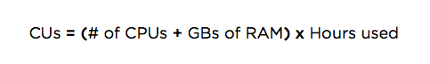

Original\
pricing\
plan

<Callout variant="important">
  This doc explains our original product-based pricing plan. For more on pricing and user-related changes, see [Overview of changes](/docs/accounts/accounts-billing/new-relic-one-pricing-users/transition-guide-new-pricing-plan).
</Callout>

## Overview of original pricing

New Relic has two pricing plans: a newer one called New Relic One pricing, and our original pricing plan. Our original pricing plan was based on subscriptions to specific products, like APM, Mobile, and Infrastructure. If you are on this pricing plan, your users are likely on our original user model and use these [original user docs](/docs/accounts/original-accounts-billing/original-users-roles). To understand more about the new pricing and user changes, see [Overview of changes](/docs/accounts/accounts-billing/new-relic-one-pricing-users/transition-guide-new-pricing-plan).

For accounts on original pricing, this doc includes:

* Explanation of how our original pricing plan works
* How to manage subscription and billing settings

## Annual vs monthly pricing plans

Here are the differences between billed-annually and billed-monthly plans:

<Table>
  <thead>
    <tr>
      <th width={200}>
        **Pricing plans**
      </th>

      <th>
        **Details**
      </th>
    </tr>
  </thead>

  <tbody>
    <tr id="annual-pricing">
      <td>
        Annual (best price)
      </td>

      <td>
        New Relic charges your credit card each month for a year for a committed number of hosts or compute units. You can increase this amount at any time, and charges will adjust with the next monthly bill. Your account will automatically renew at the end of the year unless you change your subscription.

        **Early termination, downgrade, or decrease in service:** Unless your order form states otherwise, you will be charged at the level and quantity of service ordered until the end of the then-current term if you cancel or downgrade to a lower level of service or fewer hosts during your commitment year.
      </td>
    </tr>

    <tr id="monthly-pricing">
      <td>
        Monthly (no commitment)
      </td>

      <td>
        New Relic charges your credit card each month for a specified number of hosts or compute units. The account Owner can [change the credit card number](/docs/accounts-partnerships/accounts/account-billing-usage/change-credit-card-or-payment-method) at any time: From the New Relic UI's [account dropdown](/docs/accounts-partnerships/education/getting-started-new-relic/glossary#account-dropdown), select **Account settings > Subscription**. Your billing will adjust with your next monthly bill.

        Your account automatically renews each month unless you change your subscription. You can cancel service or downgrade to a lower level of service without penalty.
      </td>
    </tr>
  </tbody>
</Table>

## APM and Infrastructure: Compute-unit vs host-based pricing

New Relic APM offers a choice between two pricing models: [compute unit (CU) based pricing](#compute-unit) and [host-based](#host-based) pricing. New Relic Infrastructure offers only [CU-based pricing](#compute-unit). This section shows how both options are calculated, and explains what "host" means in these pricing contexts:

<CollapserGroup>
  <Collapser
    id="compute-unit"
    title="Compute unit pricing"
  >
    CU-based pricing is available for these New Relic products:

    * New Relic APM (choice of either CU-based pricing or [host-based pricing](#host-based))
    * New Relic Infrastructure: only CU-based pricing

    With CU-based pricing, your monthly price is determined by the size of the [host](#understand) (computing power and memory) running New Relic and the number of hours it connects to New Relic during the month. If a host is connected to New Relic at any time during an hour, that hour counts towards the CU calculation.

    Each host is counted separately for each New Relic account the host reports data to. For example, if you have a master account with two sub-accounts, each running applications on the same host for 3,000 CUs in a given month, the usage for the master account will be 6,000 CUs.

    For New Relic APM, CU-based pricing is the best choice if you have many cloud-based dynamic computing resources. For this reason, CU-based pricing is sometimes referred to as **cloud pricing**.

    CUs are calculated as follows:

    

    The maximum size of a given host (CPUs + GB RAM) is capped at 16.

    Examples:

    * If a host has 2 CPU cores, 2GB RAM, and connects to New Relic for one hour (or less than one hour), it consumes 4 CUs.
    * If a host has 2 CPU cores, 2GB RAM, and connects to New Relic for an entire month (750 hours used as standard month size), it consumes 3,000 CUs.

    You can purchase blocks of CUs to be consumed on a monthly basis. The total number of CUs purchased monthly is calculated by adding up the estimated CU consumption for all hosts for the month. There is no month-to-month rollover of unused CUs. Also, New Relic does not charge by JVMs, containers (such as Docker or Cloud Foundry), or application instances--it charges by the hosts running those containers or application instances.

    Price points vary, depending on the New Relic product and subscription level. You can [view CU-based account usage](/docs/accounts-partnerships/accounts/account-billing-usage/account-usage-page-compute-units-understand-cu-usage-apm) from the New Relic UI.

    For more on product-specific pricing: see the [APM pricing](https://newrelic.com/application-monitoring/pricing) and [Infrastructure pricing](https://newrelic.com/products/infrastructure/pricing) pages.
  </Collapser>

  <Collapser
    id="host-based"
    title="Host-based pricing"
  >
    <Callout variant="tip">
      Pricing for your New Relic APM account can be either CU-based or host-based. New Relic Infrastructure uses only [CU-based pricing](#compute-unit).
    </Callout>

    With host-based pricing, New Relic charges based on the number of **equivalent hosts** used in a month. One **equivalent host** is defined as: a [host](#understand) connected to New Relic for 750 hours (750 hours used as standard month size). If a host is connected to New Relic at any time during an hour, that hour counts towards the host calculation.

    These hours can be divided across multiple hosts. For example, you might have three hosts that are each connected to New Relic for 250 hours during one month: these hours would add up to equal one **equivalent host**.

    Each host is counted separately for each New Relic account the host reports data to. For example, if you have a master account with two subaccounts, each running applications on the same single host for 750 hours in a given month, the usage for the master account will be 2 equivalent hosts.

    Once connected to New Relic, hosts are distinguished by their unique hostnames. A host is connected to New Relic when the language agent is active and is deployed on the host. New Relic does not charge by containers (such as Docker or Cloud Foundry), JVMs, or application instances; it charges by the hosts running those containers or application instances.

    New Relic APM gives you a choice between host-based pricing and [CU-based pricing](#compute-unit). Host-based pricing is ideal if you have mainly static environments, consisting of hosts you manage in your own data center.

    For specifics on pricing amounts, see the [APM pricing](https://newrelic.com/application-monitoring/pricing) page.
  </Collapser>

  <Collapser
    id="understand"
    title="How is a &quot;host&quot; defined?"
  >
    To understand how New Relic computes both [host-based pricing](#host-based) and [CU-based pricing](#compute-unit), it's important to understand how the word **host** is used. A host can be one of the following:

    * A **physical machine** is a hardware-based device with dedicated physical resources, including memory, processing, and storage. Each machine has its own OS which applications run on.
    * A **virtual machine** (VM) is the software implementation of a physical machine that executes programs like a physical machine. One or more virtual machines can run on a physical machine. Each virtual machine has its own OS and allocated virtual machine resources such as RAM and CPU.
    * A **cloud instance** is a type of virtual machine that is run in the public cloud. In this context, virtual machines and cloud instances are different from Java Virtual Machines (JVMs) and containers.

    For New Relic's pricing calculation purposes, a **month** is defined as 750 hours.
  </Collapser>
</CollapserGroup>

## Prorated billing

If you upgrade your subscription partway through your billing period, you will be subject to a prorated charge for the higher level of service over the remainder of your billing period. This will be invoiced or charged to your credit card when the upgrade is submitted. You will be notified about this charge as part of the subscription change process.

If you have questions, contact your New Relic account representative. If you need to report billing issues, contact New Relic's [Billing Department](mailto:billing@newrelic.com).

## Manage subscription and billing settings

<Callout variant="important">
  Note that as of July 30 2020, we have a newer pricing plan. To learn more, see [Overview of pricing](/docs/accounts/accounts-billing/new-relic-one-pricing-users/transition-guide-new-pricing-plan).
</Callout>

The account Owner can perform many subscription self-service functions directly from the user interface:

1. From [one.newrelic.com](https://one.newrelic.com), select the [account dropdown](/docs/accounts-partnerships/education/getting-started-new-relic/glossary#account-dropdown).
2. Select your choice of [self-service options](#self-service).
3. When making subscription changes, be sure to save any changes, agree to [New Relic's Terms of Service](https://newrelic.com/terms) and [Supplemental Payment Terms](https://newrelic.com/suppaymentterms) as appropriate, and select **Pay now**.
4. Optional: If you downgrade your subscription, complete New Relic's survey.

Here is a summary of the available options from your [account dropdown](/docs/accounts-partnerships/education/getting-started-new-relic/glossary#account-dropdown) in the New Relic user interface:

<CollapserGroup>
  <Collapser
    id="summary-info"
    title="View summary information"
  >
    To view summary information about your subscription: From the [account dropdown](/docs/accounts-partnerships/education/getting-started-new-relic/glossary#account-dropdown), select **Account settings > Account > Summary**. This includes:

    * Account [users](/docs/accounts-partnerships/accounts/account-setup/add-update-users) and their [roles (User, Admin, and Owner)](/docs/accounts-partnerships/accounts/account-billing-usage/users-roles) or [add-on roles](/docs/accounts-partnerships/accounts/account-setup/add-roles-permissions)
    * [Account name](/docs/accounts-partnerships/accounts/account-billing-usage/change-your-new-relic-account-name)
    * [Subscription usage information](/docs/accounts/new-relic-account-usage/getting-started/introduction-subscription-usage-data)
    * [Agent versions](/docs/agents/manage-apm-agents/installation/update-new-relic-agent)
    * [Billing credit card email](https://docs.newrelic.com/docs/accounts-partnerships/accounts/account-billing-usage/change-credit-card-or-payment-method)
    * [License key](/docs/accounts-partnerships/accounts/account-setup/license-key)
    * [Sub-accounts](/docs/accounts-partnerships/accounts/account-setup/create-sub-accounts) if applicable
    * Subscriptions to [New Relic products](https://newrelic.com/products)

    <Callout variant="tip">
      Your [account ID](/docs/accounts-partnerships/accounts/account-setup/account-id) (which is not the same as your license key) is part of the URL after you sign in to New Relic.
    </Callout>
  </Collapser>

  <Collapser
    id="change-subscription"
    title="View or change current subscription"
  >
    To view or change your current subscription options: From the [account dropdown](/docs/accounts-partnerships/education/getting-started-new-relic/glossary#account-dropdown), select **Upgrade subscription/Change subscription**.

    OR

    From the [account dropdown](/docs/accounts-partnerships/education/getting-started-new-relic/glossary#account-dropdown), select **Account settings > Account > Subscription**.

    Options include:

    * Upgrade or downgrade your pricing and subscription levels
    * [Cancel](/docs/accounts-partnerships/accounts/account-maintenance/delete-your-new-relic-account) your subscription or [delete](/docs/accounts-partnerships/accounts/account-maintenance/delete-your-new-relic-account) your account
    * Change your account's [tax location](/docs/accounts-partnerships/accounts/account-billing-usage/view-or-change-account-tax-information) for billing purposes

    If you need more help, contact your New Relic account representative, or contact New Relic's [Billing Department](mailto:billing@newrelic.com).
  </Collapser>

  <Collapser
    id="usage"
    title="View usage"
  >
    To view your [subscription usage information](/docs/accounts/new-relic-account-usage/getting-started/introduction-subscription-usage-data): From the [account dropdown](/docs/accounts-partnerships/education/getting-started-new-relic/glossary#account-dropdown), select **Account settings > Usage**.
  </Collapser>

  <Collapser
    id="billing-info"
    title="View or update billing information"
  >
    To view or update your New Relic account's billing information: From the [account dropdown](/docs/accounts-partnerships/education/getting-started-new-relic/glossary#account-dropdown), select **Account settings > Account > Billing**. Billing settings include:

    * [Account contact information](/docs/accounts-partnerships/accounts/account-billing-usage/invoices-receipts), including name, organization, address, phone, email, purchase order number, etc.
    * Billing history, including [invoices and receipts](/docs/accounts-partnerships/accounts/account-billing-usage/invoices-receipts)
    * Credit card or other [payment method](/docs/accounts-partnerships/accounts/account-billing-usage/change-credit-card-or-payment-method)
  </Collapser>
</CollapserGroup>

## For more help
