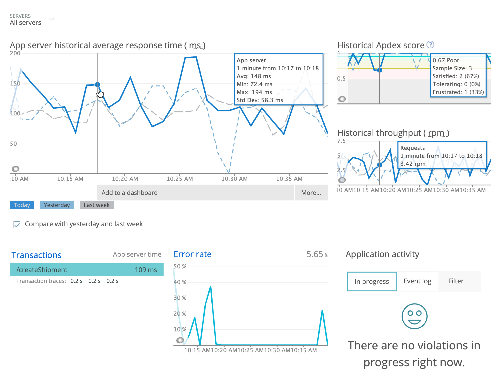

import { Link } from 'gatsby'

As a general purpose programming language, C gives you the opportunity to instrument a wide range of applications. If your app does not use [other New Relic APM agent languages](/docs/using-new-relic/welcome-new-relic/getting-started/glossary#agent), you can use the C SDK to take advantage of New Relic's monitoring capabilities and features. You can:

* Identify and solve performance issues.
* Improve your customers' experience and make data-driven business decisions.
* Monitor data from detailed dashboards in [APM](/docs/apm/new-relic-apm/getting-started/introduction-new-relic-apm), [Infrastructure](/docs/infrastructure/new-relic-infrastructure/getting-started/introduction-new-relic-infrastructure), [Alerts](/docs/alerts/new-relic-alerts/getting-started/introduction-new-relic-alerts), and more.
* Query, visualize, and share your data with charts and dashboards by using [Insights](/docs/insights/using-insights-ui/getting-started/introduction-new-relic-insights).

<Icon
  name="terminal"
  size="2em"
/>

**Get started.** Discover [C capabilities](/docs/introduction-c-sdk) and learn how to get up and running. You can also visit [New Relic's C SDK documentation on GitHub](https://newrelic.github.io/c-sdk/index.html).

<Icon
  name="list"
  size="2em"
/>

**Compile and link your code.** Verify your app meets the [compatibility and requirements](/docs/agents/c-sdk/get-started/c-sdk-compatibility-requirements) for Linux environments, then follow the [C SDK installation procedures](/docs/install-c-sdk-compile-link-your-code).

<Icon
  name="settings"
  size="2em"
/>

**Configure the agent.** Use [default config settings](/docs/agents/c-sdk/install-configure/c-sdk-configuration) and [logging options](/docs/install-c-sdk-compile-link-your-code#logging). To fine-tune data collection that matters the most to your business, refer to the [API guide](/docs/agents/c-sdk/instrumentation/guide-using-c-sdk-api).

<Icon
  name="tool"
  size="2em"
/>

**Extend instrumentation.** Customize [transactions, segments, and error reporting](/docs/agents/c-sdk/instrumentation/instrument-your-app-c-sdk) for your C application. For even finer detail, use [default or customized attributes](/docs/agents/c-sdk/instrumentation/use-default-or-custom-attributes-c-sdk).

<Icon
  name="database"
  size="2em"
/>

**Explore new features.** To take advantage of New Relic's latest features, get an RSS feed for the [release notes](/docs/release-notes/agent-release-notes/c-sdk-release-notes), and [update your C SDK library](/docs/agents/c-sdk/install-configure/update-your-c-sdk-library) as needed.

<Icon
  name="life-buoy"
  size="2em"
/>

**Troubleshoot problems.** Get help if you are [not seeing data](/docs/agents/c-sdk/troubleshooting/no-data-appears-c) on New Relic dashboards, need [troubleshooting logs](/docs/generate-logs-troubleshooting-c-sdk), etc. Share questions and suggestions with the C SDK community in New Relic's [Explorers Hub](https://discuss.newrelic.com/tags/cagent).

**[one.newrelic.com/apm](https://one.newrelic.com/apm) > APM > (select an app):** This is just one of New Relic's dashboards where you can explore detailed data about your transactions, external services, datastores, arbitrary code, SQL, and more.

<Button
  as={Link}
  to="/docs/agents/c-sdk?toc=true"
  variant="primary"
>
  View all C SDK docs
</Button>
