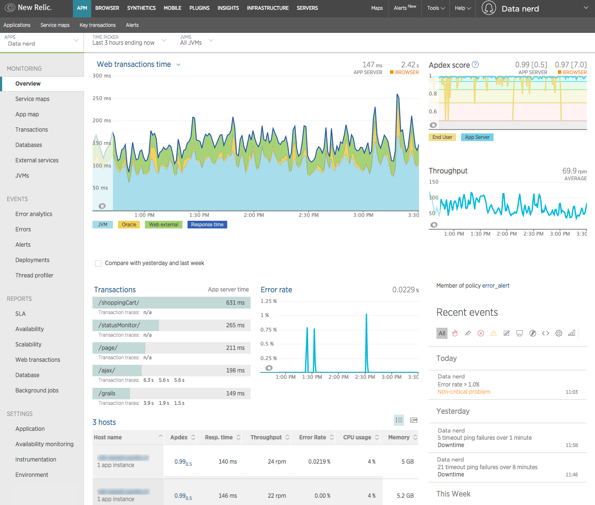

import { Link } from 'gatsby'

With New Relic's Java agent, you can track everything from performance issues to tiny errors within your code. New Relic's Java agent monitors your Java app and provides visibility into the behavior of your JVM. After installing, you will be able to quickly monitor transactions, dive deep into errors, and more.

To keep your agent up to date and ensure you have access to the latest features, see the [Java agent release notes](/docs/release-notes/agent-release-notes/java-release-notes).

**[rpm.newrelic.com/apm](https://rpm.newrelic.com/apm) > (select an app) > Overview**: After installing the Java agent, view a summary of your app's performance.

<LandingPageTileGrid>
  <LandingPageTile
    title="Get started."
    icon="fe-terminal"
  >
    Discover what you can do with the Java agent and how to [get started](/docs/agents/java-agent/getting-started/introduction-new-relic-java).
  </LandingPageTile>

  <LandingPageTile
    title="Install the Java agent."
    icon="fe-list"
  >
    Learn how to [install the Java agent](/docs/agents/java-agent/installation/install-java-agent) on supported app servers and frameworks.
  </LandingPageTile>

  <LandingPageTile
    title="Configure the agent."
    icon="fe-settings"
  >
    Use [configuration options](/docs/agents/java-agent/configuration/java-agent-configuration-config-file) to further customize and fine-tune your installation. Enable [distributed tracing](/docs/apm/distributed-tracing/getting-started/introduction-distributed-tracing).
  </LandingPageTile>

  <LandingPageTile
    title="Customize monitoring."
    icon="fe-tool"
  >
     Use the [Java agent API](/docs/agents/java-agent/custom-instrumentation/java-agent-api) or implement [custom instrumentation](/docs/agents/java-agent/custom-instrumentation/java-custom-instrumentation) to extend functionality.
  </LandingPageTile>

  <LandingPageTile
    title="Verify compatibility and requirements."
    icon="fe-database"
  >
    Check the [compatibility and requirements](/docs/agents/java-agent/getting-started/compatibility-requirements-java-agent), including supported app/web servers, frameworks, JDBC drivers, JVMs, and more.
  </LandingPageTile>

  <LandingPageTile
    title="Troubleshoot common problems."
    icon="fe-life-buoy"
  >
    Refer to the [Java troubleshooting documentation](/docs/agents/java-agent/troubleshooting) for help with common issues.
  </LandingPageTile>
</LandingPageTileGrid>

<Button
  as={Link}
  to="/docs/agents/java-agent/table-of-contents"
  variant="normal"
>
  View all Java agent docs
</Button>
