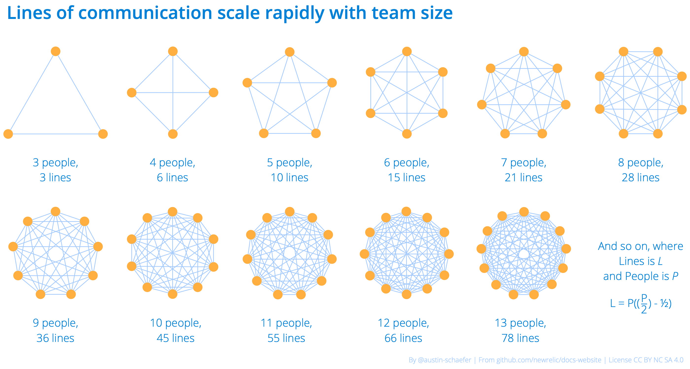

Our team uses an **agile** **Sprint** workflow in **Jira** and **GitHub** to manage our work. We've further divided our team into **squads** to simplify planning and improve accountability. 

All those words are pretty inconsistent in their usage, so let's break them down further.

## Agile [#agile]

People use agile to mean everything from a specific system of work (which we call sprints), to just "moving fast, preferably in a way that lets me bend things to my whims." 

Luckily, we don't need to define it from scratch. Wikipedia does [an admirable job defining it](https://en.wikipedia.org/wiki/Agile_software_development):

> Agile software development is an approach to software development under which requirements and solutions evolve through the collaborative effort of self-organizing and cross-functional teams and their customer(s)/end user(s). It advocates adaptive planning, evolutionary development, empirical knowledge, and continual improvement, and it encourages rapid and flexible response to change.

For our team, that means our process is optimized to ship early and often. This lets us respond swiftly to changes in the product roadmap. More importantly, it ensures we validate our solutions with stakeholders, and that we're not letting valuable work sit around and get moldy when it could be out in the world making our users' lives better.

## Sprint (or scrum) [#sprint]

This is the particular flavor of agile we follow. The sprint system (often referred to as scrum) is one major approach to Agile, along with other Agile systems such as Kanban. Sprint systems are often accompanied by a lot of jargon and best practices, but for our team the most essential elements are:

* Working in strict timeboxes (two weeks in our case)
* Planning that sprint in advance, and not changing the scope of the sprint (much) once it starts
* Expecting all team members to contribute to making the sprint a success

The video [Agile Product Ownership in a Nutshell](https://www.youtube.com/watch?v=502ILHjX9EE) (18 minutes) is an excellent resource for learning about sprint methodology. The Kindle book [Scrum: a Breathtakingly Brief and Agile Introduction](https://www.amazon.com/Scrum-Breathtakingly-Brief-Agile-Introduction-ebook/dp/B007P5N8D4/) is also a great read that you can get through in a short afternoon. 

For more on the "why" of Sprint as our chosen methodology, see [Key agile principles](/docs/agile-handbook/key-concepts/key-agile-principles/). And for more on the "how," see [Sprint workflow](/docs/agile-handbook/sprint-mechanics/sprint-workflow-and-jira-boards/).

## Jira and GitHub issues [#jira-and-github-projects]

Jira and GitHub issues are the tools we use to manage our Agile workflow. If you remember one thing about them, it should be this: using Jira or GitHub issues is not the same as having an agile workflow. They're powerful tools for tracking work and managing a backlog, but the most important part of project management is the structure we impose on that tool.

Jira is for sprint work. Sprints are where roadmap docs get written, monthly commits get delivered, and deeper research percolates. We have a backlog, board, and future sprint list in Jira that help us track what people want, what's coming up, and what we're working on now. For more on the mechanics of how we use Jira, see [Sprint workflow and Jira boards](/docs/agile-handbook/sprint-mechanics/sprint-workflow-and-jira-boards/) and [Ticket best practices](/docs/agile-handbook/appendices/ticket-best-practices/).

We use GitHub projects for hero work, customer-reported issues, and managing the flow of PRs and edits. The [Docs PRs and Issues board](https://github.com/newrelic/docs-website/projects/3) contains everything we're actively working on in GitHub. We'll often connect work in GitHub back to Jira by putting a Jira issue key in the PR or issue title (`DOC-1234`, for example). For more on the mechanics of how we use GitHub, see [Managing the GitHub boards](/docs/agile-handbook/heroing/managing-the-github-boards/).

## Teams and squads [#teams-and-squads]

Our team is the Tech Docs team. We're collectively responsible for docs.newrelic.com and sundry writing content. Our team is further divided into two agile squads (_The Odd Squad_ and _The Amp Squad_), one squad for each manager.

The primary function of squads is to simplify sprint planning, backlog grooming, and liaisonships. Less people means shorter meetings. It also means better information sharing: The more people you have in a group, the more lines of communication are needed (see illustration) to maintain a shared understanding. Small squads can collaborate more easily than a large team, because not everyone needs to keep in mind everything that goes on everywhere. 

Each squad is responsible for its own grooming and sprint planning, but the managers and scrum masters coordinate grooming to ensure we're meeting our overall goals as a team.

<ButtonGroup>
  <ButtonLink
  role="button"
  to="/docs/agile-handbook/key-concepts/key-agile-principles/"
  variant="secondary"
  >
  Key agile principles →
  </ButtonLink>
</ButtonGroup>

## For more help

We welcome thoughts or questions on our handbook! The easiest way to get in touch is to [file a GitHub issue](https://github.com/newrelic/docs-website/issues/new/choose).