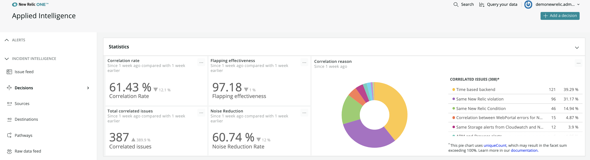

Our [Incident Intelligence](/docs/new-relic-one/use-new-relic-one/new-relic-ai/get-started-incident-intelligence) uses logic to correlate your [incidents](/docs/alerts-applied-intelligence/applied-intelligence/incident-intelligence/get-started-incident-intelligence#issue-feed). We call these logic "decisions." We have built-in decisions and you can create and customize your own on the Incident Intelligence **Decisions** UI page. The more optimally you configure decisions, the better we will group and correlate your incident events, resulting in reduced noise and increased context for on-call teams.


**[one.newrelic.com](https://one.newrelic.com) > Applied Intelligence > Incident intelligence > Decisions**: Our UI shows how each decision correlates incidents.

## Key concepts

Here are some key concepts for understanding our decisions logic:

* **What is "correlation" and how does it work?** For the [incident events](/docs/alerts-applied-intelligence/applied-intelligence/incident-intelligence/get-started-incident-intelligence#issue-feed) being sent into Incident Intelligence from your various alerting engines, the most recently created and active incidents are available for correlation. Correlation occurs between two events whenever the criteria in any decision is met. All the events available for correlation are tested against each other in all possible pair combinations and a "greedy merge" is performed. This means that if incident A correlates with B into an [issue](/docs/alerts-applied-intelligence/applied-intelligence/incident-intelligence/get-started-incident-intelligence#issue-feed) and incident B correlates with incident C into another issue, then AB and BC will also merge together resulting in a single issue including A, B, and C.
* **What types of logic can be used in a decision?** At a high level, decisions allow you to define logic based on time (duration between events), frequency (number of events), context (metadata structure & values), and [topology](#topology) (entity relationships).

## Review your active decisions [#decisions]

Decisions determine how Incident Intelligence correlates incidents together. By default, a broad set of global decisions is enabled when you start using Incident Intelligence.

To review existing decisions:

1. Go to **[one.newrelic.com](https://one.newrelic.com)** and click **Alerts & AI**. In the left navigation, under **Incident Intelligence**, click **Decisions**.
2. Review the list of active decisions. To see the rule logic that creates correlations between your issues, click the decision.
3. To see examples of incidents the decision correlated, click the **Recent correlations** tab.
4. Use any of the other options to enable or disable these global decisions.

Your decisions will routinely be analyzed for their efficacy as well as other best practices, and recommendations will be attached for review.

### Correlation statistics [#correlation]

Whether you want to use the suggested decisions we provide using our pattern recognition algorithms, or you want to add in your own correlation logic, you'll get insights into your correlation rate, noise reduction improvement, and the number of correlated issues arising, as shown below.

From the UI, you can view the [underlying NRQL queries](/docs/query-your-data/nrql-new-relic-query-language/get-started/introduction-nrql-new-relics-query-language) and create your own custom charts and dashboards from this data.



**[one.newrelic.com](https://one.newrelic.com) > Applied Intelligence > Incident intelligence > Decisions**: Some example statistics from the decisions UI.

Some definitions of statistics:

* Correlation rate: The percentage of the time correlations are occurring versus not.
* Total correlated issues: Number of issues correlated with another issue.
* Noise reduction: Total number of issues after correlation divided by the total number of issues before correlation.
* Correlation reason: Shows which decisions are correlating issues the most.

### Use suggested decisions [#suggested-decisions]

Information about the types of suggested decisions:

* **Suggested decisions:** The data from your selected sources is continuously inspected for patterns to help reduce noise. Once patterns have been observed in your data, decisions are suggested that would allow these events to correlate in the future.
* **Accelerated suggested decisions:** If you have been using New Relic Alerts for a while, when you add alert policies to sources, we're able to use that historical data to accelerate the pattern recognition step and suggest decisions up to 30% faster.

To get started, click on a suggested decision, located under the statistics block on the **Decisions** UI page. You'll see information on the logic behind the suggested decision, why we think it will help you, and the estimated correlation rate for that decision.


**[one.newrelic.com](https://one.newrelic.com) > Applied Intelligence > Incident intelligence > Decisions**: Suggested decision block

If there isn't enough data to see the correlation rate, a link right below the percentage estimate will guide you to other sources you can add to get stronger results. **Note: if you have less than 5000 incidents per month, you probably won't have suggested decisions.**

To add the suggested decision, click **Activate decision** and it will appear enabled, alongside the other decisions. If the decision isn't relevant to your needs, click **Dismiss**.

## Create custom decisions [#customize]

You can reduce noise and improve correlation by building your own custom decisions. To start building a decision, go to **[one.newrelic.com](https://one.newrelic.com)** and click **Alerts & AI**. In the left navigation, under **Incident Intelligence**, click **Decisions**, then click **Add a decision**. Tips on how to use that UI are in the table below.

When building a decision, steps 1, 2 and 3 are optional on their own but at least one must be defined in order to create a decision.

<table id="decision-guidelines">
  <thead>
    <tr>
      <th style={{ width: "250px" }}>
        Option
      </th>

      <th>
        Description
      </th>
    </tr>
  </thead>

  <tbody>
    <tr>
      <td>
        Step 1: Filter your data
      </td>

      <td>
        In this step you'll define your filters. Remember correlation occurs between two incidents. If no filters are defined all incoming Incidents will be considered by the decision.

        Define your filters for the first segment (or bucket) of incidents, and the second segment of Incidents. Types of filter operators range from substring matching to [regex matching](#regex) to help you target the incident events you want and exclude those you don't.

        All combination of event pairs between segment one and segment two are used in the next steps of the decision.
      </td>
    </tr>

    <tr>
      <td>
        Step 2: Contextual correlation
      </td>

      <td>
        Once you've filtered your data, define the logic used when comparing the incidents' context. You can correlate events based on the following methods:

        * Attribute value comparisons with standard operators
        * Attribute value similarity using [similarity algorithms](#algorithms)
        * Attribute value [regex with capture groups](#regex)
        * Entire incident comparisons using similarity or clustering algorithms
      </td>
    </tr>

    <tr>
      <td>
        Step 3: Topology correlation
      </td>

      <td>
        [Topology correlation](#topology) is currently in limited release. Contact your account representative to enable this feature. Once enabled, you'll first need to ingest your topology data via our NerdGraph `aiTopologyCollector` (search for aiTopology in the [NerdGraph GraphiQL explorer](https://api.newrelic.com/graphiql)). This allows any topology-related decision to be matched with your topology data. [Learn more about setting up topology correlation](#topology).
      </td>
    </tr>

    <tr>
      <td>
        Give it a name
      </td>

      <td>
        After you configure your decision logic, give it a recognizable name and description. This is used in notifications and other areas of the UI to indicate which decision caused a pair of incidents to be correlated together.
      </td>
    </tr>

    <tr>
      <td>
        Advanced settings
      </td>

      <td>
        Optional. The advanced settings area allows you to further customize how your decision behaves when correlating events. Each setting has a default value so customization is optional.

        * **Time window**: Sets the maximum time between two incidents created time for them to be eligible for correlation.
        * **Issue priority**: Overrides the default priority setting (`inherit priority`) to add higher or lower priority if the Incidents are correlated.
        * **Frequency**: Modifies the minimum number of incidents that need to meet the rule logic for the decision to trigger.
        * **Similarity**: If you're using `similar to` operators in your rule logic, you can choose from a list of algorithms and set its sensitivity. This will apply to all `similar to` operators in your decision.
      </td>
    </tr>
  </tbody>
</table>

### Similarity algorithms [#algorithms]

Here are technical details on the similarity algorithms we use:

<CollapserGroup>
  <Collapser
    id="levenshtein-distance"
    title="Levenshtein distance"
  >
    This measure is useful for comparing short strings with static schema and fixed length, like host names. Levenshtein distance is also known as edit distance.

    <table>
      <thead>
        <tr>
          <th style={{ width: "200px" }}>
            Details
          </th>

          <th>
            Description
          </th>
        </tr>
      </thead>

      <tbody>
        <tr>
          <td>
            How it works
          </td>

          <td>
            The Levenshtein distance between two strings is the minimum number of single-character edits to get from one string to the other. Allowed edit operations are deletion, insertion, and substitution.

            The default similarity threshold for Applied Intelligence decisions is an edit distance of 3. You can change this in the **Advanced mode** of the decision builder.
          </td>
        </tr>

        <tr>
          <td>
            When to use it
          </td>

          <td>
            This measure is most useful for comparing relatively short strings with static schema and fixed length. Common applications include spell checkers, computational biology, and speech recognition.
          </td>
        </tr>

        <tr>
          <td>
            Examples
          </td>

          <td>
            `number/bumble: 3 (number → bumber → bumblr → bumble)`

            `trying/lying: 2 (trying → rying → lying)`

            `strong/through: 4 (strong → htrong → throng → throug → through)`
          </td>
        </tr>

        <tr>
          <td>
            Potential drawbacks
          </td>

          <td>
            Levenshtein distance is not normalized by default to take into account string lengths.
          </td>
        </tr>
      </tbody>
    </table>
  </Collapser>

  <Collapser
    id="fuzzy-score"
    title="Fuzzy score"
  >
    This metric is useful for comparing same-length strings where the same prefix would be a good indicator of correlation.

    <table>
      <thead>
        <tr>
          <th style={{ width: "200px" }}>
            Details
          </th>

          <th>
            Description
          </th>
        </tr>
      </thead>

      <tbody>
        <tr>
          <td>
            How it works
          </td>

          <td>
            The fuzzy score algorithm works by allocating "points" for character matches between strings:

            * One point for each matching character
            * Two bonus points for subsequent matches

            The higher the fuzzy score, the greater the similarity between two strings.
          </td>
        </tr>

        <tr>
          <td>
            When to use it
          </td>

          <td>
            Fuzzy score is most useful for strings that have the same, and relatively short (ideally &lt;5 character), prefixes. A minimum guaranteed score would be `(length(expected prefix) * 3) - 2`.
          </td>
        </tr>

        <tr>
          <td>
            Examples
          </td>

          <td>
            Example: `Decisions / dcsions`

            `d: 1`

            `c: 1`

            `i 1`

            `s: 2`

            `o: 1`

            `n: 1`

            `si: 2`

            `io: 2`

            `on: 2`

            `ns: 2`

            `= 15 points`
          </td>
        </tr>

        <tr>
          <td>
            Potential drawbacks
          </td>

          <td>
            If the first character of the first string can't be found in the second string, no points are awarded.
          </td>
        </tr>
      </tbody>
    </table>
  </Collapser>

  <Collapser
    id="fuzzy-wuzzy-ratio"
    title="Fuzzy wuzzy ratio"
  >
    This metric is useful for comparing strings of similar length.

    <table>
      <thead>
        <tr>
          <th style={{ width: "200px" }}>
            Details
          </th>

          <th>
            Description
          </th>
        </tr>
      </thead>

      <tbody>
        <tr>
          <td>
            How it works
          </td>

          <td>
            The **fuzzy wuzzy** family of similarity measures was [developed by SeatGeek](https://chairnerd.seatgeek.com/fuzzywuzzy-fuzzy-string-matching-in-python/) to help find tickets for the same event that have different labels across multiple platforms. The fuzzy wuzzy ratio for two strings is expressed as a percentage, where a higher number indicates a more similar string. It's based on the [SequenceMatcher algorithm](https://docs.python.org/3/library/difflib.html) in Python's difflib.
          </td>
        </tr>

        <tr>
          <td>
            When to use it
          </td>

          <td>
            Fuzzy wuzzy ratio is effective for very short (eg. hostname) or very long (eg. event description) strings, especially in comparing strings of similar length.
          </td>
        </tr>

        <tr>
          <td>
            Potential drawbacks
          </td>

          <td>
            This algorithm is too sensitive to be used effectively for 3-10 word strings. One of the other modifications to fuzzy wuzzy (see below) may be a better choice.
          </td>
        </tr>
      </tbody>
    </table>
  </Collapser>

  <Collapser
    id="fuzzzy-wuzzy-partial"
    title="Fuzzy wuzzy partial ratio"
  >
    This metric is useful for comparing strings of different length. This modification to the fuzzy wuzzy algorithm helps address the effective length limitation.

    <table>
      <thead>
        <tr>
          <th style={{ width: "200px" }}>
            Details
          </th>

          <th>
            Description
          </th>
        </tr>
      </thead>

      <tbody>
        <tr>
          <td>
            How it works
          </td>

          <td>
            With fuzzy wuzzy partial ratio, the shorter string is compared to each substring of the same length within the longer string. The score of the “best matching” substring is used to determine the fuzzy wuzzy partial ratio.
          </td>
        </tr>

        <tr>
          <td>
            When to use it
          </td>

          <td>
            Fuzzy wuzzy partial ratio is especially effective for the types of comparisons the basic fuzzy wuzzy algorithm fails at: 3-10 word strings where some significant substrings are likely to be overlapping.
          </td>
        </tr>

        <tr>
          <td>
            Examples
          </td>

          <td>
            For example, between the following strings:

            `DevOps and SRE teams`

            `DevOps`

            …”DevOps” (the shorter string, length = 6) would be compared to each substring with length 6 within “DevOps and SRE teams.” Since one of those substrings (“DevOps”) is a perfect match, the fuzzy wuzzy partial ratio for these two strings will be high.
          </td>
        </tr>

        <tr>
          <td>
            Potential drawbacks
          </td>

          <td>
            Where fuzzy wuzzy may be too conservative, fuzzy wuzzy partial match may be more liberal than expected with correlations. You can adjust the threshold in the decision builder according to your needs.
          </td>
        </tr>
      </tbody>
    </table>
  </Collapser>

  <Collapser
    id="fuzzy-wuzzy-token"
    title="Fuzzy wuzzy token set ratio"
  >
    This metric is useful for comparing strings where the information may not be in the same order, and of possible different lengths. It works best for sentences such as messages, descriptions, etc.

    <table>
      <thead>
        <tr>
          <th style={{ width: "200px" }}>
            Details
          </th>

          <th>
            Description
          </th>
        </tr>
      </thead>

      <tbody>
        <tr>
          <td>
            How it works
          </td>

          <td>
            The token set ratio algorithm follows a few steps to compare strings:

            1. Tokenize each string (eg. “DevOps and SRE teams” → “DevOps” “and” “SRE” “teams”; “SRE team and DevOps engineers” → “SRE” “teams” “and” “DevOps” “engineers”)
            2. Combine intersecting tokens into a new string, leaving the remaining tokens. (eg. intersecting: ”DevOps”, “and”, “SRE”; remainder1: “teams”; remainder2: “team”, “engineers”)
            3. Alphabetize each token group (eg. “and, DevOps, SRE”, “teams”, engineers, team”)
            4. Compare the following pairs of strings:

               1. Intersection group
               2. Intersection group + remainder1
               3. Intersection group + remainder2

            The comparison from these pairs (“best matches”) is the fuzzy wuzzy token set ratio.
          </td>
        </tr>

        <tr>
          <td>
            When to use it
          </td>

          <td>
            This metric is helpful in cases where similar strings may have overlapping words but different construction - for example, event descriptions for different issues with the same resource.
          </td>
        </tr>

        <tr>
          <td>
            Potential drawbacks
          </td>

          <td>
            Where fuzzy wuzzy may be too conservative, fuzzy wuzzy token set match may be more liberal than expected with correlations. You can adjust the threshold in the decision builder according to your needs.
          </td>
        </tr>
      </tbody>
    </table>
  </Collapser>

  <Collapser
    id="Jaro-winkler-distance"
    title="Jaro-winkler distance"
  >
    This metric is useful for short strings where identical prefixes are a strong indication of correlation.

    <table>
      <thead>
        <tr>
          <th style={{ width: "200px" }}>
            Details
          </th>

          <th>
            Description
          </th>
        </tr>
      </thead>

      <tbody>
        <tr>
          <td>
            How it works
          </td>

          <td>
            This metric uses a scale of 0-1 to indicate the similarity between two strings, where 0 is no similarity (0 matching characters between strings) and 1 is an exact match. Jaro-Winkler similarity takes into account:

            * `matching`: two characters that are the same and in similar positions in the strings.
            * `transpositions`: matching characters that are in different sequence order in the strings.
            * `prefix scale`: the Jaro-Winkler distance is adjusted favorably if strings match from the beginning (a prefix is up to 4 characters).
          </td>
        </tr>

        <tr>
          <td>
            When to use it
          </td>

          <td>
            This metric is fairly tolerant of transpositions, but transpositions further apart in the string are less useful.

            A generally-safe number to use for Jaro-Winkler similarity in moderate to long strings is 0.9; you could use {'~'}0.85 in cases where more leniency is okay (if you have other, more specific logic in the decision).
          </td>
        </tr>
      </tbody>
    </table>
  </Collapser>

  <Collapser
    id="cosine-distance"
    title="Cosine distance"
  >
    This measure is most commonly used to compare large blocks of text (for example, incident descriptions) and provides an easy visualization of similarity.

    <table>
      <thead>
        <tr>
          <th style={{ width: "200px" }}>
            Details
          </th>

          <th>
            Description
          </th>
        </tr>
      </thead>

      <tbody>
        <tr>
          <td>
            How it works
          </td>

          <td>
            For each text block you're comparing, a vector is calculated to represent the count of each unique word in the block. The cosine distance of the resulting vectors is their dot product divided by the product of their magnitudes.
          </td>
        </tr>

        <tr>
          <td>
            When to use it
          </td>

          <td>
            This measure is most useful to compare long blocks of text, specifically when the comparison is meant to consider the text as a whole, and not differences or misspellings in individual words.
          </td>
        </tr>

        <tr>
          <td>
            Examples
          </td>

          <td>
            ```
            It is not length of life, but depth of life.
            Depth of life does not depend on length.
            ```

            Here are the word counts for these sentences:

            `it 1 0`

            `is 0 1`

            `not 1 1`

            `length 1 1`

            `of 2 1`

            `life 2 1`

            `but 1 0`

            `depth 1 1`

            `does 0 1`

            `depend 0 1`

            `on 0 1`

            And here are those counts represented as a vector:

            ```
            [1, 0, 1, 1, 2, 2, 1, 1, 0, 0, 0]
            [0, 1, 1, 1, 1, 1, 0, 1, 1, 1, 1]
            ```

            The cosine distance of these vectors is about 0.9 (1 is the highest similarity).
          </td>
        </tr>

        <tr>
          <td>
            Potential drawbacks
          </td>

          <td>
            Cosine distance is less useful for situations where small character differences in words are insignificant. Also, cosine distance ignores word order in the text blocks.
          </td>
        </tr>
      </tbody>
    </table>

    For more information on cosine distance implementation, see this [detailed walkthrough](http://blog.christianperone.com/2013/09/machine-learning-cosine-similarity-for-vector-space-models-part-iii/).
  </Collapser>

  <Collapser
    id="hamming-distance"
    title="Hamming distance"
  >
    This measure is useful for shorter text with static schema, but it works only for same-length strings.

    <table>
      <thead>
        <tr>
          <th style={{ width: "200px" }}>
            Details
          </th>

          <th>
            Description
          </th>
        </tr>
      </thead>

      <tbody>
        <tr>
          <td>
            When to use it
          </td>

          <td>
            Hamming distance requires the compared strings to be of equal length. This is a useful similarity metric for situations where the difference between two strings may be due to typos, or where you want to compare two attributes with known lengths. For example: Low Disk Space in application myapp in datacenter us01

            If you wanted to be tolerant to datacenter changes, the hamming distance should be set to 4. An average use case for Hamming distance would be around 2-3.
          </td>
        </tr>

        <tr>
          <td>
            Examples
          </td>

          <td>
            A simpler version of "edit distance" metrics like Levenshtein distance, the Hamming distance between two strings is the number of characters in the string that don't match (in the same position). For example, in the strings below, the Hamming distance is 2:

            ```
            flowers / florets
            ```
          </td>
        </tr>

        <tr>
          <td>
            Potential drawbacks
          </td>

          <td>
            In the example above, if the application name changes instead of the datacenter, a correlation would also be created. As the distance grows, the usefulness of Hamming Distance plummets. For this reason, for anything remotely more complicated than being tolerant to 1-2 character substitutions (or if the string lengths will not match), a different similarity measurement should be used.
          </td>
        </tr>
      </tbody>
    </table>
  </Collapser>

  <Collapser
    id="Jaccard-distance"
    title="Jaccard distance"
  >
    This measure is useful for comparing large blocks of text, like descriptions or entire incidents.

    <table>
      <thead>
        <tr>
          <th style={{ width: "200px" }}>
            Details
          </th>

          <th>
            Description
          </th>
        </tr>
      </thead>

      <tbody>
        <tr>
          <td>
            How it works
          </td>

          <td>
            The distance, denoted as a percentage (0 being completely similar; 1 being totally dissimilar) is calculated with the following formula:

            ```
            1 - [(# of characters in both sets) / (# of characters in either set) * 100]
            ```

            In other words, the Jaccard distance is the number of shared characters divided by the total number of characters (shared and un-shared). A Jaccard distance of 0.1 means that 10% or fewer characters between two incidents are different.
          </td>
        </tr>

        <tr>
          <td>
            When to use it
          </td>

          <td>
            Jaccard distance is very easy to interpret and especially useful in cases with large data sets. For example, in comparing the similarity between two entire incidents (as opposed to one attribute).
          </td>
        </tr>

        <tr>
          <td>
            Potential drawbacks
          </td>

          <td>
            It's less effective for small data sets or situations with missing data. Also, different permutations of the character set don't affect Jaccard distance, so care should be taken to prevent false positives.
          </td>
        </tr>
      </tbody>
    </table>
  </Collapser>
</CollapserGroup>

## Regex operators [#regex]

When [building a decision,](#customize) available operators include:

* `contains (regex)`: used in [Step 1: Filter your data](#customize).
* `regular expression match`: used in [Step 2: Contextual correlation.](#customize)

The decision builder follows the standards outlined in [these documents for regular expressions](https://docs.oracle.com/javase/8/docs/api/java/util/regex/Pattern.html).

### Regex in Step 1 [#regex-step-1]

In order for your regex to test as true, the entire attribute value (the data you’re evaluating) must be matched by the regular expression provided. Captured groups can be used but are not explicitly evaluated.

For instance, if the attribute value is `foobarbaz`, these examples would meet the criteria and test as true:

* `foo.*`
* `^.*baz`
* `\w+`

### Regex in Step 2 [#regex-step-2]

In order for your regex to test as true, the entire attribute values for incident 1 and incident 2 must be included in the match. Also, each captured group (expressions in `( )` parentheses) must exist in both values (incident 1 and incident 2 attributes), and have the same value:

* The number of captured groups must be equal for both incident attributes.
* Each group must be equal to the corresponding group between attribute values: the value of the first captured group in the incident 1 attribute value is equal to the value of the first captured group in the incident 2 attribute.

For instance, if attribute value 1 is `abc-123-xyz` and attribute value 2 is `abc-777-xyz`, then `(\w+)-(?:\w+)-(\w+)` would meet the criteria:

* The whole value is matched by the expression.
* The first and third captured groups have the same respective values.
* The second group is not captured using `?:`, which allows the whole value to match but isn’t used in the capture group comparison.

### About flags [#flags]

No flags are enabled by default. Some useful flags to include in regular expressions in the decision builder are:

* CASE_INSENSITIVE: (?i)
* MULTILINE: (?m)
* DOTALL: (?s)

See [field detail](https://docs.oracle.com/javase/8/docs/api/java/util/regex/Pattern.html#field.detail) for more notes on the function and implementation of each of these flags.

## Correlation assistant [#assistant]

You can use the correlation assistant to more quickly analyze [incidents](/docs/alerts-applied-intelligence/applied-intelligence/incident-intelligence/get-started-incident-intelligence#issue-feed), create decision logic, and test the logic with a simulation. To use the correlation assistant:

1. From **one.newrelic.com**, click **Alerts & AI**, click **Overview**, then click the **Incidents** tab.
2. Check the boxes of incidents you'd like to correlate. Then, at the bottom of the incident list, click **Correlate incidents**.
3. For best results for correlating incidents, select common attributes with a low frequency percentage. [Learn more about using frequency](#frequency-tips).
4. Click **Simulate** to see the likely effect of your new decision on the last week of your data.
5. Click on examples of correlation pairs and determine of those correlations are desired.
6. If you like what's been simulated, click **Next**, and then name and describe your decision.
7. If the simulation result shows too many potential incidents, you may want to choose a different set of attributes and incidents for your decision and run another simulation. [Learn more about simulation](#simulations).

### Attribute analysis [#frequency-tips]

Here are explanations of the two types of attribute analysis displayed in the UI:

* **Common attributes**: This analysis simply highlights attributes and values that are the exact same between all selected incidents.
* **Similar attributes**: Similarity analysis uses the Levenshtein algorithm with a distance of 3 to find attributes whose values would be the same if 3 or less character changes are performed. Other details:
  * Numerical values as well as single character values are filtered out of the results.
  * Requires two incidents to be selected. Similarity analysis is not performed when 3 or more incidents are selected.

To create the best decisions, we recommend choosing common attributes that have a lower frequency in your incidents. Here are tips for understanding how choosing low or high frequency attributes affects your decisions:

* **Low frequency:** As an example, an attribute with a 0% in the frequency column is likely a unique identifier or an attribute that only recently reported in your data in the last month. Choosing low frequency attributes may correlate few events.
* **High frequency:** On the other end, an attribute with 100% frequency would be one that is present on all your data. Choosing these attributes would correlate all of your events together.

By default, the attributes are sorted by frequency with the least frequently reported attributes at the top. Click an attribute's frequency percentage to get more information about the distribution of values we've seen reported for that attribute in the last month.

### Tips on using simulation [#simulations]

Using a set of incidents, the [correlation assistant](#assistant) identifies common attributes among those incidents as well as attributes with similar values. Select attributes you believe are good indicators that events should correlate and then simulate the decision. Simulation will test the logic against the last week of your data and show you how many correlations would have happened, in addition to actual examples to inspect.

If the simulation looks good, continue creating your real decision. If the simulation doesn't show examples of useful correlations, choose a different set of attributes, and run the simulation again.

Here’s a breakdown of the decision preview information displayed when you create a simulation:

* **Potential correlation rate**: The percentage of tested incidents this decision would have affected.
* **Total created incidents**: The number of incidents tested by this decision.
* **Total estimated correlated incidents**: The estimated number of incidents this decision would have correlated.
* **Incident examples**: A list of incident pairs this decision would have correlated. You can click on these to see a side by side comparison of all attributes and values to help you determine if the correlation is desired or not.

Run the simulation with different attributes as many times as you need until you see results you like. When you’re ready, follow the UI prompts to save your decision.

## Topology correlation [#topology]

What do we mean by “topology”? For New Relic's Applied Intelligence, topology is a representation of your service map: how the services and resources in your infrastructure relate to one another. 

When you [create a custom decision](#build-decision), you can use our topology correlation, which finds relationships between incident sources to determine if [incidents](/docs/alerts-applied-intelligence/applied-intelligence/incident-intelligence/get-started-incident-intelligence#issue-feed) should correlate. Topology correlation is designed to improve the quality of your correlations and the speed at which they're found.

### Requirements [#topology-requirements]

**Topology correlation is currently in limited release.** Requirements:

* Given access to topology feature by a New Relic representative
* Limit of 10K vertices per New Relic organization per environment

### How does topology correlation work? [#topology-explained]


<figcaption>In this service map, the hosts and apps are the vertices, and the lines showing their relationships are the edges.</figcaption>

Topology correlation relies on two main concepts:

* **Vertex**: A vertex represents a monitored entity: it's the source from which your incident events are coming from, or describing a problematic symptom about. A vertex has attributes (key/value pairs) configured for it, like entity GUIDs or other IDs, which allow it be associated with incoming incident events.
* **Edges**: An edge is a connection between two vertices. Edges describe the relationship between vertices. 

To set up your topology, you'll use [our NerdGraph API](#create-topology-graph). But first, it may help to understand how topology is used to correlate incidents: 

1. First, New Relic gathers all relevant incidents. This includes incidents where [decision-logic steps 1 and 2](#build-decision) are true, and that are also within the defined time window in advanced settings. 


<figcaption>In this example, all of the incidents in the dotted-line selection have met these requirements: they've gone through the [decision logic in steps 1 and 2](#build-decision), and all contextual comparisons made in [decision logic step 2](#build-decision) are true.</figcaption>

2. Next, we attempt to associate each incident to a vertex in your [topology graph](#create-topology-graph) using a vertex's defining attributes and the available attributes on the incident. 


<figcaption>Here's an example of the steps for associating incidents with the information in the topology graph.</figcaption>

3. Next, the pairs of vertices which were associated with incidents are tested using the "topologically dependent" operator to determine if these vertices are connected to each other. This operator checks to see if there is any path in the graph that connect the two vertices within 5 hops.


4. The incidents are then correlated and the issues are merged together.

### Add attributes to incident events [#add-attributes]

Incidents are connected to vertices using a vertex's defining attributes (in the example topology under [Topology explained](#topology-explained), each vertex has a defining attribute "CID" with a unique value). Next, Applied Intelligence finds a vertex that matches the attribute.

If the defining attribute you'd like to use on your vertices isn't already on your incident events there are a few ways to add it:

1. **Tag your entities in New Relic:** By [tagging your entities](/docs/new-relic-one/use-new-relic-one/core-concepts/use-tags-help-organize-find-your-data), those tags will enrich the incident events generated by Alerts. For example, if you've tagged your entities with `CID` and their corresponding unique values then you can have defining attributes on your vertex as follows: `'newrelic/tags/CID' : CID_VALUE`
2. **Facet your data:** Creating [NRQL alert conditions](/docs/alerts-applied-intelligence/new-relic-alerts/alert-conditions/create-nrql-alert-conditions) with one or more [facets](/docs/alerts-applied-intelligence/new-relic-alerts/alert-conditions/create-nrql-alert-conditions#syntax) defined will group your data by attribute. Also, incident events emitted will be enriched with those attributes and values. For incidents, faceted attributes follow the same format: `newrelic/tags/ATTRIBUTE_NAME`

### Create or view topology [#create-topology-graph]

To set up your topology or view existing topology, see the [NerdGraph topology tutorial](/docs/apis/nerdgraph/examples/topology-nerdgraph-tutorial).

