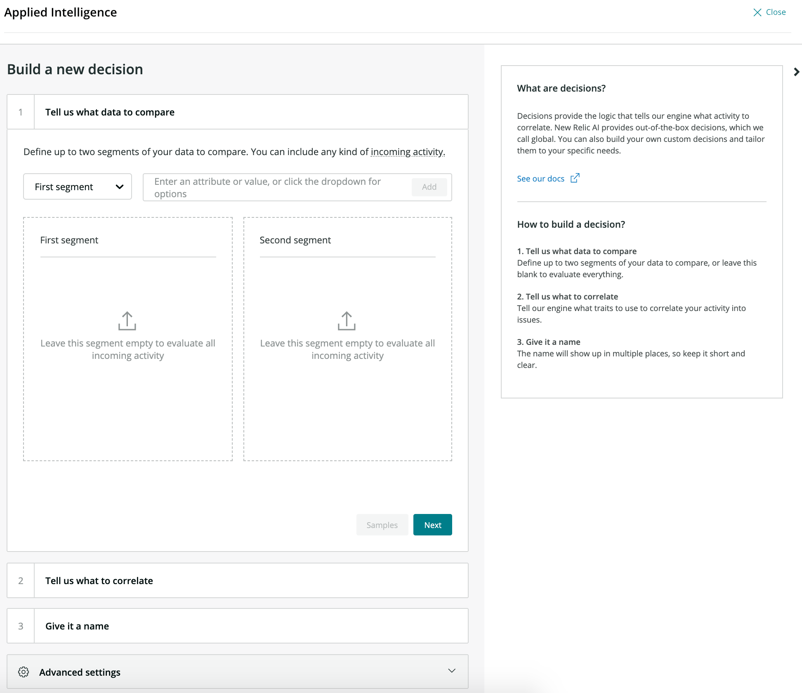
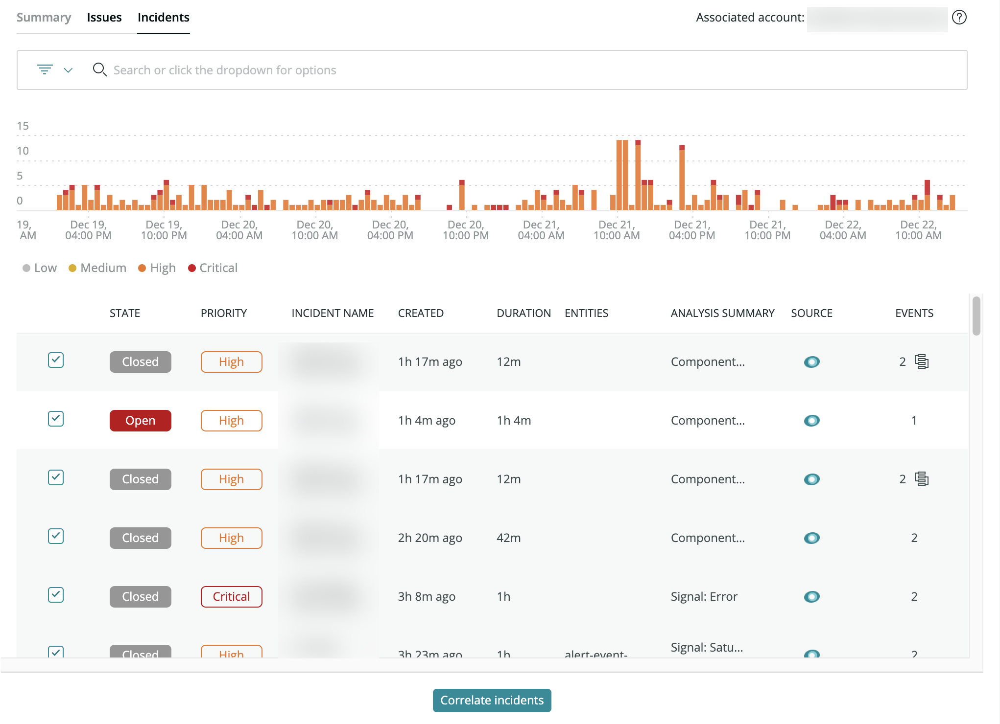

You can use decisions logic to affect the correlation [Incident Intelligence](https://docs.newrelic.com/docs/new-relic-one/use-new-relic-one/new-relic-ai/get-started-incident-intelligence) provides. Using decisions effectively will give you better issue correlation, which results in reduced noise and increased context.


<figcaption>
  **[one.newrelic.com](https://one.newrelic.com) > Applied Intelligence > Incident intelligence > Decisions**: This screenshot of our UI shows how each decision correlates your incidents using a specific logic.
</figcaption>

## Key Concepts

**What is "correlation" and how does it work?**

Think of all your incident events from all your alerting engines being sent into Incident Intelligence. The most recently created ones which are open are available for correlation. Correlation occurs between two incidents whenever all the criteria in any Decision is met.

**What is issue merging and how does that affect Issue size?**

All the incidents available for correlation are tested against each other in all possible pair combinations and a greedy merge is performed. So if A correlates with B into an issue and B correlates with C into another issue, then AB and BC will also merge together resulting in a single Issues with A, B and C inside.

## Review your active decisions [#decisions]

Decisions determine how Incident Intelligence correlates incidents together. By default, a broad set of decisions is enabled when you start using Incident Intelligence.

To review your decisions:

1. Go to **[one.newrelic.com](https://one.newrelic.com)**, click **Alerts & AI**, in the left nav under **Incident Intelligence** click **Decisions**.
2. Review the list of active decisions.
3. To see the rule logic that creates correlations between your issues, click the decision.
4. Click the recent correlations tab to see examples of incidents the decision correlated
5. Use any of the other options to enable, disable, edit, or delete decisions.

Your Decisions will routinely be analyzed for their efficacy as well as other best practices, and recommendations will be attached for review.

## Customize your decisions [#customize]

You can reduce noise with improved correlation by customizing the decisions you use.

You can also create your own decisions in our decision builder:

1. Go to **[one.newrelic.com](https://one.newrelic.com)**, click **Alerts & AI**, in the left nav under **Incident Intelligence** click **Decisions**, then click **Add a decision**.
2. Use the [decision builder guidelines](#decision-guidelines) below to build the decision.

   

   <figcaption>
     **Alerts & AI > Decisions > Add a decision** to access the decision builder
   </figcaption>
3. When you've added and customized your logic, save the decision. It will be enabled by default.

<table id="decision-guidelines">
  <thead>
    <tr>
      <th style={{ width: "250px" }}>
        Option
      </th>

      <th>
        Description
      </th>
    </tr>
  </thead>

  <tbody>
    <tr>
      <td>
        Choose data to compare
      </td>

      <td>
        In this step you'll define your filters. Remember correlation occurs between two Incidents. If no filters are defined all Incidents will be used.

        Otherwise, define your filters for the first segment (or bucket) of Incidents, and the second segment of Incidents. Types of filter operators range from substring matching to [regex matching](#regex).

        These will be the two segments of data that will be used in the next step when that data is compared to each other in all possible combinations.
      </td>
    </tr>

    <tr>
      <td>
        Customize your logic
      </td>

      <td>
        Once you've chosen your data, you can add logic to define when they should be correlated. You can correlate issues based on the following methods:

        * Attribute comparisons with standard operators
        * Attribute similarity using [similarity algorithms](#algorithms)
        * Attribute [regex with capture groups](#regex)
        * Entire incident comparisons (similarity or clustering)
      </td>
    </tr>

    <tr>
      <td>
        Name your decision
      </td>

      <td>
        After you configure your decision logic, give it a recognizable name and description.
      </td>
    </tr>

    <tr>
      <td>
        Optional: Advanced settings
      </td>

      <td>
        You can also change other settings for your decision:

        * **Time window**: Sets the maximum time between incidents created time for them to be eligible for correlation.
        * **Issue priority**: Overrides the default priority setting (`inherit priority`) to add higher or lower priority if the Incidents correlated.
        * **Frequency**: Modifies the minimum number of incidents that need to meet the rule logic for the decision to trigger.
        * **Similarity**: If you're using `similar to` operators in your rule logic, you can choose from a list of algorithms and set their sensitivity. This will apply to all `similar to` operators in your logic.
      </td>
    </tr>
  </tbody>
</table>

### Correlation Statistics [#correlation]

Whether you want to use the suggested decisions we provide using our pattern recognition algorithms, or you want to add in your own correlation logic, you'll get strong insights into your correlation rate, flapping effectiveness, noise reduction improvement, and the number of correlated issues arising, as shown below.

Remember all statistics are being pulled from NRDB and you are able to view the underlying queries and create your own customized dashboards using this data.

**Correlation rate**: The percentage of the time are correlations occurring vs. not.

**Total correlated issues**: Number of issues correlated with another issue.

**Noise reduction**: Total number of issues after correlation divided by the total number of issues before correlation.

**Flapping effectiveness**: The percentage of issues where flapping was detected (opening and closing frequently) and new redundant issues were prevented from opening.

**Correlation reason**: Shows which Decisions are correlating issues the most

### Use suggested decisions [#suggested-decisions]

**Suggested Decisions:** The data being sent into Incident Intelligence via Sources is continuously inspected for patterns to help you reduce noise faster. Once patterns have been observed in your data, decisions are suggested that would allow these events to correlate in the future.

**Accelerated Suggested Decisions:** As an existing New Relic customer with historical Alerts data, after adding Policies to Sources, Incident Intelligence is able to use that historical data to more accelerate the pattern recognition step and suggest decisions up to 30% faster.


<figcaption>
  Decisions Statistic Block
</figcaption>

To get started, simply click on one of three suggested decisions right under the statistics block. Once clicked, you'll see information on what the logic is behind the suggested decision and why the trained AI system thinks it will benefit you. In addition, you'll see the estimated correlation rate on that one specific decision.


<figcaption>
  Suggested Decision Block
</figcaption>

If there isn't enough data to see the correlation rate, a link right below the percentage estimate will guide you to other sources you can add to get stronger results _(note: if you don't have a minimum of 5000 incidents a month, you most likely won't see any suggested decisions)._

To add the suggested decision, simply click on the activate decision button and it will appear enabled alongside the rest of your decisions. If the decision isn't relevant to your needs, click the dismiss button and you can dismiss it forever or come back to it at a later time.

### Similarity algorithms [#algorithms]

For technical details on some of the correlation algorithms you can use in the decision engine, click any of the following options:

<CollapserGroup>
  <Collapser
    id="levenshtein-distance"
    title="Levenshtein distance"
  >
    This measure is useful for comparing short strings with static schema and fixed length, like host names. Levenshtein distance is also known as edit distance.

    <table>
      <thead>
        <tr>
          <th style={{ width: "200px" }}>
            Details
          </th>

          <th>
            Description
          </th>
        </tr>
      </thead>

      <tbody>
        <tr>
          <td>
            How it works
          </td>

          <td>
            The Levenshtein distance between two strings is the minimum number of single-character edits to get from one string to the other. Allowed edit operations are deletion, insertion, and substitution.

            The default similarity threshold for Applied Intelligence decisions is an edit distance of 3. You can change this in the **Advanced mode** of the decision builder.
          </td>
        </tr>

        <tr>
          <td>
            When to use it
          </td>

          <td>
            This measure is most useful for comparing relatively short strings with static schema and fixed length. Common applications include spell checkers, computational biology, and speech recognition.
          </td>
        </tr>

        <tr>
          <td>
            Examples
          </td>

          <td>
            `number/bumble: 3 (number → bumber → bumblr → bumble)`

            `trying/lying: 2 (trying → rying → lying)`

            `strong/through: 4 (strong → htrong → throng → throug → through)`
          </td>
        </tr>

        <tr>
          <td>
            Potential drawbacks
          </td>

          <td>
            Levenshtein distance is not normalized by default to take into account string lengths.
          </td>
        </tr>
      </tbody>
    </table>
  </Collapser>

  <Collapser
    id="fuzzy-score"
    title="Fuzzy score"
  >
    This metric is useful for comparing same-length strings where the same prefix would be a good indicator of correlation.

    <table>
      <thead>
        <tr>
          <th style={{ width: "200px" }}>
            Details
          </th>

          <th>
            Description
          </th>
        </tr>
      </thead>

      <tbody>
        <tr>
          <td>
            How it works
          </td>

          <td>
            The fuzzy score algorithm works by allocating "points" for character matches between strings:

            * One point for each matching character
            * Two bonus points for subsequent matches

            The higher the fuzzy score, the greater the similarity between two strings.
          </td>
        </tr>

        <tr>
          <td>
            When to use it
          </td>

          <td>
            Fuzzy score is most useful for strings that have the same, and relatively short (ideally &lt;5 character), prefixes. A minimum guaranteed score would be `(length(expected prefix) * 3) - 2`.
          </td>
        </tr>

        <tr>
          <td>
            Examples
          </td>

          <td>
            Example: `Decisions / dcsions`

            `d: 1`

            `c: 1`

            `i 1`

            `s: 2`

            `o: 1`

            `n: 1`

            `si: 2`

            `io: 2`

            `on: 2`

            `ns: 2`

            `= 15 points`
          </td>
        </tr>

        <tr>
          <td>
            Potential drawbacks
          </td>

          <td>
            If the first character of the first string can't be found in the second string, no points are awarded.
          </td>
        </tr>
      </tbody>
    </table>
  </Collapser>

  <Collapser
    id="fuzzy-wuzzy-ratio"
    title="Fuzzy wuzzy ratio"
  >
    This metric is useful for comparing strings of similar length.

    <table>
      <thead>
        <tr>
          <th style={{ width: "200px" }}>
            Details
          </th>

          <th>
            Description
          </th>
        </tr>
      </thead>

      <tbody>
        <tr>
          <td>
            How it works
          </td>

          <td>
            The **fuzzy wuzzy** family of similarity measures was [developed by SeatGeek](https://chairnerd.seatgeek.com/fuzzywuzzy-fuzzy-string-matching-in-python/) to help find tickets for the same event that have different labels across multiple platforms. The fuzzy wuzzy ratio for two strings is expressed as a percentage, where a higher number indicates a more similar string. It's based on the [SequenceMatcher algorithm](https://docs.python.org/3/library/difflib.html) in Python's difflib.
          </td>
        </tr>

        <tr>
          <td>
            When to use it
          </td>

          <td>
            Fuzzy wuzzy ratio is effective for very short (eg. hostname) or very long (eg. event description) strings, especially in comparing strings of similar length.
          </td>
        </tr>

        <tr>
          <td>
            Potential drawbacks
          </td>

          <td>
            This algorithm is too sensitive to be used effectively for 3-10 word strings. One of the other modifications to fuzzy wuzzy (see below) may be a better choice.
          </td>
        </tr>
      </tbody>
    </table>
  </Collapser>

  <Collapser
    id="fuzzzy-wuzzy-partial"
    title="Fuzzy Wuzzy partial ratio"
  >
    This metric is useful for comparing strings of different length. This modification to the fuzzy wuzzy algorithm helps address the effective length limitation.

    <table>
      <thead>
        <tr>
          <th style={{ width: "200px" }}>
            Details
          </th>

          <th>
            Description
          </th>
        </tr>
      </thead>

      <tbody>
        <tr>
          <td>
            How it works
          </td>

          <td>
            With fuzzy wuzzy partial ratio, the shorter string is compared to each substring of the same length within the longer string. The score of the “best matching” substring is used to determine the fuzzy wuzzy partial ratio.
          </td>
        </tr>

        <tr>
          <td>
            When to use it
          </td>

          <td>
            Fuzzy wuzzy partial ratio is especially effective for the types of comparisons the basic fuzzy wuzzy algorithm fails at: 3-10 word strings where some significant substrings are likely to be overlapping.
          </td>
        </tr>

        <tr>
          <td>
            Examples
          </td>

          <td>
            For example, between the following strings:

            `DevOps and SRE teams`

            `DevOps`

            …”DevOps” (the shorter string, length = 6) would be compared to each substring with length 6 within “DevOps and SRE teams.” Since one of those substrings (“DevOps”) is a perfect match, the fuzzy wuzzy partial ratio for these two strings will be high.
          </td>
        </tr>

        <tr>
          <td>
            Potential drawbacks
          </td>

          <td>
            Where fuzzy wuzzy may be too conservative, fuzzy wuzzy partial match may be more liberal than expected with correlations. You can adjust the threshold in the decision builder according to your needs.
          </td>
        </tr>
      </tbody>
    </table>
  </Collapser>

  <Collapser
    id="fuzzy-wuzzy-token"
    title="Fuzzy wuzzy token set ratio"
  >
    This metric is useful for comparing strings where the information may not be in the same order, and of possible different lengths. It works best for sentences such as messages, descriptions, etc.

    <table>
      <thead>
        <tr>
          <th style={{ width: "200px" }}>
            Details
          </th>

          <th>
            Description
          </th>
        </tr>
      </thead>

      <tbody>
        <tr>
          <td>
            How it works
          </td>

          <td>
            The token set ratio algorithm follows a few steps to compare strings:

            1. Tokenize each string (eg. “DevOps and SRE teams” → “DevOps” “and” “SRE” “teams”; “SRE team and DevOps engineers” → “SRE” “teams” “and” “DevOps” “engineers”)
            2. Combine intersecting tokens into a new string, leaving the remaining tokens. (eg. intersecting: ”DevOps”, “and”, “SRE”; remainder1: “teams”; remainder2: “team”, “engineers”)
            3. Alphabetize each token group (eg. “and, DevOps, SRE”, “teams”, engineers, team”)
            4. Compare the following pairs of strings:

               1. Intersection group
               2. Intersection group + remainder1
               3. Intersection group + remainder2

            The comparison from these pairs (“best matches”) is the fuzzy wuzzy token set ratio.
          </td>
        </tr>

        <tr>
          <td>
            When to use it
          </td>

          <td>
            This metric is helpful in cases where similar strings may have overlapping words but different construction - for example, event descriptions for different issues with the same resource.
          </td>
        </tr>

        <tr>
          <td>
            Potential drawbacks
          </td>

          <td>
            Where fuzzy wuzzy may be too conservative, fuzzy wuzzy token set match may be more liberal than expected with correlations. You can adjust the threshold in the decision builder according to your needs.
          </td>
        </tr>
      </tbody>
    </table>
  </Collapser>

  <Collapser
    id="Jaro-winkler-distance"
    title="Jaro-winkler distance"
  >
    This metric is useful for short strings where identical prefixes are a strong indication of correlation.

    <table>
      <thead>
        <tr>
          <th style={{ width: "200px" }}>
            Details
          </th>

          <th>
            Description
          </th>
        </tr>
      </thead>

      <tbody>
        <tr>
          <td>
            How it works
          </td>

          <td>
            This metric uses a scale of 0-1 to indicate the similarity between two strings, where 0 is no similarity (0 matching characters between strings) and 1 is an exact match. Jaro-Winkler similarity takes into account:

            * `matching`: two characters that are the same and in similar positions in the strings.
            * `transpositions`: matching characters that are in different sequence order in the strings.
            * `prefix scale`: the Jaro-Winkler distance is adjusted favorably if strings match from the beginning (a prefix is up to 4 characters).
          </td>
        </tr>

        <tr>
          <td>
            When to use it
          </td>

          <td>
            This metric is fairly tolerant of transpositions, but transpositions further apart in the string are less useful.

            A generally-safe number to use for Jaro-Winkler similarity in moderate to long strings is 0.9; you could use {'~'}0.85 in cases where more leniency is okay (if you have other, more specific logic in the decision).
          </td>
        </tr>
      </tbody>
    </table>
  </Collapser>

  <Collapser
    id="cosine-distance"
    title="Cosine distance"
  >
    This measure is most commonly used to compare large blocks of text (for example, incident descriptions) and provides an easy visualization of similarity.

    <table>
      <thead>
        <tr>
          <th style={{ width: "200px" }}>
            Details
          </th>

          <th>
            Description
          </th>
        </tr>
      </thead>

      <tbody>
        <tr>
          <td>
            How it works
          </td>

          <td>
            For each text block you're comparing, a vector is calculated to represent the count of each unique word in the block. The cosine distance of the resulting vectors is their dot product divided by the product of their magnitudes.
          </td>
        </tr>

        <tr>
          <td>
            When to use it
          </td>

          <td>
            This measure is most useful to compare long blocks of text, specifically when the comparison is meant to consider the text as a whole, and not differences or misspellings in individual words.
          </td>
        </tr>

        <tr>
          <td>
            Examples
          </td>

          <td>
            ```
            It is not length of life, but depth of life.
                                Depth of life does not depend on length.
            ```

            Here are the word counts for these sentences:

            `it 1 0`

            `is 0 1`

            `not 1 1`

            `length 1 1`

            `of 2 1`

            `life 2 1`

            `but 1 0`

            `depth 1 1`

            `does 0 1`

            `depend 0 1`

            `on 0 1`

            And here are those counts represented as a vector:

            ```
            [1, 0, 1, 1, 2, 2, 1, 1, 0, 0, 0]
                                [0, 1, 1, 1, 1, 1, 0, 1, 1, 1, 1]
            ```

            The cosine distance of these vectors is about 0.9 (1 is the highest similarity).
          </td>
        </tr>

        <tr>
          <td>
            Potential drawbacks
          </td>

          <td>
            Cosine distance is less useful for situations where small character differences in words are insignificant. Also, cosine distance ignores word order in the text blocks.
          </td>
        </tr>
      </tbody>
    </table>

    For more information on cosine distance implementation, see this [detailed walkthrough](http://blog.christianperone.com/2013/09/machine-learning-cosine-similarity-for-vector-space-models-part-iii/).
  </Collapser>

  <Collapser
    id="hamming-distance"
    title="Hamming distance"
  >
    This measure is useful for shorter text with static schema, but it works only for same-length strings.

    <table>
      <thead>
        <tr>
          <th style={{ width: "200px" }}>
            Details
          </th>

          <th>
            Description
          </th>
        </tr>
      </thead>

      <tbody>
        <tr>
          <td>
            When to use it
          </td>

          <td>
            Hamming distance requires the compared strings to be of equal length. This is a useful similarity metric for situations where the difference between two strings may be due to typos, or where you want to compare two attributes with known lengths. For example: Low Disk Space in application myapp in datacenter us01

            If you wanted to be tolerant to datacenter changes, the hamming distance should be set to 4. An average use case for Hamming distance would be around 2-3.
          </td>
        </tr>

        <tr>
          <td>
            Examples
          </td>

          <td>
            A simpler version of "edit distance" metrics like Levenshtein distance, the Hamming distance between two strings is the number of characters in the string that don't match (in the same position). For example, in the strings below, the Hamming distance is 2:

            ```
            flowers / florets
            ```
          </td>
        </tr>

        <tr>
          <td>
            Potential drawbacks
          </td>

          <td>
            In the example above, if the application name changes instead of the datacenter, a correlation would also be created. As the distance grows, the usefulness of Hamming Distance plummets. For this reason, for anything remotely more complicated than being tolerant to 1-2 character substitutions (or if the string lengths will not match), a different similarity measurement should be used.
          </td>
        </tr>
      </tbody>
    </table>
  </Collapser>

  <Collapser
    id="Jaccard-distance"
    title="Jaccard distance"
  >
    This measure is useful for comparing large blocks of text, like descriptions or entire incidents.

    <table>
      <thead>
        <tr>
          <th style={{ width: "200px" }}>
            Details
          </th>

          <th>
            Description
          </th>
        </tr>
      </thead>

      <tbody>
        <tr>
          <td>
            How it works
          </td>

          <td>
            The distance, denoted as a percentage (0 being completely similar; 1 being totally dissimilar) is calculated with the following formula:

            ```
            1 - [(# of characters in both sets) / (# of characters in either set) * 100]
            ```

            In other words, the Jaccard distance is the number of shared characters divided by the total number of characters (shared and un-shared). A Jaccard distance of 0.1 means that 10% or fewer characters between two incidents are different.
          </td>
        </tr>

        <tr>
          <td>
            When to use it
          </td>

          <td>
            Jaccard distance is very easy to interpret and especially useful in cases with large data sets. For example, in comparing the similarity between two entire incidents (as opposed to one attribute).
          </td>
        </tr>

        <tr>
          <td>
            Potential drawbacks
          </td>

          <td>
            It's less effective for small data sets or situations with missing data. Also, different permutations of the character set don't affect Jaccard distance, so care should be taken to prevent false positives.
          </td>
        </tr>
      </tbody>
    </table>
  </Collapser>
</CollapserGroup>

### Regex operator [#regex]

Available operators in the [decision builder](#customize) include `contains (regex)` (in step 1 — Tell us what data to compare) and `regular expression match` (in step 2 — Tell us what to correlate). The decision builder follows the standards outlined in [these documents for regular expressions](https://docs.oracle.com/javase/8/docs/api/java/util/regex/Pattern.html).

**Using regex in step 1 — Tell us what data to compare**

In order for your regex to test as true, the entire attribute value (the data you’re evaluating) must be matched by the regular expression provided. Captured groups can be used but are not explicitly evaluated.

For instance, if the attribute value is `foobarbaz`, these examples would meet the criteria and test as true:

* `foo.*`
* `^.*baz`
* `\w+`

**Using regex in step 2 — Tell us what to correlate**

In order for your regex to test as true, the entire attribute values for incident 1 and incident 2 must be included in the match. Also, each captured group (expressions in `( )` parentheses) must exist in both values (incident 1 and incident 2 attributes), and have the same value:

* The number of captured groups must be equal for both incident attributes.
* Each group must be equal to the corresponding group between attribute values: the value of the first captured group in the incident 1 attribute value is equal to the value of the first captured group in the incident 2 attribute.

For instance, if attribute value 1 is `abc-123-xyz` and attribute value 2 is `abc-777-xyz`, then `(\w+)-(?:\w+)-(\w+)` would meet the criteria:

* The whole value is matched by the expression.
* The first and third captured groups have the same respective values.
* The second group is not captured using `?:`, which allows the whole value to match but isn’t used in the capture group comparison.

**About flags**

No flags are enabled by default. Some useful flags to include in regular expressions in the decision builder are:

* CASE_INSENSITIVE: (?i)
* MULTILINE: (?m)
* DOTALL: (?s)

See [field detail](https://docs.oracle.com/javase/8/docs/api/java/util/regex/Pattern.html#field.detail) for more notes on the function and implementation of each of these flags.

## Correlate incidents into a decision [#assistant]

Use our correlation assistant to reduce the time it takes to inspect your incidents and past behavior, review attributes from incidents, and create a decision.

The correlation assistant selects a handful of incidents to correlate, see meaningful insights about the relationships between them, and quickly create a decision for similar incidents in the future.


<figcaption>
  To use the correlation assistant, from **one.newrelic.com**, click **Alerts & AI**, click **Overview**, click the **Incidents** tab, and then click **Correlate incidents**.
</figcaption>

### Create a decision [#decision]

You can use the correlation assistant to correlate similar incidents, simulate a decision based on the incident attributes, and create a decision.

1. From **one.newrelic.com**, click **Alerts & AI**, click **Overview**, then click the **Incidents** tab.
2. Select a set of incidents you'd like to correlate, and then at the bottom of the incident list, click **Correlate incidents**.
3. For best results, select common attributes with a low frequency percentage that you'd like to use to correlate your incidents.
4. Click **Simulate** to see the likely effect of your new decision.
5. If you like what's been simulated, click **Next**, and then name and describe your decision.
6. If the simulation result shows too many potential incidents, you may want to choose a different set of attributes and incidents for your decision.

### Use simulations to improve your decisions [#simulations]

Using a set of incidents, the correlation assistant identifies common attributes among those incidents. Select useful attributes to simulate a decision. If the simulation looks good, continue through the UI prompts to create your real decision. If the simulation doesn't show a helpful decision, choose a different set of attributes, and rerun the simulation.



<figcaption>
  Choose the most relevant attributes between your related incidents and then simulate a decision preview. If it looks good, follow the UI prompts to name and describe your new decision.
</figcaption>

Common attributes are all of the common key-value pairs in your selected incidents.

For the best decisions, we recommend you choose the common attributes that are least frequently present in your set of incidents. By default, the attributes are sorted by frequency with the most unique attributes at the top. Click an attribute's frequency percentage to get more information about that score.

Check an attribute to add it to your decision. Use **Simulate** to get a preview of your decision. Here’s a breakdown of the decision preview information:

* **Potential correlation rate**: The percentage of tested incidents this decision would have affected.
* **Total created incidents**: The number of incidents tested by this decision.
* **Total estimated correlated incidents**: The estimated number of incidents this decision would have correlated.
* **Incident examples**: A list of incident pairs this decision would have correlated.

Run the simulation with different attributes as many times as you need until you see a preview that you like. When you’re ready, follow the UI prompts to save your decision.
