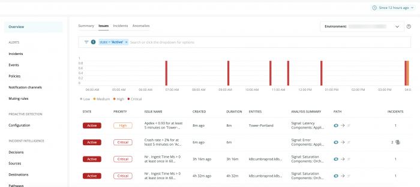
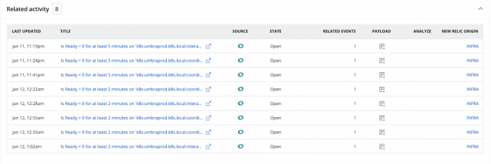

This is a great cohort!

<Callout variant="tip">
  To use Incident Intelligence and Applied Intelligence, as well as the rest of our [observability platform](https://one.newrelic.com), join the New Relic family! [Sign up](https://newrelic.com/signup) to create your free account in only a few seconds. Then ingest up to 100GB of data for free each month. Forever.
</Callout>


<figcaption>
  This screenshot shows an example issue feed, which describes your issues' statuses, correlations, and more.
</figcaption>

**What's the difference between an issue, incident, and event?** In short, these terms are like building blocks. Events are raw data from your sources. Incidents are made up of one or more events. Issues are composed of one or more incidents.

In more detail:

* **Events** indicate a state change or trigger defined by your monitoring systems. An event contains information about the affected entity, and they are almost always triggered automatically by the system.
* **Incidents** are groups of events that describe the "symptoms" of your system over time. These symptoms are detected by your monitoring tools, which evaluate your data streams and events.
* **Issues** are groups of incidents that describe the underlying problem of your symptoms. When a new incident is created, Incident Intelligence opens an issue and evaluates other open issues for correlations.

## Set up Incident Intelligence [#get-started]

To enable Incident Intelligence, follow these four steps. Afterwards, issues should start to appear in your issue feed.

* [1. Configure your environment (one-time)](#1-configure-environment).
* [2. Configure sources](#1-configure-sources).
* [3. Configure destinations](#2-configure-destinations).
* [4. Configure pathways](#3-configure-pathways).

## 1. Configure your environment (one-time) [#1-configure-environment]

To set up an environment in Incident Intelligence, you need an administrator to select a New Relic account for it. This account should be the one your team is using.

* **Who sets the environment?** Only administrators, and only for accounts where they have admin privileges.
* **Can administrators set more than one environment?** They can set one environment per master account and its sub-accounts. More than one can be set if an administrator has privileges for more than one master account.
* **Need to change the environment's associated account?** Reach out to your account executive or [our support team](http://support.newrelic.com) for help.

<Callout variant="tip">
  Incident Intelligence is a cross-account product. This means you can send in data from any New Relic account or external source to correlate events.
</Callout>

## 2. Configure sources [#1-configure-sources]

After setting up your environment, determine your incident sources. These are your data inputs.

You can get data from any of the following sources:

<CollapserGroup>
  <Collapser
    className="freq-link"
    id="configure-source-nr-alerts"
    title="Alerts"
  >
    By integrating Incident Intelligence with your alerts violations, you can get context and correlations from what you're monitoring.

    To get data from alerts:

    1. From **[one.newrelic.com](https://one.newrelic.com)**, click **Alerts**.
    2. On the left under **Incident Intelligence**, click **Sources** and then click **Alerts**.
    3. Select the policies you want to connect to Applied Intelligence, and click **Connect**.

    You can add additional alerts policies or remove policies you've already connected in **Sources > New Relic Alerts**.

    <Callout variant="tip">
      Adding alerts as a source will not affect your current configuration or notifications.
    </Callout>
  </Collapser>

  <Collapser
    className="freq-link"
    id="configure-source-anomalies"
    title="Anomalies"
  >
By integrating Incident Intelligence with your New Relic [Proactive Detection](/docs/alerts-applied-intelligence/applied-intelligence/proactive-detection/proactive-detection-applied-intelligence) anomalies, you can get context and correlations from what you're monitoring.

To get data from New Relic Proactive Detection anomalies:

1. From [one.newrelic.com](https://one.newrelic.com), click **Alerts & AI**. 
2. On the left under **Incident Intelligence**, click **Sources** and then click **Anomalies**.
3. Select the configurations you want to connect to Applied Intelligence by toggling to on (green).

To add or remove alert policies, from **Alerts & AI**, click **Sources**, then **Alerts**.

<Callout variant="tip">
Adding anomalies as a source won't affect your current Proactive Detection configurations or notifications.
</Callout>


  </Collapser>

  <Collapser
    className="freq-link"
    id="configure-source-pagerduty"
    title="PagerDuty"
  >
    You can integrate Incident Intelligence directly with your PagerDuty services to ingest, process, and enhance all of your PagerDuty incidents.

    To get data from PagerDuty:

    1. Make sure your [PagerDuty API key](https://support.pagerduty.com/docs/generating-api-keys) has write access.
    2. From **[one.newrelic.com](https://one.newrelic.com)**, click **Alerts & AI**.
    3. On the left under **Incident Intelligence**, click **Sources** and then click **PagerDuty**.
    4. Enter your [PagerDuty API key](https://support.pagerduty.com/docs/generating-api-keys).
       * The key should be either a personal or general access key with write access. If it's created by a user, the user should be an admin.
    5. Select the PagerDuty services you want to connect to Applied Intelligence, and click **Connect**.

    You can add additional services or remove services you've already connected in **Sources > PagerDuty**.

    <Callout variant="tip">
      Connecting PagerDuty services to Applied Intelligence will not affect your current services or notifications.
    </Callout>
  </Collapser>

  <Collapser
    className="freq-link"
    id="configure-source-splunk"
    title="Splunk"
  >
    By integrating Incident Intelligence with your Splunk log monitoring, you can:

    * Use your environment's log data for searches and key term reports.
    * Correlate alerts and search reports with your other metrics and incidents.

    <Callout variant="important">
      Applied Intelligence supports Splunk Light, Splunk Cloud, and Splunk Enterprise version 6.3 and higher.
    </Callout>

    To get data from Splunk:

    1. In your **Splunk console**, start a search for the relevant events.
    2. Save your search as an alert, configure your alert conditions, and then choose the webhook as the delivery method.
    3. Go to **[one.newrelic.com](https://one.newrelic.com)** and click **Alerts & AI**. 
    4. On the left under **Incident Intelligence**, click **Sources** and then click **Splunk**.
    5. Copy the collector URL, and paste it into the webhook endpoint in the Splunk console.
    6. Optional: Use Splunk tokens to [enrich alert data with Splunk metadata](#enrich-splunk-search).
  </Collapser>

  <Collapser
    className="freq-link"
    id="enrich-splunk-search"
    title="Splunk metadata"
  >
    To enrich alerts data with your Splunk metadata, use Splunk tokens. This helps you leverage your search data, which includes metadata and values from the first row of search results.

    <table>
      <thead>
        <tr>
          <th style={{ width: "200px" }}>
            If you want to...
          </th>

          <th>
            Do this...
          </th>
        </tr>
      </thead>

      <tbody>
        <tr>
          <td>
            Access search data
          </td>

          <td>
            Use the format `$<fieldname>$`. For example, use `$app$` for the app context for the search.
          </td>
        </tr>

        <tr>
          <td>
            Access field values
          </td>

          <td>
            To access field values from the first result row that a search returns, use the format `$result.<fieldname>$`. For example, use `$result.host$` for the host value and `$result.sourcetype$` for the source type.
          </td>
        </tr>

        <tr>
          <td>
            Use variables
          </td>

          <td>
            You can leverage any of the **Selected fields** in the Splunk search and add any unique fields to the **Selected fields** to make the data available as a variable.

            The following fields will automatically provide hints to the correlation engine:

            * `app`: parsed as `APPLICATION_NAME`
            * `application:`parsed as `APPLICATION_NAME`
            * `application_name`: parsed as `APPLICATION_NAME`
            * `cluster`: parsed as `CLUSTER_NAME`
            * `computer`: parsed as `HOST_NAME`
            * `Dc`: parsed as `DATACENTER_NAME`
            * `datacenter`: parsed as `DATACENTER_NAME`
            * `host`: parsed as `HOST_NAME`
            * `host_name`: parsed as `HOST_NAME`
            * `hostname:` parsed as `HOST_NAME`
            * `transaction`: parsed as `EVENT_ID`
            * `Transaction_id`: parsed as `EVENT_ID`
            * `user`: parsed as `USER_NAME`
          </td>
        </tr>
      </tbody>
    </table>
  </Collapser>

  <Collapser
    className="freq-link"
    id="configure-source-prometheus"
    title="Prometheus Alertmanager"
  >
    By integrating Incident Intelligence with Prometheus Alertmanager, you can receive and correlate your Prometheus alerts with events from other sources.

    To integrate Prometheus Alertmanager:

    1. Set up your Alertmanager configuration file by running:

       ```
       ./alertmanager -config.file=simple.yml
       ```
    2. Go to **[one.newrelic.com](https://one.newrelic.com)** and click **Alerts & AI**. 
    3. On the left under **Incident Intelligence**, click **Sources** and then click **Prometheus Alertmanager**.
    4. Copy the Prometheus Alertmanager URL, and paste it into the `<webhook_config>/url` section of your Alertmanager config file.
    5. Reload the Prometheus Alertmanager configuration with one of the two methods:
       * Send a `SIGHUP` to the process.
       * Send an HTTP `POST` request to the `/-/reload` endpoint.
  </Collapser>

  <Collapser
    className="freq-link"
    id="configure-source-grafana"
    title="Grafana"
  >
    You can integrate Incident Intelligence with Grafana's notifications for insight into events across your applications and environment. Grafana's webhook notification is a simple way to send information over HTTP to a custom endpoint.

    To integrate Grafana as a new webhook:

    1. Log into your Grafana portal using Admin permissions, and choose **Alerting**.
    2. On the Grafana **Notification Channels** page, click **New Channel > Webhook**.
    3. Go to **[one.newrelic.com](https://one.newrelic.com)** and click **Alerts & AI**. 
    4. On the left under **Incident Intelligence**, click **Sources**, and then click **Grafana**.
    5. Copy the URL, and paste it into your new Grafana webhook.
  </Collapser>

  <Collapser
    className="freq-link"
    id="configure-source-aws"
    title="AWS"
  >
    You can integrate Incident Intelligence with Amazon CloudWatch to provide incident management for all of your AWS services.

    To integrate Amazon CloudWatch:

    1. Go to **[one.newrelic.com](https://one.newrelic.com)** and click **Alerts & AI**.
    2. On the left under **Incident Intelligence**, click **Sources** and then click **Amazon Web Services**.
    3. Copy the URL.
    4. [Create a new Amazon SNS topic](https://docs.aws.amazon.com/sns/latest/dg/sns-getting-started.html).
    5. Set CloudWatch to forward all **Alarms** state changes to that topic:

       * In the Amazon CloudWatch UI, click **Events > Event Pattern**.
       * Select **Service Name > CloudWatch**.
       * Select **Event Type > CloudWatch Alarm State Change**.
       * Select **Targets > SNS Topic**, and select your new Amazon SNS topic.
    6. Create a new subscription:

       * In the Amazon AWS UI, click **Create a Subscription**.
       * Select your new Amazon SNS topic.
       * Select **Protocol > choose HTTPS**.
       * In **Endpoint**, paste the URL you previously copied from the Applied Intelligence **Sources**.
  </Collapser>

  <Collapser
    className="freq-link"
    id="configure-source-rest-api"
    title="REST API"
  >
    Incident Intelligence supports a dedicated REST API interface that lets you integrate with additional systems. The interface allows instrumentation of your code or other monitoring solutions to report any kind of metric or event.

    * A metric can be a raw data point such as CPU, memory, disk utilization, or business KPI.
    * An event can be a monitoring alert, deployment event, incident, exceptions or any other change in state that you want to describe.

    You can also send any type of data to Incident Intelligence straight from your own systems or applications. The REST API supports secure token-based authentication and accepts JSON content as input.

    For more information on authentication and the full API reference, see [REST API for New Relic Applied Intelligence](/docs/rest-api-new-relic-ai).
  </Collapser>


</CollapserGroup>

## 3. Configure destinations [#2-configure-destinations]

Now that you've set up your sources, you can configure your destinations. These are the data outputs where you view your incidents.

You can set destinations using any of the following methods:

<CollapserGroup>
  <Collapser
    id="pager-duty-destination"
    title="Send data to PagerDuty"
  >
    **Recommended**: Create a new PagerDuty service to use as a destination. Because PagerDuty services can also be used as sources, this can help you distinguish your data input from your output.

    To create a PagerDuty destination:

    1. Go to **[one.newrelic.com](https://one.newrelic.com)**, click **Alerts & AI**, in the left nav under **Incident Intelligence** click **Destinations**, then click **PagerDuty**.
    2. Enter your [PagerDuty API key](https://support.pagerduty.com/docs/generating-api-keys).
       * The key should be either a personal or general access key with write access. If it's created by a user, the user should be an admin. If you've configured a PagerDuty source with an API key, you can use the same key.
    3. Select the PagerDuty services you want to connect to Applied Intelligence, and click **Connect**.

    When you're ready, you can add policies for one or more PagerDuty destinations. You can also transfer the policies over from your existing services or leave them as sources if needed.

    From the **Destinations > PagerDuty** page, you can also:

    * Review the permissions for your services. Click **Authorize** when you're done.
    * Add or delete existing services from the PagerDuty destination.
    * Edit permissions for any service.

    To configure your PagerDuty destinations, use the following settings:

    <table>
      <thead>
        <tr>
          <th style={{ width: "250px" }}>
            Configuration setting
          </th>

          <th>
            Description
          </th>
        </tr>
      </thead>

      <tbody>
        <tr>
          <td>
            Trigger new incidents
          </td>

          <td>
            **Required**. Trigger correlated parent incidents so you can identify issues faster.
          </td>
        </tr>

        <tr>
          <td>
            Edit incident titles
          </td>

          <td>
            **Required**. Alter your incident titles to help you orient and understand issues.
          </td>
        </tr>

        <tr>
          <td>
            Add new integrations
          </td>

          <td>
            **Required**. Add integrations to enable incident creation for selected services.
          </td>
        </tr>

        <tr>
          <td>
            Add webhook extensions
          </td>

          <td>
            Add webhook extensions to sync user actions in PagerDuty to New Relic. This lets you update the correlated issue state.
          </td>
        </tr>

        <tr>
          <td>
            Auto-resolve correlated incidents
          </td>

          <td>
            When enabled, this will resolve and automatically close correlated parent/child incidents.
          </td>
        </tr>

        <tr>
          <td>
            Select a user to take actions in PagerDuty
          </td>

          <td>
            You need to select a user before you can enable deep integration with PagerDuty. Once you do, the user can:

            * **Add notes to incidents (required)**: Incident notes are used to enrich incidents with context.
            * **Acknowledge triggered incidents**: When enabled, Applied Intelligence will acknowledge and correlate newly triggered incidents in PagerDuty before you're notified.
            * **Use the original escalation policy**: When enabled, the escalation policy of the source service will be applied to each incident.
          </td>
        </tr>
      </tbody>
    </table>
  </Collapser>

  <Collapser
    id="webhook-destination"
    title="Send data via webhook"
  >
    Incident Intelligence will send the event body in JSON format by HTTPS POST. The system expects the endpoint to return a successful HTTP code (`2xx`).

    To configure Incident Intelligence to send data via webhook:

    1. Go to **[one.newrelic.com](https://one.newrelic.com)**, click **Alerts & AI**, in the left nav under **Incident Intelligence** click **Destinations**, then click **Webhook**.
    2. **Required:** Configure the unique `webhook key`, used in Applied Intelligence to refer to this webhook configuration and its specific settings.
    3. **Required:** Configure the `destination endpoint` where the webhook payload will be sent.
    4. Optional steps:
       * Configure `custom headers`, which are `key:value` pairs of headers to be sent with the request. Example: `"Authentication" "Bearer" <bearer token>`
       * Configure a `custom payload` template that can be used to map New Relic fields to match the destination tool's expected name and format.
       * Configure `priority mapping` (critical, high, medium, or low), used to map New Relic's priorities to the priorities expected at the destination.
  </Collapser>

  <Collapser
    id="servicenow-destination"
    title="Send data to ServiceNow"
  >
    Using ServiceNow as a destination enables you to push valuable violation data into new ServiceNow incident tickets.

    To configure Incident Intelligence to send data to ServiceNow:

    1. Go to **[one.newrelic.com](https://one.newrelic.com)**, click **Alerts & AI**, in the left nav under **Incident Intelligence** click **Destinations**, then click **ServiceNow**.
    2. **Required:** Enter a channel name. This is used internally in Applied Intelligence to identify the destination (for example, in Pathways).
    3. **Required:** Enter your ServiceNow credentials:
       1. Team domain (This must be unique. No two destinations can have the same domain).
       2. Username
       3. Password
    4. Follow the two-way integration on screen instructions:
       1. Open and download this [XML file](https://storage.cloud.google.com/newrelic-connect/workflows-proxy-production.xml).
       2. In the ServiceNow sidebar menu, go to System Definition > Business Rule.
       3. Click the menu icon in one of the column headers, select Import XML, and upload the XML file you downloaded.

    The two way integration will allow the ServiceNow incident to be updated with changes to the Applied Intelligence issue.

    Closing a ServiceNow incident will close its corresponding New Relic issue.

    When a New Relic issue is resolved, the corresponding ServiceNow incident will be closed.

    ## Custom notification message [#custom-message]

    Applied Intelligence uses a templating framework called Jinja2 in the customization section interface. The Value field must be in [valid](https://cryptic-cliffs-32040.herokuapp.com/) Jinja syntax.

    By default, the interface populates a set of default fields in ServiceNow.

    When you add a custom field, enter the ServiceNow field name you want to use.

    <Callout variant="tip">
      By default, ServiceNow adds `u_` to the beginning of its custom values. When mapping to ServiceNow attributes, use the Column name value.
    </Callout>

    

    <figcaption>
      Please note that the name needs to be lowercase separated by underscores.
    </figcaption>

    Go here to see the [custom notification message attribute descriptions](https://docs.newrelic.com/docs/alerts-applied-intelligence/applied-intelligence/incident-intelligence/incident-intelligence-destination-examples#webhook-format).

    Go here to see [Jinja2 Useful Syntax](https://docs.newrelic.com/docs/alerts-applied-intelligence/applied-intelligence/incident-intelligence/incident-intelligence-destination-examples#jinja2-useful).
  </Collapser>
</CollapserGroup>

For examples of destination templates, webhook formats, and JSON schema, see the [Incident Intelligence destination examples](https://docs.newrelic.com/docs/new-relic-one/use-new-relic-one/new-relic-ai/incident-intelligence-destination-examples).

## 4. Configure pathways [#3-configure-pathways]

To control when and where you want to receive notifications from your incidents, you can configure pathways.

**To add a pathway:**

1. Go to **[one.newrelic.com](https://one.newrelic.com)**, click **Alerts & AI**, in the left nav under **Incident Intelligence** click **Pathways**, then click **Add a pathway**.
2. In the query builder box, select an attribute, such as `application/name`.
   * This can be from the list of all attributes available in PagerDuty incidents and New Relic alerts violations, or you can add your own attributes.
3. Select a logical operator. For example, `contains`.
4. Enter a specific value to complete the logical expression.

   * To include all issues created by your sources, select **Send everything**. (Use this if you only use one PagerDuty service to manage all incidents.)
   * To build more complex logic, use the `AND/OR` operators.
5. Select one or more of your [destinations](#2-configure-destinations).

To edit or remove existing pathways, mouse over the pathway's name on the **Pathways** page.

## Visual timeline [#visual-timeline]

The visual timeline, as presented below, shows you a breakdown of:

* Incidents
* The trends taking place
* What incidents are active
* What incidents are resolved
* What is correlated to each other
* Various milestones at different issue levels



In addition, you’ll see a grey line at the top of the timeline. In comparison to the visual timeline that shows the changes to each incident, the grey line represents changes to the issue.


<figcaption>
  Mouse over the grey line to see details of the event.
</figcaption>

Finally, mouse over the incident to see information on the location, timing, and level of importance of a specific incident.


<figcaption>
  This figure shows a particular incident populated on January 11th with a level of **Critical**.
</figcaption>

To view the issues in a text format, in the right hand corner, click **Switch to issue log view.**

## Related activity [#related-activity]

The related activity section aggregates a set of incidents into a single issue, according to a rule-based system.



<figcaption>
  This section will show you the **Last Update**, the **Source** location, its **State**, the number of **Related Events**, and where it **Originated**. You can also copy the **Payload** or click on **Analyze** for more information.
</figcaption>

## Issue summary [#issue-summary]

The issue page is built to first provide the user with bottom line insights to understand the problem and minimize the time needed to resolve it.


The following outlines each of the four sections on the issue page:

1. **The Analysis Summary:** the analysis summary has two machine learning modules, the golden signals and the related components.
2. **The Suggested Responder:** the suggested responder will tell you who to potentially reach out to on your team to solve a specific problem.
3. **The Impacted Entities:** an entity is anything that has data you can monitor. Specifically, these are focused on incidents from New Relic sources, extracting the entities and providing a summary. Each entity is unique.
4. **The Label Sets:** label sets are focused on incidents that come from 3rd party sources, such as PagerDuty, AWS Cloudwatch, REST APIs, etc., as well as for NRQL queries. They come in the form of key:value pairs.

All four of these sections can show up together for each issue or separately. It will vary based on the data in the issue.

In addition to these four sections, you can also take a look at [anomaly overview](https://docs.newrelic.com/docs/alerts-applied-intelligence/applied-intelligence/proactive-detection/proactive-detection-applied-intelligence#anomaly-overview) and entity overview directly from the issue feed.


If you hover over an impacted entity application, you’ll notice both call to actions: anomaly overview and entity overview. Anomaly overview will open the application's anomalies page. This is only available for applications that are set up for Proactive Detection.

Finally, the issue page contains deployment events.

[APM’s Deployment page](https://docs.newrelic.com/docs/apm/apm-ui-pages/events/deployments-page-view-impact-your-app-users) lists recent deployments and their impact on your end user and app server's Apdex scores, response times, throughput, and errors. This section will only show up if New Relic has identified applications under the Impacted Entities that have deployments.

There are two types of deployment events: deployments and related deployments. Click “[Show all deployments](https://docs.newrelic.com/whats-new/applied-intelligence-deployment-events-issue-feed)”, to see all your deployment events when they arrive. Click a specific deployment to see its APM deployments page.

## Root cause analysis 

Root cause analysis automatically finds potential causes for an issue and its impacted entities. It shows you why open issues occurred, which deployments contributed, and relevant error logs and attributes. With this, you can investigate the problem and reduce your mean time to resolution (MTTR).

<Callout variant="tip">
Note that root cause analysis is dependent on other New Relic data sources and features. This is why root cause analysis information may not always be present for every issue.
</Callout>


<figcaption>When you select an issue, you may see **Root cause analysis** information.</figcaption>

Root cause analysis includes three main UI sections: 

* **Deployment events**: When you set up deployments, we provide the deployment nearest to the issue creation. Changes, such as deployments, account for a high percentage of the root causes of incidents and having that information at hand can help diagnose and resolve issues.
*  **Error logs**: You can explore millions of log messages with a single click and use manual querying to help you find anomalous patterns and hard-to-find problems.
* **Attributes to investigate**: We scan the distribution of attributes and surface possible causes by finding significant changes in the distribution. For example, for every single transaction event, we can scan to see if an individual user starts to take up an anomalous share of the requests sent to your app. You can also [query interesting attributes](https://docs.newrelic.com/docs/query-your-data/nrql-new-relic-query-language/get-started/introduction-nrql-new-relics-query-language). 

## Use decisions [#decisions]

To further reduce noise or get improved incident correlation, you can change or customize your decisions. Decisions determine how Incident Intelligence groups incidents together.

To get started, see [Decisions](https://docs.newrelic.com/docs/new-relic-one/use-new-relic-one/new-relic-ai/get-started-decisions).

## Use suggested responders [#suggested-responders]

If you’re using **PagerDuty** or New Relic alerts violations as your incident notification tools, Incident Intelligence suggests relevant team members that can help resolve your issues.

Incident Intelligence learns from your PagerDuty and alerts violations data to provide suggestions for each new incident. Once you receive a suggestion, you can contact the responder or search for relevant documentation that person may have written.

To get started, enable PagerDuty or alerts violations as a source for Incident Intelligence. Afterwards, you can view the suggestions in two places:

* The issue feed, where you can also provide feedback on the suggestions.
* Directly within PagerDuty (both UI and API.) If you’re also using PagerDuty as a destination, the suggestions will appear in your issue notifications payload.

<Callout variant="important">
  This feature doesn't account for on-call availability at the time of incident.
</Callout>

<Callout variant="tip">
  In order to train the model, we use the information PagerDuty provides about individuals. We ingest incident information only, not users’ contact details.
</Callout>

## EU and US datacenter and Incident Intelligence data [#datacenter]

New Relic's Incident Intelligence service is performed solely in the United States. By using New Relic Incident Intelligence, you agree that New Relic may move your data to, and process your data in, the US region. This applies whether you store your data in New Relic's US region data center or in our [EU region data center](/docs/using-new-relic/welcome-new-relic/get-started/introduction-eu-region-data-center).

If you elect to use the Suggested Responder feature and manage EU-based individuals, you may need to confirm that an appropriate data processing agreement is in place.
