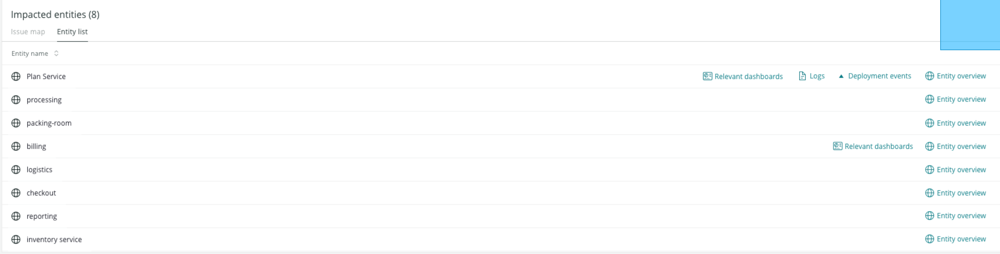
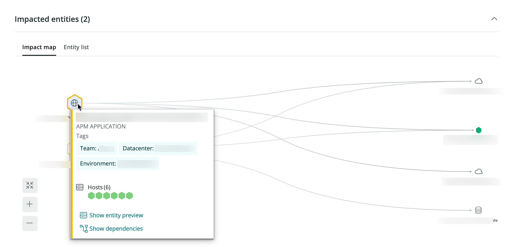
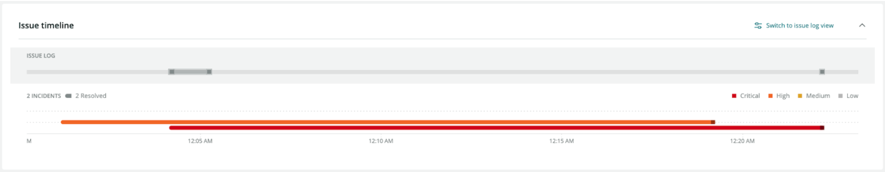

After you [set up Incident Intelligence](/docs/alerts-applied-intelligence/applied-intelligence/incident-intelligence/get-started-incident-intelligence/#get-started), our system will begin finding issues from your data sources.

In the **issue feed**, you can find an overview of all your issues, along with helpful information about them. You can also click any individual issue for more detail, including its analysis summary, event log, and details about correlated issues.

<figcaption>
  This screenshot shows an example issue feed, which describes your issues' statuses, correlations, and more.
</figcaption>

**What's the difference between an issue, incident, and event?** In short, these terms are like building blocks. Events are raw data from your sources. Incidents are made up of one or more events. Issues are composed of one or more incidents.

In more detail:

* **Events** indicate a state change or trigger defined by your monitoring systems. An event contains information about the affected entity, and they are almost always triggered automatically by the system.
* **Incidents** are groups of events that describe the "symptoms" of your system over time. These symptoms are detected by your monitoring tools, which evaluate your data streams and events.
* **Issues** are groups of incidents that describe the underlying problem of your symptoms. When a new incident is created, Incident Intelligence opens an issue and evaluates other open issues for correlations.

## Issue summary [#issue-summary]

The **Issue page** is built to provide you with bottom line insights first to understand the problem, and then to minimize the time you need to resolve it.

The **Issue page** includes the following sections:

1. **Issue summary:** This section has two machine learning modules, the golden signals and the related components.
2. **Suggested responders:** This section will tell you who to potentially reach out to on your team to solve a specific problem.
3. **Label sets:** Label sets are focused on incidents that come from 3rd party sources, such as AWS Cloudwatch, REST APIs, etc., as well as for NRQL queries. They come in the form of key:value pairs.
4. **Impacted entities:** An entity is anything that has data you can monitor. Specifically, these are focused on incidents from New Relic sources, extracting the entities and providing a summary. Each entity is unique. You can see your entities in a list or on a map.

Depending on the data in an issue, all four of these sections can show up together for each issue or separately.

If you mouse over an impacted entity application, you’ll notice a few calls to action: relevant dashboards, [anomaly overview](/docs/alerts-applied-intelligence/applied-intelligence/proactive-detection/proactive-detection-applied-intelligence#anomaly-overview), deployment events, and entity overview. 

* **Relevant dashboards** helps users in your account look at and interact with [dashboards](/docs/query-your-data/explore-query-data/dashboards/introduction-dashboards/) you've created that are related to an entity. The queries you've run to power the various widgets are automatically mapped to entities whenever possible and are presented back to you here for quick access and discovery.
* **Anomaly overview** will open the application's anomalies page. This is only available for applications that are set up for Proactive Detection.
* There are two types of **deployment events**: deployments and related deployments. Click **[Show all deployments](/whats-new/applied-intelligence-deployment-events-issue-feed)** to see all your deployment events when they arrive, or click a specific deployment to see its APM deployments page. The [APM deployment page](/docs/apm/apm-ui-pages/events/deployments-page-view-impact-your-app-users) lists recent deployments and their impact on your end user and app server's Apdex scores, response times, throughput, and errors. This section will only show up if New Relic has identified applications under the impacted entities that have deployments.

## Impacted entities issue map 

<figcaption>Mouse over an entity to see more information about it.</figcaption>

In the **Impacted entities** section, an issue map is available for any issue involving two or more entities. The [map](/docs/new-relic-one/use-new-relic-one/ui-data/maps-in-context/) shows not only the affected entities, but also the services and resources directly related to those entities.

## Use suggested responders [#suggested-responders]

If you’re using New Relic alerts violations as your incident notification tools, Incident Intelligence suggests relevant team members that can help resolve your issues.

Incident Intelligence learns from your alerts violations data to provide suggestions for each new incident. Once you receive a suggestion, you can contact the responder or search for relevant documentation that person may have written.

To get started, enable alerts violations as a source for Incident Intelligence. Afterwards, you can view the suggestions in the issue feed, where you can also provide feedback on the suggestions.

<Callout variant="important">
  This feature doesn't account for on-call availability at the time of incident.
</Callout>

## Root cause analysis [#root-cause-analysis]

Root cause analysis automatically finds potential causes for an issue and its impacted entities. It shows you why open issues occurred, which deployments contributed, and relevant error logs and attributes. With this, you can investigate the problem and reduce your mean time to resolution (MTTR).

<Callout variant="tip">
Note that root cause analysis is dependent on other New Relic data sources and features. This is why root cause analysis information may not always be present for every issue.
</Callout>

<figcaption>When you select an issue, you may see **Root cause analysis** information.</figcaption>

Root cause analysis includes three main UI sections: 

* **Deployment events**: When you set up deployments, we provide the deployment nearest to the issue creation. Changes, such as deployments, account for a high percentage of the root causes of incidents and having that information at hand can help diagnose and resolve issues.
*  **Error logs**: You can explore millions of log messages with a single click and use manual querying to help you find anomalous patterns and hard-to-find problems.
* **Attributes to investigate**: We scan the distribution of attributes and surface possible causes by finding significant changes in the distribution. This section also shows changes in database and external metrics. You can also [query interesting attributes](/docs/query-your-data/nrql-new-relic-query-language/get-started/introduction-nrql-new-relics-query-language). 

## Issue timeline [#visual-timeline]

The issue timeline, as presented below, shows you a breakdown of:

* Incidents
* The trends taking place
* What incidents are active
* What incidents are resolved
* What is correlated to each other
* Various milestones at different issue levels

In addition, you’ll see a grey line at the top of the timeline. In comparison to the visual timeline that shows the changes to each incident, the grey line represents changes to the issue.

<figcaption>
  Mouse over the grey line to see details of the event.
</figcaption>

Finally, mouse over the incident to see information on the location, timing, and level of importance of a specific incident.

<figcaption>
  This figure shows a particular incident populated on January 11th with a level of **Critical**.
</figcaption>

To view the issues in a text format, in the right hand corner, click **Switch to issue log view.**

## Related activity [#related-activity]

The issue page includes a **Related activity** section, which is a table displaying activity related to the incident or anomally you are are trying to analyze. You can click each line item in the table to view a unique dashboard that displays data for the entity the incident or anomally came from.

The related activity section aggregates a set of incidents into a single issue, according to a rule-based system.

## Use decisions [#decisions]

To further reduce noise or get improved incident correlation, you can change or customize your decisions. Decisions determine how Incident Intelligence groups incidents together.

To get started, see [Decisions](/docs/new-relic-one/use-new-relic-one/new-relic-ai/get-started-decisions).

