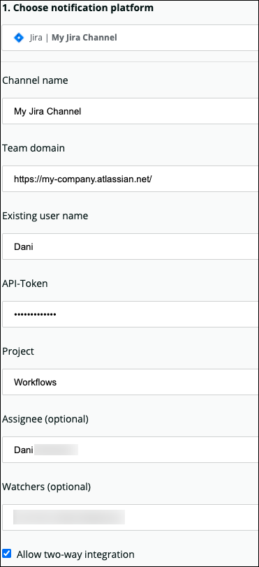

Incident Workflows (or "workflows") is a flexible notification system that works within Applied Intelligence to enhance and enrich alert notifications. Incident Workflows uses a friendly user interface to build rich notification message templates and customize how, when, and where they’re sent.

<Callout variant="tip">
  To use Incident Workflows and Applied Intelligence, as well as the rest of our [observability platform](https://one.newrelic.com), join the New Relic family! [Sign up](https://newrelic.com/signup) to create your free account in only a few seconds. Then ingest up to 100GB of data for free each month. Forever.
</Callout>

## Why it matters

Incident Workflows sends alert events to many destinations in any format, enriched with additional context.

The destinations include various notification platforms, like webhooks and Jira. Before being sent to a destination, a notification is enriched with extra information, including from the New Relic database (NRDB). Not only that, workflows creates a two-way connection between your notification platforms and New Relic. All of your alert policies can be grouped into a single incident workflow.

<Callout variant="tip">
  Incident Workflows is currently in BETA. If you haven't signed up yet, go to [one.newrelic.com > **Alerts & AI**](https://one.newrelic.com/launcher/nrai.launcher?pane=eyJuZXJkbGV0SWQiOiJucmFpLm5yYWktaG9tZSIsIm5hdiI6IkhvbWUifQ==&sidebars[0]=eyJuZXJkbGV0SWQiOiJucmFpLm5hdmlnYXRpb24tYmFyIiwibmF2IjoiSG9tZSJ9c-ai/one.newrelic.com) and click **Incident Workflows Request access**.
</Callout>

## How it works

Workflows are a collection of triggers and actions for alerts incidents. A workflow is a set of instructions that defines enriched notification templates, chooses triggers, and connects to multiple notification platforms:

* A notification template maps the workflows fields to your notification platform.
* Triggers are alerts policies that start workflow processes.
* Actions are operations that execute when workflows trigger. Actions include enriching a notification with extra information or configuring your notification platform to define the notification message format.

Each workflow has a single account and uses that account’s conditions for its triggers.

## When notifications are sent [#notifications-sent]

Workflows uses the same incidents you defined in your [alert policies](/docs/alerts-applied-intelligence/new-relic-alerts/alert-policies/create-edit-or-find-alert-policy).

In alert policies, [incident preferences](/docs/alerts/new-relic-alerts/configuring-alert-policies/specify-when-new-relic-creates-incidents) define how incidents and notifications are created when conditions in the policy are violated.

## Create or edit a workflow [#create-edit-workflow]

From [one.newrelic.com](https://one.newrelic.com/), click **Alerts & AI**. In the left pane, click **Incident Workflows** to open the workflows dashboard.

Use the workflows dashboard to create, edit, enable, or disable your workflows. Here’s a basic overview:

1. [Add and name the workflow](#add-workflow).
2. [Select triggers](#select-triggers).
3. [Enrich your notifications with NRQL](#add-nrql-enrich-notifications).
4. [Create notification actions](#create-notification-actions).
5. [Test your workflow](#test-workflow).
6. [Activate your workflow](#activate-workflow).

## Step 1. Add and name a workflow [#add-workflow]

When you add a workflow, give it a unique, descriptive name that will help you remember its purpose later.

## Step 2. Select your triggers [#select-triggers]

An alerts condition defines a violation. Violations are workflow triggers. These violations are either Warning or Critical thresholds defined in the Alert policy.

<Callout variant="tip">
  Each workflow must have at least one trigger. If you select more than one, only one of them needs to be true to trigger the actions that follow.
</Callout>

## Step 3. Optional: Add NRQL query data to enrich your notifications [#add-nrql-enrich-notifications]

After you select triggers, enrich your notification data with NRQL queries.

The workflows enrich tool is similar to the [query builder](/docs/query-your-data/explore-query-data/query-builder/introduction-query-builder).

The NRQL query's results are included in the notification message.

If you create queries for your workflows, they run in real time.

You can save any valid (error free) query into your workflow, even if they return an empty result. You can also query with violation-specific variables; for example `{{entity.id}}`.


<figcaption>
  An example of a NRQL query you might use to enrich your workflow.
</figcaption>

### NRQL query enrichment examples [#examples]

Here are some examples of how to set up enrichment queries.

<CollapserGroup>
  <Collapser
    id="synthetic-monitoring"
    title="Check overall Synthetic monitoring health"
  >
    If you're using Synthetic monitoring to measure your website, you can define the number of unsuccessful health checks that will trigger a violation.

    This query lets your site reliability team track your unsuccessful health checks.

    ```
    SELECT count(*) FROM SyntheticCheck WHERE result != 'SUCCESS' since since 10 minutes FACET monitorName
    ```
  </Collapser>

  <Collapser
    id="application-traffic"
    title="Know when violation-related traffic for an application drops"
  >
    This query tracks the number of transactions on the entity with a condition violation, using the custom variable `entity.name`:

    ```
    SELECT count(*) FROM Transaction WHERE appName = '{{entity.name}}' since 10 minutes ago
    ```

    This query tracks the latest HTTP status code response, filtered by the entity that violated the condition’s threshold:

    ```
    From Transaction select latest(httpResponsepre), average(duration) where appName = '{{entity.name}}'
    ```

    This query gets the number and ingest time by product running within a Kubernetes pod so you can find a potential remedy:

    ```
    SELECT uniqueCount(displayName), sum(nr.ingestTimeMs) from K8sServiceSample where entityName = '{{entity.name}}' since 1 hour ago
    ```
  </Collapser>

  <Collapser
    id="custom-variables"
    title="Add custom variables to your query"
  >
    Custom variables are properties you can add to violations when you configure a workflow action. You can get information about the alert, such as condition, violation, and entity, using double curly brackets: `{{variable_name}}`.

    To get information about the entity that violated a condition, you can use custom variables as part of the WHERE statement of the query. For example, here's a query using an `entity.name` variable to get the state of an Amazon EC2 instance:

    ```
    SELECT latest(ec2State) FROM ComputeSample where provider = 'Ec2Instance' where entityName = '{{entity.name}}'
    ```

    This query has a single value result (stopped) because it only selects a single field. The `entity.name` is the entity identifier. You can also use `entity.id` and any other entity properties like this.
  </Collapser>
</CollapserGroup>

## Step 4. Create notification actions [#create-notification-actions]

You can use the monitoring platforms ServiceNow, Atlassian Jira Cloud, and AWS EventBridge with workflows. You can also configure a webhook to other destinations.

Every workflow requires at least one notification action. To create an action:

1. Configure the notifier
2. Build the message
3. Test the notifier

### Configure the notifier [#notifier]

To configure your notifier, choose a notification platform, and then configure its destination fields.

1. Click **Add an action**, and then under **Notify your channels**, click **Add**.
2. Choose your notification platform.
3. Complete the destination fields based on your notification platform.

To acknowledge and close an alerts incident with Jira or ServiceNow, check **Allow two-way integration**. For example configurations, see [Jira](#jira) and [ServiceNow](#servicenow).

### Configure your notification message [#notification]

The notification message is delivered to your notification platform. A notification message includes one or more key-value fields.

<Callout variant="tip">
  When using Jira and ServiceNow, you must map a workflows `field name` value to its corresponding field in your notification platform.
</Callout>

A field’s value can be any combination of the following:

* Free text
* Output enriched with NRQL queries results
* Output enriched with Custom variables

In each notifier, the payload is populated with your query results and some custom variables. You can remove those and add other custom variables, using the `#` sign.  
Type `#` to see a list of available outputs and custom variables.

You can also write the custom variables manually:

* `{{enricher_name.result}}` is replaced with its result.
* `{{variable_name}}` is replaced with the variable’s value.

Choose the variable name from a list of common fields or create a custom string.


<figcaption>
  ServiceNow notification message example
</figcaption>

### Optional: Test the notifier [#test-notifier]

Send a notification message to verify that you have a good connection to your platform.

A workflow test creates a ticket with placeholders for the final values. You get live results from the NRQL queries used to enrich the notifications, but N/A when referring to violations-related data. This is expected behavior.

Updated variables are rendered on your notification platform when a real violation triggers the workflow. These values are part of the violation event. If you use variables as part of the notification message, the variables value uses the variable name (for example, `entity.name`) as a placeholder.

If the notifier test fails, check the following:

* Make sure to use the proper domain, username, and password/token for your platform.
* Confirm your destination is live/awake.
* Make sure to use different names for your notifiers.

### Notifier configuration examples [#notifer-examples]

Here are some examples of specific notifier configurations.

<CollapserGroup>
  <Collapser
    id="jira"
    title="Atlassian Jira notifier"
  >
    Using Jira as a notifier enables you to push valuable violation data into a new Jira Cloud ticket.

    With two-way integration you can also make sure that state-updates are mirrored back to New Relic.

    Atlassian Jira notifiers need:

    * Notifier name
    * Jira endpoint
    * Jira API key
    * A user with write permission
    * Optional: Assignee and watchers for the ticket
    * A notification message where every field name of the message has a corresponding field name in the project schema (text field or multi-line text field)

    

    <figcaption>
      An example Jira configuration with two-way notification enabled.
    </figcaption>
  </Collapser>

  <Collapser
    id="eventbridge"
    title="AWS EventBridge notifier"
  >
    Use workflows to hook New Relic events into AWS services with [EventBridge](https://docs.aws.amazon.com/eventbridge/latest/userguide/what-is-amazon-eventbridge.html), Amazon's serverless event bus. Then use EventBridge to deliver notification messages to route data to targets like AWS Lambda, SNS queues, CloudWatch logs, etc.

    Configure an EventBridge integration:

    1. Complete the AWS account ID, the AWS region, the name of the event bus, and the notification message (JSON).
    2. Send a test notification, which creates a partner event source in your EventBridge service page.
    3. On Partner event sources, select Associate with event bus.

    

    <figcaption>
      The Associate with event bus button.
    </figcaption>

    1. Set an event rule to forward the events to whatever AWS service you need:
       * Select the custom or partner event bus option, and then select the name of the event bus.
       * Choose an AWS service to run when triggered by a workflow.
  </Collapser>

  <Collapser
    id="servicenow"
    title="ServiceNow notifier"
  >
    Using ServiceNow as a notifier enables you to push valuable violation data into a new ServiceNow Incidents tickets.

    With two-way integrations, you can also make sure that status updates are mirrored back to New Relic.

    ServiceNow notifier needs:

    * Notifier name
    * ServiceNow endpoint
    * A user with write permission
    * A workflow notification where every field name has a matching field name in the ServiceNow incident table

    

    <figcaption>
      A comprehensive example of a ServiceNow notification message configuration.
    </figcaption>

    Here's what that configuration would look like in ServiceNow:

    

    <figcaption>
      ServiceNow ticket created when testing the above example (populated with text placeholders when testing)
    </figcaption>

    Here are some notes about this example:

    * We used ServiceNow’s default field incident configuration, you or your company may have configured additional fields and values.
    * Default configurations:
      * Severity, Impact, Urgency are numeric values 1/2/3 that correspond with High/Medium/Low.
      * State field: new, in progress, on hold, resolved, closed, canceled.
      * The Category and Subcategory fields are text fields with a limited value set. See [ServiceNow](https://docs.servicenow.com/bundle/orlando-it-service-management/page/product/incident-management/reference/r_CategorizingIncidents.html) for more detail.
    * Description, Short-Description, and Work_notes are free text fields and can be enriched as part of the notification message

    ### ServiceNow two-way integration

    You can configure a two-way integration with ServiceNow incidents so that when state updates for the incident (resolved or closed), it triggers an update in the corresponding New Relic alerts incident state.

    To enable auto-sync between the ServiceNow incident state and a workflow incident:

    

    <figcaption>
      When you enable two-way integration, changes to ServiceNow incidents will update Alerts' incident state.
    </figcaption>

    1. Check Allow two-way integration when you create the Notifier.
    2. Open and download this [XML file](https://storage.cloud.google.com/newrelic-connect/workflows-proxy-production.xml) (which includes the business rule for Incident Workflows).
    3. In the ServiceNow sidebar menu, go to System Definition > Business Rule.
    4. Click the menu icon in one of the column headers, select Import XML, and upload the XML file you downloaded.

    After you enable the auto-sync process, an incident state in ServiceNow changes to Resolved or Closed, and the corresponding workflow incident changes to Closed. For any state other than New, the workflow incident state changes to Acknowledged.
  </Collapser>

  <Collapser
    id="webhook"
    title="Webhook notifier"
  >
    Use the webhook notifier to send notification messages to any endpoint. The webhook configuration requires:

    * A channel name
    * The endpoint of the target application
    * Authorization
    * Custom headers (if needed)
    * The notification message

    Make sure to use valid JSON payloads. As suggested above, type "#" to add variables to the payload.

    

    <figcaption>
      This is an example of a webhook configuration you might use.
    </figcaption>

    <CollapserGroup>
      <Collapser
        id="slack-webhook"
        title="Slack"
      >
        You can use a webhook to send workflows content to Slack.

        * Read Slack documentation on how to set up [incoming webhooks](https://slack.com/help/articles/115005265063-Incoming-webhooks-for-Slack).
        * You can send a basic webhook.

          ```
          {
              “text”: “The {{violation.id}}\n led to this result:{{enricher.result}} ”
              }
          ```
        * You can also send enriched webhooks.

          ```
          {
              "text": "Example for larger block example - for {{alert.id}}",
              "blocks": [
                  {
                      "type": "section",
                      "text": {
                          "type": "mrkdwn",
                          "text": "{{alert.description}} - {{alert.threshold}}"
                      }
                  },
                  {
                      "type": "section",
                      "block_id": "section567",
                      "text": {
                          "type": "mrkdwn",
                          "text": "<https: 72nfswczfve=youtu.be> \n :star: \n {{violation.threshold}}"
                              },
                      "accessory": {
                          "type": "image",
                          "image_url": "https://usercontent2.hubstatic.com/13785369.jpg",
                          "alt_text": "Troubled cat image, or a PNG image for your NRQL chart"
                      }
                  },
                  {
                      "type": "section",
                      "block_id": "section789",
                      "fields": [
                          {
                              "type": "mrkdwn",
                              "text": "*bolded text*"     
                          }
                      ]
                  }
              ]
          }
          ```
      </Collapser>

      <Collapser
        id="msteams-webhook"
        title="Microsoft Teams"
      >
        You can use a webhook to send workflows content to Microsoft Teams.

        * Read Microsoft documentation on how to [create an incoming webhook](https://docs.microsoft.com/en-us/microsoftteams/platform/webhooks-and-connectors/how-to/add-incoming-webhook).
        * Use your Microsoft Teams URL as the webhook domain name.
        * You can use this payload example JSON for testing.

          ```
          {
              "summary": "{{violation.title}} - New Relic Alert Test Policy",
              "themeColor": "0076D7",
              "@type": "MessageCard",
              "potentialAction": [
                  {
                      "@type": "openUri",
                      "name": "Go To Alert Details",
                      "targets": [
                          {
                              "os": "default",
                              "uri": "{{alert.link}}"
                          }
                      ]
                  },
                  {
                      "@type": "openUri",
                      "name": "Go To Condition (deep link)",
                      "targets": [
                          {
                              "os": "default",
                              "uri": "{{condition.deep_link_url}}"
                          }
                      ]
                  },
                  {
                      "@type": "openUri",
                      "name": "Go To Alert Condition (definition)",
                      "targets": [
                          {
                              "os": "default",
                              "uri": "{{alert.condition}}"
                          }
                      ]
                  },
                  {
                      "@type": "openUri",
                      "name": "Go To Violation Details",
                      "targets": [
                          {
                              "os": "default",
                              "uri": "{{violation.detail_url}}"
                          }
                      ]
                  },
                  {
                      "@type": "openUri",
                      "name": "Go To Runbook",
                      "targets": [
                          {
                              "os": "default",
                              "uri": "{{violation.runbook_url}}"
                          }
                      ]
                  },
                  {
                      "@type": "openUri",
                      "name": "Application Dashboard",
                      "targets": [
                          {
                              "os": "default",
                              "uri": "http://…"
                          }
                      ]
                  },
                  {
                      "@type": "ActionCard",
                      "name": "Add a comment",
                      "inputs": [
                          {
                              "@type": "TextInput", "id": "comment", "title": "Enter your comment",
                              "isMultiline": true
                          }
                      ],
                      "actions": [ { "@type": "HttpPOST",  "name": "OK",  "target": "http://…"  }  ]
                  }
              ],
              "@context": "http://schema.org/extensions",
              "sections": [
                  {
                      "activitySubtitle": "{{alert.message}}",
                      "activityTitle": "New Relic Alert: {{alert.description}}"
                  },
                  {
                      "images": [
                          {
                              "image": "https://embed-ssl.wistia.com/deliveries/7d647fc03b31bafcfe1e88146629c5d8379d76c5.png?image_resize=580x114%3E"
                          }
                      ]
                  },
                  {
                      "markdown": true,
                      "facts": [
                          {
                              "name": "Assigned to",
                              "value": "harry@potter.com"
                          },
                          {
                              "name": "Due date",
                              "value": "Mon May 01 2017 17:07:18 GMT-0700 (Pacific Daylight Time)"
                          },
                          {
                              "name": "Status",
                              "value": "Not started yet, but maybe later"
                          },
                          {
                              "name": "Severity",
                              "value": "1.1"
                          },
                          {
                              "name": "Account ID",
                              "value": "{{account.id}}"
                          },
                          {
                              "name": "alert.description",
                              "value": "{{alert.description}}"
                          },
                          {
                              "name": "alert.id",
                              "value": "{{alert.id}}"
                          },
                          {
                              "name": "alert.labels",
                              "value": "{{alert.labels}}"
                          },
                          {
                              "name": "alert.link",
                              "value": "{{alert.link}}"
                          },
                          {
                              "name": "alert.message",
                              "value": "{{alert.message}}"
                          },
                          {
                              "name": "alert.metric_name",
                              "value": "{{alert.metric_name}}"
                          },
                          {
                              "name": "alert.name",
                              "value": "{{alert.name}}"
                          },
                          {
                              "name": "alert.priority",
                              "value": "{{alert.priority}}"
                          },
                          {
                              "name": "alert.state",
                              "value": "{{alert.state}}"
                          },
                          {
                              "name": "alert.threshold",
                              "value": "{{alert.threshold}}"
                          },
                          {
                              "name": "condition.deep_link_url",
                              "value": "{{condition.deep_link_url}}"
                          },
                          {
                              "name": "condition.id",
                              "value": "{{condition.id}}"
                          },
                          {
                              "name": "condition.name",
                              "value": "{{condition.name}}"
                          },
                          {
                              "name": "entity.id",
                              "value": "{{entity.id}}"
                          },
                          {
                              "name": "entity.kind",
                              "value": "{{entity.kind}}"
                          },
                          {
                              "name": "entity.name",
                              "value": "{{entity.name}}"
                          },
                          {
                              "name": "entity.type",
                              "value": "{{entity.type}}"
                          },
                          {
                              "name": "evaluation.analyzer",
                              "value": "{{evaluation.analyzer}}"
                          },
                          {
                              "name": "evaluation.expected_groups",
                              "value": "{{evaluation.expected_groups}}"
                          },
                          {
                              "name": "evaluation.label",
                              "value": "{{evaluation.label}}"
                          },
                          {
                              "name": "evaluation.name",
                              "value": "{{evaluation.name}}"
                          },
                          {
                              "name": "evaluation.operator",
                              "value": "{{evaluation.operator}}"
                          },
                          {
                              "name": "evaluation.threshold",
                              "value": "{{evaluation.threshold}}"
                          },
                          {
                              "name": "evaluation.threshold_duration_seconds",
                              "value": "{{evaluation.threshold_duration_seconds}}"
                          },
                          {
                              "name": "evaluation.threshold_occurrences",
                              "value": "{{evaluation.threshold_occurrences}}"
                          },
                          {
                              "name": "evaluation.value_function",
                              "value": "{{evaluation.value_function}}"
                          },
                          {
                              "name": "evaluation.violate_on_overlap",
                              "value": "{{evaluation.violate_on_overlap}}"
                          },
                          {
                              "name": "health_check.id",
                              "value": "{{health_check.id}}"
                          },
                          {
                              "name": "health_check.name",
                              "value": "{{health_check.name}}"
                          },
                          {
                              "name": "host.id",
                              "value": "{{host.id}}"
                          },
                          {
                              "name": "host.name",
                              "value": "{{host.name}}"
                          },
                          {
                              "name": "nrql.event_type",
                              "value": "{{nrql.event_type}}"
                          },
                          {
                              "name": "policy.id",
                              "value": "{{policy.id}}"
                          },
                          {
                              "name": "policy.name",
                              "value": "{{policy.name}}"
                          },
                          {
                              "name": "product",
                              "value": "{{product}}"
                          },
                          {
                              "name": "signal.nrql.query",
                              "value": "{{signal.nrql.query}}"
                          },
                          {
                              "name": "signal.units",
                              "value": "{{signal.units}}"
                          },
                          {
                              "name": "source",
                              "value": "{{source}}"
                          },
                          {
                              "name": "system",
                              "value": "{{system}}"
                          },
                          {
                              "name": "templatized_title",
                              "value": "{{templatized_title}}"
                          },
                          {
                              "name": "violation.close_time",
                              "value": "{{violation.close_time}}"
                          },
                          {
                              "name": "violation.degradation_time",
                              "value": "{{violation.degradation_time}}"
                          },
                          {
                              "name": "violation.detail_url",
                              "value": "{{violation.detail_url}}"
                          },
                          {
                              "name": "violation.incident_key",
                              "value": "{{violation.incident_key}}"
                          },
                          {
                              "name": "violation.muted",
                              "value": "{{violation.muted}}"
                          },
                          {
                              "name": "violation.open_time",
                              "value": "{{violation.open_time}}"
                          },
                          {
                              "name": "violation.policy.id",
                              "value": "{{violation.policy.id}}"
                          },
                          {
                              "name": "violation.policy.name",
                              "value": "{{violation.policy.name}}"
                          },
                          {
                              "name": "violation.priority",
                              "value": "{{violation.priority}}"
                          },
                          {
                              "name": "violation.recovery_time",
                              "value": "{{violation.recovery_time}}"
                          },
                          {
                              "name": "violation.runbook_url",
                              "value": "{{violation.runbook_url}}"
                          },
                          {
                              "name": "violation.status",
                              "value": "{{violation.status}}"
                          },
                          {
                              "name": "violation.time_limit",
                              "value": "{{violation.time_limit}}"
                          },
                          {
                              "name": "violation.title",
                              "value": "{{violation.title}}"
                          },
                          {
                              "name": "violation.chart_url",
                              "value": "{{violation.chart_url}}"
                          {
                              "name": "label.owning_team",
                              "value": "{{label.owning_team}}"
                          },
                          {
                              "name": "label.product",
                              "value": "{{label.product}}"
                          },
                          {
                              "name": "label.service_name",
                              "value": "{{label.service_name}}"
                          },
                          {
                              "name": "tag.account",
                              "value": "{{tag.account}}"
                          },
                          {
                              "name": "tag.cluster_name",
                              "value": "{{tag.cluster_name}}"
                          },
                          {
                              "name": "tag.cluster_role",
                              "value": "{{tag.cluster_role}}"
                          },
                          {
                              "name": "tag.display_name",
                              "value": "{{tag.display_name}}"
                          },
                          {
                              "name": "tag.full_hostname",
                              "value": "{{tag.full_hostname}}"
                          },
                          {
                              "name": "tag.hostname",
                              "value": "{{tag.hostname}}"
                          },
                          {
                              "name": "aws.ec2.instance_type",
                              "value": "{{aws.ec2.instance_type}}"
                          },
                          {
                              "name": "enricher",
                              "value": "{{enricher-200716-1010.result}}"
                          }
                      ]
                  }
              ]
          }
          ```
      </Collapser>
    </CollapserGroup>
  </Collapser>
</CollapserGroup>

## Step 5. Optional: Test your workflow [#step-test-workflow]

When you test the workflow, it runs [NRQL queries](#add-nrql-enrich-notifications) to enrich your notifications and send test notification messages to your notification platforms.

If your workflow test fails, check the following:

* There's a unique name for your workflow and notifiers.
* The queries are valid (without error messages in the NRQL query).
* The notifiers passed their test.

## Step 6. Activate your workflow [#activate-workflow]

Make sure your workflow has at least one trigger and one notification channel, then save and activate the workflow.
