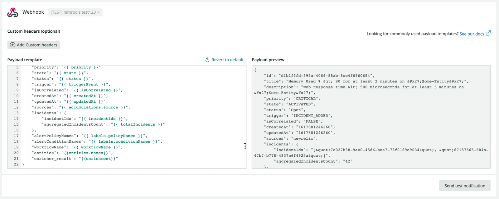

<Callout title="EOL NOTICE">
  We're discontinuing support for several capabilities in November 2021, including the Incident Workflows beta. For more details, including how you can easily prepare for this transition, see our [Explorers Hub post](https://discuss.newrelic.com/t/important-upcoming-changes-to-capabilities-and-support-across-node-agents-suggested-pagerduty-responders-incident-workflows-and-kubernetes-instrumentation/164481?u=dholloran).
</Callout>

With Workflows you control when and where you want to receive notifications about issues, tunnel the right information to the relevant person or team, and enrich your issue's notifications with additional New Relic data.

## What is an issue [#issue]
Issues are groups of incidents that describe the underlying problem of your symptoms. When a new incident is created, Incident Intelligence opens an issue and evaluates other open issues for correlations. For more information see [Use Incident Inteligence](/docs/alerts-applied-intelligence/applied-intelligence/incident-intelligence/use-incident-intelligence/).

## Add a Workflow [#add-workflow]

The Workflows feature is located under the Alerts & AI menu.

1. Go to [one.newrelic.com](one.newrelic.com), click **Alerts & AI**, in the left navigation under **Enrich and Notify** click **Workflow**, then click **Add a workflow**.

<Callout variant="tip">
The maximum workflows you can add per environment is 1000.
</Callout>

2. Name your workflow. This field is mandatory and needs to be unique.

3. Workflows filters the issues you want to send to the relevant destination. You can send all issues by selecting **Send all issues** or you can build a query to filter the right issues.

4. Build a query by selecting an attribute, operator and value/s to narrow down the right issues you want to be passed on.

5. Optional: Enriched Data (available to users with full license).

<CollapserGroup>
  <Collapser
    className="freq-link"
    id="enrich"
    title="Enrichments"
  >
- Enrichments can give additional context on alert notifications by adding NRQL query results to them
- The workflows enrich tool is similar to the query builder.
- The NRQL query's results are included in the notification message.
- If you create queries for your workflows, they run in real time and the query results are the value of the enricher.
- You can save any valid query into your workflow, even if they return an empty result, but you must run the query before saving the enrichment. You can also query with issue-specific variables; for example `{{entities.ids}}`
- Note: The query name needs to be unique because you will use the name to decide how to include the result in the payload of the notification that will be sent by the workflow.

<Callout variant="important">
  At this stage, visual representation of enrichments are sent to Slack and email. Servicenow and JIRA destinations are limited to NRDB queries with single value results (for example: `count`, `min`, `max`, etc.).

  The maximum number of enrichments per workflow is 5. The maximum number of variables an enrichment can contain is 1.
</Callout>
</Collapser>

<Collapser
        className="freq-link"
        id="notif"
        title="Notifier"
    >

 6. Notify -  Choose one or more destinations and add an optional message
 
- In order to save and activate a Workflow you need to include a notifier.
- Setting up a notifier requires having a notification destination configured. 
- You can either set it up through the **Destination** menu item, or through the **Create new destination item** in the destination selection drop down in each destination channel screen.        
- A notification destination includes the credentials required to send a notification to a third party platform and an option to customize the message sent by mapping fields from our issues to fields in the destination platform.
- To learn how to set up destinations and configure message templates, [check the documentation on notifications](/docs/alerts-applied-intelligence/notifications/destinations/).
</Collapser>
</CollapserGroup>

7. Click “update message” once completing the notifier requirements
8. Optional : Test your workflow 
- We'll use existing data from your account to test what you've configured and send a sample notification
9. Complete the workflow by clicking **activate**. 

<Callout variant="tip">
In any destination channel, start typing and a variable menu will open up. You will see the names of the variables, that at runtime will be replaced with the variable’s value/s. In order to use the enrichers’ results use their name.
</Callout>

## Variables

To get information about the entity that violated a condition, you can use variables as part of the `where` statement of the query. 

For example, to get a list of error logs for a specific issue use:

```
FROM log SELECT * where service.name = {{ entities.names }} AND level = ‘error’ LIMIT 10
```

This query returns the last 10 error logs for each notification sent for the entities that are associated with the issue. This would give you additional context as to what may have gone wrong and likely help you solve the issue faster. You can use any other entity properties in the same way.



<figcaption>An example of how to populate the field</figcaption>

<Callout variant="important">
Note: In order to attain the value in the JSON format, you must specify the word JSON. Otherwise, you will get a comma delimited list (for example, `{{ json entities.Ids}}` ).  
</Callout>

For more variable options to find additional context, a comprehensive list of variables can be found here:

<table>
<thead>
<tr>
    <th style={{ width: "200px" }}>
    Key
    </th>
    <th>
Display Name (First word will be used for grouping)
    </th>
</tr>
</thead>
<tbody>

<tr>
    <td>accumulations.conditionName</td>
    <td>IAlert Condition Names</td>
</tr>
<tr>
    <td>accumulations.origin</td>
    <td>Issue Origin</td>
</tr>
<tr>
    <td>accumulations.policyName</td>
    <td>Alert Policy Names</td>
</tr>
<tr>
    <td>accumulations.source</td>
    <td>Issue Source</td>
</tr>

<tr>
    <td>activatedAt</td>
    <td>Issue Activated At</td>
</tr>

<tr>
    <td>dataMLModules.components</td>
    <td>Machine Learning Components</td>
</tr>

<tr>
    <td>dataMLModules.suggestedResponders</td>
    <td>Machine Learning Suggested Responder</td>
</tr>

<tr>
    <td>dataMLModules.goldenSignals</td>
    <td>Machine Learning Golden Signals</td>
</tr>

<tr>
    <td>annotations.description</td>
    <td>Issue Description</td>
</tr>

<tr>
    <td>annotations.title</td>
    <td>Issue Title</td>
</tr>

<tr>
    <td>closedAt</td>
    <td>Issue ClosedAt</td>
</tr>

<tr>
    <td>createdAt</td>
    <td>Issue CreatedAt</td>
</tr>

<tr>
    <td>entities.ids</td>
    <td>Impacted Entities IDs</td>
</tr>

<tr>
    <td>entities.types</td>
    <td>Impacted Entities Types</td>
</tr>

<tr>
    <td>entities.names</td>
    <td>Impacted Entities Names</td>
</tr>

<tr>
    <td>entities.kinds</td>
    <td>Impacted Entities Kinds</td>
</tr>

<tr>
    <td>incidentIds</td>
    <td>Incident IDs</td>
</tr>

<tr>
    <td>isCorrelated</td>
    <td>Issue Is Correlated</td>
</tr>

<tr>
    <td>issueId</td>
    <td>Issue ID</td>
</tr>
  
<tr>
    <td>issue.pageUrl</td>
    <td>Issue Page URL</td>
</tr>

<tr>
    <td>labels.accountIds</td>
    <td>Issue Environment Associated Account ID</td>
</tr>

<tr>
    <td>labels.aggregationKeys</td>
    <td>Labels Alerts Aggregation Key</td>
</tr>

<tr>
    <td>labels.conditionNames</td>
    <td>Labels Alert Condition Names</td>
</tr>

<tr>
    <td>labels.originalAccountIds</td>
    <td>Labels Account IDs</td>
</tr>

<tr>
    <td>labels.policyIds</td>
    <td>Labels Alert Policy IDs</td>
</tr>

<tr>
    <td>labels.policyNames</td>
    <td>Labels Alert Policy Names</td>
</tr>

<tr>
    <td>priority</td>
    <td>Issue Priority</td>
</tr>

<tr>
    <td>state</td>
    <td>Issue State</td>
</tr>

<tr>
    <td>status</td>
    <td>Issue Status</td>
</tr>

<tr>
    <td>totalIncidents</td>
    <td>Incident Count</td>
</tr>

<tr>
    <td>triggerEvent</td>
    <td>Issue Notification Trigger Event</td>
</tr>

<tr>
    <td>triggeredAt</td>
    <td>Issue Triggered At</td>
</tr>

<tr>
    <td>updatedAt</td>
    <td>Issue Updated At</td>
</tr>

<tr>
    <td>workflowName</td>
    <td>Workflow Name</td>
</tr>

</tbody>
</table>


