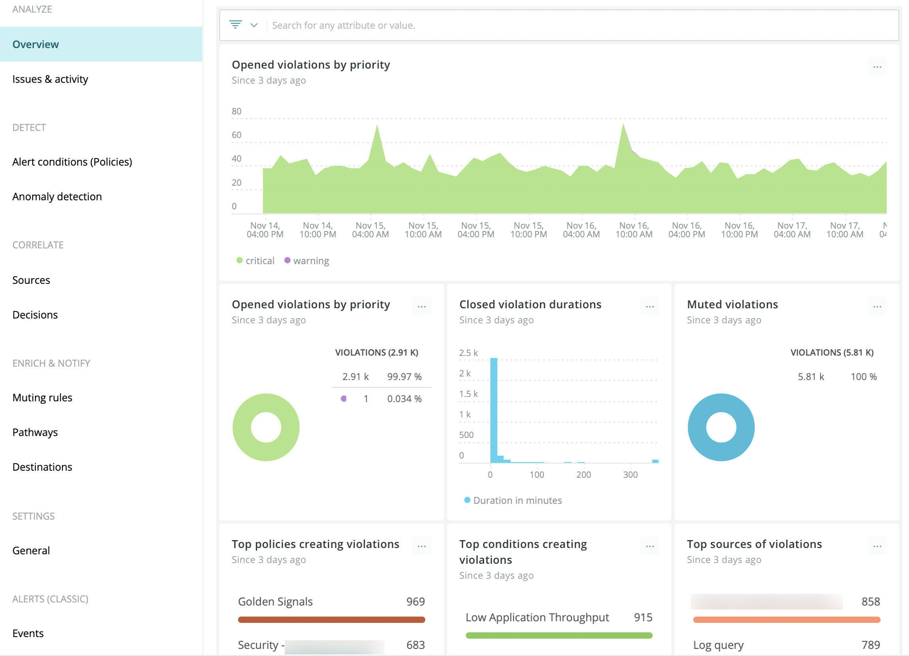

<LandingPageHero>
  <HeroContent>
    Together, New Relic Alerts and Applied Intelligence form a flexible and centralized notification system that unlocks the operational potential of New Relic. Alerts is a single tool to manage alert policies and alert conditions, letting you focus on the metrics you care about most.

    Applied Intelligence helps you find, troubleshoot, and resolve problems faster. Specifically, it's a hybrid machine learning engine that reduces alert noise, correlates incidents, automatically detects anomalies, and provides root cause analysis.
  
    <ButtonGroup>
    <ButtonLink
    role="button"
    to="https://newrelic.com/signup"
    variant="primary"
    >
    Sign up for free
    </ButtonLink>
    </ButtonGroup>
    No credit card required. Already have an account? [Login](http://one.newrelic.com/).
  </HeroContent>

  

  

  <figcaption>
    **[one.newrelic.com](https://one.newrelic.com) > Alerts & AI: You can use the overview summary page to quickly review your violations, issues, and incidents.**
  </figcaption>
</LandingPageHero>

<LandingPageTileGrid>
  <LandingPageTile
    title="Learn about alerting in New Relic."
    href="/docs/alerts/new-relic-alerts/getting-started/alerting-new-relic"
    icon="fe-zap"
  >
     Understand the fundamental principles of policies, conditions, thresholds, notification channels, and events.
  </LandingPageTile>

  <LandingPageTile
    title="Follow alert policy workflow."
    href="/docs/alerts/new-relic-alerts/configuring-alert-policies/alert-policy-workflow"
    icon="fe-move-horizontal"
  >
     Learn the basic process for creating an alert policy for New Relic products.
  </LandingPageTile>

  <LandingPageTile
    title="Define alert conditions."
    href="/docs/alerts/new-relic-alerts/configuring-alert-policies/define-alert-conditions"
    icon="fe-sliders"
  >
     Set the necessary criteria for New Relic Alerts to create an incident. Or, use the [REST API](/docs/alerts/new-relic-alerts/rest-api-alerts).
  </LandingPageTile>

  <LandingPageTile
    title="Create notification channels."
    href="/docs/alerts/new-relic-alerts/managing-notification-channels/notification-channels-controlling-where-send-alerts"
    icon="fe-message-circle"
  >
     Specify how to get notified when critical violations occur, so you can quickly fix the issue.
  </LandingPageTile>

  <LandingPageTile
    title="Learn about AI."
    href="/docs/alerts-applied-intelligence/new-relic-alerts/get-started/introduction-applied-intelligence"
    icon="fe-alert-triangle"
  >

    Take advantage of automatically enabled [Proactive Detection](/docs/alerts-applied-intelligence/applied-intelligence/proactive-detection/proactive-detection-new-relic-ai) to be warned about trouble brewing in your APM-monitored apps. Group similar incidents with [Incident intelligence](/docs/alerts-applied-intelligence/incident-intelligence/get-started-incident-intelligence). [Incident workflows](/docs/alerts-applied-intelligence/applied-intelligence/incident-workflows/enhance-notifications-incident-workflows) enrich your notifications with New Relic data.
  </LandingPageTile>

  <LandingPageTile
    title="Resolve an issue."
    href="/docs/alerts/new-relic-alerts/reviewing-alert-incidents"
    icon="fe-tool"
  >
     [Acknowledge an incident](/docs/alerts/new-relic-alerts/reviewing-alert-incidents/acknowledge-alert-incidents) after it occurs, or [close a violation manually](/docs/alerts/new-relic-alerts/reviewing-alert-incidents/close-violations-manually) as needed.
  </LandingPageTile>
</LandingPageTileGrid>

<ButtonLink
  role="button"
  to="/docs/alerts-applied-intelligence/table-of-contents"
  variant="primary"
>
  View all Alerts and AI docs
</ButtonLink>
