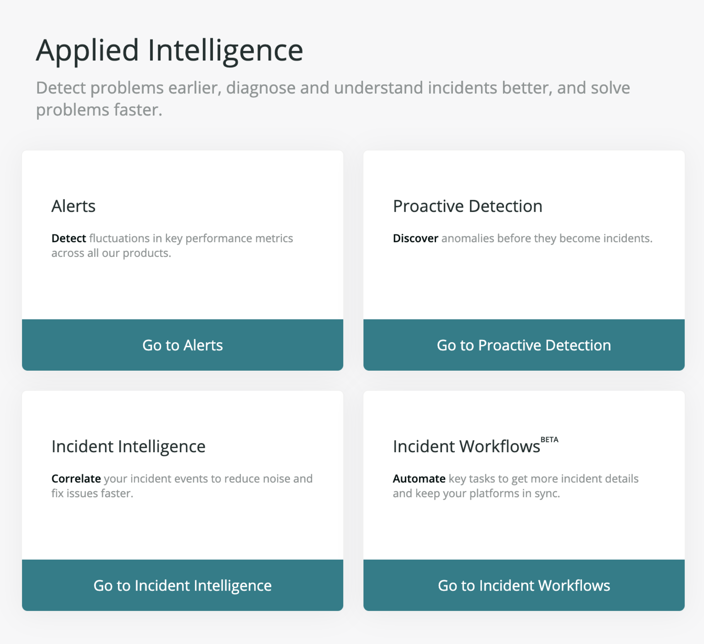

import { Link } from 'gatsby'

Together, New Relic Alerts and Applied intelligence form a flexible and centralized notification system that unlocks the operational potential of New Relic. Alerts is a single tool to manage alert policies and alert conditions, letting you focus on the metrics you care about most.

Applied intelligence helps you find, troubleshoot, and resolve problems faster. Specifically, it's a hybrid machine learning engine that reduces alert noise, correlates incidents, and automatically detects anomalies.

**[one.newrelic.com](https://one.newrelic.com) > Alerts & AI: See all of the Alerts and Applied intelligence tools in one place.**

<LandingPageTileGrid>
  <LandingPageTile
    title="Learn about alerting in New Relic."
    href="/docs/alerts/new-relic-alerts/getting-started/alerting-new-relic"
    icon="zap"
  >
     Understand the fundamental principles of policies, conditions, thresholds, notification channels, and events.
  </LandingPageTile>

  <LandingPageTile
    title="Follow alert policy workflow."
    href="/docs/alerts/new-relic-alerts/configuring-alert-policies/alert-policy-workflow"
    icon="move-horizontal"
  >
     Learn the basic process for creating an alert policy for New Relic products.
  </LandingPageTile>

  <LandingPageTile
    title="Define alert conditions."
    href="/docs/alerts/new-relic-alerts/configuring-alert-policies/define-alert-conditions"
    icon="sliders"
  >
     Set the necessary criteria for New Relic Alerts to create an incident. Or, use the [REST API](/docs/alerts/new-relic-alerts/rest-api-alerts).
  </LandingPageTile>

  <LandingPageTile
    title="Create notification channels."
    href="/docs/alerts/new-relic-alerts/managing-notification-channels/notification-channels-controlling-where-send-alerts"
    icon="message-circle"
  >
     Specify how to get notified when critical violations occur, so you can quickly fix the issue.
  </LandingPageTile>

  <LandingPageTile
    title="Learn about AI."
    href="/docs/alerts/new-relic-alerts/reviewing-alert-incidents"
    icon="alert-triangle"
  >

    Use [Proactive detection](/docs/alerts-applied-intelligence/applied-intelligence/proactive-detection/proactive-detection-new-relic-ai) to be warned when trouble is brewing. Group similar incidents with [Incident intelligence](/docs/alerts-applied-intelligence/incident-intelligence/get-started-incident-intelligence). [Incident workflows](/docs/alerts-applied-intelligence/applied-intelligence/incident-workflows/enhance-notifications-incident-workflows) will enrich your notifications with New Relic data.
  </LandingPageTile>

  <LandingPageTile
    title="Resolve an issue."
    href="/docs/alerts/new-relic-alerts/reviewing-alert-incidents"
    icon="tool"
  >
     [Acknowledge an incident](/docs/alerts/new-relic-alerts/reviewing-alert-incidents/acknowledge-alert-incidents) after it occurs, or [close a violation manually](/docs/alerts/new-relic-alerts/reviewing-alert-incidents/close-violations-manually) as needed.
  </LandingPageTile>
</LandingPageTileGrid>

<Button
  role="button"
  as={Link}
  to="/docs/alerts?toc=true"
  variant="primary"
>
  View all Alerts and AI docs
</Button>
