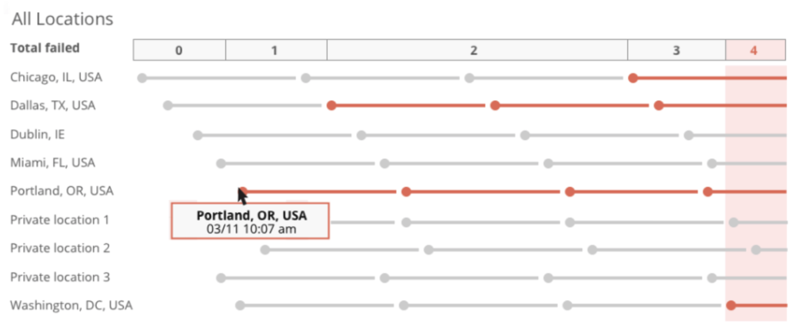

With multi-location Synthetic monitoring alert conditions, you can create a monitor to notify you when a specific number of locations are failing at the same time.

## Why this matters [#feature]

For [Synthetic monitoring](/docs/synthetics/new-relic-synthetics/getting-started/introduction-new-relic-synthetics) that runs in multiple [locations](/docs/synthetics/new-relic-synthetics/using-monitors/add-edit-monitors#setting-location), a single location will sometimes temporarily fail for a wide variety of reasons. In many cases, a single, short-lived failure does not indicate a problem that would require a notification.

With multi-location conditions, you can set the number of locations that must simultaneous fail in order to trigger a violation and send you a notification. For example, if your monitor is running in six locations, you might set a condition requiring four locations to fail before you receive a notification.

<Callout variant="important">
  Multi-location alerts do **not** affect Alerts policies for a Synthetic monitor. For example, [muting a Multi-location alert](/docs/alerts-applied-intelligence/new-relic-alerts/alert-notifications/muting-rules-suppress-notifications) will **not** mute a [Synthetic monitor's alerts.](/docs/synthetics/synthetic-monitoring/using-monitors/alerts-synthetic-monitoring#alerts-existing-monitor)
</Callout>

## Rules

Rules for [creating a multi-location condition](#):

<table>
  <thead>
    <tr>
      <th style={{ width: "250px" }}>
        Rule
      </th>

      <th>
        Details
      </th>
    </tr>
  </thead>

  <tbody>
    <tr>
      <td>
        Required check frequency
      </td>

      <td>
        15 minutes or less.
      </td>
    </tr>

    <tr>
      <td>
        Maximum monitors per condition
      </td>

      <td>
        50
      </td>
    </tr>

    <tr>
      <td>
        Conditions per account
      </td>

      <td>
        This feature has a limit of 1000 conditions per account, but some types of Infrastructure alert conditions also count towards this limit. If you get a notification that you've exceeded your limit, contact your account representative or [Support](https://support.newrelic.com/) for assistance.
      </td>
    </tr>

    <tr>
      <td>
        Status between checks
      </td>

      <td>
        A failed location check will be considered failed until it performs a successful check. For example: a location may fail and then immediately become available, but we'll consider it failed until a scheduled check is reported as successful.
      </td>
    </tr>
  </tbody>
</table>

Here's a diagram that shows how a four-location condition will be triggered for non-simultaneous failures:

<figcaption>
  This diagram shows an example of how a four-failed-locations setting will trigger a violation for failures that occur one after the other. Note that failed location checks will be viewed as failed until they next have a successful check.
</figcaption>

## Create condition from Alerts UI [#create]

Before creating a condition, read the [rules for multi-location conditions](#rules).

1. In the **[one.newrelic.com](https://one.newrelic.com/ "Link opens in a new window.")** top nav, click **Alerts & AI**, click **Alert policies**, and start the process to [create a condition](/docs/alerts/new-relic-alerts/defining-conditions/define-alert-conditions#create-condition).
2. Click **Synthetics**, then click **Multiple location failures**.

<Callout variant="important">
  You can't view or edit multi-location Synthetic monitoring alert conditions in the [Synthetics UI](/docs/synthetics/new-relic-synthetics/pages/view-monitors-alert-information).
</Callout>

## Create condition with the API [#api]

Before creating a condition, read the [rules for multi-location conditions](#rules).

To use the Alerts REST API to manage multi-location conditions, use the [REST API explorer](https://rpm.newrelic.com/api/explore/alerts_location_failure_conditions/create).
