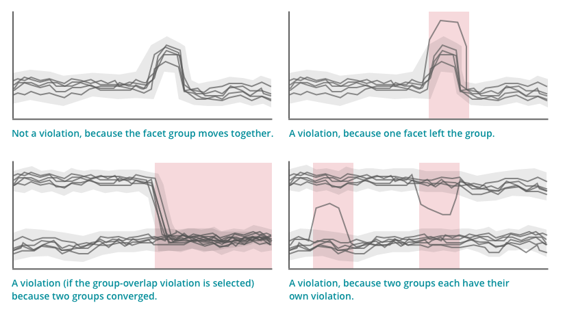

[Alerts](/docs/alerts/new-relic-alerts/getting-started/introduction-new-relic-alerts) offers [NRQL conditions](/docs/alerts/new-relic-alerts/defining-conditions/create-alert-conditions-nrql-queries) in three [threshold types](/docs/alerts/new-relic-alerts/defining-conditions/create-alert-conditions-nrql-queries#threshold-types): static, baseline, and outlier. This document explains how the outlier threshold type works, gives some [example use cases and NRQL queries](#example-use-cases), and explains how to [create an outlier condition](#create).

<Callout variant="important">
  NRQL alerts do **not** affect Alerts policies for a Synthetic monitor. For example, [muting a NRQL alert](/docs/alerts-applied-intelligence/new-relic-alerts/alert-notifications/muting-rules-suppress-notifications) will **not** mute a [Synthetic monitor's alerts.](/docs/synthetics/synthetic-monitoring/using-monitors/alerts-synthetic-monitoring#alerts-existing-monitor)
</Callout>

## What is outlier detection? [#feature]

In software development and operations, it is common to have a group consisting of members you expect to behave approximately the same. For example: for servers using a load balancer, the traffic to the servers may go up or down, but the traffic for all the servers should remain in a fairly tight grouping. See outlier detection in action in this NerdBytes video (2:51 minutes).

<Video id="_Hh7HZViJW8" type="youtube" />

The NRQL alert outlier detection feature parses the data returned by your [faceted NRQL query](/docs/insights/nrql-new-relic-query-language/nrql-resources/nrql-syntax-components-functions#sel-facet) and:

* Looks for the number of expected groups that you specify
* Looks for outliers (values deviating from a group) based on the sensitivity and time range you set

Additionally, for queries that have more than one group, you can choose to be notified when groups start behaving the same.



<figcaption>
  This visual aid will help you understand the types of situations that will trigger a violation and those that won't.
</figcaption>

For more on the rules and logic behind this calculation, see [Outlier detection rules](#rules-logic).

<Callout variant="tip">
  Note: this feature does not take into account the past behavior of the monitored values; it looks for outliers only in the currently reported data. For an alert type that takes into account past behavior, see [Baseline alerting](/docs/alerts/new-relic-alerts/defining-conditions/create-baseline-alert-conditions).
</Callout>

## Example use cases

These use cases will help you understand when to use the outlier threshold type. Note that the outlier feature requires a NRQL query with a [`FACET` clause](/docs/insights/nrql-new-relic-query-language/nrql-resources/nrql-syntax-components-functions#sel-facet).

<CollapserGroup>
  <Collapser
    id="load-balanced-servers-uneven"
    title="Notify if load-balanced servers have uneven workload"
  >
    A load balancer divides web traffic approximately evenly across five different servers. You can set a notification to be sent if any server starts getting significantly more or less traffic than the other servers.

    Example query:

    ```
    SELECT average(cpuPercent) FROM SystemSample WHERE apmApplicationNames = '<var>MY-APP-NAME</var>' FACET hostname
    ```
  </Collapser>

  <Collapser
    id="load-balanced-app-misbehaving"
    title="Notify if load-balanced application has misbehaving instances"
  >
    Application instances behind a load balancer should have similar throughput, error rates, and response times. If an instance is in a bad state, or a load balancer is misconfigured, this will not be the case. Detecting one or two bad app instances using aggregate metrics may be difficult if there is not a significant rise in the overall error rate of the application.

    You can set a notification for when an app instance’s throughput, error rate, or response time deviates too far from the rest of the group.

    Example query:

    ```
    SELECT average(duration) FROM Transaction WHERE appName = '<var>MY-APP-NAME</var>' FACET host
    ```
  </Collapser>

  <Collapser
    id="changes-environments"
    title="Notify of changes in different environments"
  >
    An application is deployed in two different environments, with ten application instances in each. One environment is experimental and gets more errors than the other. But the instances that are in the same environment should get approximately the same number of errors.

    You can set a notification for when an instance starts getting more errors than the other instances in the same environment. Also, you can set a notification for when the two environments start to have the same number of errors as each other.
  </Collapser>

  <Collapser
    id="timezone-related-changes"
    title="Notify for time zone-related changes"
  >
    The number of logged in users for a company is about the same for each of four applications, but varies significantly by each of the three time zones the company operates in.

    You can set a notification for when any application starts getting more or less traffic from a certain time zone than the other applications. Sometimes the traffic from the different time zones are the same, so you would set up the alert condition to not be notified if the time zone groups overlap.
  </Collapser>
</CollapserGroup>

For more details on how this feature works, see [Outlier rules and logic](#rules-logic).

## Create an outlier alert condition [#create]

To create a NRQL alert that uses outlier detection:

1. When creating a condition, under **Select a product**, select **NRQL**.
2. For **Threshold type**, select **Outlier**.
3. Create a [NRQL query](/docs/alerts/new-relic-alerts/defining-conditions/create-alert-conditions-nrql-queries#syntax) with a [`FACET` clause](/docs/insights/nrql-new-relic-query-language/nrql-resources/nrql-syntax-components-functions#sel-facet) that returns the values you want to alert on.
4. Depending on how the returned values group together, set the **Number of expected groups**.
5. Adjust the deviation from the center of the group(s) and the duration that will trigger a violation.
6. Optional: Add a [warning threshold](/docs/alerts/new-relic-alerts/defining-conditions/define-thresholds-trigger-alert#threshold-levels) and set its deviation.
7. Set any remaining available options and save.

## Rules and logic [#rules-logic]

Here are the rules and logic behind how outlier detection works:

<CollapserGroup>
  <Collapser
    id="alert-logic"
    title="Details about alert condition logic"
  >
    After the condition is created, the query is run once every [harvest cycle](/docs/using-new-relic/welcome-new-relic/getting-started/glossary#harvest-cycle) and the condition is applied. Unlike baseline alerts, outlier detection uses no historical data in its calculation; it's calculated using the currently collected data.

    Alerts will attempt to divide the data returned from the query into the number of groups selected during condition creation.

    For each group, the approximate average value is calculated. The allowable deviation you have chosen when creating the condition is centered around that average value. If a member of the group is outside the allowed deviation, it produces a violation.

    If **Trigger when groups overlap** has been selected, Alerts detects a convergence of groups. If the condition is looking for two or more groups, and the returned values cannot be separated into that number of distinct groups, then that will produce a violation. This type of “overlap” event is represented on a chart by group bands touching.

    Because this feature does not take past behavior into account, data is never considered to "belong" to a certain group. For example, a value that switches places with another value wouldn't trigger a violation. Additionally, an entire group that moves together also wouldn't trigger a violation.
  </Collapser>

  <Collapser
    id="nrql-query-rules"
    title="NRQL query rules and limits"
  >
    The NRQL query must be a [faceted query](/docs/insights/nrql-new-relic-query-language/nrql-resources/nrql-syntax-components-functions#sel-facet).

    The number of unique values returned must be 500 or less. If the query returns more than this number of values, the condition won't be created. If the query later returns more than this number after being created, the alert will fail.
  </Collapser>

  <Collapser
    id="unreturned-data"
    title="Zero values for unreturned data"
  >
    When a query returns a set of values, only values that are actually returned are taken into account. If a value is not available for calculation (including if it goes from being collected one harvest cycle to not being collected), it is rendered as a zero and is not considered. In other words, the behavior of unreturned zero values will never trigger violations.
  </Collapser>
</CollapserGroup>
