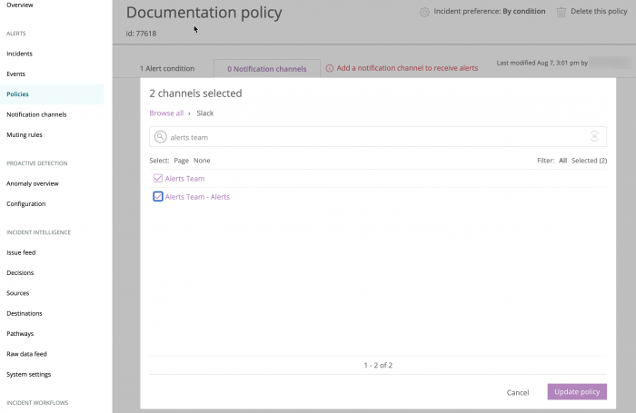

You can use targeted entities to monitor the types of data that matter most to your business. 

A targeted entity is a specific [entity](/docs/new-relic-one/use-new-relic-one/core-concepts/what-entity-new-relic/) you can create, view, and update. Learn more about these three options below.

<Callout variant = "tip">
  Before you get started, make sure you create an [alert condition](/docs/alerts-applied-intelligence/new-relic-alerts/alert-conditions/create-alert-conditions/) first.
</Callout>

## Add entities to a condition [#adding-targets]

For your convenience, the user interface organizes targeted entities into logical folders. You can use these folders to edit entities anytime. If applicable, the target folders reflect what your organization has defined for [labels and rollup categories](/docs/apm/new-relic-apm/maintenance/labels-categories-organizing-your-apps-servers).

<Callout variant="important">
  With the exception of [Infrastructure](/docs/infrastructure/new-relic-infrastructure/infrastructure-alert-conditions/infrastructure-alerts-add-edit-or-view-host-alert-information), there's a [limit](/docs/alerts/new-relic-alerts/configuring-alert-policies/minimum-maximum-values) to the number of entities you may add to a condition.
</Callout>

<figcaption>
  **Alerts & AI > Policies > (selected policy) > (selected condition) > Notification channels:** As part of the policy setup process, select one or more entities monitored by the selected product that will be the target entity for the condition.
</figcaption>

To identify which entities or components monitored by the selected product will be the targets for the selected condition:

1. In the **[one.newrelic.com](https://one.newrelic.com/ "Link opens in a new window.")** top nav, click **Alerts & AI**, click **Alert policies**, then **(select a policy)**.
2. In the conditions list, **(select a condition)**, then click **Notification channels**.
3. Click **Add notification channels**, and then choose your notification channels.
4. When you're done, click **Update policy**.

## Continue the condition setup process [#target-next-step]

After you select the targeted entities for the alert condition, select **Define thresholds** to specify the [thresholds for the condition](/docs/alerts/new-relic-alerts-beta/configuring-alert-policies/define-thresholds-trigger-alert).

## View existing targeted entities [#alert-target-view]

The policies index lists them in alphabetical order. To view or search for existing entities for an alert condition:

1. In the **[one.newrelic.com](https://one.newrelic.com/ "Link opens in a new window.")** top nav, click **Alerts & AI**, then click **Alert policies**
2. To select a policy name: Use the search box, sort any column, or scroll the list.
3. Optional: From the **Alert conditions** page, use the search box to locate a specific condition.
4. To view detailed information about entities associated with a condition, click **Notification channels**.

<Callout variant="tip">
  To view [policy and condition information for a specific entity](/docs/alerts/new-relic-alerts-beta/configuring-alert-policies/view-policy-conditions-new-relic-products), select the **Settings > Alert conditions** page from the entity's product UI.
</Callout>

## Update a condition's entities [#updating-targets]

To change the list of selected targeted entities for an existing condition:

1. In the **[one.newrelic.com](https://one.newrelic.com/ "Link opens in a new window.")** top nav, click **Alerts & AI**, click **Alert policies**, then **(select a policy)**.
2. From the list of existing conditions, select the entity name (for example, `My app - Production`) or number of entities (for example, `3 Targets`).
3. Click **Notification channels**.
4. In the channels list, click a channel to edit it.
5. Click the trashcan to delete a channel.
6. Click **Add notification channels** to add a new channel.