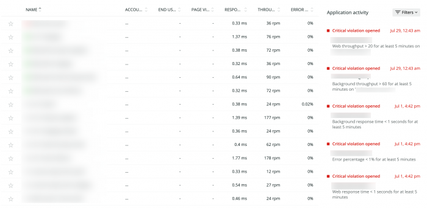
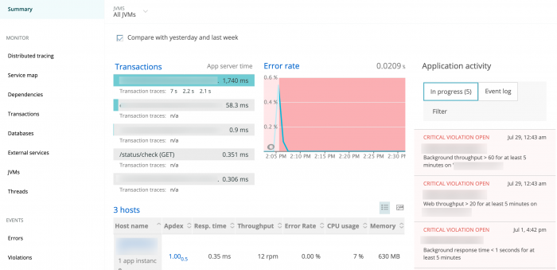

You can view [events](/docs/alerts/new-relic-alerts/getting-started/new-relic-alerts-concepts-workflow#terminology) and other activity for a specific entity from the New Relic One product index. For example, to find more information about a specific app in APM: Go to **[one.newrelic.com](https://one.newrelic.com)**, in the top nav click **APM**, then mouse over the listed apps, or select an event from the **Applications activity** list.

For instructions on how to view these details in Infrastructure, see the [Infrastructure](/docs/infrastructure/new-relic-infrastructure/infrastructure-alert-conditions/infrastructure-alerts-add-edit-or-view-host-alert-information#view-alerts) documentation.

## View health status from product entities (targets) [#health-status]

To view information about the current status for an entity (alert condition target):

1. From the menu bar, select the product (**APM**, **Browser**, etc.).
2. The right side of the screen shows all of the violations for the entities listed.

<figcaption>
  **[one.newrelic.com](https://one.newrelic.com/apm) > APM** : This example shows the violations for all of the APM applications for a specific account. The color-coded health states indicate Critical (red) conditions.
</figcaption>

## View events and activity lists from products [#products]

You can [view a list of events and other activity](/docs/apm/applications-menu/monitoring/viewing-your-applications-list) from the index for the selected product. By selecting an event from the list, you can go directly to the selected entity's **Summary** page, where you can view detailed information.

<figcaption>
  **[one.newrelic.com](https://one.newrelic.com)**: Here's an example of a Summary of **Application activity**. It includes errors and violations.
</figcaption>

Depending on the product, the recent events and activity list also may appear on the selected entity's **Overview** page.

<Callout variant="tip">
  **Exception:** The index for dashboards and Synthetic monitoring doesn't include a list of recent events and other activity.
</Callout>

## View event violations [#violations-dashboard]

To view an index of events resulting in condition violations across all available products: Go to **[one.newrelic.com](https://one.newrelic.com)**, in the top nav click **Alerts & AI**, click **Events**, then click **Violations**.

The **Violations** index provides summary information about alerting events across all products. From here, follow standard procedures to sort any column or select available links on any row to view drill-down details. For example:

* To view the **Overview** page for the entity associated with the violation (if available), select the **Target**.
* To view the condition that triggered the violation, select the **Condition**.
* To view incident details, select the **Incident ID**.

## View all event types [#events-dashboard]

To view an index of events for all available products: Go to **[one.newrelic.com](https://one.newrelic.com)**, in the top nav click **Alerts & AI**, click **Events**, then click **All events**.

The **All events** index provides summary information about alerting events across available products. From here, follow standard procedures to sort any column or select available links on any row to view drill-down details. For example:

* To view the **Overview** page for the entity associated with the violation, select its name from the **Description**.
* To view the condition that triggered the violation, select the condition's name from the **Description**.
* To view incident details, select the **Incident ID**.
