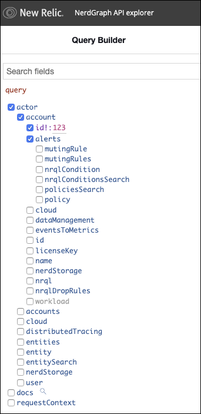
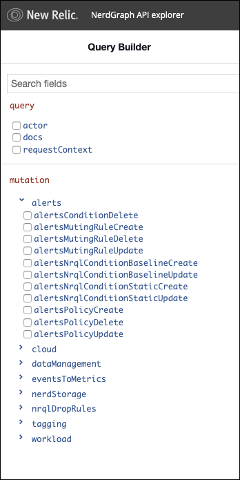

You can manage your policies, conditions, and muting rules programmatically using our [GraphQL NerdGraph API](/docs/apis/nerdgraph/get-started/introduction-new-relic-nerdgraph). This is a powerful alternative to managing them in New Relic One or through the [REST API](/docs/alerts/rest-api-alerts/new-relic-alerts-rest-api/rest-api-calls-new-relic-alerts).

## Alerts features you can manage with NerdGraph [#what-you-can-do]

Here's what you can do in NerdGraph:

* [Manage policies](/docs/alerts/alerts-nerdgraph/nerdgraph-examples/nerdgraph-api-alerts-policies)
* [Use NRQL conditions](/docs/alerts/alerts-nerdgraph/nerdgraph-examples/nerdgraph-api-alerts-nrql-conditions)
* [Add muting rules to suppress notifications](/docs/alerts/new-relic-alerts/managing-notification-channels/muting-rules-suppress-notifications)
* [Manage notification channels](/docs/alerts-applied-intelligence/new-relic-alerts/alerts-nerdgraph/nerdgraph-api-notification-channels/)
* [Customize loss of signal and gap filling](/docs/alerts-applied-intelligence/new-relic-alerts/alerts-nerdgraph/nerdgraph-api-loss-signal-gap-filling/)

The easiest way to discover alerts queries and mutations is through the NerdGraph API explorer.

## NerdGraph API explorer

Our [NerdGraph API explorer](https://api.newrelic.com/graphiql) is a GraphiQL editor where you can prototype queries and mutations. Here are some examples showing how to find fields for queries and mutations.

<Callout variant="tip">
  For general information about NerdGraph, see [Introduction to NerdGraph](/docs/apis/nerdgraph/get-started/introduction-new-relic-nerdgraph).
</Callout>

### Queries

To explore the various queries, look for the available queries under the `actor.account.alerts` namespace in NerdGraph API explorer:

### Mutations

To explore various mutations, look in the **alerts** dropdown in the NerdGraph API explorer:

