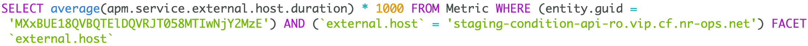

There are various ways to create alert conditions for New Relic APM and browser monitoring metrics, but we recommend using NRQL. Using a NRQL alert condition provides additional controls, improved detection time, and consistency across all data types.

In 2021, we made it easier to create NRQL alert conditions from charts and queries throughout New Relic One. See below an example of how to create an APM external service condition using NRQL.

Setting up an APM or browser monitoring metric alert condition is a two-part process: First, you need to identify the entity, then you create the NRQL condition.

## APM condition example

Here's a procedure showing how you might set up a condition for an APM-monitored app. 

### First: identify the entity [#identity-entity]

First, you'll identify the entity for which you'll set the alert condition:

1. Go to [one.newrelic.com](https://one.newrelic.com), and click **APM** in the toolbar.
2. Find the service you’d like to alert on.
3. Click on the service.
4. In the left navigation pane, click **External services**.
5. Under **Top 20 external services**, find the service you want and click on it.

   
6. On the right side of the page, where you see graphs for **Response time** and **External calls per minute** (throughput), decide which of these two options you would like to alert on.
7. In the upper-right corner of the graph you choose, click the three dots, and select **Create alert condition**.

   <Callout variant="tip">
     If you don’t see these three dots, ensure the **Show new view** option at the top of the page is enabled.
   </Callout>

   
8. This launches a modal with the NRQL alert condition builder, the query is pre-populated.
   * If you choose response time, your query may look like this:

     
   * If you choose external calls per minute, your query may look like this:

     

With your query pre-populated in the condition builder, continue to the next section to create the NRQL alert condition.

Next, you'll create the NRQL alert condition: 

### Next: create the NRQL alert condition [#create-condition]

In the modal, complete the following:

1. Enter a condition name.
2. In **Define your signal**, observe that any `LIMIT`, `SINCE...AGO`, and `TIMESERIES` clauses are removed so that the NRQL query syntax is valid.

   <Callout variant="tip">
     If no results are returned, ensure you are in the correct account by looking at the current account in the upper-left of the modal.
     If it's not correct, you may need to close out of the modal and double-check that the correct account is selected in the account picker in the upper-left corner of the page.
   </Callout>

   
3. Fill out the remaining fields, select or create a policy near the bottom of the form, and save your condition.

Optional: see [how to query APM metric timeslice data with NRQL](/docs/query-your-data/nrql-new-relic-query-language/nrql-query-tutorials/query-apm-metric-timeslice-data-nrql#timeslice-conversion).
