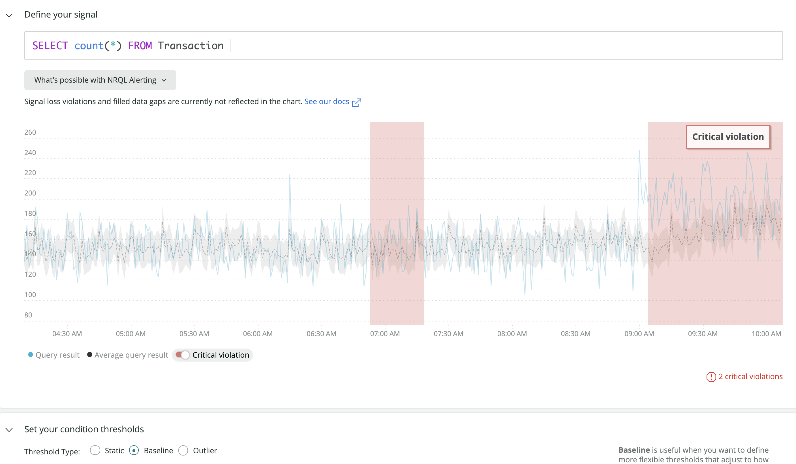
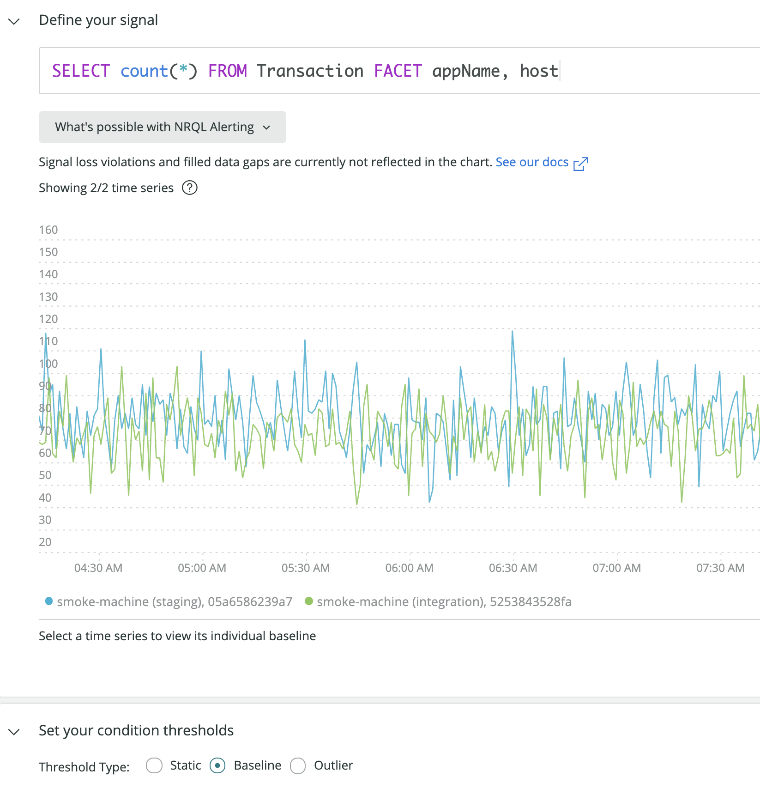
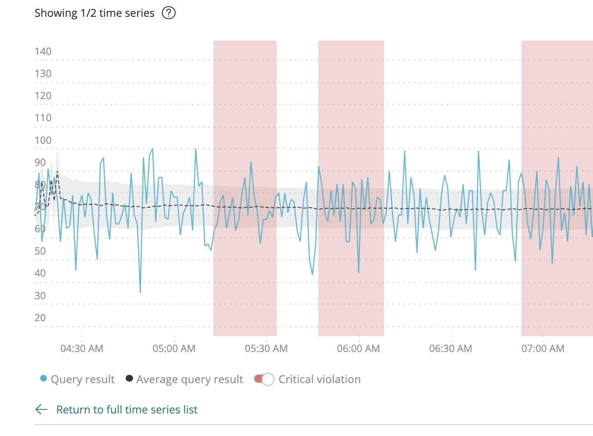
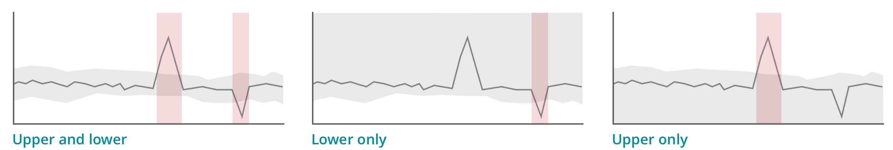

You can use baseline conditions to define violation [thresholds](/docs/using-new-relic/welcome-new-relic/get-started/glossary#alert-threshold) that adjust to the behavior of your data.

Baseline alerting is useful for creating [conditions](/docs/using-new-relic/welcome-new-relic/get-started/glossary#alert-condition) that:

* Only notify you when data is behaving abnormally.
* Dynamically adjust to changing data and trends, including daily or weekly trends.

In addition, baseline alerting works well with new applications when you do not yet have known behaviors.

## How it works [#baseline-overview]

When you choose a data source (for example, an APM metric) for a baseline condition, we'll use the past values of that data to dynamically predict the data's near-future behavior.

The line of that predicted future behavior for that value is called a **baseline.** It appears as a dotted black line on the preview chart in the baseline condition UI.

You'll use the baseline alert condition UI to:

* Adjust how sensitive the condition is to fluctuations in the data source.
* Set the behavior that will trigger a violation (for example: "deviating for more than five minutes").
* Set whether you want the condition to check for upper violations, lower violations, or both.

When your data escapes the predicted "normal" behavior and meets the criteria you've chosen, you'll receive a notification.

## Set baseline thresholds

<figcaption>
  **[one.newrelic.com](https://one.newrelic.com) > AI & Alerts > Policies > (create or select policy) > Create alert condition:** Baseline alert conditions give you the ability to set intelligent, self-adjusting thresholds that only generate violations when abnormal behavior is detected.
</figcaption>

To create a baseline condition, go to **[one.newrelic.com](https://one.newrelic.com) > AI & Alerts > Policies > (create or select policy) > Create alert condition**: When you start to create a [condition](/docs/alerts/new-relic-alerts/defining-conditions/define-alert-conditions#create-condition), choose one of the following [data sources](#availability):

* NRQL: Create a NRQL condition and then choose baseline
* APM: Application metric baseline
* Browser: Metric baseline

Here are some tips for setting baseline thresholds:

* Set the [baseline direction](#upper-lower) to monitor violations that happen either above or below the baseline.
* Set the preview chart to either [2 days or 7 days](#days) of displayed data. (Not applicable for [NRQL alert conditions](/docs/alerts/new-relic-alerts/defining-conditions/create-alert-conditions-nrql-queries).)
* Use the slider bar to adjust the  **Critical** threshold sensitivity, represented in the preview chart by the light gray area around the baseline. The tighter the band around the baseline, the more sensitive it is and the more violations it will generate.
* Optional: You can create a  [**Warning** threshold](/docs/alerts/new-relic-alerts/defining-conditions/set-thresholds-alert-condition#threshold-levels) (the darker gray area around the baseline).
* For NRQL alerts, see the [allowed types of NRQL queries](/docs/alerts/new-relic-alerts/defining-conditions/create-alert-conditions-nrql-queries#threshold-types).
* If the alert condition applies to multiple apps, you can select a choice from the dropdown above the chart to use different metrics. (Not applicable for NRQL alert conditions.)

## Faceted baseline conditions [#baseline-facets]

<figcaption>NRQL alerts conditions support faceted baselines. In the chart legend, click a time series to scope it to a single facet.</figcaption>

Once you've run a faceted NRQL query for a baseline condition, you can scope your results to a single baseline. 

<figcaption>Click **Return to full timeseries list** to go back to seeing all your facets.</figcaption>

The single time series shows the baseline, threshold band, and one or more violation regions, if there are any.

## Baseline rules and settings [#baseline-algorithm]

Here are some details about how the UI works:

<CollapserGroup>
  <Collapser
    id="baseline-rules"
    title="Rules governing creation of baseline"
  >
    The algorithm for baseline conditions is mathematically complex. Here are some of the major rules governing its predictive abilities:

    <table>
      <thead>
        <tr>
          <th style={{ width: "200px" }}>
            Data trait
          </th>

          <th>
            Baseline rules
          </th>
        </tr>
      </thead>

      <tbody>
        <tr>
          <td>
            Age of data
          </td>

          <td>
            On initial creation, the baseline is calculated using between 1 to 4 weeks of data, depending on data availability and baseline type. After its creation, the algorithm will take into account ongoing data fluctuations over a long time period, although greater weight is given to more recent data.

            For data that has only existed for a short time, the baseline will likely fluctuate a good deal and not be very accurate. This is because there is not yet enough data to determine its usual values and behavior. The more history the data has, the more accurate the baseline and thresholds will become.
          </td>
        </tr>

        <tr>
          <td>
            Consistency of data
          </td>

          <td>
            For metric values that remain in a consistent range or that trend slowly and steadily, their more predictable behavior means that their thresholds will become tighter around the baseline. Data that is more varied and unpredictable will have looser (wider) thresholds.
          </td>
        </tr>

        <tr>
          <td>
            Regular fluctuations
          </td>

          <td>
            For shorter-than-one-week cyclical fluctuations (such as weekly Wednesday 1pm deployments or nightly reports), the baseline algorithm looks for these cyclical fluctuations and attempts to adjust to them.
          </td>
        </tr>
      </tbody>
    </table>
  </Collapser>

  <Collapser
    id="upper-lower"
    title="Baseline direction: select upper or lower ranges"
  >
    You can choose whether you want the condition to violate for behavior that goes above the baseline ("upper") or that goes below the baseline ("lower"), or that goes either above or below. You choose these with the **Baseline direction** selector.

    Example use cases for this:

    * You might use the **Upper** setting for a data source like error rate, because you generally are only concerned if it goes up, and aren't concerned if it goes down.
    * You might use the **Lower** setting for a data source like throughput, because sudden upward fluctuations are quite common, but a large sudden downswing would be a sign of a problem.

    Here are examples of how large fluctuations in your data would be treated under the different baseline direction settings. The red areas represent violations.

  </Collapser>

  <Collapser
    id="days"
    title="Preview chart: select 2 or 7 days"
  >
    Not applicable for [NRQL alert conditions](/docs/alerts/new-relic-alerts/defining-conditions/create-alert-conditions-nrql-queries). When setting thresholds, the preview chart has an option for displaying **Since 2 days ago** or **Since 7 days ago**. These selections are **not** the time period used to compute the baseline; they are only the time range used for a preview display. For more about the time range used to calculate the baseline, see the [algorithm rules](#baseline-rules).
  </Collapser>
</CollapserGroup>
