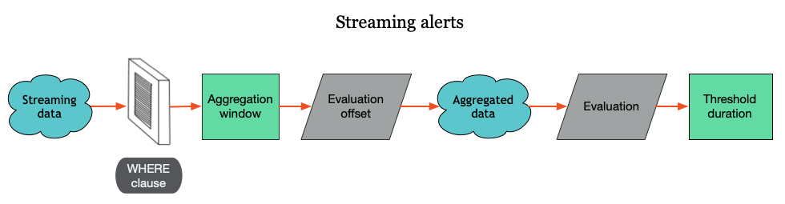

The streaming alerts platform checks for violations based on data that’s present or missing in your stream of data, or [signal](/docs/using-new-relic/welcome-new-relic/get-started/glossary#signal), coming into New Relic. 

You can use [NRQL conditions](/docs/alerts-applied-intelligence/new-relic-alerts/alert-conditions/create-nrql-alert-conditions/) to control what part of the signal you want to be notified about. Your NRQL condition filters the data that's processed by the [streaming algorithm](/docs/using-new-relic/welcome-new-relic/get-started/glossary#streaming-algorithm).

There are three methods for aggregating the data filtered through your NRQL condition:

* Event flow (default)
* Event timer
* Cadence

## Why it matters [#why]

Understanding how streaming alerts works will help you fine-tune your NRQL conditions to be notified about what's important to you. 

<figcaption>
  Only data that matches the conditions of the NRQL WHERE clause is alerted on. For more details on each step of the process, see [Streaming alerts process and descriptions](docs/alerts-applied-intelligence/new-relic-alerts/get-started/streaming-alerts-key-terms-concepts#streaming-table).
</figcaption>

As data streams into New Relic, it's filtered by the NRQL condition. Before data is evaluated, it must meet the criteria defined by the [NRQL query's `WHERE` clause](/docs/query-your-data/nrql-new-relic-query-language/get-started/nrql-syntax-clauses-functions#sel-where). Instead of evaluating that data immediately for violations, the NRQL alert conditions collect the data over a period of time known as the aggregation window. An additional offset delay allows for slower data to come through before it's processed.

Once the aggregation window plus the offset time have elapsed, New Relic aggregates the data into a single data point. Alerts then evaluates the data point using the NRQL condition in order to determine whether it meets the violation threshold criteria.

Even if a data point meets the criteria for a violation, a violation may not be triggered. A violation is only triggered when data points consistently meet the threshold criteria over a period of time. This is the threshold duration. If the data points are in violation for an entire threshold duration, we'll send you a notification based on your policy settings.

All of these configurable delays give you more control over how you're alerted on sporadic and missing data.

## Streaming alerts process and descriptions [#streaming-table]

<table class="alternate">
  <thead>
    <tr>
      <th style={{ width: "200px" }}>
        Process
      </th>

      <th>
        **Description**
      </th>
    </tr>
  </thead>
    <tbody>
    <tr>
      <td>
        Streaming data
      </td>
      <td>
        All data coming into New Relic.
      </td>
    </tr>
    
    <tr>
      <td>
        WHERE clause
      </td>
      <td>
        Filters all incoming streaming data. We only monitor for alerts on data that makes it through this filter.
      </td>
    </tr>

    <tr>
      <td>
        Aggregation methods
      </td>
      <td>
        One of three methods that control how data is collected before it's evaluated.

        They are:
        * Event flow (Default)
        * Event timer
        * Cadence
      </td>
    </tr>
      
    <tr>
      <td>
        Aggregation window
      </td>
      <td>
        Data with timestamps that fall within this window will be aggregated and sent for Alerts evaluation.
      </td>
    </tr>

    <tr>
      <td>
        Delay/timer
      </td>
      <td>
        A time delay to ensure data points are placed in the correct aggregation window.
      </td>
    </tr>

    <tr>
      <td>
        Aggregated data
      </td>
      <td>
        Data in the aggregated window is collapsed to a single data point for alert evaluation.
      </td>
    </tr>

    <tr>
      <td>
        Evaluation
      </td>
      <td>
        The data point is evaluated by the NRQL condition, which is trigged by each incoming aggregated data point.
      </td>
    </tr>

    <tr>
      <td>
        Threshold duration
      </td>
      <td>
        A specific duration that determines if a violation is created. If your specified NRQL condition meets the threshold criteria over the threshold duration, a violation occurs. 
        
        When a data point lacks data, a custom value is inserted to fill the gap. 
      </td>
    </tr>
    </tbody>
</table>

## Choose your aggregation method [#aggregation-methods]

You can choose between three different aggregation methods, depending on your needs.

[Event flow](#event-flow) (default) works best for data that comes in frequently and mostly in order.

[Event timer](#event-timer) works best for data that arrives infrequently in batches, such as cloud integration data or infrequent error logs.

[Cadence](#cadence) is our original and inferior aggregation method. It aggregates data on specific time intervals as detected by New Relic's internal wall clock, regardless of data timestamps.

## Event flow detail [#event-flow]

Event flow starts aggregating data when the first data point arrives and for a specific custom duration, or window duration. A custom delay provides extra time for data to arrive. These times are based on the data's timestamps and not New Relic's wall clock time.

For example, suppose you're monitoring CPU usage in window durations of 1 minute and a 3 minute delay.

When a CPU usage data point comes in with a timestamp of 12:00pm, event flow will start aggregating CPU usage data with timestamps between 12:00pm and 12:01pm. When event flow receives a data point with a timestamp of 12:03pm, it sends the 12:00 to 12:01 data to be evaluated.

## Event timer detail [#event-timer]

Like event flow, event timer only starts aggregating data when data arrives. When a data point arrives, a timer starts to count down. If no data arrives before the timer counts down, the data is evaluated. When a data point arrives before the timer has completed counting down, the timer is reset.

For example, suppose you're monitoring CloudWatch data that arrives fairly infrequently. You're using a window duration of 1 minute and a 3 minute timer.

When a CloudWatch data point comes in with a timestamp of 12:00pm, the timer will start to count down. At 12:03pm, if no other data with a timestamp between 12:00 and 12:01pm has arrived, the data with a 12:00pm timestamp is evaluated.

If a new data point with a timestamp between 12:00 and 12:01 arrives, the timer resets. It keeps resetting until data points for that window stop arriving.

If the timer for a later data point elapses before an earlier data point, the event timer method waits for the earlier timer to elapse before evaluating the later data point.

For best results, make sure your timer is equal to or longer than your window duration time. If the timer is less than your window duration and your data flow is inconsistent, then your data may be evaluated before all of your data points arrive. This could cause you to be notified incorrectly.

## Cadence [#cadence]

We recommend you use one of the other two methods.

Cadence is our old streaming aggregation method. It was based entirely on New Relic's wall clock time and didn't take into account data point timestamps as they arrived.

## Streaming alerts tools [#tools]

Streaming alerts provide a set of tools to give you greater control over how your data is evaluated to reduce incorrect notifications you receive. They are:

* Window duration
* Delay/timer
* Loss of signal detection
* Gap filling

<Callout variant="tip">
  This article covers these tools at a conceptual level. You'll find direct instructions on how to use these tools in [Create NRQL alert conditions](/docs/alerts-applied-intelligence/new-relic-alerts/alert-conditions/create-nrql-alert-conditions).
</Callout>

### Window duration [#window-duration]

In order to make loss of signal detection more effective and to reduce unnecessary notifications, you can customize aggregation windows to the duration that you need.

An [aggregation window](/docs/using-new-relic/welcome-new-relic/get-started/glossary#aggregation-window) is a specific block of time. We gather data points together in an aggregation window, before using the aggregation method to evaluate the data. A longer aggregation window gives straggling data points more time to arrive before evaluating that data. When a data point arrives, its timestamp is used to put it in the proper aggregation window.

You can set your aggregation window to anything between 1 second and 15 minutes. The default is `1` minute.

### Delay/timer [#delay-timer]

The delay/timer setting controls how long an aggregation method should wait before evaluating the data in the aggregation window.

The event flow and cadence methods use delay. Event timer uses timer.

The delay default is `2 minutes`. The timer default is `1 minute` and has a minimum value of `5 seconds`.

### Loss of signal detection [#signal-loss]

Loss of signal occurs when no data matches the NRQL condition over a specific period of time. A loss of signal is caused by different things. The `WHERE` clause in your NRQL query can filter out data before it's evaluated for violations. It could also mean a service or entity is offline or a periodic job has failed to run and no data is being sent to New Relic.

In order to avoid unnecessary notifications, you can choose how long to wait before you're notified by a loss of signal violation. You can use loss of signal detection to open violations and be notified when a signal is lost. Alternately, you can use a loss of signal to close violations for ephemeral services or sporadic data, such as error counts.

### Gap filling [#gap-filling]

Gap filling lets you customize the values to use when your signals don't have any data. You can fill gaps in your data streams with `None`, the last value received, or a static value. The default is `None`.

Gaps in streaming data can be caused by network or host issues, a signal may be sparse, or some signals, such as error counts, may only have data when something is wrong. By filling the gaps with known values, the alert evaluation process can process those gaps and determine how they should affect the loss of signal evaluation.

<Callout variant="tip">
  The alerts system fills gaps in actively reported signals. This signal history is dropped after 2 hours of inactivity. For gap filling, data points received after this period of inactivity are treated as new signals.

  To learn more about signal loss, gap filling, and how to request access to these features, see [this Explorers Hub post](https://discuss.newrelic.com/t/announcing-new-relic-one-streaming-alerts-for-nrql-conditions/115361).
</Callout>

