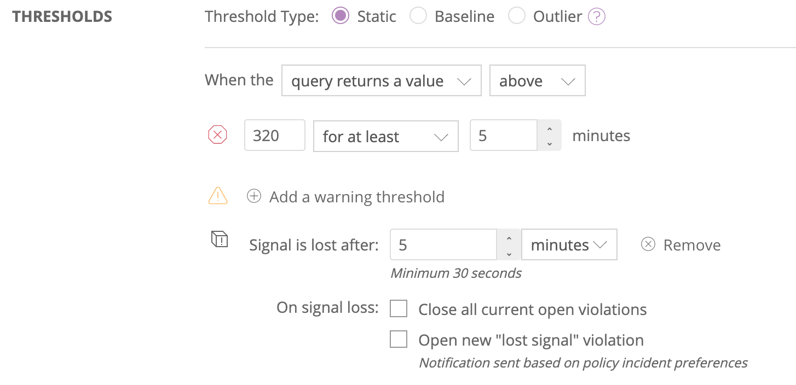

You can use [NRQL queries](/docs/insights/new-relic-insights/using-new-relic-query-language/using-nrql) to create alert conditions. Read on to learn more about how to do this.

<Callout variant="tip">
  For more information on key concepts relating to NRQL alert conditions and streaming alerts, see [Streaming alerts: key terms and concepts](/docs/alerts-applied-intelligence/new-relic-alerts/get-started/streaming-alerts-key-terms-concepts).
</Callout>

## Create a NRQL alert condition [#create]

To create a NRQL alert condition for a policy:

* On [one.newrelic.com](https://one.newrelic.com), in the header click **Alerts & AI**, then in the left sidebar click **Policies**.
* Select an existing policy or click **New alert policy** to [create a new policy](/docs/alerts-applied-intelligence/new-relic-alerts/alert-policies/create-edit-or-find-alert-policy).
* Click **Create a condition**.
* Under **Select a product** click **NRQL**, and then click **Next, define thresholds**.

## NRQL alert syntax [#syntax]

Here's the basic syntax for creating all NRQL alert conditions. The [`FACET` clause](#facet) is required for Outlier threshold types, optional for Static, and not allowed for Baseline.

```
SELECT function(attribute) 
FROM Event
WHERE attribute [comparison] [AND|OR ...]
```

<Table>
  <thead>
    <tr>
      <th style={{ width: "300px" }}>
        **Clause**
      </th>

      <th>
        **Notes**
      </th>
    </tr>
  </thead>

  <tbody>
    <tr>
      <td>
        `SELECT function(attribute)`

        **Required**
      </td>

      <td>
        Supported functions that return numbers include:

        * `apdex`
        * `average`
        * `count`
        * `latest`
        * `max`
        * `min`
        * `percentage`
        * `percentile`
        * `sum`
        * `uniqueCount`

        <Callout variant="tip">
          If you use the `percentile` aggregator in a faceted alert condition with many facets, this may cause the following error to appear:

          `An error occurred while fetching chart data.`

          If you see this error, use `average` instead.
        </Callout>
      </td>
    </tr>

    <tr>
      <td>
        `FROM data type`

        **Required**
      </td>

      <td>
        Only one data type can be targeted.

        Supported data types:

        * `Event`
        * `Metric` (RAW data points will be returned)
      </td>
    </tr>

    <tr>
      <td>
        `WHERE attribute [comparison] [AND|OR ...]`
      </td>

      <td>
        Use the `WHERE` clause to specify a series of one or more conditions. All the [operators](/docs/insights/new-relic-insights/using-new-relic-query-language/nrql-reference#where-operators) are supported.
      </td>
    </tr>

    <tr>
      <td id="facet">
        `FACET attribute`

        **Required for outlier conditions, but not baseline or static**
      </td>

      <td>
        Include an optional `FACET` clause in your NRQL syntax depending on the [threshold type](#threshold-types): static, baseline, or outlier.

        Use the [`FACET`](/docs/insights/nrql-new-relic-query-language/nrql-resources/nrql-syntax-components-functions) clause to separate your results by attribute and alert on each attribute independently. No `LIMIT` clause is allowed, but all queries will receive the maximum number of facets possible. Faceted queries can return a maximum of 5000 values for [static](/docs/alerts/new-relic-alerts/defining-conditions/create-alert-conditions-nrql-queries#threshold-types) conditions and a maximum of 500 values for [outlier](/docs/alerts/new-relic-alerts/defining-conditions/outlier-detection-nrql-alert) conditions.

        <Callout variant="important">
          If the query returns more than the maximum number of values, the alert condition can't be created. If you create the condition and the query returns more than this number later, the alert will fail. Modify your query so that it returns a fewer number of values.
        </Callout>
      </td>
    </tr>
  </tbody>
</Table>

## NRQL alert threshold examples [#examples]

Here are some common use cases for NRQL alert conditions. These queries will work for static and baseline [threshold types](#threshold-types). The outlier threshold type will require additional [`FACET` clauses](#facet).

<CollapserGroup>
  <Collapser
    id="constrained-alerts"
    title="Alert on specific segments of your data"
  >
    Create constrained alerts that target a specific segment of your data, such as a few key customers or a range of data. Use the `WHERE` clause to define those conditions.

    ```
    SELECT average(duration) FROM Transaction WHERE account_id in (91290, 102021, 20230)
    ```

    ```
    SELECT percentile(duration, 95) FROM Transaction WHERE name LIKE 'Controller/checkout/%'
    ```
  </Collapser>

  <Collapser
    id="nth-percentile"
    title="Alert on Nth percentile of your data"
  >
    Create alerts when an Nth percentile of your data hits a specified threshold; for example, maintaining SLA service levels. Since we evaluate the NRQL query in one-minute time windows, percentiles will be calculated for each minute separately.

    ```
    SELECT percentile(duration, 95) FROM Transaction
    ```

    ```
    SELECT percentile(databaseDuration, 75) FROM Transaction
    ```
  </Collapser>

  <Collapser
    id="max-min-avg"
    title="Alert on max, min, avg of your data"
  >
    Create alerts when your data hits a certain maximum, minimum, or average; for example, ensuring that a duration or response time does not pass a certain threshold.

    ```
    SELECT max(duration) FROM Transaction
    ```

    ```
    SELECT average(duration) FROM Transaction
    ```
  </Collapser>

  <Collapser
    id="percentage"
    title="Alert on a percentage of your data"
  >
    Create alerts when a proportion of your data goes above or below a certain threshold.

    ```
    SELECT percentage(count(*), WHERE duration > 2) FROM Transaction
    ```

    ```
    SELECT percentage(count(*), WHERE httpResponseCode = '500') FROM Transaction
    ```
  </Collapser>

  <Collapser
    id="apdex"
    title="Alert on Apdex with any T-value"
  >
    Create alerts on [Apdex](/docs/apm/new-relic-apm/apdex/apdex-measuring-user-satisfaction), applying your own T-value for certain transactions. For example, get an alert notification when your Apdex for a T-value of 500ms on transactions for production apps goes below 0.8.

    ```
    SELECT apdex(duration, t:0.5) FROM Transaction WHERE appName like '%prod%'
    ```
  </Collapser>
</CollapserGroup>

## NRQL condition creation tips [#nrql-tips]

Here are some tips for creating and using a NRQL condition:

<Table>
  <thead>
    <tr>
      <th style={{ width: "200px" }}>
        Topic
      </th>

      <th>
        Tips
      </th>
    </tr>
  </thead>

  <tbody>
    <tr>
      <td>
        Condition threshold types
      </td>

      <td>
        NRQL condition threshold types include [static, baseline, and outlier](#threshold-types).
      </td>
    </tr>

    <tr>
      <td>
        Create a description
      </td>

      <td>
        For NRQL conditions, you can create a custom [description](/docs/alerts/new-relic-alerts/defining-conditions/alert-condition-descriptions) to add to each violation. Descriptions can be enhanced with variable substitution based on metadata in the specific violation.

        For details, see [Description](/docs/alerts/new-relic-alerts/defining-conditions/alert-condition-descriptions)
      </td>
    </tr>

    <tr>
      <td>
        Query results
      </td>

      <td>
        Queries must return a number. The condition evaluates the returned number against the thresholds you've set.
      </td>
    </tr>

    <tr>
      <td>
        Time period
      </td>

      <td>
        As with all alert conditions, NRQL conditions evaluate one single minute at a time. The implicit `SINCE ... UNTIL` clause specifying which minute to evaluate is controlled by your [**Evaluation offset**](#time) setting. Since very recent data may be incomplete, you may want to query data from 3 minutes ago or longer, especially for:

        * Applications that run on multiple hosts.
        * `SyntheticCheck` data: Timeouts can take 3 minutes, so 5 minutes or more is recommended.

        Also, if a query will generate intermittent data, consider using the [`sum of query results`](#sum) option.
      </td>
    </tr>

    <tr>
      <td>
        Lost signal threshold  
        (loss of signal detection)
      </td>

      <td>
        You can use loss of signal detection to alert on when your data (a telemetry signal) should be considered lost. A signal loss can indicate that a service or entity is no longer online or that a periodic job failed to run. You can also use this to make sure that violations for sporadic data, such as error counts, are closed when no signal is coming in.

        <Callout variant="tip">
          To learn more about signal loss and how to request access to it, see [this announcement](https://discuss.newrelic.com/t/announcing-new-relic-one-streaming-alerts-for-nrql-conditions/115361).
        </Callout>
      </td>
    </tr>

    <tr>
      <td>
        Advanced signal settings
      </td>

      <td>
        * You can set the [aggregation window](https://docs.newrelic.com/docs/alerts-applied-intelligence/new-relic-alerts/get-started/streaming-alerts-key-terms-concepts) duration to choose how long data is accumulated in a streaming time window before it's aggregated.
          * The default streaming aggregation window duration is 1 minute.
          * The minimum aggregation window is 30 seconds.
          * The maximum is 15 minutes.

            <Callout variant="tip">
              Baseline thresholds don't support configurable aggregation window durations. They use the 1 minute default.
            </Callout>
        * You can adjust the [evaluation offset](#time) to coordinate [the streaming algorithm](https://docs.newrelic.com/docs/alerts-applied-intelligence/new-relic-alerts/get-started/streaming-alerts-key-terms-concepts) with your data's latency. If it takes a while for your data to arrive, then you may need to increase the evaluation offset.
        * If your data is sporadic or has aggregation windows that may not have data, you can fill those gaps with a custom value or the last known value. The default value is **None**.
        * <Callout variant="tip">
            To learn more about gap filling and how to request access to it, see [this announcement](https://discuss.newrelic.com/t/announcing-new-relic-one-streaming-alerts-for-nrql-conditions/115361)
          </Callout>
      </td>
    </tr>

    <tr>
      <td>
        Condition settings
      </td>

      <td>
        Use the **Condition settings** to:

        * Create a concise, descriptive [condition name](/docs/alerts/new-relic-alerts/configuring-alert-policies/define-alert-conditions#rename-condition).
        * Provide a [custom violation description for the condition](https://docs.newrelic.com/docs/alerts-applied-intelligence/new-relic-alerts/alert-conditions/alert-custom-violation-descriptions) that will be included in violations and notifications.
        * Add the runbook URL to include your organization's procedures for handling incidents. You may also add this information to the [custom violation description](https://docs.newrelic.com/docs/alerts-applied-intelligence/new-relic-alerts/alert-conditions/alert-custom-violation-descriptions).
      </td>
    </tr>

    <tr>
      <td>
        Limits on conditions
      </td>

      <td>
        See the [maximum values](/docs/alerts/new-relic-alerts/getting-started/minimum-maximum-values).
      </td>
    </tr>

    <tr>
      <td>
        Health status
      </td>

      <td>
        NRQL alert conditions don't affect an entity's [health status display](/docs/alerts-applied-intelligence/new-relic-alerts/alert-conditions/view-entity-health-status-find-entities-without-alert-conditions).
      </td>
    </tr>

    <tr>
      <td>
        Examples
      </td>

      <td>
        For more information, see:

        * [Expected NRQL syntax](#syntax)
        * [Examples of NRQL condition queries](#examples)
      </td>
    </tr>
  </tbody>
</Table>

## Alert threshold types [#threshold-types]

When you create a NRQL alert, you can choose from different types of thresholds:

<Table>
  <thead>
    <tr>
      <th style={{ width: "150px" }}>
        NRQL alert threshold types
      </th>

      <th>
        Description
      </th>
    </tr>
  </thead>

  <tbody>
    <tr>
      <td>
        Static
      </td>

      <td>
        This is the simplest type of NRQL threshold. It allows you to create a condition based on a NRQL query that returns a numeric value.

        Optional: Include a `FACET` clause.
      </td>
    </tr>

    <tr>
      <td>
        [Baseline](/docs/alerts/new-relic-alerts/defining-conditions/create-baseline-alert-conditions)  
        (Dynamic)
      </td>

      <td>
        Uses a self-adjusting condition based on the past behavior of the monitored values. Uses the same NRQL query form as the static type, except you **can't** use a `FACET` clause.
      </td>
    </tr>

    <tr>
      <td>
        [Outlier](/docs/outlier-detection-nrql-alerts)
      </td>

      <td>
        Looks for group behavior and values that are outliers from those groups. Uses the same NRQL query form as the static type, but requires a `FACET` clause.
      </td>
    </tr>
  </tbody>
</Table>

## Sum of query results (limited or intermittent data) [#sum]

<Callout variant="important">
  Available only for static (basic) threshold types.
</Callout>

If a query returns intermittent or limited data, it may be difficult to set a meaningful threshold. Missing or limited data will sometimes generate false positives or false negatives. You can use loss of signal, aggregation duration, and gap filling settings to minimize these false notifications.

To avoid this problem when using the static threshold type, you can set the selector to **sum of query results**. This lets you set the alert on an aggregated sum instead of a value from a single harvest cycle. Up to two hours of one-minute data checks can be aggregated. The duration you select determines the width of the rolling sum and the preview chart will update accordingly.

## Set the loss of signal threshold [#signal-loss]

Loss of signal occurs when no data matches the NRQL condition over a specific period of time. You can set your loss of signal threshold duration and and also what happens when the threshold is crossed.



Go to **[one.newrelic.com](https://one.newrelic.com)**, click **Alerts & AI**, in the left sidebar click **Policies**, select a policy, then **Create a condition**. Loss of signal is only available for NRQL conditions.

You may also manage these settings using the GraphQL API (recommended), or the REST API. Go here for specific [GraphQL API examples](http://docs.newrelic.com/docs/alerts-applied-intelligence/new-relic-alerts/alerts-nerdgraph/nerdgraph-api-loss-signal-gap-filling).

**Loss of signal settings:**

Loss of signal settings include a time duration and two possible actions.

* **Signal loss expiration time**
  * UI label: **Signal is lost after:**
  * GraphQL Node: [expiration.expirationDuration](http://docs.newrelic.com/docs/alerts-applied-intelligence/new-relic-alerts/alerts-nerdgraph/nerdgraph-api-loss-signal-gap-filling)
  * Expiration duration is a timer that starts and resets when we receive a data point in the streaming alerts pipeline. If we don't receive another data point before your 'expiration time' expires, we consider that signal to be lost. This can be because no data is being sent to New Relic or the `WHERE` clause of your NRQL query is filtering that data out before it is streamed to the alerts pipeline.
  * The loss of signal expiration time is independent of the threshold duration and triggers as soon as the timer expires.
  * The maximum expiration duration is 48 hours. This is helpful when monitoring for the execution of infrequent jobs. The minimum is 30 seconds, but we recommend using at least 3-5 minutes.
* **Loss of signal actions**  
  Once a signal is considered lost, you can close open violations, open new violations, or both.
  * Close all current open violations: This closes all open violations that are related to a specific signal. It won't necessarily close all violations for a condition. If you're alerting on an ephemeral service, or on a sporadic signal, you'll want to choose this action to ensure that violations are closed properly. The GraphQL node name for this is ["closeViolationsOnExpiration](https://docs.newrelic.com/docs/alerts-applied-intelligence/new-relic-alerts/alerts-nerdgraph/nerdgraph-api-loss-signal-gap-filling)"
  * Open new violations: This will open a new violation when the signal is considered lost. These violations will indicate that they are due to a loss of signal. Based on your incident preferences, this should trigger a notification. The graphQL node name for this [is "openViolationOnExpiration](https://docs.newrelic.com/docs/alerts-applied-intelligence/new-relic-alerts/alerts-nerdgraph/nerdgraph-api-loss-signal-gap-filling)"
  * When you enable both actions, we'll close all open violations first, and then open a new violation for loss of signal.

To create a NRQL alert configured with loss of signal detection in the UI:

1. For a poliocy, when you create a condition, under **Select a product**, click **NRQL**, then click **Next, define thresholds**.
2. Write a [NRQL query](/docs/alerts/new-relic-alerts/defining-conditions/create-alert-conditions-nrql-queries#syntax) that returns the values you want to alert on.
3. For **Threshold type**, select **Static** or **Baseline**.
4. Click **+ Add lost signal threshold**, then set the signal expiration duration time in minutes or seconds in the **Signal is lost after** field.
5. Choose what you want to happen when the signal is lost. You can check one or both of **Close all current open violations** and **Open new "lost signal" violation** . These control how loss of signal violations will be handled for the condition.
6. Make sure you name your condition before you save it.

<Callout variant="tip">
  Loss of signal detection doesn't work on NRQL queries that use nested aggregation or sub-queries.
</Callout>

## Evaluation offset

For data that consistently takes longer to arrive, you can use offset evaluation to consistently delay the NRQL condition evaluation. Waiting longer increases accuracy, but also increases latency.


Aggregation window and Offset evaluation toggles

The total supported latency is the multiple of the aggregation window duration times the evaluation offset. In the screenshot example, the latency is 15 minutes (a 5 minute aggregation window X 3 windows).

If the event type data comes from an [APM language agent](/docs/agents) and is aggregated from many app instances (for example, `Transactions`, `TransactionErrors`, etc.), we recommend using an evaluation offset of 3 with 1 minute aggregation windows.

<Callout variant="important">
  When creating NRQL conditions for data collected from [Infrastructure Cloud Integrations](/docs/integrations) such as AWS Cloudwatch or Azure, we recommend that you start with an evaluation offset of 15 minutes, then adjust up or down depending on how long it takes to collect your data.
</Callout>

## Fill data gaps

Gap filling lets you customize the values to use when your signals don't have any data. You can fill gaps in your data streams with None, the last value received, or a static value.

### How to edit data gap values:

* In the NRQL conditions UI under **Condition settings** > **Advanced signal settings** > **fill data gaps with**, and then choose **None**, **Last known value**, or **Custom static value**.
* In the Nerdgraph API (preferred), you'll find this node located at:  
  `actor : account : alerts : nrqlCondition : signal : fillOption | fillValue`
* In the REST API Explorer, you'll see this under the **"signal"** section of [the Alert NRQL conditions API](https://rpm.newrelic.com/api/explore/alerts_nrql_conditions/list).

### Gap filling options:

* **None**: (Default) Choose this if you don't want to take any action on empty aggregation windows. On evaluation, an empty aggregation window will reset the threshold duration timer. For example, if a condition says that all aggregation windows must have data points above the threshold for 5 minutes, and 1 of the 5 aggregation windows is empty, then the condition won't be in violation.
* **Custom static value**: Choose this if you'd like to insert a custom static value into the empty aggregation windows before they're evaluated. This option has an additional, required parameter of `fillValue` (as named in the API) that specifies what static value should be used. This defaults to `0`.
* **Last known value**: This option inserts the last seen value before evaluation occurs. We maintain the state of the last seen value for 2 hours.
