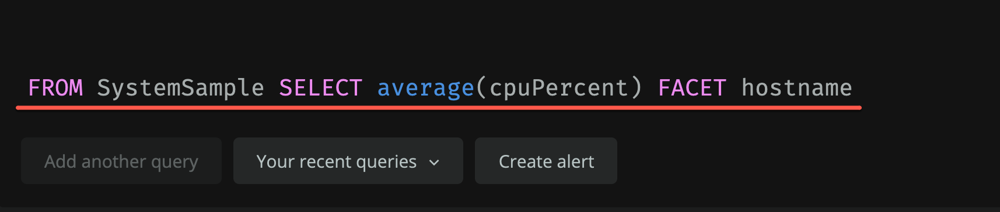
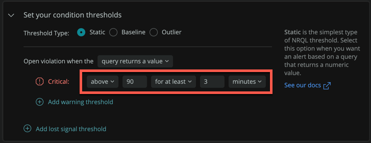
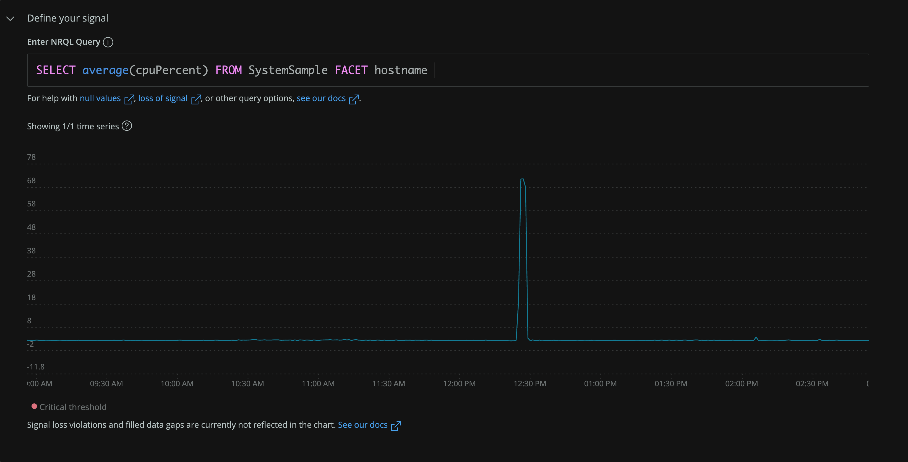

Use [NRQL queries](/docs/query-your-data/nrql-new-relic-query-language/get-started/introduction-nrql-new-relics-query-language/) to create alert [conditions](/docs/alerts-applied-intelligence/new-relic-alerts/alert-conditions/create-alert-conditions/) with ease.

Your condition only needs two attributes: a [query](/docs/query-your-data/explore-query-data/query-builder/introduction-query-builder/#specify-data) and a [threshold](/docs/alerts-applied-intelligence/new-relic-alerts/alert-conditions/set-thresholds-alert-condition/).

Follow our step-by-step example to write your first alert condition using the NRQL query builder.

<Callout variant="important">
This is a quick guide for creating NRQL alert conditions. For more information on NRQL alert examples, tips, and troubleshooting, see [Create NRQL alert conditions](/docs/alerts-applied-intelligence/new-relic-alerts/alert-conditions/create-nrql-alert-conditions/). 
</Callout>

## Step 1: Create your query

Determine what alert condition you want to query before continuing. In our example, we want to create a condition that shows us each host’s CPU utilization. We write out the NRQL query as seen in the image below to track each host individually.

If you need help writing in NRQL, see [NRQL syntax](/docs/query-your-data/nrql-new-relic-query-language/get-started/introduction-nrql-new-relics-query-language/#syntax).

## Step 2: Create alert and establish your thresholds

Your next step is to create an alert by clicking on the “Create alert” button below your query.

Finish setting up your first alert condition. Set thresholds to determine when you’re alerted. For our example, we want to know if any hosts are using over 90% of their CPU utilization for at least 3 minutes.

<figcaption>
  This is the "Set your condition thresholds" section on the form for creating an alert. Complete the other sections as needed.
</figcaption>

At least one critical threshold is required for your alert condition. You can add more thresholds as desired. For more information on thresholds, see [Alerts best practices](/docs/new-relic-solutions/best-practices-guides/alerts-applied-intelligence/alerts-best-practices/#threshold-practices).

## Step 3: See query results

Visualize your NRQL alert condition on New Relic One to make it easier for you to see how your systems are performing. In our example, we can see how each host’s average CPU utilization is performing. A violation will open if any host’s average CPU utilization is over 90% and can alert us.

If you would like to define signals, gap filling, or more, see [Create NRQL alert conditions](/docs/alerts-applied-intelligence/new-relic-alerts/alert-conditions/create-nrql-alert-conditions/). 