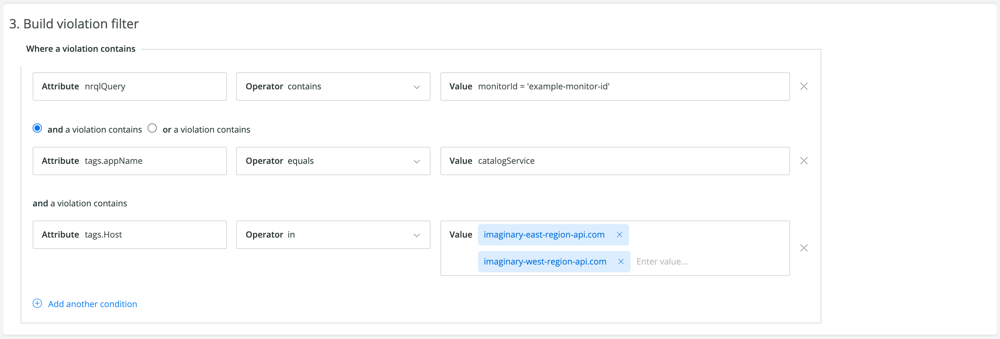

Alerts sends out timely notifications when your system is having problems. Sometimes there are notifications you know you don't need to see. You can use **muting rules** to stop being bombarded by messages you don't want.

Once you've spotted the common elements in your unwanted notifications, you can define muting rules that specifically target those elements, while letting other notifications through. Even when a notification is muted, Alerts still gathers data on those violations. Muting rules don't interfere with the alerts process and are applied at the point right before a notification is sent.

## Manage muting rules [#manage]

A muting rule condition is the set of individual expressions made up of attributes, operators, and values that define which violations to target for muting.

You can create, enable, disable, and manage muting rules. Go to **[one.newrelic.com](https://one.newrelic.com)**, in the top nav, click **Alerts & AI**, and then click **Muting rules**. Enable or disable muting rules at any time.

Rules can have one of the following statuses:

* **Active**: Muting is enabled and active.
* **Scheduled**: Muting is enabled but not active yet (there's a future schedule).
* **Ended**: Muting is enabled, but no longer active (there's no future schedule).
* **Inactive**: Muting is disabled.


<figcaption>
  **[one.newrelic.com](https://one.newrelic.com) > Alerts & AI > Muting rules**: You can create complex muting rules to target a small or large set of unwanted notifications.
</figcaption>

## Create a muting rule [#create]

<Callout variant="tip">
  Before creating muting rules, you'll need to [create policies and conditions](/docs/alerts/new-relic-alerts/configuring-alert-policies/create-edit-or-find-alert-policy) that generate violation notifications.
</Callout>

To create a muting rule, click **+ Add a rule** in the **Muting rules** screen. Enter a name and a description for the muting rule, and select the account to which the rule will apply.

Next, build the violation filter. You can use a subset of [violation event attributes](/docs/alerts/new-relic-alerts/defining-conditions/violation-event-attributes) (specifically `accountId`, `conditionId`, `conditionName`, `entity.guid`, `nrqlEventType`, `nrqlQuery`, `policyId`, `policyName`, `runbookUrl` (as `conditionRunbookUrl`), `tags.<NAME>`, and `targetName`) and [sub-condition operators](#sub-conditions). Values can be compared against one of your violation attributes, such as an Alerts policy ID or a condition name.



<figcaption>
  **[one.newrelic.com](https://one.newrelic.com) > Alerts & AI > Muting rules**: You can create complex muting rules to target a small or large set of unwanted notifications.
</figcaption>

## Schedule a muting rule [#schedule-muting-rule]

If needed, you can schedule your muting rules.

To do this, select a start time and/or end time. Optionally, you can set the muting rule to last an entire day.

You can also choose to select a time zone for the muting rule schedule. The default is the time zone selected in your user preferences.


<figcaption>
  Flexible and powerful options for scheduling your muting rules.
</figcaption>

You can schedule your muting rules to recur daily, weekly, or monthly. A muting rule that's scheduled to repeat weekly includes the option to select the days of the week to recur. If no days are selected, the weekly recurrence will default to repeating on the day of the week that the muting rule is scheduled to start.

<Callout variant="important">
The *Repeat* day of the week checkboxes override the *Starts* and *Ends* date fields. If you set a start date and also choose a day of the week, your muting rules will be applied on the first of those days after your start date  
</Callout>

You can also specify when you would like recurrence to end by selecting either a specific date or a certain number of occurrences.

## Manage muting rules with NerdGraph [#manage-with-nerdgraph]

In [NerdGraph](/docs/apis/nerdgraph/get-started/introduction-new-relic-nerdgraph), you can use the following queries and mutations with your muting rules. You can see the schema in more detail in the [API Explorer](/docs/apis/nerdgraph/get-started/introduction-new-relic-nerdgraph#explorer).

* `actor.account.alerts.mutingRule`: Fetch a muting rule by id.
* `actor.account.alerts.mutingRules`: Fetch a list of muting rules for an account.
* `alertsMutingRuleCreate`: Create a muting rule for an account.
* `alertsMutingRuleUpdate:` Update a muting rule by id and account id.
* `alertsMutingRuleDelete:` Delete a muting rule by id and account id.

We've given you some sample queries and mutations [examples in this document](#examples).

A muting rule has the following fields and components:

<table>
  <thead>
    <tr>
      <th style={{ width: "200px" }}>
        Muting rule
      </th>

      <th>
        Fields and components
      </th>
    </tr>
  </thead>

  <tbody>
    <tr>
      <td>
        `id`
      </td>

      <td>
        The unique identifier for the muting rule.
      </td>
    </tr>

    <tr>
      <td>
        `name` (**Required**)
      </td>

      <td>
        A text field for the user-friendly name of the muting rule. This is used when listing or referencing a rule. We don't require that the name be unique, but it is recommended.
      </td>
    </tr>

    <tr>
      <td>
        `description`
      </td>

      <td>
        This is an optional text field describing the muting rule. It can be a useful way to provide more context for your muting rule. This data is only used for management display purposes.
      </td>
    </tr>

    <tr>
      <td>
        `accountId`
      </td>

      <td>
        The muting rule's account ID. A muting rule will only affect violations that occur in a single account. To mute violations across multiple accounts, you'll need to create a muting rule for each account separately.
      </td>
    </tr>

    <tr>
      <td>
        `createdAt`
      </td>

      <td>
        The timestamp when the muting rule was created (UTC).
      </td>
    </tr>

    <tr>
      <td>
        `createdBy`
      </td>

      <td>
        The user ID of the person who created the muting rule.
      </td>
    </tr>

    <tr>
      <td>
        `updatedAt`
      </td>

      <td>
        The timestamp when the muting rule was last modified (UTC).
      </td>
    </tr>

    <tr>
      <td>
        `updatedBy`
      </td>

      <td>
        The user ID of the person who last modified the muting rule.
      </td>
    </tr>

    <tr>
      <td>
        `enabled`
      </td>

      <td>
        Enable or disable the muting rule (Boolean). Muting rules must be manually enabled and disabled.
      </td>
    </tr>

    <tr>
      <td>
        `condition`
      </td>

      <td>
        The set of individual expressions that define which violations to target. A muting rule condition has:

        * `operator`: The boolean operator `AND` or `OR` that defines how to combine the set of conditions.
        * `conditions`: The set of individual expressions (sub-conditions) that target attributes within a violation. These are evaluated together based on the `operator`. You can have a maximum of 20 sub-conditions for a single muting rule.

        A sub-condition has:

        * `attribute`: A single attribute within a violation. Go here for a list of [Violation event attributes](/docs/alerts/new-relic-alerts/defining-conditions/violation-event-attributes).
        * `operator`: The comparison function used to compare the selected violation attribute against values in the condition. Go here for a list of [sub-condition operators](#sub-conditions).
        * `values`: An array of string values to compare against selected violation attributes. When the muting rules evaluate a condition, if necessary, values will be coerced from strings. You can use a maximum of 500 values when using an operator that supports comparison against multiple values, such as `IN`.
      </td>
    </tr>

    <tr>
      <td>
        `schedule`
      </td>

      <td>
        The time window when the `MutingRule` actively mutes violations.

        * `startTime`: The datetime stamp that represents when the muting rule starts. This is in local ISO 8601 format without an offset. Example: '2020-07-08T14:30:00'
        * `endTime`: The datetime stamp that represents when the muting rule ends. This is in local ISO 8601 format without an offset. Example: '2020-07-15T14:30:00'
        * `timeZone`: The time zone that applies to the muting rule schedule. Example: 'America/Los_Angeles'. See [Wikipedia's list of tz database time zones](https://en.wikipedia.org/wiki/List_of_tz_database_time_zones).
        * repeat: The frequency the muting rule schedule repeats. If it does not repeat, use null. Options are DAILY, WEEKLY, MONTHLY.
        * endRepeat: The datetime stamp when the muting rule schedule stops repeating. This is in local ISO 8601 format without an offset. Example: '2020-07-10T15:00:00'. Note: Either `endRepeat` or `repeatCount` should be used to end a muting rule schedule. Both fields should not be provided together.
        * repeatCount: The number of times the muting rule schedule repeats. This includes the original schedule. For example, a `repeatCount` of 2 will recur one time. A `repeatCount` of 3 will recur two times. Note: Either `repeatCount` or `endRepeat` can be used to end a muting rule schedule. Both fields should not be provided together.
        * weeklyRepeatDays: The day(s) of the week that a muting rule should repeat when the repeat field is set to 'WEEKLY'. Example: \['MONDAY', 'WEDNESDAY'].
      </td>
    </tr>
  </tbody>
</table>

## How muting rules work [#overview]

Muting rules are applied at the end of the default alert lifecycle in order to suppress, or mute, notifications. They don't disable existing policies or conditions. For example, you can mute notifications during known system disruptions, such as maintenance windows and deployments. System disruption violations will still be identified, even though the notifications for those violations are muted.

A muting rule uses a set of conditions that match against attributes in a [violation event](/docs/alerts/new-relic-alerts/defining-conditions/violation-event-attributes). The muting rules tell us how to:

1. Identify individual violations after they're created, but before an incident is opened.
2. Override their default condition to indicate that they should be "muted."

Currently, muting a violation means that the normal Alerts incident lifecycle will be maintained, except that an incident that only contains muted violations will not send out any notifications.

Muting rules override specific violations. They don't disable existing policies or conditions. This allows you to mute violations from specific entities that may be covered by a policy or condition that covers a large number of entities. This also keeps you from having to over-mute your monitoring when you are performing maintenance on a subset of your system.

## Muting behavior [#behavior]

The following table describes how the Alerts incident lifecycle is affected by muted violations:

<table>
  <thead>
    <tr>
      <th>
        IF
      </th>

      <th>
        AND
      </th>

      <th>
        THEN
      </th>
    </tr>
  </thead>

  <tbody>
    <tr>
      <td
        colSpan={3}
        style={{ backgroundColor: "rgb(238, 238, 238)" }}
      >
        **Event**: Incident opens
      </td>
    </tr>

    <tr>
      <td>
        An incident opens because of a violation that is **not** muted
      </td>

      <td/>

      <td>
        An “Open incident” notification will be sent (default).
      </td>
    </tr>

    <tr>
      <td>
        An incident opens due to a violation that **is** muted
      </td>

      <td/>

      <td>
        An “Open incident” notification will **not** be sent (muted).
      </td>
    </tr>

    <tr>
      <td
        colSpan={3}
        style={{ backgroundColor: "rgb(238, 238, 238)" }}
      >
        **Event**: Violation added to an open incident
      </td>
    </tr>

    <tr>
      <td>
        A new **muted** violation is added to an already open incident
      </td>

      <td/>

      <td>
        No notification action is triggered (default).
      </td>
    </tr>

    <tr>
      <td>
        A new **unmuted** violation is added to an open incident
      </td>

      <td>
        An “Open incident” notification **has not** **been sent**
      </td>

      <td>
        An “Open incident” notification **will be sent**.
      </td>
    </tr>

    <tr>
      <td>
        A new **unmuted** violation is added to an open incident
      </td>

      <td>
        An “Open incident” notification **has already been sent**
      </td>

      <td>
        No notification action is triggered (default).
      </td>
    </tr>

    <tr>
      <td
        colSpan={3}
        style={{ backgroundColor: "rgb(238, 238, 238)" }}
      >
        **Event**: Incident closed
      </td>
    </tr>

    <tr>
      <td>
        An Incident is closed
      </td>

      <td>
        An “Open incident” notification **has not been sent**
      </td>

      <td>
        A “Close incident” notification **will not be sent**.
      </td>
    </tr>

    <tr>
      <td>
        An Incident is closed
      </td>

      <td>
        An “Open incident” notification **has been sent**
      </td>

      <td>
        A “Close incident” notification **will be sent**.
      </td>
    </tr>

    <tr>
      <td
        colSpan={3}
        style={{ backgroundColor: "rgb(238, 238, 238)" }}
      >
        **Event**: Incident acknowledged
      </td>
    </tr>

    <tr>
      <td>
        An Incident is acknowledged
      </td>

      <td>
        An “Open incident” notification **has not been sent**
      </td>

      <td>
        An “Incident acknowledged” notification **will not be sent**.
      </td>
    </tr>

    <tr>
      <td>
        An Incident is acknowledged
      </td>

      <td>
        An “Open incident” notification **has been sent**
      </td>

      <td>
        An “Incident acknowledged” notification **will be sent**.
      </td>
    </tr>
  </tbody>
</table>

## View muted violations and incidents [#ui]

When viewing an open or closed incident, violations and incidents are marked as `Muted`. The following sections show some of these muted violations and incidents, and where you can find them.

<CollapserGroup>
  <Collapser
    id="clamshell-1"
    title="An incident with a critical violation that's been muted"
  >
    

    <figcaption>
      Go to **[one.newrelic.com](https://one.newrelic.com)**, and in the top nav, click **Alerts & A**I, then click **Incidents.**
    </figcaption>
  </Collapser>

  <Collapser
    id="clamshell-2"
    title="An incident that has been muted"
  >
    Violations and incidents are marked as **Muted** in the **State** column:

    

    <figcaption>
      Go to **[one.newrelic.com](https://one.newrelic.com)**, and in the top nav click **Alerts & A**I, click **Incidents**, then click **Open incidents.**
    </figcaption>
  </Collapser>

  <Collapser
    id="clamshell-1"
    title="A list of violations, some of which are muted"
  >
    

    <figcaption>
      Go to **[one.newrelic.com](https://one.newrelic.com)**, and in the top nav, click **Alerts & A**I, then click **Events.**
    </figcaption>
  </Collapser>

  <Collapser
    id="clamshell-2"
    title="A list of alert events, some of which are muted"
  >
    In the list of alert events, the **State** column shows which events have been muted.

    

    <figcaption>
      Go to **[one.newrelic.com](https://one.newrelic.com)**, in the top nav click **Alerts & A**I, click **Events**, then click **All events.**
    </figcaption>
  </Collapser>
</CollapserGroup>

### Mute faceted results using `tags.` [#facet-muting]

To mute results of faceted queries, use the `tags.FACETED_ATTRIBUTE` attribute, where <var>FACETED_ATTRIBUTE</var> represents the attributed you've run a NRQL [`FACET` query](/docs/query-data/nrql-new-relic-query-language/getting-started/nrql-syntax-clauses-functions#sel-facet) on. For example: if your NRQL alert condition includes `FACET host` in its query, you can target that `FACET` attribute using `tags.host`.

NRQL condition queries can accept multiple facet attributes. If you want to be able to filter from attributes in your events or metric time series that have been aggregated, you must add those attributes to your NRQL query `FACET` clause; for example: `FACET host, region, cluster`.

For an example of using `tags.`, see [Create muting rule](#create).

## Sub-condition operators [#sub-conditions]

The following are the logical operators available to use to compare attributes when you're constructing muting rules. For examples of these being used, see [Examples](/docs/alerts/new-relic-alerts/managing-notification-channels/muting-rules-suppress-notifications#examples).

* `EQUALS`: Where the supplied value equals the violation attribute value.
* `NOT_EQUALS`: Where the supplied value does not equal the violation attribute value.
* `IN`: Where the violation attribute value is present in a list of supplied values (up to 500).
* `NOT_IN`: Where the violation attribute value is not present in a list of supplied values (up to 500).
* `CONTAINS`: Where the supplied value string is present in the violation attribute value.
* `NOT_CONTAINS`: Where the supplied value string is not present in the violation attribute value.
* `ANY`: **Caution:** A condition with this operator will mute **all** violations on the account.
* `IS_BLANK`: Where the violation attribute value is blank. Null, empty string, etc.
* `IS_NOT_BLANK`: Where the violation attribute value is not blank. Null, empty string, etc.
* `STARTS_WITH`: Where the violation attribute value begins with the supplied value string.
* `NOT_STARTS_WITH`: Where the violation attribute value does not begin with the supplied value string.
* `ENDS_WITH`: Where the violation attribute value ends with the supplied value string.
* `NOT_ENDS_WITH`: Where the violation attribute value does not end with the supplied value string.

## Muting examples [#examples]

For more information about making requests to NerdGraph, see the [NerdGraph documentation](/docs/apis/nerdgraph/get-started/introduction-new-relic-nerdgraph), including [GraphQL tutorials](/docs/apis/graphql-api/tutorials).

<CollapserGroup>
  <Collapser
    id="fetch-list"
    title="Fetch muting rules for account"
  >
    To fetch the list of muting rules (with name and condition) for an account:

    ```
    {
          actor {
            account(id: <var>YOUR_ACCOUNT_ID</var>) {
              alerts {
                mutingRules {
                  name
                  condition {
                    operator
                    conditions {
                      attribute
                      operator
                      values
                    }
                  }
                }
              }
            }
          }
        }
    ```
  </Collapser>

  <Collapser
    id="create-rule"
    title="Create muting rule"
  >
    To create a muting rule and return the muting rule's `id` for muting violations from NRQL conditions where host facet is `host-1`:

    ```
    mutation {
          alertsMutingRuleCreate(accountId: <var>YOUR_ACCOUNT_ID</var>, rule: {
            name: "host-1 mute rule",
            description: "Mute host-1 violations",
            enabled: true,
            condition: {
              operator: AND,
              conditions: [{
                attribute: "tags.host",
                operator: EQUALS,
                values: ["host-1"]
              }]
            }
          }) {
            id
          }
        }
    ```
  </Collapser>

  <Collapser
    id="rule-product"
    title="Create muting rule for specific hosts or products"
  >
    To create a muting rule and return the muting rule's `id` for muting violations from infrastructure conditions where the target host is `host-1` or the violation was from synthetic or mobile monitoring:

    ```
    mutation {
          alertsMutingRuleCreate(accountId: <var>YOUR_ACCOUNT_ID</var>, rule: {
            name: "host-1 and synthetics/mobile mute rule",
            description: "Mute host-1 and synthetics/mobile violations",
            enabled: true,
            condition: {
              operator: OR,
              conditions: [
                {
                  attribute: "targetName",
                  operator: EQUALS,
                  values: ["host-1"]
                },
                {
                  attribute: "product",
                  operator: IN,
                  values: ["SYNTHETICS", "MOBILE"]
                }
              ]
            }
          }) {
            id
          }
        }
    ```
  </Collapser>

  <Collapser
    id="rule-product"
    title="Create a muting rule with a recurring schedule"
  >
    To create a muting rule scheduled to repeat with these criteria:

    * Weekly on Tuesday and Friday
    * End on 01/31/2021
    * Return the muting rule's `schedule` and `id`

    ```
    mutation {
      alertsMutingRuleCreate(
        accountId: YOUR_ACCOUNT_ID,
        rule: {
          condition: {
            conditions: {
              attribute: "conditionName", 
              operator: ANY, 
              values: "This is a condition"
            }, 
            operator: AND
          }, 
          enabled: true, 
          name: "Recur Weekly", 
          schedule: {
            startTime: "2020-12-01T12:00:00", 
            endTime: "2020-12-01T14:00:00", 
            timeZone: "America/Los_Angeles",
            repeat: WEEKLY,
            endRepeat: "2021-01-31T12:00:00", 
            weeklyRepeatDays: [TUESDAY, FRIDAY]
          }
        }
      ) {
        id
        schedule {
          endTime
          startTime
          timeZone
          repeat
          repeatCount
          endRepeat
          weeklyRepeatDays
          nextStartTime
          nextEndTime
        }
      }
    }
    ```
  </Collapser>

  <Collapser
    id="rename"
    title="Rename and disable muting rule"
  >
    To change the name and disable a muting rule and return its new name:

    ```
    mutation {
          alertsMutingRuleUpdate(accountId: <var>YOUR_ACCOUNT_ID</var>, id: <var>MUTING_RULE_ID</var>, rule: {
            name: "updated name",
            enabled: false
          }) {
            name
          }
        }
    ```
  </Collapser>

  <Collapser
    id="delete-rule"
    title="Delete muting rule"
  >
    To delete a muting rule:

    ```
    mutation {
         alertsMutingRuleDelete(accountId: <var>YOUR_ACCOUNT_ID</var>, id: <var>MUTING_RULE_ID</var>) {
            id
          }
        }
    ```
  </Collapser>
</CollapserGroup>
