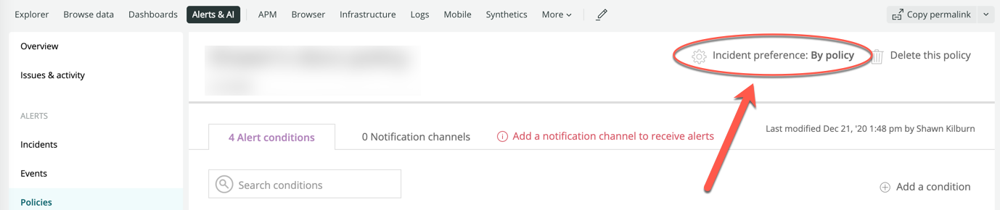
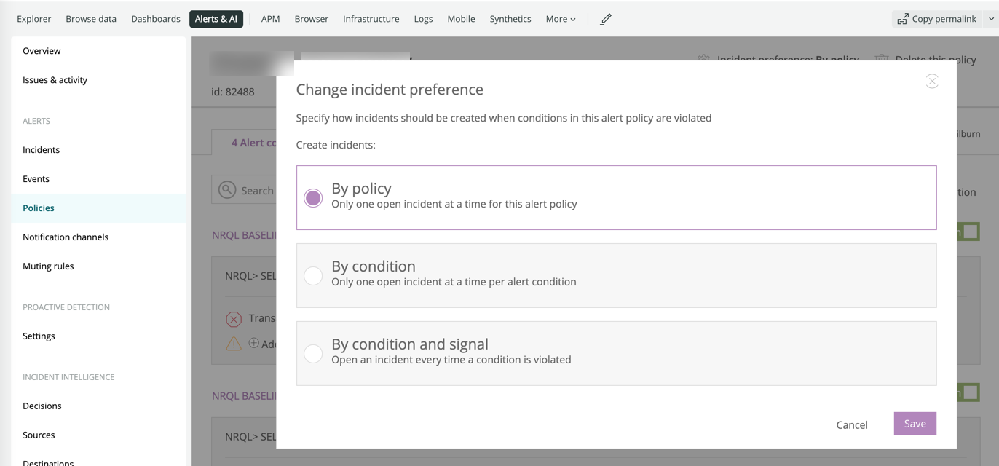
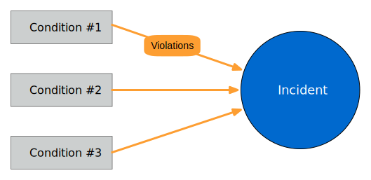
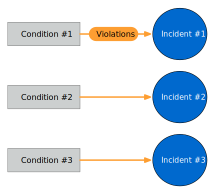
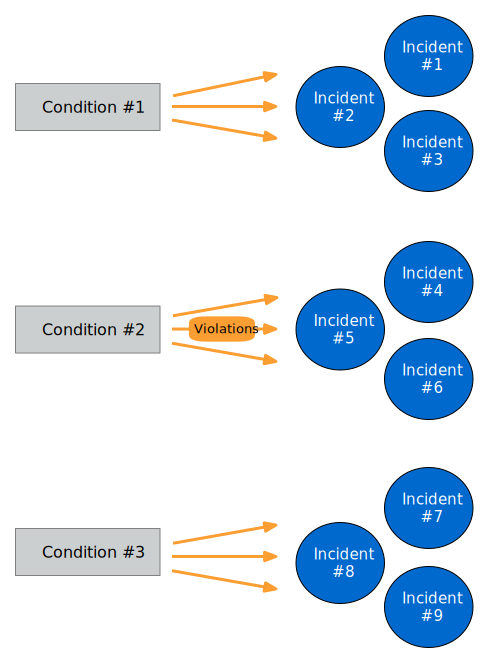

An incident is a collection of one or more violations.
 
Incidents determine when you are notified about violations disrupting your business. These violations occur when your given alert conditions (like CPU overage, synthetic monitoring crashes, or slow web app response times) are met.
 
Control which policy conditions create incidents. This ensures that you are notified about important ongoing or recurring issues and not bombarded by unnecessary notifications.
 
Learn how to set incident preferences by your policy, condition, or condition and signal combination. 

## Critical and warning violations [#incident-types]
Choose from two threshold types when a policy condition is met:
- Critical (red)
- Warning (yellow)
 
When a policy condition violates a critical threshold, an incident record can be created with detailed information to help you respond efficiently. The incident record will also include any warning violations occurred after the opening critical threshold violation.
 
Notifications are sent to every notification channel on the policy when an incident opens, if and when an incident is acknowledged, and when an incident closes.

## Incident preference options [#preference-options]

Each incident preference option has its own advantages. You can select any preference for any policy.

<table>
  <thead>
    <tr>
      <th width={200}>
        **Incident preference**
      </th>

      <th>
        **Advantages**
      </th>
    </tr>
  </thead>

  <tbody>
    <tr>
      <td>
        [By policy (default)](#preference-policy)
      </td>

      <td>
        Only one incident will be open at a time for the entire policy.

        * Fewest number of notifications
        * Requires immediate action and closing the incidents to be effective
      </td>
    </tr>

    <tr>
      <td>
        [By condition](#preference-condition)
      </td>

      <td>
        One incident will be open at a time for each condition in your policy.

        * More notifications
        * Useful for policies containing conditions that focus on [entities](/docs/apm/new-relic-apm/getting-started/glossary#alert-target) that perform the same job; for example, hosts that all serve the same application(s)
      </td>
    </tr>

    <tr>
      <td>
        [By condition and signal](#preference-target)
      </td>

      <td>
        An incident will be created for every violation in your policy.

        * The most notifications
        * Useful if you need to be notified of every violation or if you have an external system where you want to send alert notifications
      </td>
    </tr>
  </tbody>
</table>

## Select your incident preference [#preference-procedures]

By default, a single incident record will be created for each policy.

To change the incident preference for the selected policy:

1. In the **[one.newrelic.com](https://one.newrelic.com/ "Link opens in a new window.")** top nav, click **Alerts & AI**, then click **Policies**, and then (**select a policy)**.
2. Click **Incident preference**, select your choice of available [options](#preference-options), and then save.

Repeat these steps for each policy as needed.

<figcaption>
  **[one.newrelic.com](https://one.newrelic.com) > Alerts & AI > Policies > (select a policy):** The selected policy page shows how alerts rolls up incidents for alert notifications and UI details. (Default is **By policy**). To choose a different option for this policy, click **Incident preference**.
</figcaption>

## By policy (default) [#preference-policy]

<figcaption>
  When you select the default (**By policy**) as your incident preference, it will group all condition violations into the same incident.
</figcaption>

If additional conditions are violated after the incident opens, the violations are added to the same incident. Only one incident appears on your Incidents indexes for the selected policy.
 
Choose the **By policy** preference if your policy and its conditions have a focused scope (like monitoring one entity). Learn more about [incident preference best practices](/docs/new-relic-solutions/best-practices-guides/alerts-applied-intelligence/alerts-best-practices/#incident-practices).

## By condition [#preference-condition]

<figcaption>
  When you select **By condition** as your incident preference, it will group all violations by any target for a specific condition into separate incidents.
</figcaption>

Choose the **By condition** option when you want an individual incident record to focus on a specific condition. If the policy has multiple conditions, separate incident records for each condition will appear on your incidents indexes.

* If a target violates a condition for the alert policy, an incident record will be created.
* If the same target violates another condition for the alert policy, another incident record will be created.
* If additional targets violate the same condition after the incident opens, these violations will be added to the incident record already open for that condition.

Learn more about [incident preference best practices](/docs/new-relic-solutions/best-practices-guides/alerts-applied-intelligence/alerts-best-practices/#incident-practices).

## By condition and signal [#preference-target]

<figcaption>
  When you select **By condition and signal** as your incident preference, it will not group violations at all. A new incident will be created for every violation that occurs in your policy.
</figcaption>

The **By condition and signal** option is the most granular level for creating incident records. Choose this incident preference when you want to closely monitor anything that is occurring anywhere across your infrastructure.
 
Learn more about [incident preference best practices](/docs/new-relic-solutions/best-practices-guides/alerts-applied-intelligence/alerts-best-practices/#incident-practices).