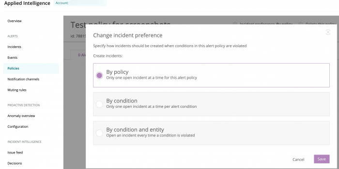
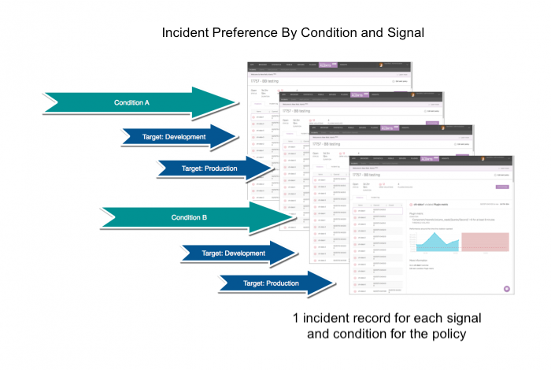

When a policy [condition](/docs/alerts/new-relic-alerts-beta/configuring-alert-policies/define-alert-conditions) violates a Critical (red) [threshold](/docs/alerts/new-relic-alerts-beta/configuring-alert-policies/define-thresholds-trigger-alert), it can create an incident record with detailed information to help you respond efficiently. An **incident** is a collection of one or more violations. It includes all of the open and close timestamps for each violation. The incident record will include any Warning (yellow) violations which occurred after the opening Critical (red) threshold violation.

Notifications are sent to every notification channel on the policy when an incident opens, if and when an incident is acknowledged, and when an incident closes.

<Callout variant="tip">
  To select when alerts create incidents and how violations are grouped, use the **Incident preference** setting inside your policy. Then, to view the alerts policy violations (incident records), select the **Incidents** indexes.
</Callout>

## Incident preference options [#preference-options]

Each option for incident preference has its own advantages. You can select any option for any policy.

<table>
  <thead>
    <tr>
      <th width={200}>
        **Incident preference**
      </th>

      <th>
        **Comments**
      </th>
    </tr>
  </thead>

  <tbody>
    <tr>
      <td>
        [By policy (default)](#preference-policy)
      </td>

      <td>
        Only one incident will be open at a time for the entire policy.

        * Fewest number of notifications
        * Requires immediate action and closing the incidents to be effective
      </td>
    </tr>

    <tr>
      <td>
        [By condition](#preference-condition)
      </td>

      <td>
        One incident will be open at a time for each condition in your policy.

        * More notifications
        * Useful for policies containing conditions that focus on [entities](/docs/apm/new-relic-apm/getting-started/glossary#alert-target) that perform the same job; for example, hosts that all serve the same application(s)
      </td>
    </tr>

    <tr>
      <td>
        [By condition and entity](#preference-target)
      </td>

      <td>
        An incident will be created for every violation in your policy.

        * The most notifications
        * Useful if you need to be notified of every violation or if you have an external system where you want to send alert notifications
      </td>
    </tr>
  </tbody>
</table>

## Select your incident preference [#preference-procedures]

By default, a single incident record will be created for each policy.

**[one.newrelic.com](https://one.newrelic.com) > Alert & AI > Policies > (select a policy):** The selected policy page shows how alerts rolls up incidents for alert notifications and UI details. (Default is **By policy**). To choose a different option for this policy, click **Incident preference**.

To change the incident preference for the selected policy:

1. In the **[one.newrelic.com](https://one.newrelic.com/ "Link opens in a new window.")** top nav, click **Alerts & AI**, then click **Policies**, and then (**select a policy)**.
2. Click **Incident preference**, select your choice of available [options](#preference-options), and then save.

Repeat these steps for each policy as needed.

## Example: By policy (default) [#preference-policy]

When you select the default (**By policy**) as your incident preference, it will group all condition violations into the same incident.

By default, a single incident record will be created for each alert policy. If additional conditions are violated by any target after the incident opens, the violations are added to the same incident. Only one incident appears on your **Incidents** indexes for the selected policy.

Selecting the **By policy** preference is the most general option. All condition violations for every target will be accumulated into a single incident record.

## Example: By condition [#preference-condition]

When you select **By condition** as your incident preference, it will group all violations by any target for a specific condition into separate incidents.

Selecting the **By condition** option is useful, for example, when you want an individual incident record to focus on a specific condition. If the policy has multiple conditions, separate incident records for each condition will appear on your **Incidents** indexes.

* If a target violates a condition for the alert policy, an incident record will be created.
* If the same target violates another condition for the alert policy, another incident record will be created.
* If additional targets violate the same condition after the incident opens, these violations will be added to the incident record already open for that condition.

## Example: By condition and entity [#preference-target]

When you select **By condition and entity** as your incident preference, it will not group violations at all. A new incident will be created for every violation that occurs in your policy.

Selecting the **By condition and entity** option is the most granular level for creating incident records. This is useful, for example, when you want to closely monitor anything that is occurring anywhere across your infrastructure. An incident will appear on your **Incidents** indexes for every violation that occurs within your policy.

## For more help [#more_help]

Additional documentation resources include:

* [Alert policy workflow](/docs/alerts/new-relic-alerts-beta/configuring-alert-policies/alert-policy-workflow) (basic process to set up your alert policies, regardless of which New Relic product uses the alert policy)
* [Explore the incident history](/docs/alerts/new-relic-alerts-beta/reviewing-alert-incidents/explore-incident-history) (examine details about alert policy violations, take action, and skim for patterns)
