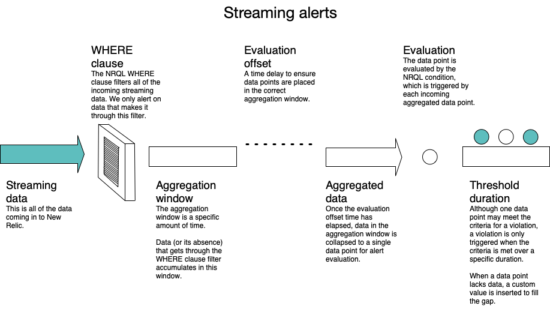

The streaming alerts platform checks for violations based on data that’s present or missing in the stream of data coming into New Relic. The stream of data that comes into New Relic is called a [signal](/docs/using-new-relic/welcome-new-relic/get-started/glossary#signal). You can control what part of the signal is alerted on through [NRQL](https://docs.newrelic.com/docs/query-your-data/nrql-new-relic-query-language/get-started/introduction-nrql-new-relics-query-language) conditions. These NRQL condition alerts are processed by the [streaming algorithm](/docs/using-new-relic/welcome-new-relic/get-started/glossary#streaming-algorithm).

The NRQL query provides the [signal filter](/docs/using-new-relic/welcome-new-relic/get-started/glossary#signal-filter) for all of your incoming data.

<Callout variant="tip">
  You can read more about the streaming alerts platform in [this Explorers Hub post](https://discuss.newrelic.com/t/announcing-new-relic-one-streaming-alerts-for-nrql-conditions/115361).
</Callout>

## Why it matters [#why]

Alerts violations are easy when they're caused by a specific event happening, but trickier when looking for events not happening.

<figcaption>
  Only data that matches the conditions of the NRQL WHERE clause is alerted on.
</figcaption>

As data streams into New Relic, it's filtered by the NRQL condition. Before data is evaluated, it must meet the criteria defined by the [NRQL query's `WHERE` clause](/docs/query-your-data/nrql-new-relic-query-language/get-started/nrql-syntax-clauses-functions#sel-where). Instead of evaluating that data immediately for violations, the NRQL alert conditions collect the data over a period of time known as the aggregation window. An additional offset delay allows for slower data to come through before it's processed.

Once the aggregation window plus the offset time have elapsed, New Relic groups the aggregated data into a single data point. Alerts then evaluates the data point using the NRQL condition in order to determine whether it meets the violation threshold criteria.

Even if a data point meets the criteria for a violation, a violation isn't triggered. A violation is only triggered when data points consistently meet the threshold criteria over a period of time. This is the threshold duration. If the data points are in violation for an entire threshold duration, we'll send you a notification based on your policy settings.

All of these configurable delays give you more control over how you're alerted on sporadic and missing data.

## Streaming alerts tools

Streaming alerts provide a set of tools you can use to more effectively alert on your streaming data, giving you greater control and reducing the number of false alerts notifications. They are:

* Loss of signal detection
* Gap filling
* Aggregation window duration customization
* Offset evaluation

<Callout variant="tip">
  This article covers these tools at a conceptual level. You'll find direct instructions on how to use these tools in [Create NRQL alert conditions](https://docs.newrelic.com/docs/alerts-applied-intelligence/new-relic-alerts/alert-conditions/create-nrql-alert-conditions).
</Callout>

### Loss of signal detection [#signal-loss]

Loss of signal occurs when no data matches the NRQL condition over a specific period of time. A loss of signal is caused by different things. The `WHERE` clause in your NRQL query can filter out data before it's evaluated for violations. It could also mean a service or entity is offline or a periodic job has failed to run and no data is being sent to New Relic.

In order to avoid unnecessary notifications, you can choose how long to wait before you're notified by a loss of signal violation. You can use loss of signal detection to open violations and be notified when a signal is lost. Alternately, you can use a loss of signal to close violations for ephemeral services or sporadic data, such as error counts.

### Gap filling

Gap filling lets you customize the values to use when your signals don't have any data. You can fill gaps in your data streams with None, the last value received, or a static value. The default is `None`.

Gaps in streaming data can be caused by network or host issues, a signal may be sparse, or some signals, such as error counts, may only have data when something is wrong. By filling the gaps with known values, the alert evaluation process can process those gaps and determine how they should affect the loss of signal evaluation.

### Aggregation window

In order to make loss of signal detection more effective and to reduce unnecessary notifications, you can customize aggregation windows to the duration that you need.

An [aggregation window](/docs/using-new-relic/welcome-new-relic/get-started/glossary#aggregation-window) is a specific block of time. We gather data points together in an aggregation window, before using the [aggregation function](/docs/using-new-relic/welcome-new-relic/get-started/glossary#aggregation-function) to evaluate the data. A longer aggregation window gives straggling data points more time to arrive before evaluating that data. When a data point arrives, its timestamp is used to put it in the proper aggregation window.

You can set your aggregation window to anything between 1 second and 15 minutes. The default is `1` minute.

### Offset evaluation

For data that consistently takes longer to arrive, you can use offset evaluation to consistently delay the NRQL condition evaluation. Waiting longer increases accuracy, but also increases latency.

The offset time value is the number of aggregation windows you want to use. The duration for each window is set in the Aggregation window field. For example, if your aggregation window is 1 minute and your Offset evaluation is 3, then a straggling data point will have about 3 minutes to arrive before it might be dropped. In other words, streaming alerts will always keep 3 aggregation windows in the queue, waiting 1 minute before evaluating each window and adding a new one.

The current default is `3`.
