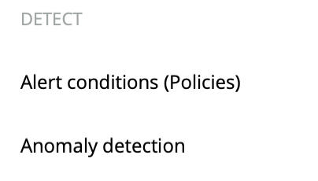
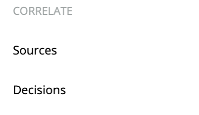

Over the course of several months during 2022, new functionalities in New Relic One will replace alerting functionalities reaching end of life (EOL). We are providing these early notices so you can plan accordingly and make a smooth transition.

## What's changed [#changed]

Starting in late 2021, we've reorganized the navigation UI for alerts and applied intelligence. Although the alerts and applied intelligence navigation has changed pretty dramatically, all the features you use are still there.

We're slowly rolling out this update to all of our users.

<CollapserGroup>
  <Collapser
    className="freq-link"
    id="nav-changes"
    title="An overview of alerts and applied intelligence nav changes"
  >

  ## Analyze [#analyze]

<figcaption>Use the analyze section to get a high-level view of your violations, issues, incidents, and anomalies.</figcaption>

The [overview page](/docs/alerts-applied-intelligence/new-relic-alerts/get-started/alerts-ai-overview-page) shows your most recent open, closed, and muted violations.

The **Issues & activity** page shows your most recent [issues](/docs/alerts-applied-intelligence/new-relic-alerts/get-started/alerts-ai-overview-page/#issues), [incidents](/docs/alerts-applied-intelligence/new-relic-alerts/get-started/alerts-ai-overview-page/#incidents), and [anomalies](/docs/alerts-applied-intelligence/new-relic-alerts/get-started/alerts-ai-overview-page/#anomalies).

## Detect [#detect]

<figcaption>Use the detect section to review and create your alerts policy conditions and anomaly detection configurations.</figcaption>

The [alert conditions (policies) page](/docs/alerts-applied-intelligence/new-relic-alerts/alert-policies/create-edit-or-find-alert-policy/) lists the policies where your conditions are created and organized. Create new policies here.

The [anomaly detection page](/docs/alerts-applied-intelligence/applied-intelligence/proactive-detection/expanded-anomaly-detection/) lists your expanded anomaly detection configurations. You can add or edit the configurations here.

## Correlate [#correlate]

<figcaption>Use the correlate section to manage your incident intelligence sources and decisions.</figcaption>

The [sources page](/docs/alerts-applied-intelligence/applied-intelligence/incident-intelligence/get-started-incident-intelligence/#1-configure-sources) shows your configured incident intelligence sources. You can add new sources or configure existing ones.

The [decisions page](/docs/alerts-applied-intelligence/applied-intelligence/incident-intelligence/change-applied-intelligence-correlation-logic-decisions/) shows your correlated incidents. You can review, edit, and add decisions.

## Enrich & notify [#enrich]

<figcaption>Use the enrich & notify section to further configure your alerts, incident intelligence, proactive detection, or workflows settings.</figcaption>

Use the [muting rules page](/docs/alerts-applied-intelligence/new-relic-alerts/alert-notifications/muting-rules-suppress-notifications/) to temporarily stop your alerts violation notifications.

Use [workflows](/docs/alerts-applied-intelligence/applied-intelligence/incident-workflows/incident-workflows/) to add more data to your alerts notifications.

Use [destinations](/docs/alerts-applied-intelligence/applied-intelligence/incident-intelligence/get-started-incident-intelligence/#2-configure-destinations) to configure where your applied intelligence notifications get sent.

Use [pathways](/docs/alerts-applied-intelligence/applied-intelligence/incident-intelligence/get-started-incident-intelligence/#3-configure-pathways) to configure where your correlated issues get sent.

Use [incident workflows](/docs/alerts-applied-intelligence/applied-intelligence/incident-workflows/incident-workflows/) to automate common problems and actions related to your alerts policies.

Use [incident destinations](/docs/alerts-applied-intelligence/applied-intelligence/incident-intelligence/incident-intelligence-destination-examples/) to add and configure third-party services for your incidents.

## Settings [#settings]

<figcaption>Use the settings section to review and manage your incident intelligence usage.</figcaption>

Use the settings page to review and manage your current incident intelligence usage.

## Alerts (classic) [#alerts]

 section.")

<figcaption>Use the alerts (classic) section to return to the alerts UI you're familiar with.</figcaption>

Use the [events and incidents pages](/docs/alerts-applied-intelligence/new-relic-alerts/alert-incidents/view-violation-event-details-incidents/) to review alerts violations and other events.

Use the [channels page](/docs/alerts-applied-intelligence/new-relic-alerts/alert-notifications/notification-channels-control-where-send-alerts/) for a list of your alerts notification channels and to create new channels.

  </Collapser>
</CollapserGroup>

## What's changing [#changes]

Here is a summary of what we plan to EOL in 2022, why this is happening, and what will replace the current experience for Alerts and Applied Intelligence.

If you have questions or comments about anything in this EOL transition guide, don't hesitate to:

* Reach out to your New Relic account representative.
* Use the reply thread in our [Explorers Hub post](https://discuss.newrelic.com/t/big-news-for-alerts-and-applied-intelligence/161436).

<CollapserGroup>

  <Collapser
    id="outlier"
    title="February 2022: NRQL baselines to replace outlier NRQL alert condition types."
  >

  **Reason for EOL:** [Outlier conditions](/docs/alerts-applied-intelligence/new-relic-alerts/advanced-alerts/advanced-techniques/outlier-detection-nrql-alert/) don't provide efficient cluster identification and analysis capabilities.

  **Replacement:** Use NRQL baselines to watch for anomalies in your cluster or to group similar signals. This method is an improvement over outlier conditions, since it will alert you to exactly which member of the group is misbehaving. You may be able to meet the same need as your old outlier conditions by using a faceted baseline condition.

  **Learn more:**

  * [Faceted baseline conditions documentation](/docs/alerts-applied-intelligence/new-relic-alerts/advanced-alerts/other-condition-types/create-baseline-alert-conditions/#baseline-facets)
  * [Explorers Hub](https://discuss.newrelic.com/t/nrql-outlier-alert-conditions-end-of-life/164167)

  </Collapser>

  <Collapser
    id="query-thresholds"
    title="May 2022: Sliding window aggregations to replace sum of query results thresholds."
  >

  **Reason for EOL:** The [NRQL sum of query results](/docs/alerts-applied-intelligence/new-relic-alerts/alert-conditions/create-nrql-alert-conditions/#sum) option has not been an ideal way to address issues caused by sporadic signals. It lacks the ability to smooth out volatile signals or efficiently deal with gaps in signal.

  **Replacement:** Development for full support for sliding window aggregation in NRQL conditions is underway. You can start using our current sliding windows functionality now.

  **Learn more:**
  
  * [Sliding window aggregation documentation](/docs/query-your-data/nrql-new-relic-query-language/nrql-query-tutorials/create-smoother-charts-sliding-windows)
  * [Explorers Hub](https://discuss.newrelic.com/t/big-news-for-alerts-and-applied-intelligence/161436)

  </Collapser>

  <Collapser
    id="incident-response"
    title="2nd half of 2022: Native experience in New Relic One to replace classic incident response workflow."
  >

  **Reason for EOL:** The classic [incident response workflow](/docs/alerts-applied-intelligence/new-relic-alerts/alert-policies/specify-when-alerts-create-incidents/) involves the **Incident** and **Violation details** pages in the UI. It also uses APIs for incidents and violations.

  **Replacement:** We will replace the current experience by rolling out improved incident response experiences with a new, native UI experience in New Relic One.

  **Learn more:**

  * Additional documentation will be provided.
  * [Explorers Hub](https://discuss.newrelic.com/t/big-news-for-alerts-and-applied-intelligence/161436)

  </Collapser>

  <Collapser
    id="notifications"
    title="2nd half of 2022: Workflows and destinations to replace notification channels and relationship to policies."
  >

  **Reason for EOL:** The [current alerting setup process](/docs/alerts-applied-intelligence/new-relic-alerts/learn-alerts/alerts-concepts-workflow) is rigid and cannot be customized. It also requires restrictive policy-based alert conditions that focus on incident creation.

  **Replacement:** Workflows and destinations, a new way to manage issue-driven notifications, will replace [current notification channel options](/docs/alerts-applied-intelligence/new-relic-alerts/alert-notifications/notification-channels-control-where-send-alerts/). This solution is more flexible, and it enables notifications for all severity levels.

  **Learn more:**

  * Additional documentation will be provided for the new workflow.
  * [Explorers Hub](https://discuss.newrelic.com/t/big-news-for-alerts-and-applied-intelligence/161436)

  </Collapser>

  <Collapser
    id="condition-types"
    title="2nd half of 2022: NRQL conditions to replace all non-NRQL alert condition types."
  >

  **Reason for EOL:** Currently NRQL alert conditions are one type of alert condition we offer. But our [many types of alert conditions](/docs/alerts-applied-intelligence/new-relic-alerts/alert-conditions/create-alert-conditions/) have resulted in a complex user experience, and the lack of alignment has prevented advances in detection capabilities.

  **Replacement:** This is being replaced by NRQL alert conditions with increased functionality. You can start preparing for this transition now by using [NRQL alert conditions](/docs/alerts-applied-intelligence/new-relic-alerts/alert-conditions/create-nrql-alert-conditions/) instead of other types.

  **Learn more:**

  * Additional documentation will be provided.
  * [Explorers Hub](https://discuss.newrelic.com/t/big-news-for-alerts-and-applied-intelligence/161436)

  </Collapser>

</CollapserGroup>

