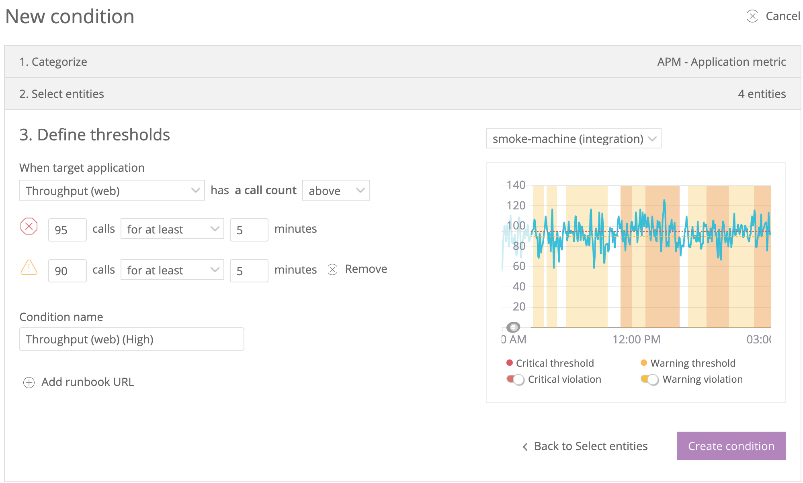

Alerts lets you set up robust and customizable alert policies for anything that you can monitor. Receive notifications for fluctuations in key performance metrics as data streams in from all of our products, including APM, infrastructure, browser, mobile, and NRQL queries.

## Build a comprehensive alerting solution [#alerting-solution]

<figcaption>
  Go to **[one.newrelic.com](https://alerts.newrelic.com/ "Link opens in a new window.")**, then click **Alerts & AI > Create condition:** This shows the [threshold-setting UI page](/docs/alerts/new-relic-alerts/defining-conditions/set-thresholds-alert-condition) when creating an alert condition.
</figcaption>

We give you control over every part of creating a robust alerting solution for your applications and architecture:

<table>
  <thead>
    <tr>
      <th style={{ width: "200px" }}>
        Decision
      </th>

      <th>
        Steps
      </th>
    </tr>
  </thead>

  <tbody>
    <tr>
      <td>
        Decide what to monitor.
      </td>

      <td>
        You can set up alert conditions for any monitored data source. Whether your architecture has just a few components or many, you'll be able to create an effective alerting solution.
      </td>
    </tr>

    <tr>
      <td>
        Define how it will be monitored.
      </td>

      <td>
        You can define exactly what data source behavior opens a violation. Unique features include:

        * Extensive control over the time and frequency settings that opens a violation and a notification.
        * Set critical thresholds for obvious performance problems and optional warning thresholds for when behavior is approaching critical.
        * Baseline alert conditions that automatically adjust to your system's behavior. You decide how sensitive you want the thresholds to be.
      </td>
    </tr>

    <tr>
      <td>
        Decide how incidents are generated.
      </td>

      <td>
        To reduce notification fatigue, incident preference settings give you control over how notifications are created. For example, you may want to receive a notice for every violation or only want a single notification for a series of consecutive violations.
      </td>
    </tr>

    <tr>
      <td>
        Decide how notifications are sent.
      </td>

      <td>
        We offer customizable notification channels via many common services, including email, mobile push notifications, OpsGenie, Slack, and more. To see supported services, see [Notification channels](/docs/alerts/new-relic-alerts/managing-notification-channels/notification-channels-control-where-send-alerts).
      </td>
    </tr>
  </tbody>
</table>

## Unique, intelligent features [#features]

Besides the standard controls you'd expect from a complete alerting solution, we offer some unique and powerful features, including:

<table>
  <thead>
    <tr>
      <th width={200}>
        **Feature**
      </th>

      <th>
        Details
      </th>
    </tr>
  </thead>

  <tbody>
    <tr>
      <td>
        Self-adjusting monitoring
      </td>

      <td>
        [Baseline alert conditions](/docs/alerts/new-relic-alerts/defining-conditions/create-baseline-alert-conditions) allow you to create intelligent, self-adjusting conditions.
      </td>
    </tr>

    <tr>
      <td>
        Anomaly detection
      </td>

      <td>
        An [anomalous behavior indicator](/docs/alerts/new-relic-alerts/reviewing-alert-incidents/view-violation-event-details-incidents#anomalous-behavior) automatically detects when a violation has occurred within a few minutes of major changes in key database or external service activity.
      </td>
    </tr>

    <tr>
      <td>
        Detect outliers from group behavior
      </td>

      <td>
        Use [outlier detection](/docs/alerts/new-relic-alerts/defining-conditions/outlier-detection-nrql-alert) to detect when one or more data sources in a defined group deviate from the behavior you expect from that group.
      </td>
    </tr>

    <tr>
      <td>
        Custom query conditions
      </td>

      <td>
        [Using our NRQL query language,](/docs/insights/nrql-new-relic-query-language/using-nrql/introduction-nrql) create a customized query, and then monitor the results of that query for deviations over time.
      </td>
    </tr>

    <tr>
      <td>
        NerdGraph API
      </td>

      <td>
        Use our GraphQL [NerdGraph API](/docs/alerts/alerts-nerdgraph/nerdgraph-examples/nerdgraph-api-examples) to interact with alerts. We recommend the NerdGraph API over the REST API because it has the latest features.
      </td>
    </tr>

    <tr>
      <td>
        Alerts REST API
      </td>

      <td>
        Use the [REST API](/docs/alerts/rest-api-alerts/new-relic-alerts-rest-api/rest-api-calls-new-relic-alerts) to return information about your alert settings or to create alert policies and conditions. We recommend you start with the NerdGraph API to see if it has the options you need.
      </td>
    </tr>

    <tr>
      <td>
        Webhooks
      </td>

      <td>
        Customizable [webhooks](/docs/alerts/new-relic-alerts-beta/managing-notification-channels/customize-your-webhook-payload) allow you to define custom headers, basic authentication, custom payloads, and more.
      </td>
    </tr>

    <tr>
      <td>
        Incident scoping and rollups
      </td>

      <td>
        Every alert policy can be configured to use one of [three violation grouping strategies](/docs/alerts/new-relic-alerts-beta/reviewing-alert-incidents/specify-when-new-relic-creates-incidents) to control the number of alert incidents created, and therefore the number of notifications sent.
      </td>
    </tr>

    <tr>
      <td>
        Cross-product events
      </td>

      <td>
        A dedicated [**Events** page](/docs/alerts/new-relic-alerts-beta/reviewing-events/review-events-across-products) that shows operational events across all of your products.
      </td>
    </tr>
  </tbody>
</table>

## Data security and privacy [#security]

By default, Alerts doesn't record any personal data. In addition, it automatically sets [default permissions](/docs/alerts/new-relic-alerts/rules-limits-glossary/rules-limits-new-relic-alerts) for individual account users and access levels within account structures.

For more information about our security measures, see our [security and privacy documentation](/docs/using-new-relic/new-relic-security/security/security-matters-data-privacy-new-relic), or visit our [security website](https://newrelic.com/security).

## What's next? [#what-next]

If you're new to using Alerts and want to learn more, see:

* The [basic process](/docs/alerts/new-relic-alerts/getting-started/understand-new-relic-alerts-workflow)
* [Best practices](/docs/alerts/new-relic-alerts/getting-started/best-practices-alert-policies)
