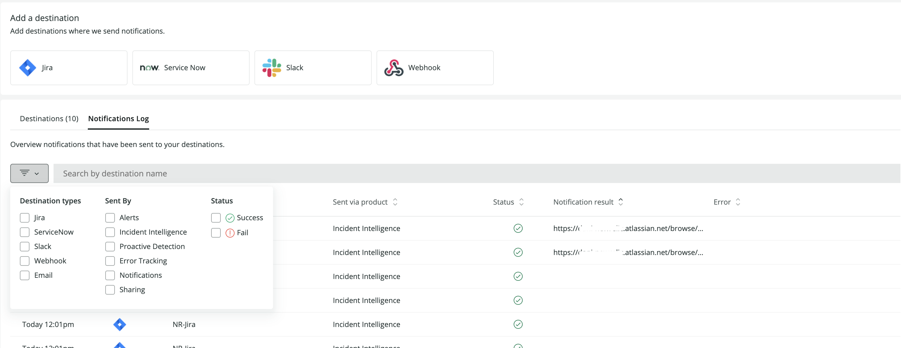

<Callout title="Early access">
The features described here are early access. You won't be able to use these features if you're not part of the early access program.

For more information on related features, see our docs on [Alerts notification channels](/docs/alerts-applied-intelligence/new-relic-alerts/alert-notifications/notification-channels-control-where-send-alerts/), [Incident Intelligence destinations](/docs/alerts-applied-intelligence/applied-intelligence/incident-intelligence/incident-intelligence-destination-examples/), and [Proactive Detection notifications](https://docs.newrelic.com/docs/alerts-applied-intelligence/applied-intelligence/proactive-detection/proactive-detection-applied-intelligence/#set-up).
</Callout>

Destinations are where we send notifications about your New Relic One data. A destination is a unique identifier for a third-party system that you use. 

Destination settings contain the connection details to integrate with third-party systems and can be used across a variety of tools in New Relic One.

The supported destination platforms include:

* Atlassian Jira
* ServiceNow
* Slack
* Webhook
* Email (Coming soon!)
* PagerDuty (Coming soon!)
* AWS EventBridge (Coming soon!)

For more on these and other destinations, see [notification integrations](/docs/alerts-applied-intelligence/notifications/notification-integrations).

<Callout variant="tip">
  It's also possible to configure destinations using the `aiNotifications` [NerdGraph  API](https://developer.newrelic.com/collect-data/get-started-nerdgraph-api-explorer/).
</Callout>

## Required capabilities [#required-roles] 

Destination settings require specific [capabilities](/docs/accounts/accounts-billing/new-relic-one-user-management/new-relic-one-user-model-understand-user-structure/#capabilities): 

* To access your settings: you need `View` capabilities for `Applied Intelligence:Destinations` or `Alerts`.
* To modify or delete your settings: you need `Modify` capabilities for `Applied Intelligence:Destinations` or `Alerts`.

## Manage destinations [#manage-destinations]

1. Go to [one.newrelic.com](https://docs.newrelic.com/one.newrelic.com), click **Alerts & AI**, and in the left nav under **Enrich and Respond**, click **Destinations**. The destinations table shows information about the existing destinations and allows users to enable, disable, and modify.
2. To add a destination, click the appropriate platform tile. To modify destination settings, click the destination row in the destinations table.

<figcaption>**one.newrelic.com > Alerts & AI > Destinations**.</figcaption>

### Destination status [#manage-destinations]

Destinations have a 'status' value that indicates if we encountered issues while processing and sending events to them (see the destinations table in the above image).
Some errors, like Authentication or Authorization issues, require an update to the destination's connection details. After the update, the destination status value will be changed to "Default".  

## Notifications log [#notifications-log]

To view past notification events details, go to the **Destination** menu, and click the **Notifications log** tab.

Notifications log enable you to view the history and status of all your past notifications. Here you can view the status of any notification along with related error details and destination ticket numbers.

<figcaption>Filter your destination logs by destination type, sent by, and status.</figcaption>
