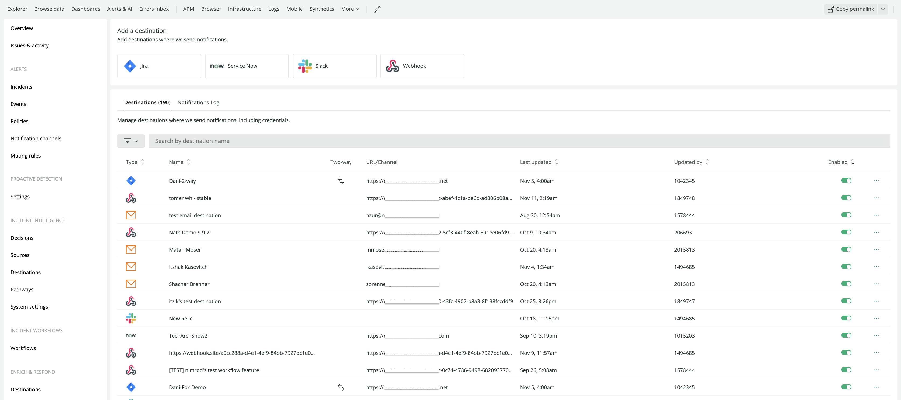
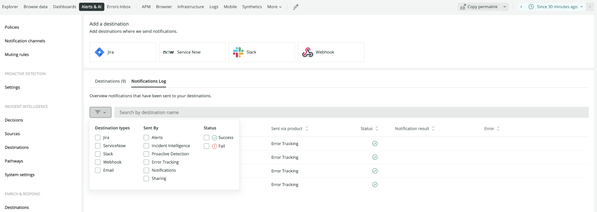

<Callout title="Early access">
The features described here are early access.

For more information on related features, see our docs on [Alerts notification channels](/docs/alerts-applied-intelligence/new-relic-alerts/alert-notifications/notification-channels-control-where-send-alerts/), [Incident Intelligence destinations](/docs/alerts-applied-intelligence/applied-intelligence/incident-intelligence/incident-intelligence-destination-examples/), and [Proactive Detection notifications](https://docs.newrelic.com/docs/alerts-applied-intelligence/applied-intelligence/proactive-detection/proactive-detection-applied-intelligence/#set-up).
</Callout>

Destinations are unique identifiers for third-party systems. The destination you choose is the location where we send your notifications. Destination settings contain connection details to integrate with third-party systems and can be used across a variety of tools in New Relic One.

The supported destination platforms include:

* Email
* Jira
* ServiceNow
* Slack
* Webhook

For more on these destinations, see [notification integrations](/docs/alerts-applied-intelligence/new-relic-alerts/get-started/notification-integrations).

<Callout variant="tip">
  It's also possible to configure destinations using the `aiNotifications` [NerdGraph  API](https://developer.newrelic.com/collect-data/get-started-nerdgraph-api-explorer/).
</Callout>

## Required roles in New Relic One [#required-roles]

Destinations require specific user roles.

* To access your destinations settings, you must have either `View` capabilities for `Applied Intelligence:Destinations` or for `Alerts`.
* To modify/delete your destinations settings, you must have either `Modify` capabilities for `Applied Intelligence:Destinations` or for `Alerts`.

## Add a destination [#add-destination]

Follow these steps to add a new destination for your notifications.

1. Go to [one.newrelic.com](https://docs.newrelic.com/one.newrelic.com), click **Alerts & AI**, and, in the left nav under **Enrich and Respond**, click **Destinations**.

2. Select one of the destination types at the top of the destination management screen.

3. The **Destinations** table shows information about the existing destinations and allows users to enable, disable, modify, or create new destinations.

<figcaption>If you have access to it, find the destinations overview page at **one.newrelic.com > Alerts & AI > Destinations**.</figcaption>

To add a destination, click the appropriate platform tile. To modify destination settings, click the destination row in the destinations table

## Notifications log [#notifications-log]

To view past notification events details, go to the **Destination** menu, and click the **Notifications Log** tab.

Notification logs enable you to view the history and status of all your sent notifications. Here you can view the status of any notification along with related error details and destination ticket numbers.

<figcaption>Filter your destination logs by destination type, sent by, and status.</figcaption>