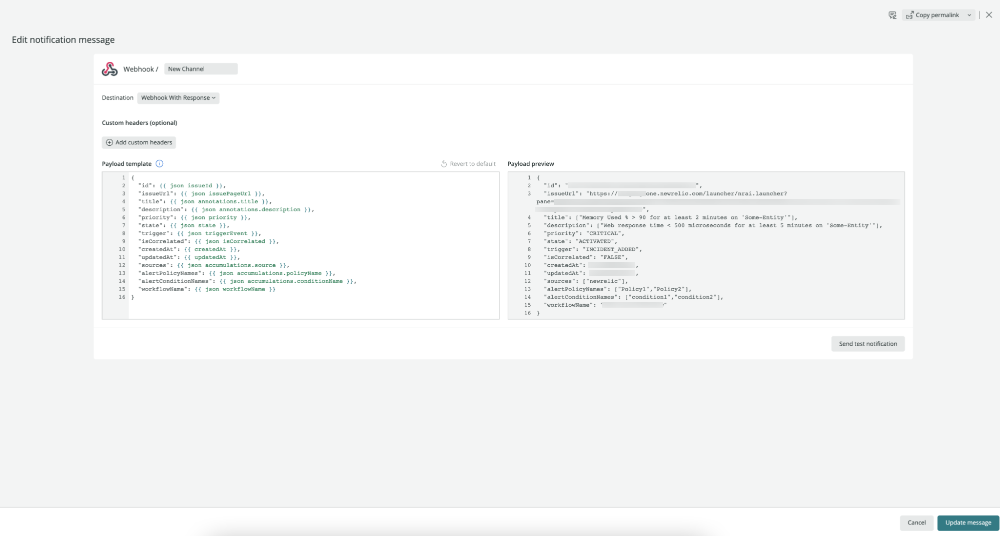

<Callout title="Early access">
The features described here are early access.

For more information on related features, see our docs on [Alerts notification channels](/docs/alerts-applied-intelligence/new-relic-alerts/alert-notifications/notification-channels-control-where-send-alerts/), [Incident Intelligence destinations](/docs/alerts-applied-intelligence/applied-intelligence/incident-intelligence/incident-intelligence-destination-examples/), and [Proactive Detection notifications](https://docs.newrelic.com/docs/alerts-applied-intelligence/applied-intelligence/proactive-detection/proactive-detection-applied-intelligence/#set-up).
</Callout>

Notification message templates enable you to customize notifications before they're sent to your destinations. Doing so gives you full control over what data is sent where, as well as being able to fully engage with the services you use.

## Variables [#variables]

Message templates are written in Handlebars syntax using [expressions](https://handlebarsjs.com/guide/expressions.html).

Variables are product-specific attributes used as part of the event-template configuration.



<figcaption>Use the notification message template to map your New Relic notifications to the fields in your external services.</figcaption>

## The variables menu [#variables-menu]

Choose the variables important to you from the variables menu. The variables are grouped into subcategories. 

Type `{{` to select from a list of variables. As you type, variable names appear via autocomplete. The variable type is written on the right-hand side. You can add enriched data to these variables.

## Use the Handlebars syntax[#handlebars-syntax]

Handlebars is a templating language that enables you to use dynamic content to customize your notification events.

When the template is executed via the rendering process, the Handlebar variables are replaced with values from the event that generated the notification.


<figcaption>The variables menu shows all of the options you have when mapping New Relic notification fields onto the fields in your external service.</figcaption>

The Handlebars language provides many features in addition to basic variable replacement, including evaluating [nested input objects](https://handlebarsjs.com/guide/#nested-input-objects) and functions, such as iterations (loops), conditional statements, and more. In handlebars, these functions are called helpers.

## Specific helper functions [#help-functions]

Our message templates support all of the Handlebars built-in helpers.

In addition, we've added other helpers that might be useful to you.

### JSON [#json]

The `{{json}}` helper converts text to a JSON element.

Use this when you're configuring a Webhook’s payload, which uses a JSON syntax, and any other situation you might want to pass JSON formatted data.

For example, with a variable called `data`.

```
{
   "data":{
      "tags":["infra, team-a"]
   }
}
```

To get the `names` array as a JSON element, use the `{{json}}` helper:

`{{json data.tags}}`

to get:

`["infra","team-a"]`

### Equality [#eq]

The `{{eq}}` helper compares string values or other variables. 

When used to evaluate variables `a` and `b`, this renders `yes` or `no`:

`{{#eq a b}} yes {{else}} no {{/eq}}`

This example compares string value `"a"` to variable `b`, and then returns `yes` or `no`:

`{{#eq "a" b}} yes {{else}} no {{/eq}}`

This returns `true` or `false`:

`{{eq a b}}`

Returns `y` or `n`:

`{{eq a b yes='y' no='n'}}`

## Usage examples [#usage-examples]

The examples are based on a variable called `data`.

```
"data":{
    "tags":["infra, team-a"],
    "id":123456789,
    "name": "Alice",
 }
```

The variable value above has an equivalent, `dot-notated` form:

```
"data.tags": ["infra, team-a"]
"data.id": 123456789
"data.name": "Alice"
```

If `id` equals `123456789`, then the output is `valid`. If not, output is `not valid`.

```
{{eq data.name "Alice" yes='valid' no = 'not valid'}}
```

If `name` equals `Alice`, then the output is `valid`.

Get the `tags` and object’s properties in a JSON form:

```
{{json data.tags}}
```
would return the JSON:

```
["infra","team-a"]
```

Get the first tag from the `tags` array:

```
{{json data.tags.[0]}}
```

would return the first value from the array:

```
"infra"
```

Iterate a variable of type array and aggregate the values:

```
{{#each tags}}{{this}}{{#unless @last}}, {{/unless}}{{/each}}
```

would return all of the values from each tag:

```
infra, team
```

Similarly, iterate the `data` variable, aggregate the object’s values, and output a JSON element:

```
{{#each (json data)}}{{this}}{{/each}}
```

would return JSON like this: 
```
{
	"tags":["infra, team-a"],"name":"n","id":"Alice"
}
```

Alternately, iterate the `data` variable, then aggregate the object’s entries to a String:

```
{{#each data}}{{@key}}: {{this}}{{#unless @last}}, {{/unless}}{{/each}}
```

would return a string like:

```
tags: infra,team-a, name: n, id: 123
```
