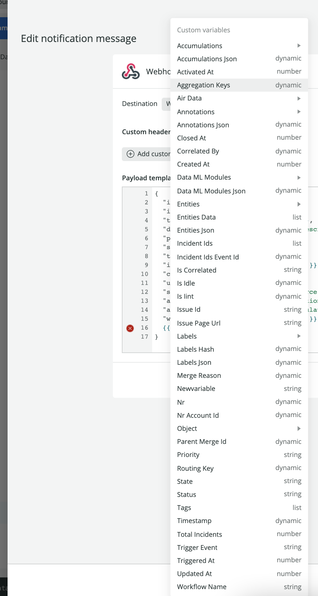

<Callout title="Early access">
The features described here are early access. You won't be able to use these features if you're not part of the early access program.

For more information on related features, see our docs on [Alerts notification channels](/docs/alerts-applied-intelligence/new-relic-alerts/alert-notifications/notification-channels-control-where-send-alerts/), [Incident Intelligence destinations](/docs/alerts-applied-intelligence/applied-intelligence/incident-intelligence/incident-intelligence-destination-examples/), and [Proactive Detection notifications](https://docs.newrelic.com/docs/alerts-applied-intelligence/applied-intelligence/proactive-detection/proactive-detection-applied-intelligence/#set-up).
</Callout>

Notification message templates enable you to customize your notification events data before it's sent to your third-party destination. The templates map your custom values to the values used by your third-party destination. 

This gives you full control over what data will be sent and where, as well as being able to fully engage with the services you use.

## Message template variables [#variables]

A message template is what you use to convert New Relic event data to data that's consumable by your third-party service. Variables are specific attributes that are mapped to data fields in your third-party service.

Message templates are written in a simple templating language called [Handlebars](https://handlebarsjs.com/guide/). Variables in the message templates are written as [expressions](https://handlebarsjs.com/guide/expressions.html) inside double curly braces `{{ }}`.


<figcaption>Use the notification message template to map your New Relic notifications to the fields in your external services.</figcaption>

## The variables menu [#variables-menu]

All of the New Relic variable names are listed in the message template variables menu. The variables are grouped into subcategories. 

In the variables menu, type `{{` to select from a list of variables. As you type, variable names appear via autocomplete. The variable type is written on the right-hand side. You can add enriched data to these variables.

## Use the Handlebars syntax [#handlebars-syntax]

When an event generates a notification, the message template uses the Handlebar variables to map the notification data to the fields used by your third-party service.



<figcaption>The variables menu shows all of the options you have when mapping New Relic notification fields onto the fields in your external service.</figcaption>

The Handlebars language provides many features in addition to basic variable replacement, including evaluating [nested input objects](https://handlebarsjs.com/guide/#nested-input-objects) and functions, such as iterations (loops), conditional statements, and more. In Handlebars, these functions are called helpers.

## Helper functions [#help-functions]

Our message templates support all of the Handlebars [built-in helpers](https://handlebarsjs.com/guide/builtin-helpers.html).

In addition, we've added other helpers that might be useful to you.

<CollapserGroup>
  <Collapser
    className="freq-link"
    id="json"
    title="JSON"
  >

The `{{json}}` helper converts text to a JSON element.

Use this when you're configuring a Webhook’s payload, which uses a JSON syntax, and any other situation you might want to pass JSON formatted data.

For example, with a variable called `data`.

```json
{
   "data":{
      "tags":["infra, team-a"]
   }
}
```

To get the `names` array as a JSON element, use the `{{json}}` helper:

```handlebars
{{json data.tags}}
```

to get:

```json
 ["infra","team-a"]
```

  </Collapser>


    <Collapser
    className="freq-link"
    id="eq"
    title="Equality"
  >

Use the equality `{{#eq}}` helper to compare variables.

```handlebars
Compares variables a and b, renders 'yes' or 'no':

{{#eq a b}} yes {{else}} no {{/eq}}

Compares String value "a" to variable b, renders 'yes' or 'no':

{{#eq "a" b}} yes {{else}} no {{/eq}}

Renders 'true' or 'false':

{{eq a b}}

Render 'y' or 'n':

{{eq a b yes='y' no='n'}}
```

  </Collapser>  
</CollapserGroup>

## Usage examples [#usage-examples]

The examples are based on a variable called `data`:

```json
"data": {
    "tags":["infra, team-a"],
    "id":123456789,
    "name": "Alice",
}
```

The `data` value has an equivalent, dot-notated format:

```json
"data.tags": ["infra, team-a"]
"data.id": 123456789
"data.name": "Alice"
```

### Validate data [#validate]

If `id` equals `123456789`, then the output is `valid`. If not, the output is `not valid`.

```handlebars
{{eq data.name "Alice" yes='valid' no='not valid'}}
```

If `name` equals `Alice`, then the output is `valid`.

### Return JSON [#json]

Get the `tags` and object’s properties in a JSON form:

```handlebars
{{json data.tags}}
```

This would return the following JSON:

```json
["infra","team-a"]
```

### Get values from an array [#array]

Get the first tag from the `tags` array:

```handlebars
{{json data.tags.[0]}}
```

This would return the first value from the array:

```shell
"infra"
```

### Iterate through an array [#iterate-array]

Iterate a variable of type array and aggregate the values such as:

```handlebars
{{#each tags}}{{this}}{{#unless @last}}, {{/unless}}{{/each}}
```

This would return all of the values from each tag:

```shell
infra, team
```

Similarly, iterate the `data` variable, aggregate the object’s values, and output a JSON element:

```handlebars
{{#each (json data)}}{{this}}{{/each}}
```

This would return a JSON such as:

```json
{
	"tags":["infra, team-a"],"name":"Alice","id":"123456789"
}
```

Iterate the `data` variable, then aggregate the object’s entries to a String:

```handlebars
{{#each data}}{{@key}}: {{this}}{{#unless @last}}, {{/unless}}{{/each}}
```

This would return a string such as:

```shell
tags: infra,team-a, name: Alice, id: 123456789
```

### Handle missing attributes [#missing-attributes]

In some cases, an attribute may be missing from the **Variables** menu, or not exist whatsoever.

We can use the '#if' statement to set a fallback, such as:

```handlebars
{{#if data.type}} {{ json data.type }} {{else}}"N/A"{{/if}} 
```

would return the string `"N/A"`.