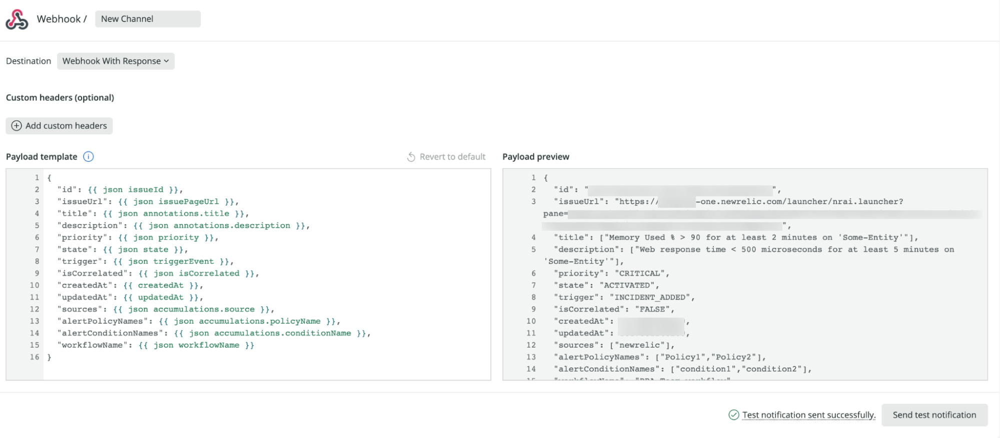

<Callout title="Early access">
The features described here are early access. You won't be able to use these features if you're not part of the early access program.

For more information on related features, see our docs on [Alerts notification channels](/docs/alerts-applied-intelligence/new-relic-alerts/alert-notifications/notification-channels-control-where-send-alerts/), [Incident Intelligence destinations](/docs/alerts-applied-intelligence/applied-intelligence/incident-intelligence/incident-intelligence-destination-examples/), and [Proactive Detection notifications](https://docs.newrelic.com/docs/alerts-applied-intelligence/applied-intelligence/proactive-detection/proactive-detection-applied-intelligence/#set-up).
</Callout>

Alerts and Applied Intelligence notification integrations are specific services and platforms you can use to send notifications from New Relic.

## Integration details [#detail]

Read more about each of our specific notification integrations.

<CollapserGroup>
    <Collapser
    className="freq-link"
    id="jira"
    title="Atlassian Jira"
  >

**Integrate New Relic with Atlassian Jira(Cloud) and automatically create and update Jira issues..**

## Permissions [#permissions]

The required permissions from the Jira `API-Token` are `create`, `edit`, and `close` tickets.

To enable the two-way sync toggle, the provided Jira `API-Key` should have an `Admin` role.

## Set up a Jira destination [#set-up-jira]

Create Jira issues, then enable Jira and New Relic to share updates and stay synced.

To create a Jira destination, enter the following information:

* **Destination name:** Custom name to identify the destination
* **Jira account endpoint:** the URL of the destination
* **User-name:** this will be the email address of the user making the connection
* **API token:** generated from your Atlassian account

<Callout variant="important">
  New Relic currently supports Atlassian-Jira Classic (company-managed) projects.
</Callout>

Before saving the destination, we recommend you test the connection via the **test connection** button.

<figcaption>Jira destination configuration. We recommand to test the connection before saving.</figcaption>

### Two-way sync [#jira-two-way]

You can enable a two-way integration with Jira to keep the issues' state synced with the corresponding state in New Relic.
To enable two-way sync, turn on the ‘two-way integration’ toggle.

When turned on, a [Jira Webhook](https://developer.atlassian.com/server/jira/platform/webhooks/) would be created in your Jira account at a later stage, for the selected project (see ‘customize a message template’). 
The webhook would contain access details to Newrelic (URL and Newrelic-API-KEY)

## Configure the message template [#configure-jira-message-template]

To configure a template for a Jira issue, you first need to choose a destination. You will be able to create a new destination at this stage. 

Upon successful connection to the destination, you will need to choose a project, and then select the Jira issue type you would like to be used. 

Once the issue-type is selected, the configured project's fields are fetched from your account and automatically mapped to your Jira instance. 

To help you get started, we automatically present the required and recommended fields and values. 

Required fields must be set with a value. You can add or remove optional fields(use the `X` mark on their right side)

<figcaption>Jira message template.</figcaption>

### Send a test notification [#send-jira-test]

You can see how the JIRA issue will appear by clicking a test notification with default field values.

If successful, a JIRA issue will be created and a link will appear.
  
  </Collapser>
    <Collapser
    className="freq-link"
    id="servicenow"
    title="ServiceNow (Incident-Management)"
  >
  **Integrate New Relic with ServiceNow Incident-Management and automatically create and update incidents.**

## Roles [#roles]

For this integration to work, your ServiceNow user details need read permissions for the tables: `sys_dictionary`, `sys_choice`, `sys_user`, and `change_request` (optional).

A write permission to the `api_key_credentials` table is required to enable two-way integration.

## Set up a destination [#set-up-service-destination]

To create a ServiceNow destination, enter the following information:

* **Destination Name:** custom name to identify the destination
* **Domain:** the URL of the destination
* **User-name:**  the name of the user
* **Password:**  the user name’s password 

Before saving the destination, we recommend testing the connection by clicking the **test connection** button.

### Two-way sync [#two-way-servicenow]

You can configure a two-way integration with ServiceNow Incidents Management to keep the incidents' state synced with the corresponding state in New Relic.

Here are some required steps to remember when configuring the two-way integration:

1. Turn on the `two-way integration` toggle. 

2. Open and download this <a href="https://storage.googleapis.com/newrelic-notifications/snow-two-way-sync/Newrelic-Snow-Sync-Configurations.xml" download="NewRelic-SNow-Sync-Configurations.xml">XML file</a>, which includes the business rule triggering events back to New Relic One.

3. In the ServiceNow sidebar menu, go to **System Definition > Business Rules**.

4. Click the menu icon in one of the column headers, select **Import XML** and upload the XML file you downloaded.

Once the Destination is saved, a New-Relic API-Key will be kept in the `api_key_credentials`. The key would sent in a header as part of the callback REST call to New-Relic

## Configure the message template [#configure-servicenow-message-template]

Upon a successful connection, ServiceNow incident table columns are fetched from your account and automatically mapped to your ServiceNow instance. 

To help you get started, we automatically present the required and recommended fields and values. 

Required fields must be set with a value. You can add or remove optional fields(use the `X` mark on their right side)

<figcaption>Select, edit or remove fields for the ServiceNow-Incident template.</figcaption>

### Send a test notification [#send-servicenow-test]

You can see how the ServiceNow incident will appear by clicking a test notification with default field values.

If successful, an incident will be created and a link will appear.

  </Collapser>
    <Collapser
    className="freq-link"
    id="slack"
    title="Slack"
  >
 
**Send notifications-messages to your Slack channels.**

## Prerequisites [#slack-prereqs]

Your Slack workspace needs to have the [New Relic application](https://newrelic.slack.com/apps/AP92KQJS3-new-relic?tab=more_info) installed.
The application must be approved by a workspace admin before it can be individually installed by users

## Set up a Slack destination [#set-slack-destination]

Click on the `one-click Slack authentication' will lead you to the Slack landing page to continue the OAuth2 authentication process.

On the Slack landing page, if you're not signed into the required workspace, you're redirected to Slack to sign in.

Add your workspace name or select the relevant workspace and click **Continue**.

When signed in to the selected workspace, you are requested to allow New Relic to perform the specified actions.

Clicking `Allow' will redirect you back to the Destination page.

## Configure the Slack message settings [#configure-slack-message-settings]

Select a Destination(Workspace) and select a Slack-channel where the messages will be sent.
You can create a new destination if there is no pre-defined destination for the required workspace.
Note that, for privacy reasons, users need to be authenticated to select private channels (one-time process)

### Send a test notification [#send-slack-test]

You can send a test notification with a pre-defined example payload to the channel. This creates a message in the selected Slack-channel.

  </Collapser>
    <Collapser
    className="freq-link"
    id="webhook"
    title="Webhook"
  >
  **Use the webhook notifier to send the notification messages to any endpoint you like.**

## Set up a webhook destination [#set-webhook-destination]

To create a webhook destination, you need the following:

* **Destination Name:** A unique destination name
* **URL:** the endpoint of the target application, authentication and custom headers if needed.
* **Authorization mechanism (*Optional*):**. Can be `basic authentication` or a `bearer token`

## Configure the webhook event template [#configure-webhook-event-template]

Pick a webhook destination from the list and configure the `HTTP-POST` request. 

The request configuration requires you to:
1. Set a name for the template.
2. Select a pre-configured destination from the destinations list or create a new one.
3. Add custom headers (optional).
4. Configure the request’s payload.

## Customize the webhook payload [#customize-webhook-payload]

You can use the default payload or customize it to contain the required data.
Pick Variables from the [Variables menu](/docs/alerts-applied-intelligence/notifications/message-templates/#variables-menu) and apply [handlebars syntax](/docs/alerts-applied-intelligence/notifications/message-templates/#handlebars-syntax) to enrich your webhook.

Note that the request’s content-type is JSON by default. Hence, the payload needs to keep the JSON form.
See [Usage examples](/docs/alerts-applied-intelligence/notifications/message-templates/#usage-examples) 

The ‘preview’ section on the right hand-side shows an expected payload after the template is rendered. 
If the eventual payload would not form a valid Json, an error will be shown and it won’t be possible to save the template. 

If the webhook payload conforms a valid Json, you can send a test notification to your defined webhook destination 

<figcaption>We recommend sending a test notification to make sure that everything's connected correctly.</figcaption>

  </Collapser>
</CollapserGroup>
