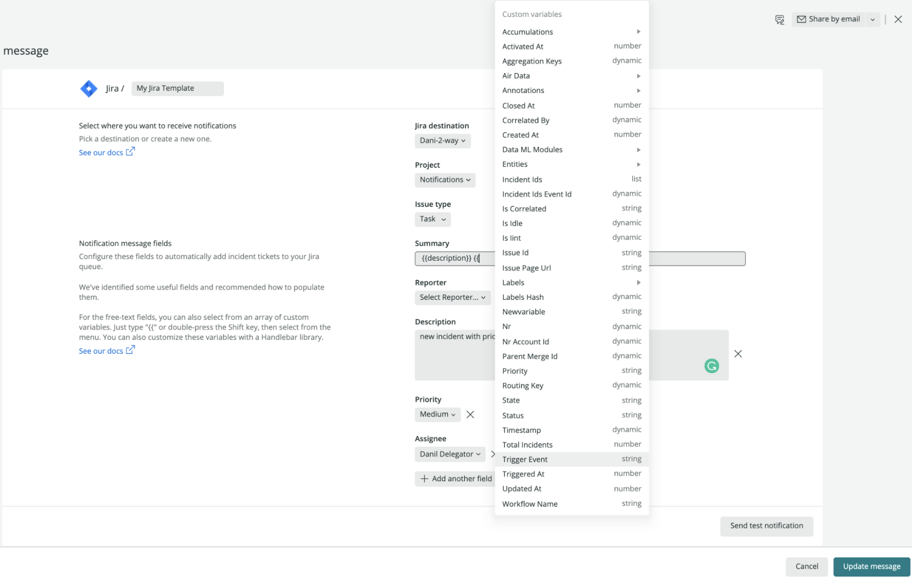

Alerts and Applied Intelligence notification integrations are specific services and platforms you can use to send notifications from New Relic.

## Notification integration detail [#detail]

Read about more about each of our specific notification integrations.

* Email
* Jira
* ServiceNow
* Slack
* Webhook

<CollapserGroup>
  <Collapser
    className="freq-link"
    id="email"
    title="Email"
  >
  Send email notifications to users with or without New Relic accounts. You don't need to create new destinations for emails, as they're automatically added from email addresses in the event template.

## Configure the event template [#configure-event-template]

Users with New Relic accounts can be found via autocomplete when searching for first or last name.

To add a user without a New Relic account or email distribution list, add the full email address.

## Send a test notification [#email-test]

You can send a test notification with a pre-defined example title and body to the emails you define.
  </Collapser>
    <Collapser
    className="freq-link"
    id="jira"
    title="Jira"
  >

Send notifications to users of Atlassian Jira.

## Permissions [#permissions]

The required permissions from the Jira `API-Token` are `create`, `edit`, and `close` tickets.

To enable the two-way sync toggle, the provided Jira `API-Key` needs  an `Admin` role.

## Sett up a Jira destination [#set-up-jira]

Create Jira issues, then enable Jira and New Relic to share updates and stay synced.

To create a Jira destination, enter the following information:

* :**Destination Name::** Custom name to identify the destination
* :**Jira account endpoint::** the URL of the destination
* :**User-name:** this will be the email address of the user making the connection
* :**API Token:** generated from your Atlassian account

<Callout variant="important">
  New Relic currently supports company-managed projects.
</Callout>

Before saving the destination, we recommend you test the connection via the **test connection** button.

## Two-way sync [#jira-two-way]

To enable two-way sync between Jira and New Relic One, enable the `two-way integration` toggle.

When enabled, a Jira webhook would be created in your Jira account at a later stage, for the selected project (see ‘customize a message template’ below). The webhook would contain access details to Newrelic (URL and Newrelic API-KEY).

By default, any update to a Jira issue created by New Relic One will sync back to New Relic One. After enabling two-way integration, when Jira issue changes to closed the corresponding workflow issue will change to Closed.

## Configure the message template [#configure-jira-message-template]

Upon successful connection, Jira fields are fetched from your account and automatically mapped to your Jira instance. 

To help you get started, recommended fields and values are automatically presented. You can add or remove fields and change the values to customize the notification to your needs.

<figcaption>The variables menu changes depending on the destination integration you're using.</figcaption>

## Send a test notification [#send-test-notification]

Users can see how the JIRA issue will appear by clicking a test notification with default field values. If successful, a Jira ticket is created and a link to that ticket appears. 
  
  </Collapser>
    <Collapser
    className="freq-link"
    id="servicenow"
    title="ServiceNow"
  >
  Integrate New Relic with ServiceNow and automatically create and update incidents.

## Roles [#roles]

For this integration to work, your ServiceNow user details need read permissions for the tables: `sys_dictionary`, `sys_choice`, `sys_user`, and `change_request` (optional).

You need a ServiceNow admin role enable two-way integration between ServiceNow and New Relic One.

## Set up a destination [#set-up-service-destination]

To create a ServiceNow destination, enter the following information:

* **Name:** custom name to identify the destination
* **Domain:** the URL of the destination
* **User-name:**  the name of the user
* **Password:**  the user name’s password 

## Two-way Sync [#two-way-servicenow]

You can configure a two-way integration with ServiceNow incidents so that when state updates for the incident (resolved or closed), it triggers an update in the corresponding New Relic issue state. 

Here are some required steps to remember when configuring the two-way integration:

1. Turn on the `two-way integration` toggle. 

2. Open and download this [XML file](), which includes the business rule triggering events back to New Relic One.

3. In the ServiceNow sidebar menu, go to **System Definition > Business Rules**.

4. Click the menu icon in one of the column headers, select **Import XML** and upload the XML file you downloaded.

Before saving the destination, we recommend testing the connection by clicking the **test connection** button.

## Configure the message template [#configure-servicenow-message-template]

Upon a successful connection, ServiceNow incident table columns are fetched from your account and automatically mapped to your ServiceNow instance. 

To help you get started, recommended fields and values are automatically presented.

You can add or remove fields and change the values to customize the notification to your needs.

<figcaption>If you're using ServiceNow, we'll recommend some known fields and values you might find useful.</figcaption>

## Send a test notification [#send-servicenow-test]

You can send a test notification with a pre-defined example payload on from the channel. This creates an incident in ServiceNow.

  </Collapser>
    <Collapser
    className="freq-link"
    id="slack"
    title="Slack"
  >
 
Send notifications to your dedicated Slack channels with destinations. New Relic notifications enable you to notify the relevant channel.

## Prerequisites [#slack-prereqs]

Your Slack workspace needs to have the [New Relic application](https://newrelic.slack.com/apps/AP92KQJS3-new-relic?tab=more_info) installed.

## Set up a Slack destination [#set-slack-destination]

Use one-click Slack authentication to enable Slack.

If you're not signed into your workspace, you're redirected to Slack to sign in.

Add your workspace name or choose the relevant workspace and click **Continue**.

If you're signed in, choose the relevant workspace from the top right and click **Allow**.

## Configure the Slack message template [#configure-slack-message-template]

The Slack notification message is pre-defined and cannot be changed. 

## Send a test notification [#send-slack-test]

You can send a test notification with a pre-defined example payload to the channel. This creates a message in Slack.

  </Collapser>
    <Collapser
    className="freq-link"
    id="webhook"
    title="Webhook"
  >
  Use the webhook notifier to send the notification messages to any endpoint you like.

## Set up a webhook destination [#set-webhook-destination]

To create a webhook destination, you need the following:

* **Name:** A unique Destination name
* **URL:** the endpoint of the target application, authentication and custom headers if needed.
* **Authorization:** `Basic authentication` or a `Bearer token` is needed
    * Basic authentication allows users to provide the username and password associated with your HTTP endpoint, which will populate in the header.
    * Bearer token involves security tokens, where the token is a cryptic string. The user must send this token in the authorization header when requesting protected resources

## Configure the webhook event template [#configure-webhook-event-template]

Pick a webhook destination from the list and configure the `HTTP-POST` request. 

The request configuration requires you to:
1. Set a name for the template.
2. Select a pre-configured destination from the destinations list or create a new one.
3. Add custom headers (optional).
4. Configure the request’s payload.

## Customize the webhook payload [#customize-webhook-payload]

You can use the default payload or customize it to contain the required data.
Pick variables from the variables menu and use Handlebars syntax to enrich your webhook.

The request’s webhook content type is JSON by default and the payload needs to also use JSON. 

The preview section on the right hand-side shows an expected payload after the template is rendered. 

## Send a test notification [#webhook-test]

You can send a test notification to your defined webhook destination.

<figcaption>We recommend sending a test notification to make sure that everything's connected correctly.</figcaption>

  </Collapser>
</CollapserGroup>
