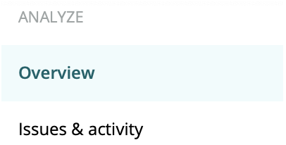
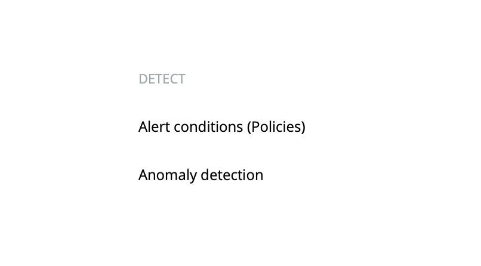
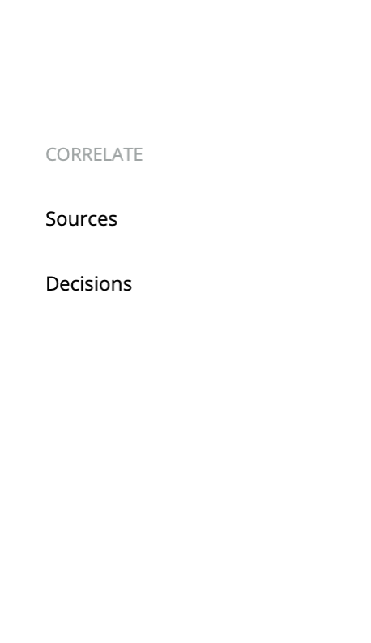
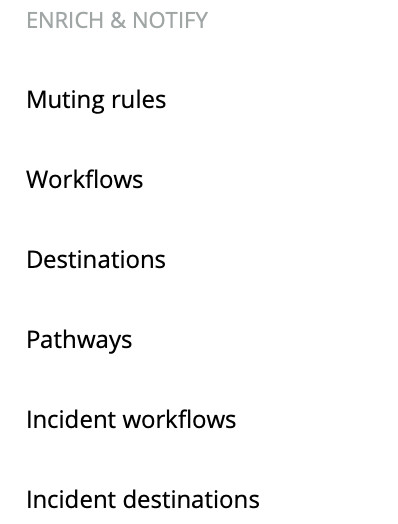
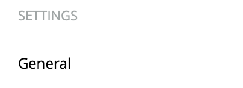

Although the alerts and applied intelligence navigation has changed pretty dramatically, all the features you use are still there. Use this guide to find the alerts and applied intelligence features you want to use.

## Analyze [#analyze]

<figcaption>Use the analyze section to get a high-level view of your violations, issues, incidents, and anomalies.</figcaption>

The [overview page](/docs/alerts-applied-intelligence/new-relic-alerts/get-started/alerts-ai-overview-page) shows your most recent open, closed, and muted violations.

The **Issues & activity** page shows your most recent [issues](/docs/alerts-applied-intelligence/new-relic-alerts/get-started/alerts-ai-overview-page/#issues), [incidents](/docs/alerts-applied-intelligence/new-relic-alerts/get-started/alerts-ai-overview-page/#incidents), and [anomalies](/docs/alerts-applied-intelligence/new-relic-alerts/get-started/alerts-ai-overview-page/#anomalies).

## Detect [#detect]

<figcaption>Use the detect section to review and create your alerts policy conditions and anomaly detection configurations.</figcaption>

The [alert conditions (policies) page](/docs/alerts-applied-intelligence/new-relic-alerts/alert-policies/create-edit-or-find-alert-policy/) lists the policies where your conditions are created and organized. Create new policies here.

The [anomaly detection page](/docs/alerts-applied-intelligence/applied-intelligence/proactive-detection/expanded-anomaly-detection/) lists your expanded anomaly detection configurations. You can add or edit the configurations here.

## Correlate [#correlate]

<figcaption>Use the correlate section to manage your incident intelligence sources and decisions.</figcaption>

The [sources page](/docs/alerts-applied-intelligence/applied-intelligence/incident-intelligence/get-started-incident-intelligence/#1-configure-sources) shows your configured incident intelligence sources. You can add new sources or configure existing ones.

The [decisions page](/docs/alerts-applied-intelligence/applied-intelligence/incident-intelligence/change-applied-intelligence-correlation-logic-decisions/) shows your correlated incidents. You can review, edit, and add decisions.

## Enrich & notify [#enrich]

<figcaption>Use the enrich & notify section to further configure your alerts, incident intelligence, proactive detection, or workflows settings.</figcaption>

Use the [muting rules page](/docs/alerts-applied-intelligence/new-relic-alerts/alert-notifications/muting-rules-suppress-notifications/) to temporarily stop your alerts violation notifications.

Use [workflows](/docs/alerts-applied-intelligence/applied-intelligence/incident-workflows/incident-workflows/) to add more data to your alerts notifications.

Use [destinations](/docs/alerts-applied-intelligence/applied-intelligence/incident-intelligence/get-started-incident-intelligence/#2-configure-destinations) to configure where your applied intelligence notifications get sent.

Use [pathways](/docs/alerts-applied-intelligence/applied-intelligence/incident-intelligence/get-started-incident-intelligence/#3-configure-pathways) to configure where your correlated issues get sent.

Use [incident workflows](/docs/alerts-applied-intelligence/applied-intelligence/incident-workflows/incident-workflows/) to automate common problems and actions related to your alerts policies.

Use [incident destinations](/docs/alerts-applied-intelligence/applied-intelligence/incident-intelligence/incident-intelligence-destination-examples/) to add and configure third-party services for your incidents.

## Settings [#settings]

<figcaption>Use the settings section to review and manage your incident intelligence usage.</figcaption>

Use the settings page to review and manage your current incident intelligence usage.

## Alerts (classic) [#alerts]

 section.")

<figcaption>Use the alerts (classic) section to return to the alerts UI you're familiar with.</figcaption>

Use the [events and incidents pages](/docs/alerts-applied-intelligence/new-relic-alerts/alert-incidents/view-violation-event-details-incidents/) to review alerts violations and other events.

Use the [channels page](/docs/alerts-applied-intelligence/new-relic-alerts/alert-notifications/notification-channels-control-where-send-alerts/) for a list of your alerts notification channels and to create new channels.