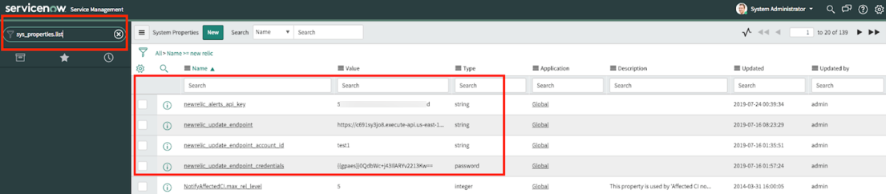

<Callout variant="important">
  This feature is being replaced by the advanced service called **Incident Workflows**. For updated docs, see [Notifications using Incident Workflows](https://docs.newrelic.com/docs/new-relic-one/use-new-relic-one/new-relic-ai/enhance-notifications-using-incident-workflows).
</Callout>

New Relic Connect enables you to customize New Relic webhooks to meet your team’s complex notification requirements. You can automatically send incident data to and from wherever you want, attaching relevant information. This way you no longer have to search for issues and can respond to incidents quickly. New Relic Connect enables you to:

* Establish two-way integration with incident management tools.
* Connect to additional notification platforms.
* Customize webhook payloads with additional attributes.
* Enrich webhooks with database information.

New Relic Connect can be used to build workflows that link your data from multiple tools and take intelligent actions. Currently supported destinations for New Relic Connect include [Amazon EventBridge](https://aws.amazon.com/eventbridge/), [Atlassian Jira](https://www.atlassian.com/software/jira), and other New Relic Alerts webhooks.

Connect with:

* [Amazon EventBridge](#using_new_relic_connect_w_aws_eventbridge)
* [Atlassian Jira](#using_new_relic_connect_w_jira)
* [New Relic Alerts webhook](#using_new_relic_alert_webhooks)
* [ServiceNow](#servicenow)
* [Zapier](#using_new_relic_alert_zapier)

## Requirements for getting started with Connect

To get access to this feature, contact your account representative or [fill out this form](https://sgnf.typeform.com/to/V1QGhO).

## Configure a New Relic Connect webhook [#configure_new_relic_webhook]

To configure a webhook using New Relic Connect, go to **[rpm.newrelic.com/apm](https://rpm.newrelic.com/apm) > Alerts > Notification channels > New notification channel**. See the [webhooks information](/docs/alerts/new-relic-alerts/managing-notification-channels/notification-channels-control-where-send-alerts#webhook) to learn more about these fields.

1. For the **Base Url**, add `https://connect.newrelic.com/YOUR_NEW_RELIC_ACCOUNT_ID`
2. In the **Basic Auth** area, set the username and password provided by your New Relic account representative. This is provided as an additional security measure and is required regardless of destination type.
3. In the **Custom Headers** area, set the name to `account_id` and for **Value**, add your [New Relic account ID](/docs/accounts/install-new-relic/account-setup/account-id).

## Connect webhook payload parameters

In the **Use** **Custom Payload** area, you can add additional parameters to customize the webhook. Refer to the following table for a list of required and optional parameters to include for New Relic Connect incidents.

All of the default fields in the custom webhook payload are optional; if you leave the default fields, all of the information in those fields is included in the webhook. You can remove any fields you don't need.

<table>
  <thead>
    <tr>
      <th>
        Parameter
      </th>

      <th>
        Description
      </th>
    </tr>
  </thead>

  <tbody>
    <tr>
      <td>
        `account_id`
      </td>

      <td>
        Required if using `nrql_execution.` Your New Relic account ID.

        `“account_id”: “YOUR_NEW_RELIC_ACCOUNT_ID”`
      </td>
    </tr>

    <tr>
      <td>
        `email_status_report`
      </td>

      <td>
        Optional. Specify an email address that will receive an error report if the webhook fails.

        `“email_status_report”: “YOUR_EMAIL"`
      </td>
    </tr>

    <tr>
      <td>
        `flatten_target`
      </td>

      <td>
        Optional. Add a new root-level field to the webhook payload for each New Relic Alerts target that is associated with the incident. This can be helpful for parsing the payload in incident management tools with a rigid structure or predefined fields.

        `“flatten_target”: “true”`
      </td>
    </tr>

    <tr>
      <td>
        `map_attributes`
      </td>

      <td>
        Optional. An object containing instructions for creating new fields required for the downstream notification channel. Use this field to populate webhook payload fields into new string fields. Each key in the `map_attributes` object specifies a new required field in the final payload, while each value contains a string template describing what original payload values to use while constructing the result.

        The `map_attributes` projection occurs after the NRQL query, and can then use NRQL results in the construction of new fields. In the example below, two new fields are defined to be added to the final webhook payload. `short_description`is copied from an existing field in the default webhook payload called `condition_name`. The second field, `description`, is combined from the static string `First event` and a dynamic value obtained from the first NRQL event. This is appended using the `nrql_execution` feature. To learn about the specific variable, make sure to run your NRQL query using the REST API and inspect the return answer to map all the available fields correctly.

        `"map_attributes": { "short_description": "{{condition_name}}", "description":"First event: {{events[0].id}}", }`
      </td>
    </tr>

    <tr>
      <td>
        `notification_channels`
      </td>

      <td>
        **Required**. This parameter replaces the functionality of the base URL originally specified in the webhook definition, and specifies the destinations for the enriched webhook. It has three fields: `type`, `endpoint`, and `credentials`.

        You can specify an unlimited number of destinations for a given webhook.

        ```
        {
        "notification_channels": [
           {
           "type": "webhook",
           "endpoint": "https://webhook.address.com",
           "credentials": {
              "api_key": "1234",
              "api_key_header": "MyHeader",
              “api_key_header_prefix”: “Bearer”
              "username": "user",
              "password": "pass"
           }
         ]
        },
        ```
      </td>
    </tr>

    <tr>
      <td>
        `notification_channels / type`
      </td>

      <td>
        **Required.** Set for the destination type you'd like to send the webhook to.
      </td>
    </tr>

    <tr>
      <td>
        `notification_channels / endpoint`
      </td>

      <td>
        **Required**. The URL to send the event to.
      </td>
    </tr>

    <tr>
      <td>
        `notification_channels / credentials`
      </td>

      <td>
        Optional. Credentials are optional for webhooks; for Amazon EventBridge, this includes your `aws_account_id` and `aws_region.`

        If the `credentials` field is not declared on a channel object, the webhook’s basic auth credentials (as defined in the customer setup section) are forwarded to the third-party channel.
      </td>
    </tr>

    <tr>
      <td>
        `notification_channels / credentials / username`
      </td>

      <td>
        Optional. Used for basic authentication. Required if `password` is specified.
      </td>
    </tr>

    <tr>
      <td>
        `notification_channels / credentials / password`
      </td>

      <td>
        Optional. Used for basic authentication. Required if `username` is specified.
      </td>
    </tr>

    <tr>
      <td>
        `notification_channels / credentials / api_key`
      </td>

      <td>
        Optional. A string token to pass in as an HTTP header. The default header is `Authorization`.
      </td>
    </tr>

    <tr>
      <td>
        `notification_channels / credentials / api_key_header`
      </td>

      <td>
        Optional. Used to override which header sends the API key. Has no effect if the `api_key` field is not set.
      </td>
    </tr>

    <tr>
      <td>
        `notification_channels / credentials / api_key_header_prefix`
      </td>

      <td>
        Optional. Add an optional prefix before the API key. A common requirement is to use the prefix `Bearer` for JWT authentication. Has no effect if the `api_key` field is not set.
      </td>
    </tr>

    <tr>
      <td>
        `nrql_execution`
      </td>

      <td>
        Optional. Include an NRQL query that runs when a new incident is triggered; the query results are attached to the webhook payload. For guidance on writing NRQL queries for this field, see the [New Relic Query Language documentation](/docs/query-data/nrql-new-relic-query-language/getting-started/introduction-nrql). Review the query results in the `events` array field of the final webhook payload.

        `"nrql_execution”: “SELECT * FROM Transaction where appName={{incident_id}} SINCE 1 hour ago”`
      </td>
    </tr>

    <tr>
      <td>
        `nrql_credentials`
      </td>

      <td>
        Required if using `nrql_execution.` Insights API key from New Relic.

        `“nrql_credentials”: “YOUR_NEW_RELIC_INSIGHTS_API_KEY”`
      </td>
    </tr>
  </tbody>
</table>

## Use New Relic Connect with Amazon EventBridge [#using_new_relic_connect_w_aws_eventbridge]

New Relic Connect makes it easy to hook New Relic events into AWS services with [EventBridge](https://aws.amazon.com/eventbridge/), Amazon's serverless event bus.

1. Follow the steps to create a New Relic webhook with a custom payload configured for New Relic Connect. Under `notification_channels` in the custom payload:

   * Set the type to `awseventbridge`.
   * Set the endpoint to the name of the new event bus you want to create in EventBridge.
   * Set the credentials to your `aws_account_id` and `aws_region`.

   Example

   ```
   "notification_channels": [
      {
         "type": "awseventbridge",
         "endpoint": ""
         "credentials": {
            "aws_account_id": ""<your account="" id="">
            "aws_region": ""
         }
      }
   ]</your>
   ```
2. Save and send a test event. This first event creates a new [partner event source](https://docs.aws.amazon.com/eventbridge/latest/userguide/create-partner-event-bus.html) in EventBridge automatically.
3. In the Amazon EventBridge UI, click on the new **Partner Event Source** that was created by your test event, and follow the process to associate it with an event bus.
4. Forward the EventBridge event to whatever AWS service you want. After EventBridge rules are configured, future events triggered by your New Relic webhook are pushed to those services automatically.
   To create more complex event filters, add a resources webhook field in the New Relic custom payload. EventBridge automatically gives you the option to use this field’s contents as filters in new rules. For more information about configuring EventBridge rules, see the [EventBridge Documentation](https://docs.aws.amazon.com/eventbridge/index.html).

## Use New Relic Connect with Atlassian Jira [#using_new_relic_connect_w_jira]

Jira is a popular issue and project tracking software that many site reliability engineering (SRE) and DevOps teams use in their incident management and response cycles. New Relic Connect makes it easy to set up a two-way integration with Jira and enhance existing incidents with additional information from other services.

<Callout variant="tip">
  Please note that currently, New Relic Connect is compatible with Jira Cloud. It does not work with Jira Server or Jira Data Center
</Callout>

1. Follow the steps to create a New Relic webhook with a custom payload configured for New Relic Connect. Under `notification_channels` in the custom payload:

   * Set the `type` to `Jira`.
   * Set the `endpoint` to your Jira instance URL.
   * Set the `credentials` using the email address for your Jira account as your `username` and a generic Jira token for your `password`.

   Example:

   ```
   "notification_channels": [
      {
         "type": "jira",
         "endpoint": """
         "credentials": {
            "username": "<your email="">"
            "password": """
         }
      }
   ]</your>
   ```
2. Set additional parameters in the webhook payload:
   * `incident_id`: (required) New Relic incident ID
   * `project`: (required) the Jira project ID for new tickets to be created in
   * `assignee`: (optional) the Jira username to assign new tickets to by default
   * `watchers`: (optional) array of Jira user names to be assigned as watchers for new incidents
3. (Optional) Follow the above instructions to map attributes from the New Relic alert to Jira fields. All single-line text fields (default and custom) are supported; only default (not custom) multi-line text fields are supported.
4. In the Jira UI, create a new field called **new relic incident id** for the New Relic incident ID to map to (required) and add it to the screen for the project you chose in step 2.
5. To enable two-way integration between Jira and New Relic, in the Jira UI, under **Settings > System > Webhooks (under “Advanced”) > Create New**, turn on “updated” for the issue.
6. In the **URL** field, enter `http://connect.newrelic.com/YOUR_NEW_RELIC_ACCOUNT_ID/jiraStatusChange` and append the following parameters:
   * nrApiKey=”&lt;[ADMIN API key for New Relic](https://docs.newrelic.com/docs/apis/get-started/intro-apis/types-new-relic-api-keys#admin)>"
   * jiraApiKey=”&lt;generic Jira token>"
   * username=”&lt;the email address for your Jira account>"
7. Once this is configured, if the status of the Jira ticket changes to anything other than “Done,” the New Relic Alert status updates to “Acknowledged.” Once the Jira ticket is moved to “Done,” it is marked as “Closed” in the New Relic UI.

   ### Full payload example

   ```
   {
     "incident_id": "$INCIDENT_ID",
     "condition_name": "$CONDITION_NAME",
     "short_description": "Example description",
     "email_status_report": "noreplay@connect.newrelic.com",
     "notification_channels": [
       {
         "type": "jira",
         "endpoint": "https://example-instance.atlassian.net/",
         "credentials": {
           "username": "example@youremail.com",
           "password": "examplepassword"
         },
         "project": "EXAMPLE",
         "assignee": "admin",
         "watchers": []
       }
     ],
     "i_will_be_used_in_query": "search",
     "flatten_target": true,
     "nrql_credentials": "",
     "nrql_execution": "SELECT * FROM Transaction where appName={{i_will_be_used_in_query}}",
     "map_attributes": {
       "short_description": "Example description here",
       "summary": "Example summary here",
       "description": "Last transaction: {{events[0].name}}"
     }
   }
   ```

## Use New Relic Connect with ServiceNow [#servicenow]

[ServiceNow](https://www.servicenow.com/) is a popular tool used for incident management and response. New Relic Connect makes it easy to set up a two-way integration with ServiceNow and enhance existing incidents with additional information from other services.

1. Follow the steps above to create a New Relic webhook with a custom payload configured for New Relic Connect.
2. Add `incident_id` as a root field in the custom payload (this field is in the custom payload by default; verify to make sure it’s there before saving the webhook since this is required).
3. Under `notification_channels` in the custom payload:
   * Set the `type` to `servicenow`
   * Set the `endpoint` to your ServiceNow instance url
   * Set the `credentials` to your username and password for ServiceNow. The account whose credentials you’re using should have permissions to create tickets and create new records in data dictionary tables.

     Example:

     ```
     “incident_id”: “<incident ID>”,
     “notification_channels”: [
        {
           “type”: “servicenow”,
           “endpoint”: “http://<var>example.yourdomain.com</var>”
           “credentials”: {
              “username”: “<<var>your_servicenow_username</var>>”
              “password”: “<<var>your_servicenow_password</var>>”
           }
        }
     ]
     ```
4. Import the New Relic Connect XML files.
   * Open [this XML file](https://docs.newrelic.com/sites/default/files/atoms/files/nr_standalone_combined_v1%20%282%29.xml "nr_standalone_combined_v1 (2).xml") (which includes the business rule for New Relic Connect) Navigate to **System Definition → Business Rule** in the ServiceNow sidebar menu.
   * Click the menu icon in one of the column headers, select **Import XML**, and upload the XML file you downloaded.
5. Configure new system properties, which can be found by typing `sys_properties.list` in the ServiceNow search box (these were automatically created by the file you imported in step 4):
   * `nr.newrelic_account_id`: Your New Relic Account ID
   * `nr.update_endpoint`: The URL of the “status update” webhook used for two-way incident synchronization. This URL will be provided by your account representative when you’re ready to get set up with Connect, and is required to update the originating New Relic incident’s status when the ServiceNow ticket tracking the incident is changed.
   * `nr.update_endpoint_username` / `nr.update_endpoint_password`: Basic auth credentials to be used with the webhook.
   * `nr.alerts_api_key`: REST API key used for interacting with the New Relic Alerts API.
   * `nr.ack_states`: Numeric ids of ServiceNow incident states that will trigger an acknowledgement of the tracked New Relic incident alert, separated by commas. Default values: 2,3 (In Progress, On Hold)
   * `nr.resolve_states`: Numeric ids of ServiceNow incident states that will trigger a resolution of the tracked New Relic incident alert, separated by commas. Default values: 6,7,8 (Resolved, Closed, Canceled)

     <Callout variant="tip">
       Numeric ids for incident states can be found in the `sys_choice_list` ServiceNow view, and filtering by `element=”incident_state”`.
     </Callout>

     

     **ServiceNow > All > Name > New Relic**
6. Optional: test the integration with New Relic Connect by configuring a webhook pointing to your ServiceNow installation. For example, `https://my-example.service-now.com`.

## Use New Relic Connect with New Relic Alerts webhooks [#using_new_relic_alert_webhooks]

In addition to connecting to external sources, you can also use New Relic Connect to feed additional data back into New Relic Alerts webhooks. This can be especially useful when combined with the NRQL enrichment functionality to add more context to incoming alerts.

1. Follow the steps to create a New Relic webhook with a custom payload configured for New Relic Connect. Under `notification_channels` in the custom payload:
   * Set the `type` to `webhook`.
   * Set the `endpoint` to the URL for the other New Relic Alerts webhook you’d like to forward to.
   * Set Basic Authentication using your `username` and `password` for New Relic Alerts.

## Use New Relic Connect with Zapier [#using_new_relic_alert_zapier]

Zapier allows users to integrate many different applications, sending information between them and triggering actions in one tool based on events from another. New Relic Connect makes it easy to send enhanced Alerts webhooks to Zapier, which then enables integration with 2000+ tools.

1. Follow [these instructions](https://zapier.com/help/create/code-webhooks/trigger-zaps-from-webhooks) to set up a new webhook trigger (zap) in Zapier. At the **Customize your webhook trigger** step, copy the provided webhook URL.
2. Follow these steps to create a New Relic webhook with a custom payload configured for New Relic Connect. Under `notification_channels` in the custom payload:
   * Set the `type` to `zapier`.
   * Set the `endpoint` to the Zapier webhook URL you copied in step 1.
   * Set the `credentials` using your Zapier `username` and password.

     Example:

     ```
     "notification_channels": [
        {
           "type": "zapier",
           "endpoint": "<zapier webhook url here>"
           "credentials": {
              "username": "<your username here><your email="">"
              "password": "<your password here>"
           }
        }
     ]</your>
     ```
