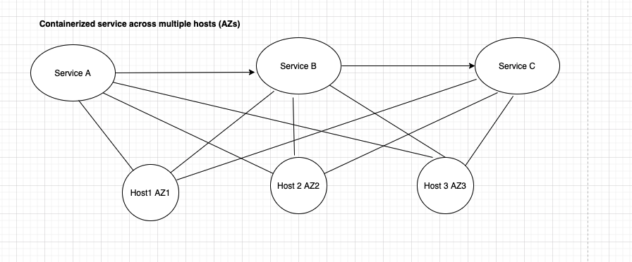

This tutorial will explain how to use our NerdGraph API to set up your topology. Topology configuration allows your [Applied Intelligence decisions](/docs/alerts-applied-intelligence/applied-intelligence/incident-intelligence/change-applied-intelligence-correlation-logic-decisions) to better correlate incidents. 

## Requirements [#requirements]

Topology correlation is currently in limited release. See [topology requirements](/docs/alerts-applied-intelligence/applied-intelligence/incident-intelligence/change-applied-intelligence-correlation-logic-decisions/#topology-requirements).

To use NerdGraph, you'll need a [user key](/docs/apis/nerdgraph/get-started/introduction-new-relic-nerdgraph/#authentication). 

## Overview of tutorial [#overview]

With New Relic’s [Applied Intelligence](/docs/alerts-applied-intelligence/new-relic-alerts/get-started/introduction-applied-intelligence/), you can create custom [decisions](/docs/alerts-applied-intelligence/applied-intelligence/incident-intelligence/change-applied-intelligence-correlation-logic-decisions) that govern how your incidents are correlated. One kind of custom decision logic uses the concept of "topology," which is a representation of your service map: how the services and resources in your infrastructure relate to one another.

This tutorial will show you how to use [NerdGraph](/docs/apis/nerdgraph/get-started/introduction-new-relic-nerdgraph/) to: 

* Set up your topology by creating vertices and edges
* Delete vertices and edges
* Retrieve topology data

Before using NerdGraph to configure your topology, you should have a basic understanding of: 

* [What Applied Intelligence decisions are](/docs/alerts-applied-intelligence/applied-intelligence/incident-intelligence/change-applied-intelligence-correlation-logic-decisions) and [how topology correlation works](/docs/alerts-applied-intelligence/applied-intelligence/incident-intelligence/change-applied-intelligence-correlation-logic-decisions/#topology).
* The topology structure you're trying to implement. One way to understand this is to use our [service map feature](/docs/understand-dependencies/understand-system-dependencies/service-maps/introduction-service-maps/) to see how entities in your infrastructure relate to each other.  
* [What NerdGraph is](/docs/apis/nerdgraph/get-started/introduction-new-relic-nerdgraph) and [how to use the NerdGraph API explorer](/docs/apis/nerdgraph/get-started/introduction-new-relic-nerdgraph/#explorer) to run queries.

## Mutation examples [#mutations]

In NerdGraph, mutations are requests that perform an action ([learn more about NerdGraph terminology](/docs/apis/nerdgraph/get-started/introduction-new-relic-nerdgraph/#terminology)), such as creating a resource or changing a configuration. 

In this section, we’ll show you how to use `aiTopologyCollector` mutations to create, edit, or delete your topology. 

In the create sections, we’ll create vertices and edges to represent this service map:


<figcaption>This tutorial uses NerdGraph to create vertices and edges that represent these entities and their relationships.</figcaption>

### Create vertices [#create-vertices]

The following mutation creates one or more vertices, which represent your monitored entities, and are the source from which your incidents come from. 

The NerdGraph call below uses the following fields:
* `accountId`: Your New Relic account ID.
* `name`: The name of the vertex. This value is case sensitive and must be unique within the graph.
* `vertexClass`: The vertex class can be `application`, `host`, `cloud service`, `cluster`, or `datastore`. This classification allows your decision logic to restrict your topology-based correlation to restrict vertices matching these classifications.
* `definingAttributes`: A set of attributes (key/value pairs) that match an incident event's attributes. These are usually unique identifiers that appear on all incidents, such as entity GUIDs or other IDs. If an incident contains any of the key/value pairs of a vertex’s `definingAttributes`, it’s matched to that vertex. To learn more about attributes and how they can be added, see [Add attributes](/docs/alerts-applied-intelligence/applied-intelligence/incident-intelligence/change-applied-intelligence-correlation-logic-decisions/#add-attributes).

Example call: 

```
mutation {
  aiTopologyCollectorCreateVertices(
  accountId: <var>NEW_RELIC_ACCOUNT_ID</var>, 
    vertices: [
    	{name: "ServiceA", vertexClass: APPLICATION, definingAttributes: [{key: "application/name", value: "ServiceA"}]}, 
    	{name: "ServiceB", vertexClass: APPLICATION, definingAttributes: [{key: "application/name", value: "ServiceB"}]}, 
    	{name: "ServiceC", vertexClass: APPLICATION, definingAttributes: [{key: "application/name", value: "ServiceC"}]}, 
    	{name: "HOST1", vertexClass: HOST, definingAttributes: [{key: "host/name", value: "HOST1"}, {key: "availability-zone", value: "us-west-2a"}, {key: "region", value: "us-west-2"}]}, 
    	{name: "HOST2", vertexClass: HOST, definingAttributes: [{key: "host/name", value: "HOST2"}, {key: "availability-zone", value: "us-west-2b"}, {key: "region", value: "us-west-2"}]}, 
    	{name: "HOST3", vertexClass: HOST, definingAttributes: [{key: "host/name", value: "HOST3"}, {key: "availability-zone", value: "us-west-2c"}, {key: "region", value: "us-west-2"}]}]) 
  {
    result
  }
}
```

### Create edges [#edges]

This mutation is used to create one or more edges, which represent relationships between vertices.

The NerdGraph call below makes use of these fields: 

* `accountId`: Your New Relic account ID.
* `fromVertexName`:  The name of the vertex the edge is starting from.
* `toVertexName`: The name of the connecting vertex.
* `directed`: A boolean that describes how vertices connect. `true` indicates a one-way relationship (for example, one service calling another) and `false` indicates . By default, directed = `true`. 

Example call: 

```
mutation {
  aiTopologyCollectorCreateEdges(
    accountId: <var>NEW_RELIC_ACCOUNT_ID</var>, 
   edges: 
    [
      {directed: true, fromVertexName: "ServiceA", toVertexName: "ServiceB"},
      {directed: true, fromVertexName: "ServiceB", toVertexName: "ServiceC"},
      {directed: false, fromVertexName: "ServiceA", toVertexName: "HOST1"},
      {directed: false, fromVertexName: "ServiceA", toVertexName: "HOST2"},
      {directed: false, fromVertexName: "ServiceA", toVertexName: "HOST3"},
      {directed: false, fromVertexName: "ServiceB", toVertexName: "HOST1"},
      {directed: false, fromVertexName: "ServiceB", toVertexName: "HOST2"},
      {directed: false, fromVertexName: "ServiceB", toVertexName: "HOST3"},
      {directed: false, fromVertexName: "ServiceC", toVertexName: "HOST1"},
      {directed: false, fromVertexName: "ServiceC", toVertexName: "HOST2"},
      {directed: false, fromVertexName: "ServiceC", toVertexName: "HOST3"},      
    ]) {
    result
  }
}
```

### Delete vertices [#delete-vertices]

This mutation deletes vertices in your topology graph. Note that deleting a vertex deletes all edges connected to it. 

The NerdGraph call below uses these fields:
* `accountId`: Your New Relic account ID.
* `vertexNames`: A list of vertex names you want to delete.

Example call: 

```
mutation {
  aiTopologyCollectorDeleteVertices(
    accountId: <var>NEW_RELIC_ACCOUNT_ID</var>, 
    vertexNames: ["ServiceA", "ServiceB", "ServiceC", "HOST1", "HOST2", "HOST3"]) 
  {
    result
  }
}
```

### Delete edges [#delete-edges]

This mutation deletes edges connecting vertices in your topology graph. 

The NerdGraph call below uses these fields:

* `accountId`: Your New Relic account ID.
* `edgeIds`: A list of edge IDs you want to delete.

Example call: 

```
mutation {
  aiTopologyCollectorDeleteEdges(
    accountId: <var>NEW_RELIC_ACCOUNT_ID</var>, 
    edgeIds: ["d8a7971b-575d-42e9-aa13-43a50c5a7d10", "0da5cb92-0428-4890-992b-2823d037cb5e"]
  ) {
    result
  }
}
```

## Query examples [#queries]

In NerdGraph, queries are used to fetch data, as opposed to mutations, which perform actions ([learn more about terminology](/docs/apis/nerdgraph/get-started/introduction-new-relic-nerdgraph/#terminology)). Nerdgraph queries are not static, meaning that you can ask for more or less data depending on your needs. To retrieve your topology data, you’ll use the `aiTopology` query.

### Retrieve vertices [#retrieve-vertices]

This query returns a list of vertices in your topology graph. 

```
{
  actor {
    account(id: <var>NEW_RELIC_ACCOUNT_ID</var>) {
      aiTopology {
        vertices {
          vertices {
            id
            name
            definingAttributes {
              key
              value
            }
            updatedAt
            vertexClass
          }
          count
          cursor
        }
      }
    }
  }
}
```

### Retrieve edges [#retrieve-edges]

This query returns a list of edges in your topology graph: 

```
{
  actor {
    account(id: <var>NEW_RELIC_ACCOUNT_ID</var>) {
      aiTopology {
        edges {
          edges {
            id
            toVertexName
            fromVertexName
            directed
            updatedAt
          }
          cursor
          count
        }
      }
    }
  }
}
```

