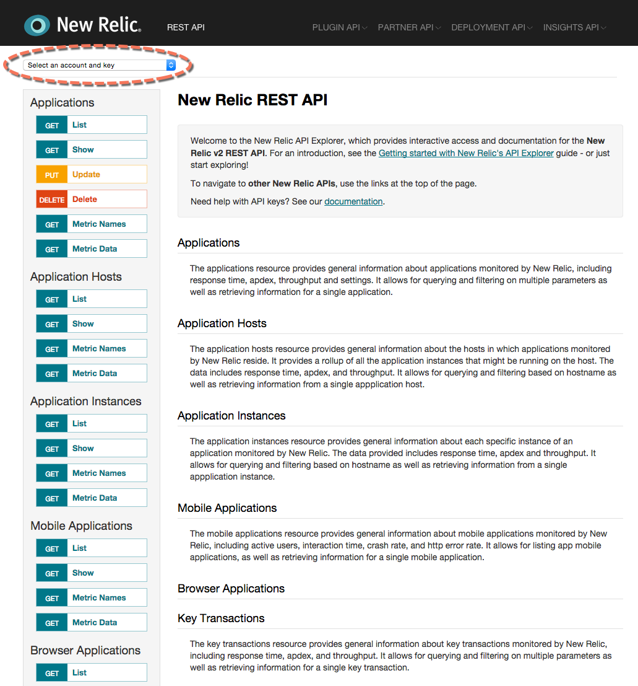

New Relic offers [several APIs](/docs/apis/getting-started/introduction-new-relic-apis), including the [New Relic REST API](/docs/apis/rest-api-v2/getting-started/introduction-new-relic-rest-api-v2). This document introduces you to the [REST API Explorer](https://api.newrelic.com), which allows admin users and those with the API Key to:

* Browse the available REST API endpoints.
* Interact with the REST API within a user interface (the API Explorer).
* View a live source of documentation.
* Obtain curl commands for API actions.
* Share configured API calls with colleagues by copy and pasting API Explorer's URLs.

This helps you to quickly search for solutions and test your API calls before adding them to your own software components.

## Features

New Relic's API Explorer includes an interactive user interface for your selected account. The API Explorer UI lists the types of API calls (**Applications**, **Users**, etc.) and their available functions, such as **GET metric data**, **PUT (update) applications**, **DELETE applications**, etc.

As you type values for **Parameters**, they automatically appear in the **Request** so that you can test and verify your syntax before sending the request. The UI indicates required fields, field descriptions, their type (integer, float, Boolean, etc.), and their location (path, query, etc.).

Any Admin user on an account may select the appropriate API key from the dropdown menu. If your account Admin user has provided an API key, enter it in the appropriate [API key field](/docs/apis/rest-api-v2/api-explorer-v2/using-api-explorer#api-key).

**[https://rpm.newrelic.com/api/explore](https://rpm.newrelic.com/api/explore)**: The New Relic API Explorer makes it easy to test and send requests for any API endpoint. After you select your account and your choice of functions for the type of API call (applications, browsers, users, etc.), the UI provides an interactive form to view requirements and test your parameter values.

## Differences from API version 1

This API Explorer applies only to the [New Relic REST API version 2](/docs/apm/apis/requirements/new-relic-rest-api-v2-getting-started), which focuses on data in and data out of New Relic. Version 2 replaces New Relic's deprecated REST API version 1.

Be aware there are some differences between version 2 and 1:

* Names for data may be different.
* Some cURL commands for v2 are different than v1.

<Callout variant="tip">
  The New Relic agents use different APIs and are not accessible via the API Explorer.
</Callout>

## For more help

Additional documentation resources include:

* [Getting started with the New Relic REST API (v2)](/docs/apm/apis/requirements/getting-started-new-relic-rest-api-v2) (overview of the New Relic REST API and the structure of an API call)
* [API keys](/docs/apis/rest-api-v2/requirements/rest-api-key) (creating, copying, or regenerating an API key from the New Relic user interface)
* [Using the API Explorer](/docs/apis/using-the-api-explorer) (using the API Explorer's user interface to get data in and data out of New Relic)
* [Pagination for API output](/docs/apis/pagination-for-api-output) (how to interpret the Link header for multiple pages of API output)
