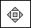

When using New Relic's REST API Explorer (v2) to get [metric timeslice data](/docs/telemetry-data-platform/ingest-manage-data/understand-data/new-relic-data-types#timeslice-data) for your application, you need:

* An [API key](/docs/apis/rest-api-v2/getting-started/introduction-new-relic-rest-api-v2#api_key)
* The [app's ID](#app_id)
* The type of metric timeslice data available for your app, including the [metric names](#view_metrics) and values

## View your app's ID [#app_id]

To view your [app's ID](/docs/apm/apis/requirements/identification-code):

1. From the New Relic REST [API Explorer](https://rpm.newrelic.com/api/explore "Link opens in a new window"), select **Applications > GET List**.
2. If you are not signed in to New Relic, provide an [API key](/docs/apis/rest-api-v2/requirements/rest-api-key#viewing) for your app.
3. Optional: From **Applications > List**, fill in values for the `name`, `ids`, or `language` filters.
4. Select **Send Request**.
5. From the **Response** section, copy the app's `id`.

Continue with the procedure to view [metric names](#view_metrics).

## View metric names for your app [#view_metrics]

To view the metric timeslice data available for your app:

1. From the New Relic REST API Explorer, select **Applications > GET Metric Names**.
2. From **Applications > Metric Names**, type or paste your [application ID](/docs/apm/apis/requirements/identification-code).
3. Fill in a specific or partial metric `name`, or leave blank to view the list of available metric names and values.
4. Select **Send Request**.
5. From the **Response** section, review the app's available `metrics`.

Continue with the procedure to get [metric](#app_metric_data) timeslice [data](#app_metric_data).

## Get metric timeslice data for your app [#app_metric_data]

To get the metric values for your app, copy the values from the **Metric Names** results, and paste them in the **Metric Timeslice Data** fields:

1. From the New Relic REST API Explorer, select **Applications > GET Metric Data**.
2. From **Applications > Metric Data**, type or paste your [application ID](/docs/apm/apis/requirements/identification-code).
3. Type or paste one or more `names` (from **GET Metric Names**) for your app. Start each name on a new line.
4. Select **Send Request**.
5. From the **Response** section, review the app's available `metric_data`.

After reviewing the **Response** section, you can continue making adjustments, and select **Send Request** again. For example:

* To specify a [time range](/docs/apm/apis/api-v2-examples/specifying-time-range-api-v2) for the metric timeslice data, fill the `from` and `to` values, or use the [diamond](/docs/apm/apis/api-explorer-v2/parts-api-explorer#diamond)  .
* To create an [average](/docs/apm/apis/requirements/calculating-average-metric-values-summarize) of the data over the time range, set `summarize` to `true`. Or, to keep the data for each time period for the range you have specified, leave `summarize` blank.

## View other REST API data [#synthetics]

To use the API Explorer with other New Relic capabilities, select the corresponding API key. This may include:

* Synthetic monitoring
* Partners
