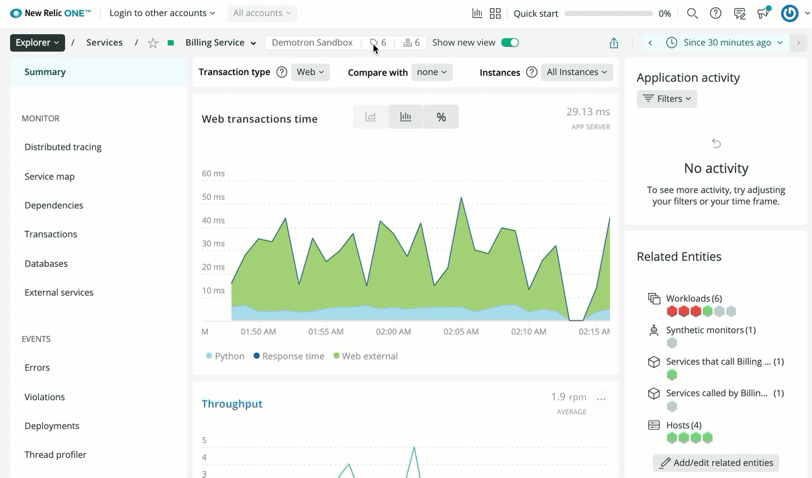

When using the [New Relic REST API](/docs/apis/rest-api-v2/getting-started/introduction-new-relic-rest-api-v2), you need to replace some ID placeholders (like `$APP_ID`, `$KEYTX_ID`, `$COMPONENT_ID`, etc.) with the ID for an app, transaction, or other component.

You can use [New Relic One](/docs/new-relic-one/use-new-relic-one/get-started/introduction-new-relic-one) to get some of these IDs. You can also get a list of IDs using the [REST API Explorer](/docs/apis/rest-api-v2/get-started/list-application-id-host-id-instance-id).

## Find IDs using New Relic One [#ui]

New Relic One includes the IDs of applications and some other components in a metadata panel.

<figcaption>
  Click the <Icon name="fe-info"/>
  icon next to the application name to open the metadata panel.
</figcaption>

Here are some examples:

<CollapserGroup>
  <Collapser
    id="apm"
    title="APM: App ID"
  >
    To locate the `$APP_ID` from the New Relic UI:

    1. From [one.newrelic.com](https://one.newrelic.com), click **APM** and select an application.
    2. Click the <Icon name="fe-tag"/>
       icon next to the application name to open the metadata panel.
    3. Locate the **App ID**.

    Substitute this number for the `$APP_ID` in your REST API calls.
  </Collapser>

  <Collapser
    id="browser"
    title="Browser app ID"
  >
    To locate the `$APP_ID` from the New Relic UI:

    1. From [one.newrelic.com](https://one.newrelic.com), click **Browser** and select a monitored app.
    2. Click the <Icon name="fe-tag"/>
       icon next to the application name to open the metadata panel.
    3. Locate the **App ID**.

    Substitute this number for the `$APP_ID` in your REST API calls.
  </Collapser>

  <Collapser
    id="mobile"
    title="Mobile app ID"
  >
    To locate the `$MOBILE_ID` from the New Relic UI:

    1. From [one.newrelic.com](https://one.newrelic.com), click **Mobile** and select a monitored app.
    2. Click the <Icon name="fe-tag"/>
       icon next to the application name to open the metadata panel.
    3. Locate the **App ID**.

    Substitute this number for the `$MOBILE_ID` in your REST API calls.
  </Collapser>
</CollapserGroup>
