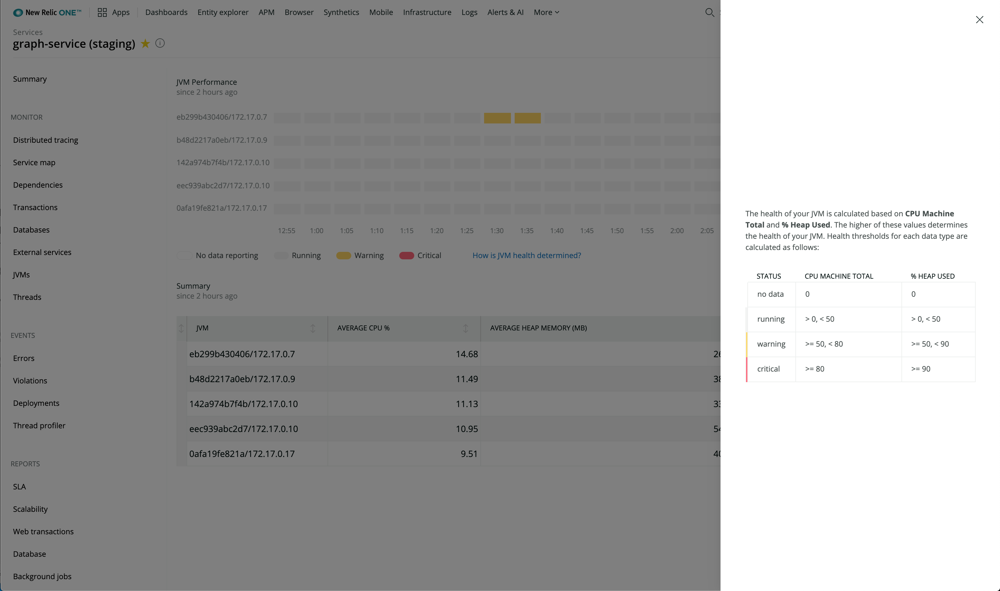

With New Relic's real-time profiling for Java using Java Flight Recorder (JFR) metrics, you can run continuous, always-on profiling of your Java code in production environments. The accompanying JVM cluster timeline view provides a fast and intuitive way to diagnose cluster-wide performance problems. For example, you can quickly see how an application’s deployment affects the overall health of the cluster.

## Find performance bottlenecks [#feature]

Troubleshooting performance bottlenecks in your Java application or service can help you better understand the following:

* Where you’re wasting resources
* When an incident occurs
* What happened during an incident
* What performance issues led up to an incident

To make troubleshooting faster and easier, you need to see the high fidelity runtime characteristics of your code running on the JVM, and you need that data in real time.

## JFR daemon [#about]

The [JFR daemon](https://github.com/newrelic/newrelic-jfr-core) is an exporter for JFR events which allows you to harness the power of the New Relic One platform for [visualizing](#find-data) your JVM's behavior. Using the New Relic [Java telemetry SDK](https://github.com/newrelic/newrelic-telemetry-sdk-java) as the underlying implementation, the JFR daemon converts JFR events into New Relic telemetry types and reports them to New Relic's metric and event ingest APIs.

There are three different usage scenarios for the JFR daemon:
* [New Relic Java agent JFR service](https://github.com/newrelic/newrelic-jfr-core/blob/main/README.md#new-relic-java-agent-jfr-service) (RECOMMENDED) - JFR monitoring built into the flagship [New Relic Java agent](/docs/agents/java-agent/). No additional setup is needed, simply [install the Java agent](/docs/agents/java-agent/installation/install-java-agent/), make sure that the [JFR service is enabled](/docs/agents/java-agent/configuration/java-agent-configuration-config-file/#jfr-real-time-profiling), and JFR data will flow into the same APM application as the Java agent. Requires [New Relic Java agent version 7.0.0+](/docs/release-notes/agent-release-notes/java-release-notes/java-agent-700/).
* [Standalone process](https://github.com/newrelic/newrelic-jfr-core/blob/main/README.md#standalone-process) - Run the `jfr-daemon` as a standalone process and configure it to monitor an existing Java process using remote JMX.
* [Standalone Java agent](https://github.com/newrelic/newrelic-jfr-core/blob/main/README.md#standalone-java-agent) - Attach the `jfr-daemon` to your Java process as a Java agent. A lightweight alternative to the New Relic Java agent.

## Supported Java versions [#supported-java-versions]

While the JFR daemon supports any version of Java 11 and above, we do not recommend
using any non-LTS version of Java in production environments.

Some vendors have backported JFR to their Java 8 binaries. For instance, OpenJDK backported JFR on version 8u262. The JFR daemon is compatible with those Java versions.

## Requirements and Usage Instructions [#requirements-and-usage-instructions]

Requirements and instructions vary for each usage scenario. For full details please see the links for your specific usage scenario:
* New Relic Java agent JFR service - [Requirements](https://github.com/newrelic/newrelic-jfr-core/blob/main/README.md#requirements-for-new-relic-java-agent-jfr-service), [configuration](https://github.com/newrelic/newrelic-jfr-core/blob/main/README.md#configuration-for-new-relic-java-agent-jfr-service), and [usage instructions](https://github.com/newrelic/newrelic-jfr-core/blob/main/README.md#usage-for-new-relic-java-agent-jfr-service)
* Standalone process - [Requirements](https://github.com/newrelic/newrelic-jfr-core/blob/main/README.md#requirements-for-standalone-process), [configuration](https://github.com/newrelic/newrelic-jfr-core/blob/main/README.md#configuration-for-standalone-usage), and [usage instructions](https://github.com/newrelic/newrelic-jfr-core/blob/main/README.md#usage-for-standalone-process)
* Standalone Java agent - [Requirements](https://github.com/newrelic/newrelic-jfr-core/blob/main/README.md#requirements-for-standalone-java-agent), [configuration](https://github.com/newrelic/newrelic-jfr-core/blob/main/README.md#configuration-for-standalone-usage), and [usage instructions](https://github.com/newrelic/newrelic-jfr-core/blob/main/README.md#usage-for-standalone-java-agent)

<Callout variant="important">
  Apps running with the JFR daemon should expect the JFR subsystem to use additional memory.
</Callout>

## View your data [#find-data]

To view your data, go to **[one.newrelic.com](https://one.newrelic.com) > Explorer > (select service) > More Views > Realtime Profiling Java**.

## Understand JVM cluster behavior over time [#ui]

The JVM cluster timeline view shows the JVM behavior across your entire cluster. This timeline enables quicker troubleshooting and issue detection; for example, at a glance you can see:

* How a recent deployment affected the rest of the JVM cluster
* When a JVM restarted
* How an individual instance was affected by its noisy neighbor

To make troubleshooting easier, you need to see the high fidelity runtime characteristics of your code running on the JVM, and you need that data in real time.

<figcaption>
  **[one.newrelic.com](https://one.newrelic.com) > Explorer > (select service) > Realtime Profiling Java**: The JVM cluster timeline view shows the JVM behavior across the cluster.
</figcaption>

Each row of the timeline represents a specific JVM over time. Inside each row, a box represents a 5-minute period of that JVM’s life. From least severe to most severe, yellow, orange, and red traffic lights indicate anomalous behavior for a JVM, so you can drill down into that instance and the right time period when investigating errors or other performance issues.

<figcaption>
  Select **How is JVM health determined?** for a detailed breakdown of how JVM health is calculated.
</figcaption>

## JVM details [#details]

The details panel for each JVM provides several critical views:

* How resources are allocated within a process
* How garbage collection affects performance
* How to track garbage collection with logs
* How CPU is used

<figcaption>
  **[one.newrelic.com](https://one.newrelic.com) > Explorer > (select service) > Realtime Profiling Java > (select JVM)**: You can see details for each JVM.
</figcaption>

## Identify resource-intensive code paths with flame graphs [#flamegraph]

<Callout variant="important">
  The flame graph feature is only compatible with the [New Relic Java agent JFR service](https://github.com/newrelic/newrelic-jfr-core/blob/main/README.md#new-relic-java-agent-jfr-service) usage scenario.
</Callout>

A "flame graph" is a way of visualizing the call tree. Each block in the graph represents a function. The more CPU time and memory resources a method consumes, the wider that block is.

Use flame graphs to identify the Java classes and methods that are most frequently executed in your application code. By using flame graphs to optimize the hot spots in your code, you can reduce resource consumption and increase your application’s overall performance.

Here are some details about the flame graph colors: 

* Light color: methods from a Java SE package.
* Dark color: methods from other libraries.

<figcaption>
  **[one.newrelic.com](one.newrelic.com/) > Explorer > (select service) > Realtime Profiling Java > (select JVM)**: You can see details for each JVM, including flame graphs.
</figcaption>

 
